# 咖啡中的粉末会迁移，但不会太远:第 3 部分

> 原文：<https://towardsdatascience.com/fines-migrate-in-espresso-but-not-far-part-3-f24c48584223?source=collection_archive---------33----------------------->

## 咖啡数据科学

## 废咖啡实验

更难观察的一个变量是颗粒如何从原始研磨分布转移到提取后，因为提取改变了相关颗粒的尺寸。为了解决这个问题，我用了一个装有刚喝完的咖啡(充分混合)的圆盘，这样我就可以在拍摄前后进行测量。这个实验仍然缺乏可溶物如何影响流动以及二氧化碳的缺乏，但它代表了改变颗粒分布的最佳情况。

这是[之前检验微粒迁移的实验](/fines-migrate-in-espresso-but-not-far-part-2-320a0801677c)的延续。

# 冰球

在我投篮后，我必须把冰球弹出来，准备削球。

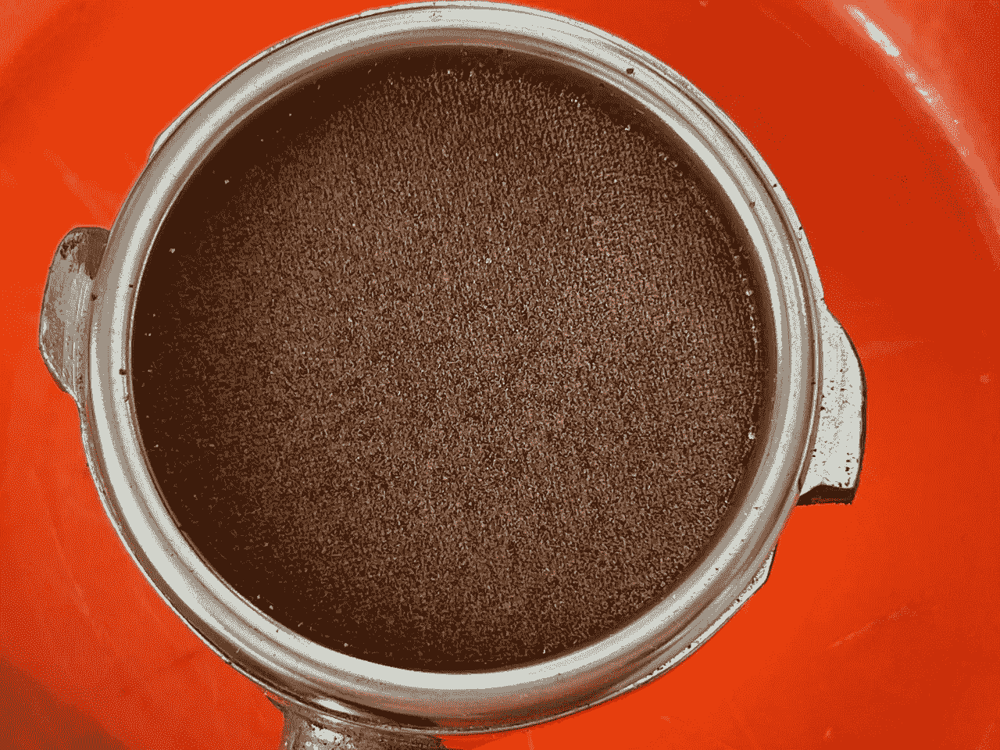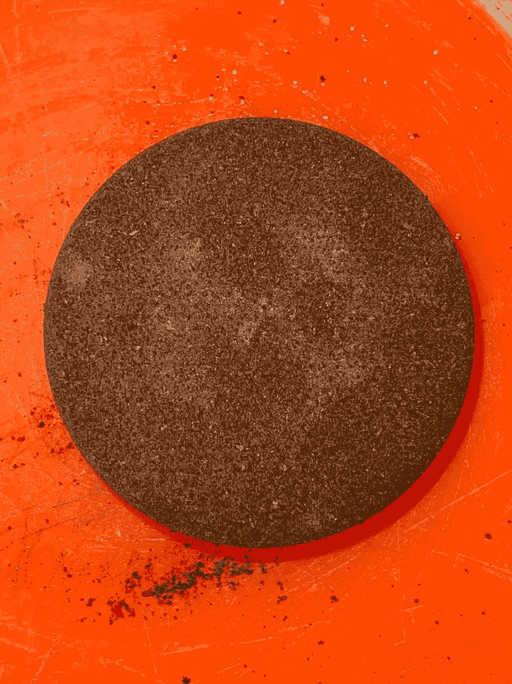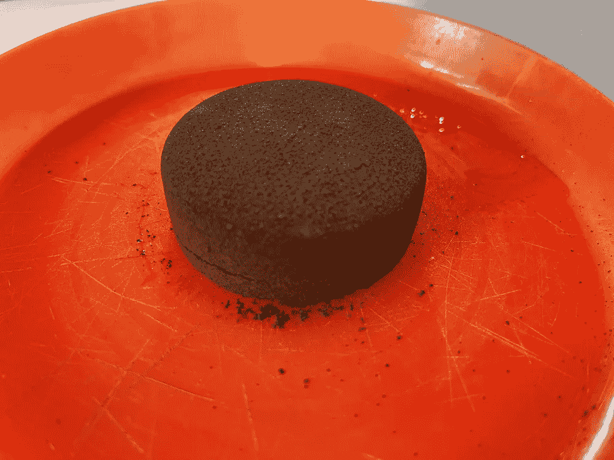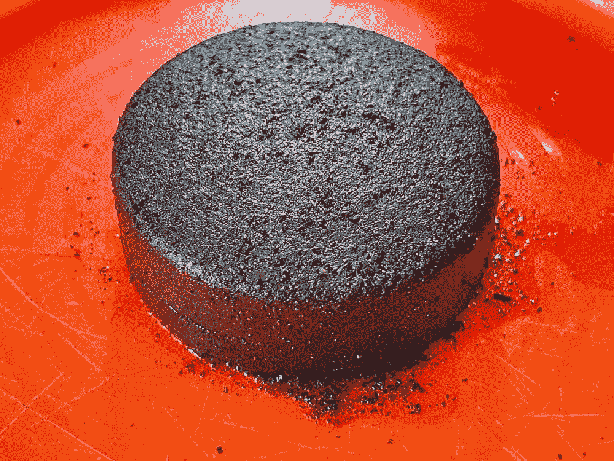

弄湿冰球后，我可以把它切成底部、中间和顶部。

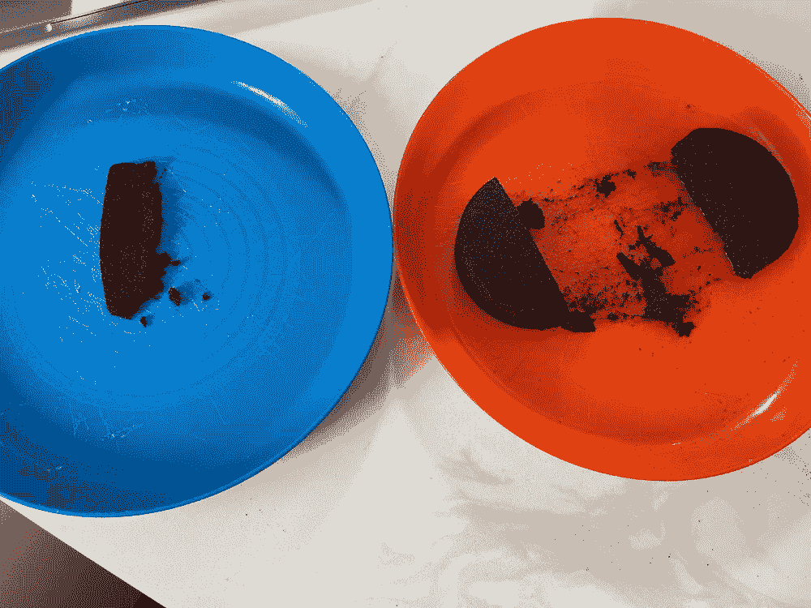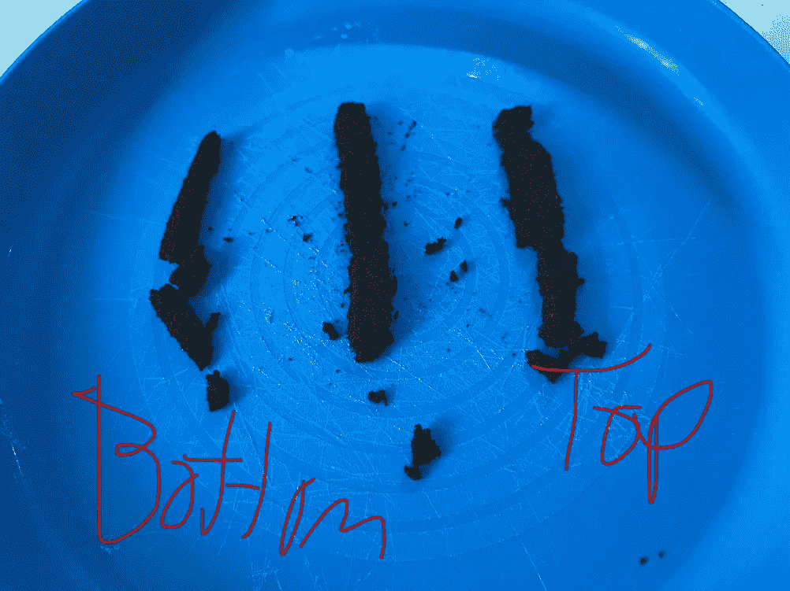

# 测量颗粒分布

我[测量了拍摄前的粒子分布](/cross-sectional-espresso-puck-slicing-4caa57366e3c)，然后是三层的粒子分布。对于每一层，我取了三个样本，然后对第一个图的样本取平均值。

拍摄后有一个大的转变，拍摄本身仍然有 0.9%的提取率。所以还是有一些可解的。这是 200 微米及以下的累积分布和放大版本。

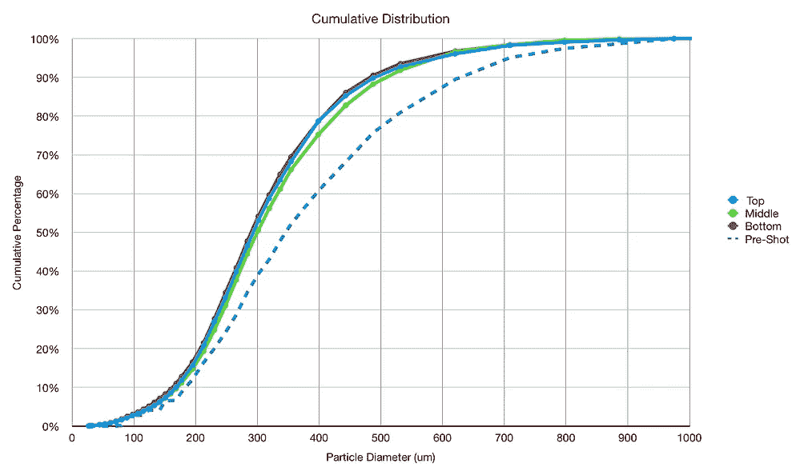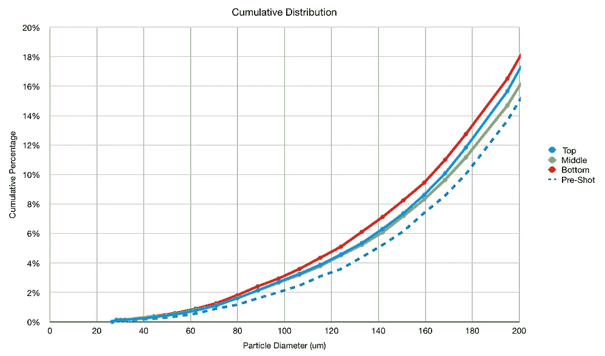

我们可以只关注顶部和底部，这显示了底部样本相对于顶部样本的较大偏移。

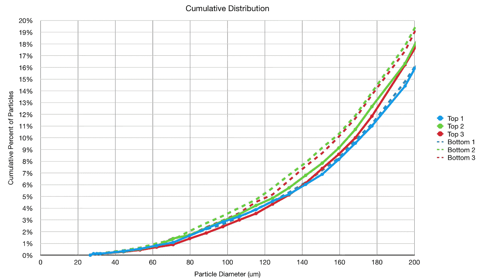

查看这些样本的另一种方法是累积条形图。它显示底部发生了移动，但移动的幅度没有我之前在这个主题上的实验那么大。

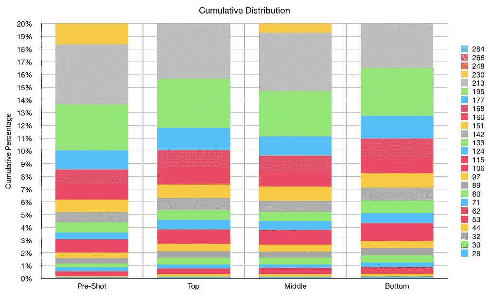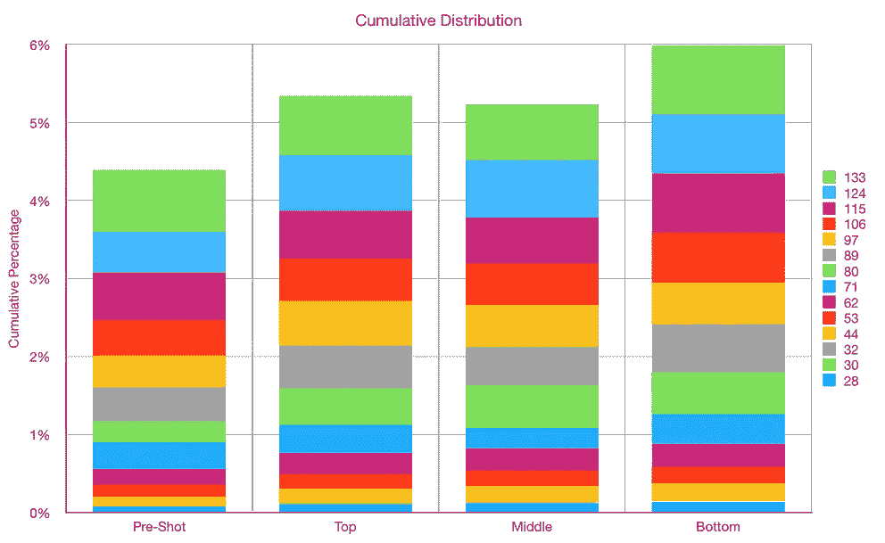

为了更好地理解这种影响，我们可以考虑顶部和底部之间的差异。这是一个相对较小的百分比，我怀疑它代表了一杯咖啡中迁移粒子的上限。似乎 200 微米左右的累积差异是所有咖啡的 1%左右。

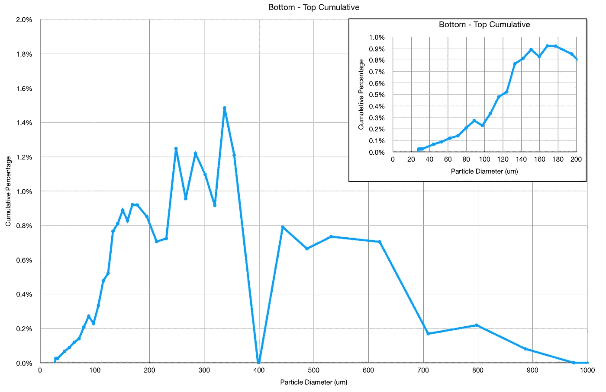

这个实验有助于分离可溶物、二氧化碳气体和咖啡渣的分布。它支持这样的理论，即较细的颗粒确实会迁移，但是迁移的总量大约是圆盘中总研磨物的 1%。

如果你愿意，可以在 Twitter 和 YouTube 上关注我，我会在那里发布不同机器上的浓缩咖啡视频和浓缩咖啡相关的东西。你也可以在 [LinkedIn](https://www.linkedin.com/in/robert-mckeon-aloe-01581595?source=post_page---------------------------) 上找到我。也可以关注我[中](https://towardsdatascience.com/@rmckeon/follow)和[订阅](https://rmckeon.medium.com/subscribe)。

# [我的进一步阅读](https://rmckeon.medium.com/story-collection-splash-page-e15025710347):

[我未来的书](https://www.kickstarter.com/projects/espressofun/engineering-better-espresso-data-driven-coffee)

[浓缩咖啡系列文章](https://rmckeon.medium.com/a-collection-of-espresso-articles-de8a3abf9917?postPublishedType=repub)

[工作和学校故事集](https://rmckeon.medium.com/a-collection-of-work-and-school-stories-6b7ca5a58318?source=your_stories_page-------------------------------------)

[个人故事和关注点](https://rmckeon.medium.com/personal-stories-and-concerns-51bd8b3e63e6?source=your_stories_page-------------------------------------)

[乐高故事首页](https://rmckeon.medium.com/lego-story-splash-page-b91ba4f56bc7?source=your_stories_page-------------------------------------)

[摄影启动页面](https://rmckeon.medium.com/photography-splash-page-fe93297abc06?source=your_stories_page-------------------------------------)

[使用图像处理测量咖啡研磨颗粒分布](https://link.medium.com/9Az9gAfWXdb)

[改善浓缩咖啡](https://rmckeon.medium.com/improving-espresso-splash-page-576c70e64d0d?source=your_stories_page-------------------------------------)

[断奏生活方式概述](https://rmckeon.medium.com/a-summary-of-the-staccato-lifestyle-dd1dc6d4b861?source=your_stories_page-------------------------------------)

[测量咖啡磨粒分布](https://rmckeon.medium.com/measuring-coffee-grind-distribution-d37a39ffc215?source=your_stories_page-------------------------------------)

[咖啡萃取](https://rmckeon.medium.com/coffee-extraction-splash-page-3e568df003ac?source=your_stories_page-------------------------------------)

[咖啡烘焙](https://rmckeon.medium.com/coffee-roasting-splash-page-780b0c3242ea?source=your_stories_page-------------------------------------)

[咖啡豆](https://rmckeon.medium.com/coffee-beans-splash-page-e52e1993274f?source=your_stories_page-------------------------------------)

[浓缩咖啡用纸质过滤器](https://rmckeon.medium.com/paper-filters-for-espresso-splash-page-f55fc553e98?source=your_stories_page-------------------------------------)

[浓缩咖啡篮及相关主题](https://rmckeon.medium.com/espresso-baskets-and-related-topics-splash-page-ff10f690a738?source=your_stories_page-------------------------------------)

[意式咖啡观点](https://rmckeon.medium.com/espresso-opinions-splash-page-5a89856d74da?source=your_stories_page-------------------------------------)

[透明 Portafilter 实验](https://rmckeon.medium.com/transparent-portafilter-experiments-splash-page-8fd3ae3a286d?source=your_stories_page-------------------------------------)

[杠杆机维护](https://rmckeon.medium.com/lever-machine-maintenance-splash-page-72c1e3102ff?source=your_stories_page-------------------------------------)

[咖啡评论与思考](https://rmckeon.medium.com/coffee-reviews-and-thoughts-splash-page-ca6840eb04f7?source=your_stories_page-------------------------------------)

[咖啡实验](https://rmckeon.medium.com/coffee-experiments-splash-page-671a77ba4d42?source=your_stories_page-------------------------------------)