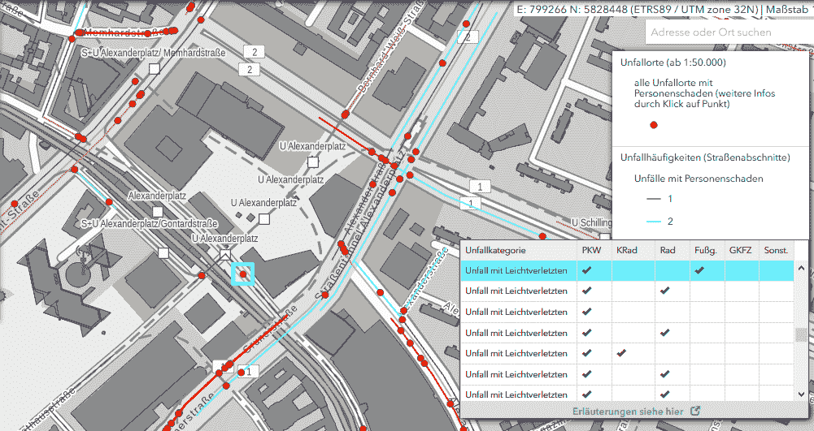
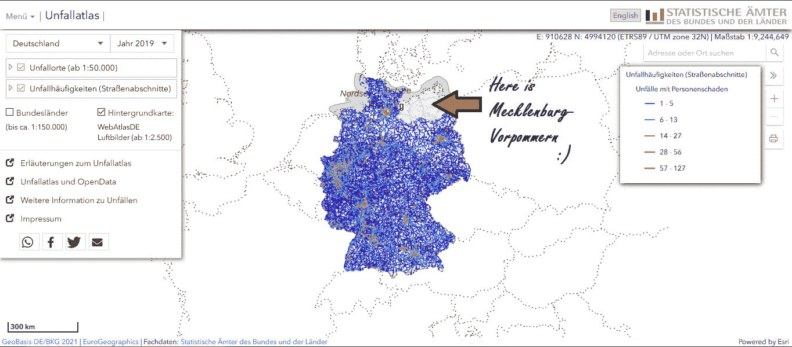

# 急救开放资料包[第 1 卷]

> 原文：<https://towardsdatascience.com/first-aid-open-data-kit-vol-1-all-you-need-to-know-about-traffic-accidents-681cb983501?source=collection_archive---------37----------------------->

## 关于交通事故你需要知道的

作者图片

你有没有想过穿过你旁边的街道有多危险？你曾经尝试过制作评估道路安全的地图吗？或者简单地说，你是一个(地理)数据极客，想学习一些新的东西吗？如果你至少有一次回答“是”，那么这篇文章就是给你的！

在《急救开放资料包》的第一集，我将向大家展示:

*   德国巨大的事故数据库可以免费下载
*   你能从这个数据集中提取什么信息
*   为什么这样的数据集是重要的，而不是没有一个原因叫做——令人敬畏的开放数据[2]。

# 事故数据的内容

*德国警方负责收集必要的信息到数据集[4]*

在[事故数据集](https://unfallatlas.statistikportal.de/_opendata2020.html)(蒙古包)内。*对德国来说，你会发现国家层面的交通事故。自 2016 年以来，警方一直在收集这些数据，并将每年进行更新。*

你可能认为只有一个事故发生的地点，这就是故事的结尾。好吧，你可能没有错，但还有更多！

你不仅可以检索过去几年中发生的每起事故的 X，Y 地理坐标，还可以检索每个事件的丰富语义。属性列表包含关于一周中的小时和天的信息(原文如此！)、月份、年份、地区、事故类别、事故类型、照明和路况、车辆类型等等[1](去[元数据](https://unfallatlas.statistikportal.de/app/UnfalldatenDownload/DSB_Unfallatlas.pdf)中查找更多)。

给你一个要点，它对你意味着什么:你可能会在地图上找到一个点，描述柏林米特的一个事故地点。然后，通过一键点击，您提取出以下信息:事情发生在 2018 年 1 月 1 日上午 9 点，这一天相当黑，涉及 2 名行人、1 辆汽车和 1 辆自行车，有 3 人受轻伤，道路湿滑，事故是由于转向操作而发生的。印象深刻？我是！

*柏林亚历山大广场的一次事故和可用的统计样本(在右下角)【5】*

# 事故数据的格式

存储库作为 csv 和 shapefiles 共享(万岁。嘘！)并且每个子集覆盖一年。负责发布的单位是联邦统计局(T2)。statistisches Bundesamt(Destatis)，辅助所谓的[事故图集](https://unfallatlas.statistikportal.de/)对数据集的探索。如果你打开这个链接，你会默认看到道路分类和事故数量。当然，您可以更改它，探索 Office 已经提供的更多特征和分析。事实上，你甚至可以很容易地将地图集整合到你的网站中。如果你熟悉 [OGC 标准](https://www.ogc.org/standards)，你会很高兴看到他们也提供了 [WMS 服务](https://www.wms.nrw.de/wms/unfallatlas?request=GetCapabilities&version=1.3.0&service=wms)(是的！).

# 事故数据的挑战

但是，我不得不承认这个数据集有一个缺点。如果你回到项目开始的时候，到 2016 年，你会发现差不多只有一半的德国人参加了开放事故数据库项目。虽然每年都有下一个州加入该项目，但截至 2019 年，几乎所有德国州都向国家数据库报告了他们的事故。只有一个突出的州——梅克伦堡-前波莫瑞州。希望该州将很快加入其他州的行列。正如他们所说——黎明前总是最黑暗的！

*事故图集的概述和数据集的覆盖范围。基于[5]*

# 事故数据的应用

除了“内部”(从技术上来说，所有政府单位都是为你——公民——制造的😏)用于上述办公室的目的(见下图)数据的开放使其可用于各种应用。

*该办公室制作的信息图之一，直观呈现了德国 2019 年死亡事故的数量。* [*美国联邦统计局*](https://www.destatis.de/EN/About-Us/_node.html)*【7】*

首先，这些统计数据被用来控制交通事故的数量，从而减少道路上的死亡人数。通过公开数据，办公室鼓励每个人解决这个问题(你也是！或者 U2，如果你喜欢爱尔兰拼法的话。即使没有什么知识，人们也可以创建有洞察力的信息图表来可视化一些模式并提高公民的意识。谁知道也许你的邻居下次骑自行车会戴头盔呢？

显然，政府部门也希望将事故数量减少到几乎为零。是的，的确如此——你听说过[零视力项目](https://en.wikipedia.org/wiki/Vision_Zero)吗？如果没有像这个工具包这样的数据集，就不可能完全理解这个问题并选择适当的措施来解决它。

最近，世界各地的城市和国家转向绿色城市，并鼓励人们使用自行车而不是汽车。然而，许多人只是害怕使用自行车，因为事故发生率很高。城市通过广告鼓励人们，提倡健康的生活方式，但也通过定位潜在的危险区域。这些数据有助于管理者对危险街道进行现代化改造。这最终会减少事故的数量。像下面这样的[创新交通解决方案](https://www.forbes.com/sites/carltonreid/2019/10/10/manchester-plans-for-dutch-style-aerial-cycling-roundabout/?sh=3f30107b53be)应该给你一个能做什么的要点。

这样的数据集也有助于研究。让我们说，你想设计一个自动驾驶汽车掉头的算法。看似简单？但现在，尝试实施提高警惕区域的意识。考虑“不可预测”,考虑过马路的行人，而不是其他道路使用者的常规动作，在不同的天气条件下测试它，等等。我想你已经知道什么数据集可以帮助应对这一挑战。

以我个人的经验，可以说数据库确实是*牛逼的开放数据*。事故数据成为我的项目【T2 拯救骑自行车的人】的支柱！。我制作了[网络地图应用](https://oloocki.github.io/)，它允许我们分析柏林最危险的地区，探索需要道路现代化或维护的地区，并允许我们实时检查救护车是否在 15 分钟的行驶范围内。你可以查看教程来复制地图

*我的网络地图应用。创建一个新的并分享它以提高社区的意识！[6]*

# 事故数据汇总

好吧，你已经知道如何利用事故数据了吗？你会如何贡献？你有没有可能受到我的地图的启发？让我知道你对这个数据集的想法，并分享你自己对如何利用这个关键(拯救生命！)数据集！

如果您想了解更多事故数据，请点击[此处](https://www.destatis.de/EN/Themes/Society-Environment/Traffic-Accidents/Methods/basic-concept-traffic-accident.pdf?__blob=publicationFile)。

请继续关注急救开放数据工具包的下一集，了解更多关于令人敬畏的开放数据世界的信息！

# **参考书目**

[1]Statistisches Bundesamt(Destatis)*【2020】datensazbechreibung un fallatlas | Kartenanwendung der Statistischen des Bundes and der lander。已访问 17 . 01 . 2021[https://un fallatlas . statistikportal . de/app/un falldatendownload/DSB _ un fallatlas . pdf](https://unfallatlas.statistikportal.de/app/UnfalldatenDownload/DSB_Unfallatlas.pdf)*

*[2]科特雷尔 D. &库迪尼奇(2020) GitHub，Awesome 公开数据[https://github.com/DigitalCommonsLab/awesome-opendata](https://github.com/DigitalCommonsLab/awesome-opendata)*

*[3]2019 年按选定的道路使用类型和地点分列的道路交通事故死亡人数(2020 年，T21)。访问 17 . 01 . 2021[https://www . destatis . de/EN/Themes/Society-Environment/Traffic-Accidents/_ node . html # sprg 454512](https://www.destatis.de/EN/Themes/Society-Environment/Traffic-Accidents/_node.html#sprg454512)*

*[4] Loeb R. (2009) Pixabay，消防警察事故。已访问 17 . 01 . 2021[https://pix abay . com/photos/fire-police-accident-police-car-1857993/](https://pixabay.com/photos/fire-police-accident-police-car-1857993/)*

*[5]德国联邦和州统计局(2020 年)。2021 年 1 月 17 日访问 https://unfallatlas.statistikportal.de/*

*[6]Wysocki o .(2020)使用 HERE Studio 帮助骑自行车的人保持安全。访问日期:2021 年 1 月 17 日*

*[https://developer . here . com/blog/helping-cyclers-stay-safe-here-studio？_ lrsc = 13d 8722 c-a051-46 a5-ba3f-cc 20 e 5148d 03&cid = other-Elevate-FD-0-HERE-&UTM _ source = Elevate&UTM _ medium = social&UTM _ campaign = Online _ comms share _ 2020](https://developer.here.com/blog/helping-cyclists-stay-safe-here-studio?_lrsc=13d8722c-a051-46a5-ba3f-cc20e5148d03&cid=other-Elevate-FD-0-HERE-&utm_source=Elevate&utm_medium=social&utm_campaign=Online_CommsShare_2020)*

*[7]Statistisches Bundesamt(Destatis)*(2021)关于我们。访问日期:2021 年 1 月 17 日**

**[https://www.destatis.de/EN/About-Us/_node.html](https://www.destatis.de/EN/About-Us/_node.html)**