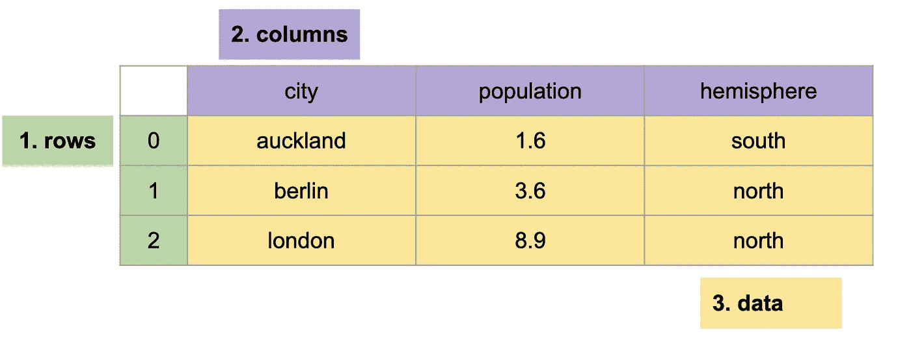
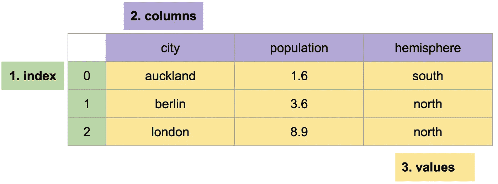
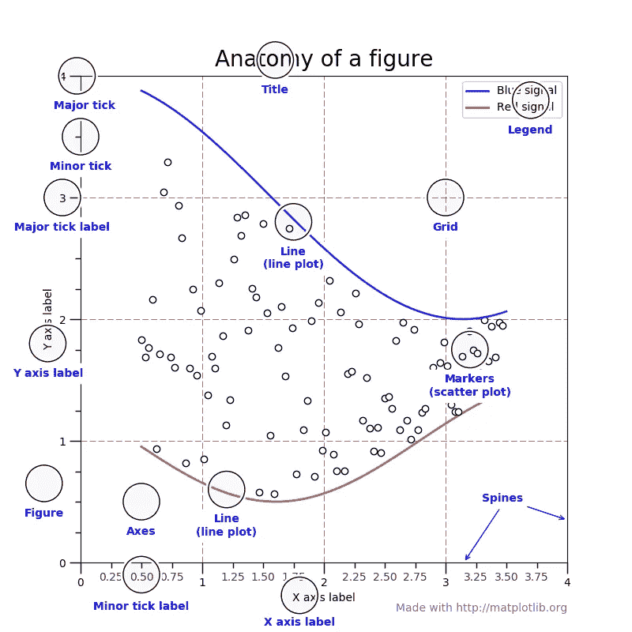
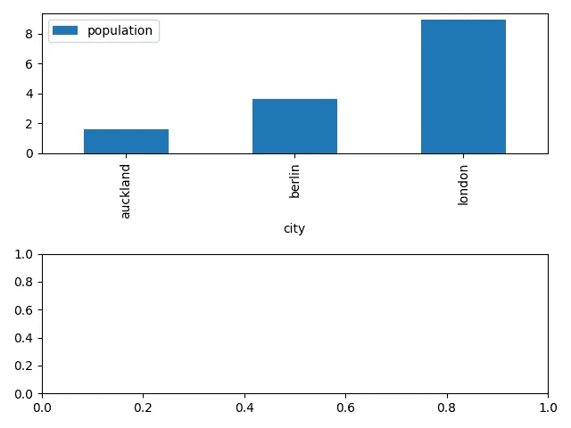
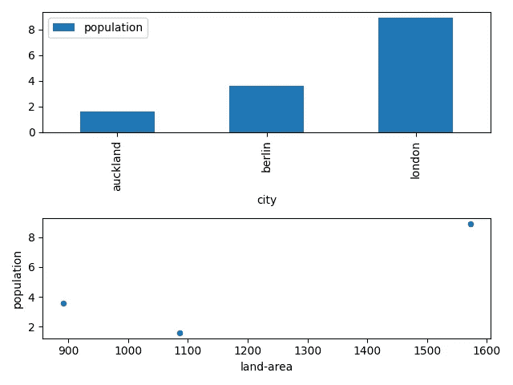

# 面向新数据科学家的首个 Python 库

> 原文：<https://towardsdatascience.com/first-python-libraries-for-new-data-scientists-c5bb93cd19e3?source=collection_archive---------44----------------------->

## 熊猫& matplotlib 入门


尼泊尔(作者供图)。

# 介绍

开始学习数据科学令人兴奋，这是一个有益的旅程。这个旅程的一部分是学习数据科学家的工具。

但是，当您刚刚开始学习时，您如何知道要学习什么工具，以及如何开始学习它们呢？

我建议从两个面向新数据科学家的库开始— **pandas** 和 **matplotlib** :

1.  **熊猫**用于加载、转换和保存数据。
2.  **matplotlib** 用于可视化数据。

这两个库一起提供了足够的东西来开始用 Python 做有意义的数据工作。

# 熊猫

pandas 是一个 Python 库，用于处理表格数据——包含行和列的数据。如果您使用过 Excel，那么您已经使用过表格数据。

在本文中，我们将使用一个简单的`cities`数据集——一个有三行三列的表格数据集:



# 安装和使用熊猫

您可以使用终端通过 Python 包管理器`pip`安装 pandas:

```
$ pip install pandas
```

你也可以在 Github 或 Google Colab 上找到一个笔记本，上面有我们在本文[中开发的所有代码。](https://github.com/ADGEfficiency/data-science-south-data/blob/main/notebooks/cities.ipynb)

熊猫是通过在 Python 中导入`pandas`包来使用的，通常别名为`pd`:

```
import pandas as pd
```

# 什么是数据帧？

熊猫的核心是 DataFrame(一个`pd.DataFrame` Python 对象)，由三部分组成:

1.  **索引** —一维行标签，
2.  **列** —一维列标签，
3.  **数值** —二维数据。



索引和列都是标签——它们告诉我们一行或一列代表什么，比如`population`列标签。

## 创建数据框架

创建数据帧的一种方法是通过 Python 字典，使用:

*   列名作为字典键，
*   作为字典值的数据。

下面我们从字典中创建一个`cities`数据帧:

```
import pandas as pdpd.DataFrame({
  'city': ['auckland', 'berlin', 'london'],
  'population': [1.6, 3.6, 8.9],
  'hemisphere': ['south', 'north', 'north']
})
"""
       city  population hemisphere
0  auckland         1.6      south
1    berlin         3.6      north
2    london         8.9      north
"""
```

## 将 CSV 数据加载到数据帧中

能够从 Python 对象(比如字典和列表)构造数据帧对于构造单元测试的数据非常有用。

创建数据帧的一种更常见的方法是从文件开始，通常是 CSV 文件。这允许我们处理保存在本地机器上的文件中的数据。

Pandas 用`pd.read_csv`来处理这个问题，它从我们本地计算机上的 CSV 文件中读取数据。同样的功能也可以用来从互联网上读取数据。

下面我们使用`pd.read_csv`从 Github URI 读取数据，读取我们的`cities`数据集:

```
import pandas as pddata = pd.read_csv(
    '[https://raw.githubusercontent.com/ADGEfficiency/data-science-south-data/main/cities/cities.csv'](https://raw.githubusercontent.com/ADGEfficiency/data-science-south-data/main/cities/cities.csv')
)
"""
       city  population hemisphere
0  auckland         1.6      south
1    berlin         3.6      north
2    london         8.9      north
"""
```

这是我们在这篇文章的其余部分直接从公共 URI(比如 URL)加载我们的`cities`数据集的方式。

## 索引、列和值

我们可以将数据帧的三个部分作为初始化的`pd.Dataframe`对象的属性来访问:

```
data.index
# RangeIndex(start=0, stop=3, step=1)data.columns
# Index(['city', 'population', 'hemisphere'], dtype='object')data.values
"""
[['auckland' 1.6 'south']
 ['berlin' 3.6 'north']
 ['london' 8.9 'north']]
"""
```

pandas 为我们创建的索引只是一个范围索引(也称为整数索引)——行被标记为一个整数序列(`[0, 1, 2]`):

```
data.index
# RangeIndex(start=0, stop=3, step=1)data
"""
       city  population hemisphere
0  auckland         1.6      south
1    berlin         3.6      north
2    london         8.9      north
"""
```

我们可以使用`set_index`将其替换为更有意义的索引，将`city`列转换为索引:

```
data.set_index('city')
"""
          population hemisphere
city
auckland         1.6      south
berlin           3.6      north
london           8.9      north
"""
```

我们失去了原来的整数索引`[0, 1, 2]`，获得了一个索引`city`——太棒了！

# 在熊猫中选择行和列

数据分析中的一个基本操作是选择—选择行和列。在熊猫身上有两种方法可以做到这一点——`loc`和`iloc`。

## 为什么我们需要两种方式来选择？

我们希望以两种方式选择行或列:

1.  使用“loc”的标签，
2.  使用“iloc”的位置。

两者都要求我们指定行和列(通过标签或位置)——使用`:`选择整个行或列。

## `loc`使用标签

`loc`根据行列标签选择**。**

`loc`允许我们使用索引和列的标签——我们使用它来选择基于标签的数据:

```
#  select the berlin row, all columns
data.loc['berlin', :]#  select all rows, second colun
data.loc[:, 'population']
```

## `iloc`用途位置

`iloc`根据行列的整数位置选择**。**

`iloc`允许我们使用行和列的位置——我们使用它来基于位置选择数据:

```
#  select the first row, all columns
data.iloc[0, :]#  select all rows, second column
data.iloc[:, 1]
```

对数据进行排序时，基于位置进行选择非常有用。

`iloc`这就是为什么范围索引在熊猫身上没那么有用——我们总是可以使用`iloc`根据它的位置来选择数据。

现在我们已经被介绍到了`loc` & `iloc`，让我们用它们来回答两个关于我们`cities`数据集的问题。

## 奥克兰的人口是多少？

我们可以使用`loc`来回答这个问题，选择`auckland`行和`population`列:

```
data.loc['auckland', 'population']
# 1.6
```

## 我们的第一个城市在哪个半球？

我们可以使用`iloc`选择带有`0`的第一行，使用`loc`选择`population`列来回答这个问题:

```
data.iloc[0].loc['hemisphere']
# north
```

# 熊猫中的布尔掩码过滤

数据分析中的另一个基本操作是过滤——基于条件逻辑(if 语句、类似`==`的等式和类似`>`或`<`的不等式)选择行或列。

我们可以用布尔掩码过滤熊猫，布尔掩码可以用条件语句创建:

```
import pandas as pddata = pd.read_csv('[https://raw.githubusercontent.com/ADGEfficiency/data-science-south-data/main/cities/cities.csv'](https://raw.githubusercontent.com/ADGEfficiency/data-science-south-data/main/cities/cities.csv'))#  create our boolean mask 
#  with the conditional 'population < 2.0'
#  aka population less than 2.0
mask = data.loc[:, 'population'] < 2.0
"""
city
auckland     True
berlin      False
london      False
Name: population, dtype: bool
"""
```

布尔掩码是一个由`True`或`False`组成的数组——如果城市的人口少于 2，这里表示`True`。

我们可以使用布尔掩码来过滤数据集，其中`loc` - `loc`了解如何使用布尔掩码:

```
subset = data.loc[mask, :]
"""
          population hemisphere
city
auckland         1.6      south
"""
```

## 如果我们可以用`loc`或`iloc`选择，为什么我们需要布尔掩码？

使用布尔掩码的强大之处在于我们可以一次选择许多行。

下面我们创建一个基于城市半球的布尔遮罩，然后使用此遮罩选择两行:

```
mask = data.loc[:, 'hemisphere'] == 'north'
"""
city
auckland    False
berlin       True
london       True
Name: hemisphere, dtype: bool
"""subset = data.loc[mask, :]
"""
        population hemisphere
city
berlin         3.6      north
london         8.9      north
"""
```

# 熊猫的群体聚集

我们要看的最后一个数据分析操作是聚合。

在 pandas 中，聚合可以通过分组来完成——在数据帧上使用`groupby`方法。

## 两步分组工作流

在熊猫中，聚集分两步进行:

1.  基于列创建组，例如通过`hemisphere`，
2.  对每个组应用聚合函数，如计数或平均。

聚合允许我们估计统计数据，让我们用它来回答几个问题。

## 每个半球的平均人口是多少？

我们可以用两步工作流程来回答这个问题:

1.  `groupby('hemisphere')`按半球来分组，
2.  `mean()`计算我们每个半球组的平均值(`north`和`south`)。

```
import pandas as pddata = pd.read_csv('[https://raw.githubusercontent.com/ADGEfficiency/data-science-south-data/main/cities/cities.csv').set_index('city')](https://raw.githubusercontent.com/ADGEfficiency/data-science-south-data/main/cities/cities.csv').set_index('city'))
data.groupby('hemisphere').mean()
"""
            population
hemisphere
north             6.25
south             1.60
"""
```

# 每个半球的总人口是多少？

回答这个问题的两个步骤是:

回答这个问题的两个步骤是:

1.按`hemisphere`、
2 分组。用一个`sum`聚合。

```
data.loc[:, ['population', 'hemisphere']].groupby('hemisphere').sum()
"""
            population
hemisphere
north             12.5
south              1.6
"""
```

# 将我们的数据保存到 CSV

我们流程的最后一步是将数据以 Excel 友好的 CSV 格式保存到硬盘上:

```
data.to_csv('groups.csv')
```

# 完整的熊猫代码

这是我们对熊猫的第一次观察——我们在上面看到的所有代码都在下面完整地给出了:

```
import pandas as pd#  read dataset from github url
data = pd.read_csv('[https://raw.githubusercontent.com/ADGEfficiency/data-science-south-data/main/cities/cities.csv').set_index('city')](https://raw.githubusercontent.com/ADGEfficiency/data-science-south-data/main/cities/cities.csv').set_index('city'))#  save cities dataset to local machine
data.to_csv('cities.csv')#  select the berlin row, all columns
data.loc['berlin', :]#  select all rows, second colun
data.loc[:, 'population']#  select the first row, all columns
data.iloc[0, :]#  select all rows, second column
data.iloc[:, 1]#  What is the population of Auckland?  
data.loc['auckland', 'population']#  Which hemisphere is our first city in?
data.iloc[0].loc['hemisphere']#  select population less than 2
mask = data.loc[:, 'population'] < 2.0
subset = data.loc[mask, :]#  northern hemisphere countries
mask = data.loc[:, 'hemisphere'] == 'north'
subset = data.loc[mask, :]#  average population in each hemisphere
data.groupby('hemisphere').mean()#  total population in each hemisphere
data.loc[:, ['population', 'hemisphere']].groupby('hemisphere').sum()#  save to csv file on local computer
data.to_csv('groups.csv')
```

# matplotlib

matplotlib 是一个 Python 库，用于创建数据的可视化。

学习和使用 matplotlib 的挑战之一是它提供了多种绘制数据的方法。掌握 matplotlib 需要了解哪种 API 最适合您的数据和工作流。

我们将使用单个 matplotlib 工作流——我们自己使用最多的工作流。它提供了在同一个图形中绘制多个图表的灵活性，并与 pandas 很好地集成。

# 安装和使用 matplotlib

可以用 Python 包管理器`pip`安装 matplotlib:

```
$ pip install matplotlib
```

你也可以在 Github 或 [Google Colab](https://githubtocolab.com/ADGEfficiency/data-science-south-data/blob/main/notebooks/cities.ipynb) 上找到包含所有代码[的笔记本。](https://github.com/ADGEfficiency/data-science-south-data/blob/main/notebooks/cities.ipynb)

Matplotlib 通过在 Python 中导入`matplotlib`包来使用，通常将模块`pyplot`别名为`plt`:

```
import matplotlib.pyplot as plt
```

# matplotlib 图形是由什么组成的？

matplotlib 的核心组件是图形和轴。

一个图形可以有多个轴:



[来自 matplotlib 文档](https://matplotlib.org/stable/tutorials/introductory/usage.html#parts-of-a-figure)

一个常见的混淆点是轴(如 x 或 y 轴)和 matplotlib 轴之间——它们不是一回事！

一个图形可以有多个轴，每个轴是一个单独的绘图或图表。每个轴都有自己的 x 轴和 y 轴(各一个)。

我们可以使用`plt.subplots`创建这两个对象——用两个轴创建一个图形:

```
import matplotlib.pyplot as pltfig, axes = plt.subplots(ncols=2)
```

我们上面所做的就是创建一个有两个轴的图形——都是空的。

接下来，我们加载熊猫数据，并在第一个坐标轴上创建一个图:

```
import pandas as pd#  run a simple data pipeline - load data from CSV with pandas
data = pd.read_csv('[https://raw.githubusercontent.com/ADGEfficiency/data-science-south-data/main/cities/cities.csv').set_index('city')](https://raw.githubusercontent.com/ADGEfficiency/data-science-south-data/main/cities/cities.csv').set_index('city'))#  access first axes and plot a line
data.plot('population', ax=axes[0], kind='bar')
```

自动为 x 和 y 轴制作标签——非常好！



我们的第二个轴仍然是空的——我们可以通过将`ax=axes[1]`传递给 DataFrame 上的另一个`plot`调用来在其上绘制一些东西:

```
#  access first axes and plot a scatter plot
data.plot('land-area', 'population', ax=axes[1], kind='scatter')
```



现在我们可以看到数据的两种可视化形式——条形图和散点图。

管道中的最后一步是将图形保存到本地机器上的 PNG 文件中:

```
fig.savefig('cities.png')
```

# 完整的 matplotlib 代码

我们可视化管道的完整代码如下:

```
import matplotlib.pyplot as plt
import pandas as pd#  create one figure with two axes
fig, axes = plt.subplots(nrows=2)#  run a simple data pipeline
data = pd.read_csv('[https://raw.githubusercontent.com/ADGEfficiency/data-science-south-data/main/cities/cities.csv').set_index('city')](https://raw.githubusercontent.com/ADGEfficiency/data-science-south-data/main/cities/cities.csv').set_index('city'))#  access first axes and plot a line
data.plot(y='population', ax=axes[0], kind='bar')#  access first axes and plot a scatter plot
data.plot('land-area', 'population', ax=axes[1], kind='scatter')#  small trick to get x-axis labels to play nice
plt.tight_layout()#  save the figure as a png file
fig.savefig('cities.png')
```

# 后续步骤

感谢阅读！这两个库还有很多值得学习的地方。

对熊猫的下一步建议是:

*   了解`pd.Series`——另一个用于存储数据的熊猫对象，
*   了解如何将数据保存为拼花格式(以及原因)，
*   看看我们如何通过一个 groupby 将`.agg`用于不同的聚合。

matplotlib 的建议后续步骤如下:

*   学习使用`plt.plot`绘制数据，
*   学会使用`ax.plot`绘制数据，
*   查看 seaborn——一个用 pairplot 等图表扩展 matplotlib 的库。

在您熟悉这些工具之后，思考一个[项目想法](https://www.datasciencesouth.com/blog/data-science-project-ideas)，并完成[数据科学项目清单](https://www.datasciencesouth.com/blog/data-science-project-checklist)。

如果你想了解更多，一定要看看我为新数据科学家写的[书](https://www.datasciencesouth.com/blog/books-new-data-scientists)！

</seven-steps-to-generate-data-science-project-ideas-8fb69400634d>  </mistakes-data-scientists-make-e915abd3b2df>  

*最初发表于*[*https://www.datasciencesouth.com*](https://www.datasciencesouth.com/blog/python-libraries-new-data-scientists)*。*