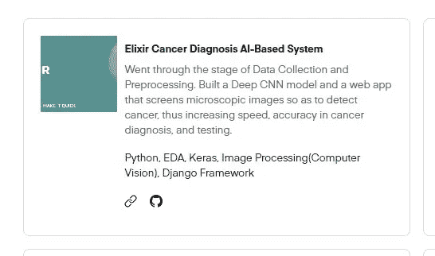
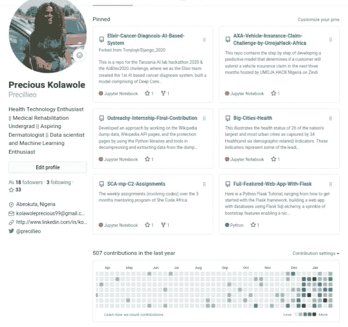
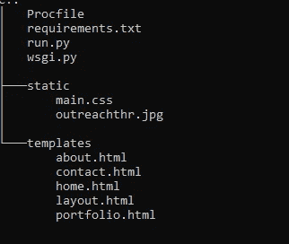

# 构建数据科学组合网站的第一步

> 原文：<https://towardsdatascience.com/first-steps-into-building-your-data-science-portfolio-website-94c3443597ff?source=collection_archive---------20----------------------->

## 成为世界级的数据科学家

图片来自 Shutterstock.com

我最近参加了一些讨论，其中数据科学家抱怨获得一份数据科学工作有多不容易。与此同时，如果你像我一样没有任何相关的技术学位，那么你应该想到建立一个自己的投资组合网站，这是讲述自己故事的一种方式，可以增加你被雇主注意到的机会，并使你在市场上的其他数据科学家中脱颖而出。

图片来自 Shutterstock.com

数据科学投资组合应该被视为包含越来越多的真实项目，而不是花哨的设计，不像 web 开发人员或设计师的投资组合。

作为数据科学家，大多数时候，我们只关注数据分析、可视化和建模，从零开始建立一个网站可能有点困难，因为我个人决定从零开始建立，以便在 web 开发领域有广阔的发展空间。然而，有一些动态的、健壮的投资组合构建器，你可以很容易地使用，比如 [urspace.io](https://urspace.io/) 、 [WordPress](https://www.wpexplorer.com/build-portfolio-wordpress/) 、 [Squarespace](https://www.squarespace.com/website-design/?channel=pbr&subchannel=go&campaign=pbr-dr-go-row-lowgeo-en-squarespace-core-e&subcampaign=(brand-core_squarespace_e)&utm_source=google&utm_medium=pbr&utm_campaign=pbr-dr-go-africa-en-squarespace-core-e&utm_term=squarespace&gclid=Cj0KCQiA6t6ABhDMARIsAONIYyyOyitqWF80XbvB5HqLGRq2jID7qX8fKJX7sqzkxsrM07SSUESKaiQaAvLrEALw_wcB) 等等。

在阅读了上面的几行文字后，关于构建这个的想法可以如此伟大和有趣，为了开始，有些事情你绝对需要知道。

# 入门指南

## **网站结构**

首先，在开始之前，你必须对你想要的网站有一个概念。你想在你的页面上看到和展示什么的大致结构，如何配置潜在的招聘人员和雇主肯定会寻找的东西。你可以上网，搜索和检查一些热门网站的布局。最好的方法是查看其他人的投资组合网站，寻找灵感。我做了很多研究，同时试图建立我的。你可以在这里查看。包括那些帮助过我的人；

> 朱莉娅·尼库尔斯基
> 
> 娜塔莎·塞尔瓦拉杰。

## 定义页面或路线

相当一部分页面是必须包含在你的网站中的。

**首页**:这是你网站的起始页/登陆页。这应该包括你是谁的简要介绍和一些到你网站上其他页面的直接链接。

**关于页面**:这是你向世界讲述你的故事、资历、兴趣、技能、旅程，以及其他许多你想说的关于自己的事情的地方。这个页面应该能够以一种个人的和友好的方式吸引和通知你的网站访问者。

**作品集页面**:如果你真的在建立一个数据科学作品集，那么这一定是你所有页面中最好的。因为我们大多数有抱负的数据科学家都没有在大公司工作的经验，然而，你的项目清单应该真实地显示和告诉我们，你拥有**关于**部分中强调的所有技能。

在这个页面上，每一个项目，链接到已部署的项目，以及 GitHub 上的代码，如果你已经写了与项目相关的文章，建议添加这样的链接。不管怎样，你应该只添加不同的和独特的项目。Kaggle Titanic Challenge，House Pricing Challenge，Iris Dataset for flower class ification，MNIST 数字分类和其他初学者相关的项目不会出现在页面上，因为这些不会让你比其他数据科学家更好。

来自我的作品集网站的项目

上面的图片显示了我的项目组合中的每个项目是如何被放置在一个容器中的，图片被缩小到特定的大小，项目的简要描述，使用的技能在底部突出显示，有两个链接，一个链接到博客文章，另一个链接到 GitHub 上的代码。这些只是为了让你的投资组合给人留下深刻印象。

博客页面:这可以是一个链接，引导站点访问者到你的博客，也可以是一个包含你所有文章的页面。无论哪种方式，你的博客页面的存在是必需的。

**联系我**:为了让潜在的雇主联系到你，这个页面应该可以胜任。这应该包含您的联系方式和您的在线状态。至少在 GitHub、LinkedIn 和 Twitter 上有你个人资料的链接。

Precious Kolawole 的 Github 个人资料

这没什么好谈的，因为我们都在走向完美，希望未来几个月会更好，但拥有一个良好的 GitHub 档案，在您的存储库上有许多贡献，会让您成为一名有竞争力的数据科学家。LinkedIn 一直是获取人脉和获得工作的最佳场所之一，拥有出色的个人资料更是加分项。

## 开始建造

我能够使用 HTML、CSS、Bootstrap、Python 和 Flask 来构建它。然而，如果您对这些编程语言和框架知之甚少，也没有必要惊慌。下面的解释应该能让你入门。

Flask App :关于上面提到的所有页面和路径，这个小型、灵活、轻量级的 python web 框架可用于用 python 创建 web 应用程序。你以前没和弗拉斯克合作过？我为你准备了一个教程，从库安装，实例化应用程序，到在你的本地机器上运行它。检查[这里](https://precillieo.medium.com/get-your-python-flask-app-deployed-in-a-swift-6fd653009e4)的链接。

在上面的 run.py 文件中，这是我们创建所有页面/部分的地方。然后我们使用**渲染模板，**一个 flask 函数，称为 Jinja 2 引擎模板包，用于将 HTML 文件添加到我们的页面，显示应用程序模板文件夹中模板文件的输出。

Templates 文件夹:这个文件夹中包含了你的 HTML 文件，这些文件将显示在你的每一个页面上。必须创建一个**layout.html**，它将作为父模板。这将包含应该在每个页面上重复的布局，其中一个例子是导航栏，它必须实现一次，并且必须在所有页面上看到。这很有帮助，而不是在每个模板中编写整个 HTML 结构。这是 layout.html 的一个例子。

了解这一点后，layout.html 将被扩展，应用程序中的每个页面将围绕不同的主体具有相同的基本布局。下面是一种在模板文件中扩展 layout.html 的方法。

用自己的内容填充块是子模板(例如 home.html)的工作。位于空间内的是你想在你的网站上展示的东西。

看看上面的 layout.html 文件，我们自己并没有写那么多代码。我们有**自举**！一个强大的集成了 Javascript 的前端框架，有助于在没有大量 CSS 代码的情况下创建漂亮且响应迅速的 web 设计。大约一半的代码来自[引导启动模板。](https://getbootstrap.com/docs/4.4/getting-started/introduction/)看看它，打造你的自己。

**静态文件夹**:我们的项目目录中必须有这个。静态文件夹必须包含 CSS、JS、images 之类的文件，只是为了给你构建的 HTML 布局添加样式。

好吧！所以，如果你以前熟悉 HTML 和 CSS，开始实现它们，使网页设计符合你的口味。如果没有，我有一些教程给你，你可以从中学习，这些概念很容易掌握。

> [FreeCodeCamp HTML & CSS 教程](https://www.freecodecamp.org/learn/responsive-web-design/basic-html-and-html5/)
> 
> [在 FreeCodeCamp 上从头开始构建](https://www.freecodecamp.org/news/how-to-build-a-portfolio-website-and-deploy-to-digital-ocean/)
> 
> [科里·斯查费的烧瓶教程](https://youtu.be/MwZwr5Tvyxo)

## 准备部署了吗？

在实现了你一直想要的作品集网站后，现在是时候让它上线了。

在部署你的投资组合网站时，如果你更喜欢付费的虚拟主机提供商，你可以试试 [Hostgator](https://www.hostgator.com/web-hosting/?utm_source=google&utm_medium=brandsearch&kclickid=17bb7495-8212-4e23-a6af-b76621bb43a5&kenshoo_ida=Host%20Gator%20IDA&adid=381250712778&utm_term=hostgator&matchtype=e&addisttype=g&campaign=2043273492&adgroup=79038778769&gclid=CjwKCAjw26H3BRB2EiwAy32zhRXdMqDSZc7dKc1PQuCsA0QS675x_6-W4b_uHiy0ViLeMWtSBr9KHBoCa9sQAvD_BwE) 或 [Digital Ocean](https://try.digitalocean.com/developerbrand/?utm_campaign=emea_brand_kw_en_cpc&utm_adgroup=digitalocean_exact_exact&_keyword=digital%20ocean&_device=c&_adposition=&utm_medium=cpc&utm_source=google&gclid=Cj0KCQiAx9mABhD0ARIsAEfpavTgNi1qcuVxQNWGRwfRD8oeAkkuhGbF79rh_Ru-5V-LL_u-qdMDX-AaAr5pEALw_wcB) 。我一直在用 Heroku 做我的部署。我写了一篇逐步介绍如何在 Heroku 上部署你的投资组合网站的文章。一定要去看看。

 [## 让您的 Python Flask 应用程序部署在 Swift 中

### 在构建了一个应用程序之后，你有一种与他人分享你的工作的愿望，因为你不能…

precillieo.medium.com](https://precillieo.medium.com/get-your-python-flask-app-deployed-in-a-swift-6fd653009e4) 

按照部署的步骤，在添加 Procfile、Requirements.txt 之后，您的项目目录的树应该如下所示。

你干得不错，做到了这一步。如果你需要澄清什么，可以在我的 GitHub 页面上找到构建 mine 的代码。也可以查看[网站](https://precillieos.herokuapp.com/)寻找灵感。这可能是相当累人的建设，但它绝对值得的时间。这是利用你作为数据科学家的职业生涯的一千种方法之一。

你有更多的想法分享，问题和批评。我的投资组合网站的**联系我**页面有链接，您可以通过这些链接联系到我。让我们从那里开始。我只差一条短信了。

希望这篇文章对你入门有足够的帮助和启发。快乐大厦！