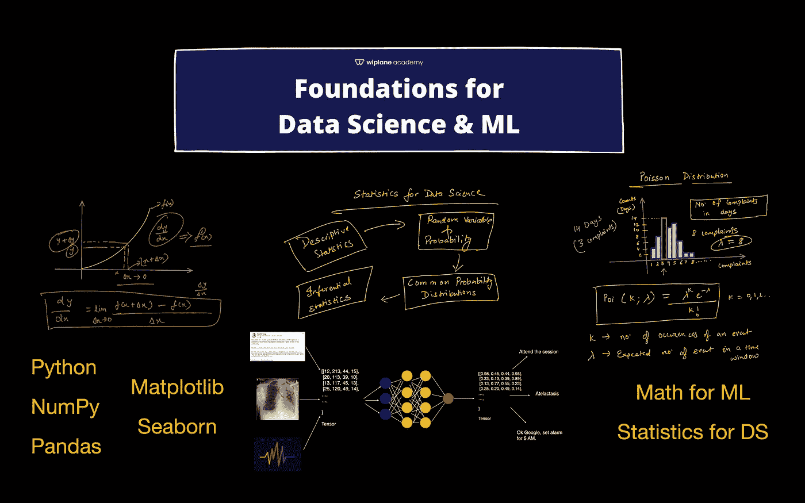
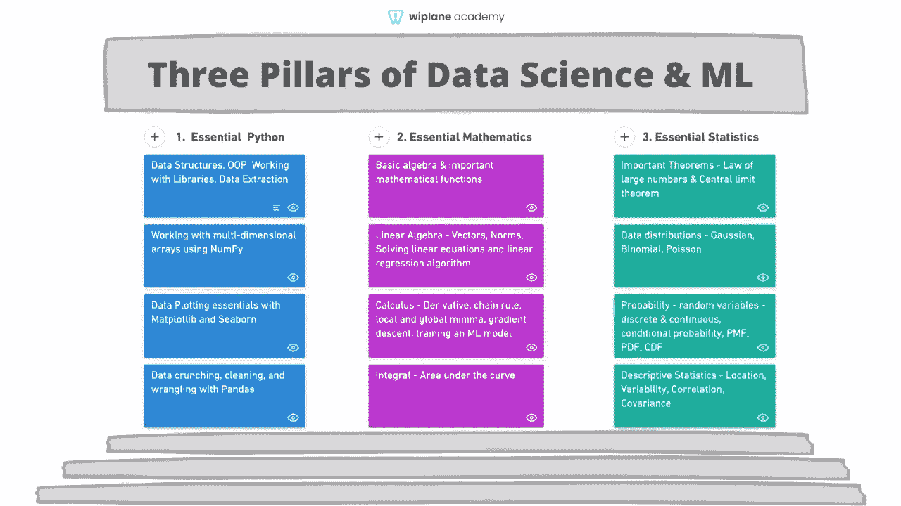
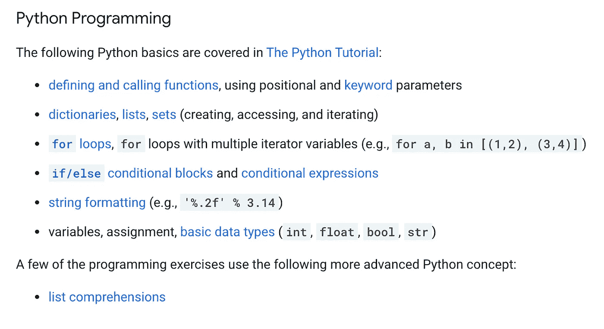
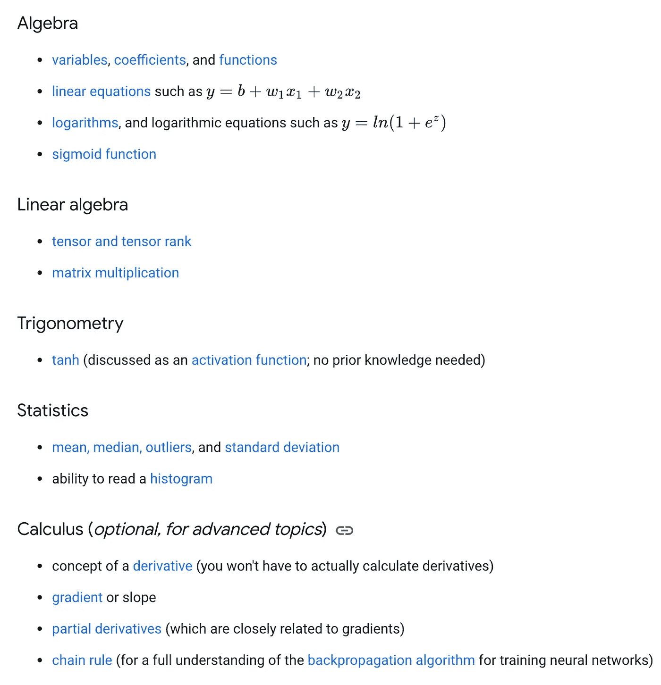
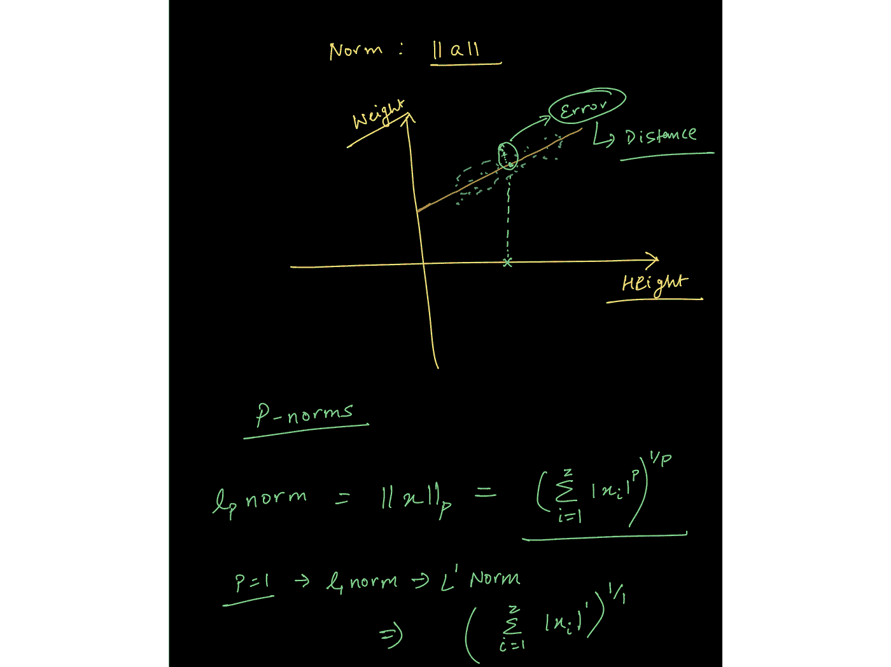
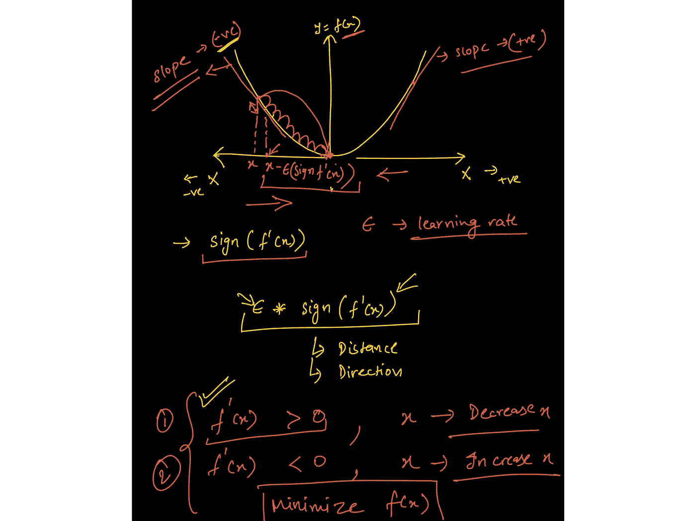
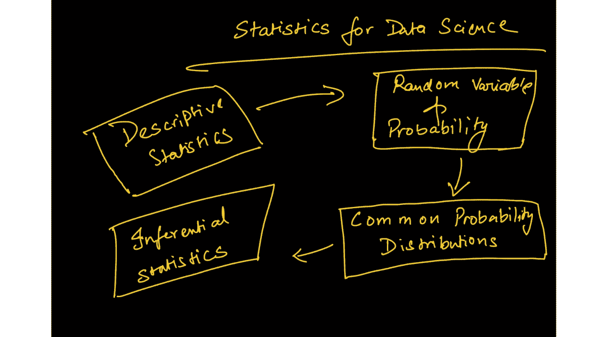
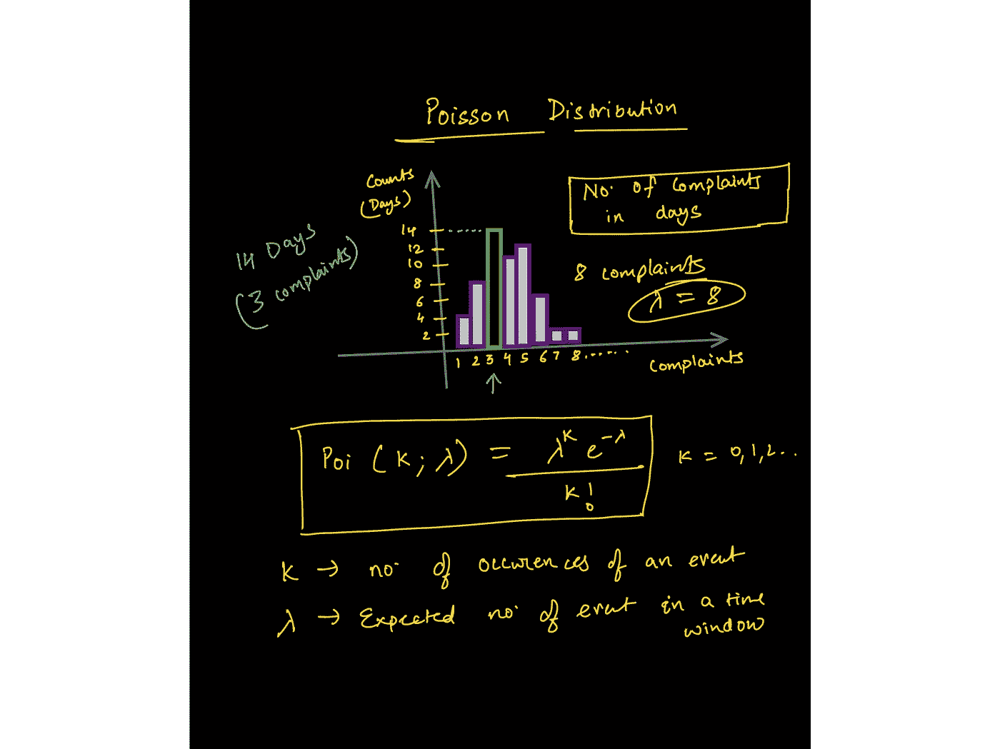
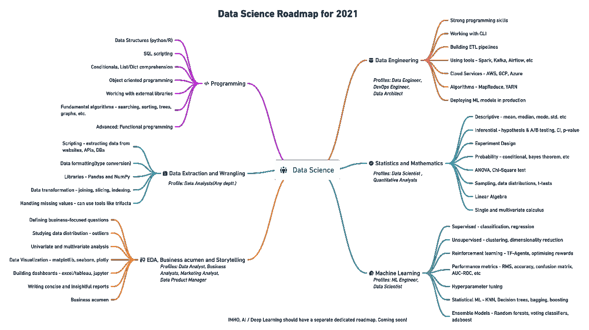
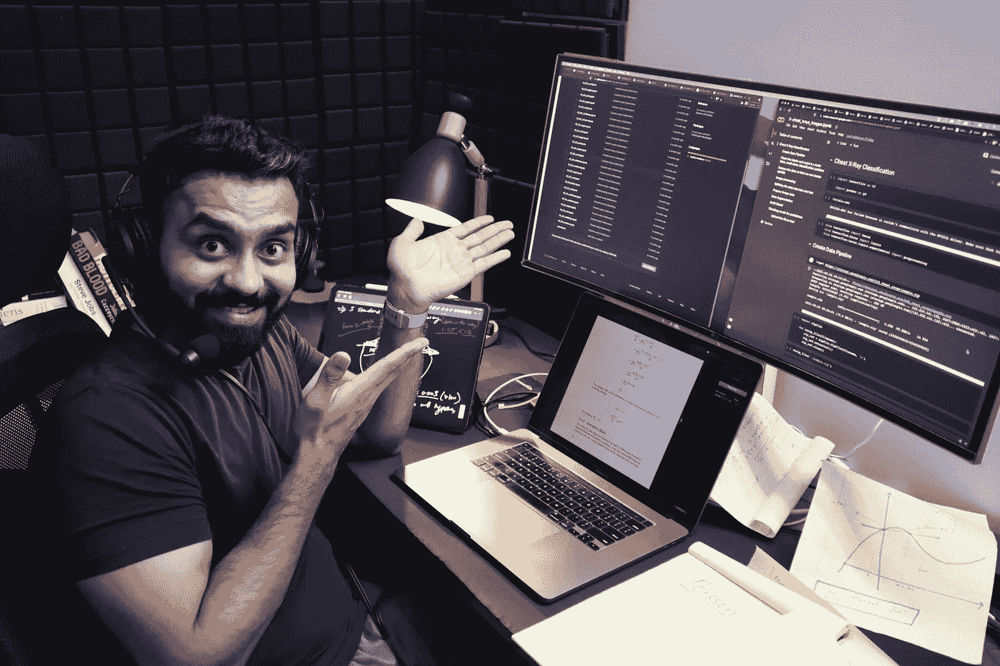

# 路线图之后学习数据科学或 ML 的第一步

> 原文：<https://towardsdatascience.com/first-steps-to-learning-data-science-or-ml-after-the-roadmap-50d4b46b93e9?source=collection_archive---------12----------------------->

## 深入研究数据科学和 ML 之前的先决条件和准备工作

来源:https://www.wiplane.com/p/foundations-for-data-science-ml

今年年初，我在[数据科学学习路线图(如下图)](/data-science-learning-roadmap-for-2021-84f2ba09a44f)上发表了思维导图。路线图被广泛接受，那篇文章被翻译成不同的语言，很多人感谢我发表了它。

一切都很好，直到一些有抱负的人指出，有太多的资源，其中许多是昂贵的。Python 编程是唯一一个有很多非常好的课程的分支，但对于初学者来说，它就到此为止了。

关于基础数据科学的几个重要问题让我印象深刻:

*   学会编码后应该做什么？有没有帮助你巩固数据科学基础的主题？
*   我讨厌数学，对我来说，要么有非常基础的教程，要么太深奥。你能推荐一门紧凑而全面的数学和统计学课程吗？
*   有多少数学知识足以开始学习 ML 算法是如何工作的？
*   数据分析或数据科学入门的基本统计主题是什么？

这些问题的答案可以在伊恩·古德菲勒和约舒阿·本吉奥合著的《T4 深度学习》一书中找到。但是对许多人来说，这本书有点太专业和数学化了。

因此，这篇文章的本质是学习数据科学或 ML 的第一步。

# 数据科学的三大支柱& ML

来源:[https://wiplane.com](https://www.wiplane.com/p/foundations-for-data-science-ml)

如果你仔细阅读任何 ML/DS 课程的先决条件或准备工作，你会发现编程、数学和统计学的结合。

忘掉其他人吧，以下是谷歌推荐你在学习 ML 课程前要做的事情:

[https://developers . Google . com/machine-learning/速成班/先决条件和准备工作](https://developers.google.com/machine-learning/crash-course/prereqs-and-prework) (CC BY 4.0)

# 1.基本程序设计

除了商业智能、市场分析、产品分析师等少数角色之外，大多数数据角色都是基于编程的。

我将专注于需要至少一门编程语言专业知识的技术数据工作。我个人更喜欢 Python，因为它的通用性和易学性——这无疑是开发端到端项目的好选择。

**一瞥数据科学必须掌握的主题/库:**

*   **常用数据结构**(数据类型、列表、字典、集合、元组)、编写函数、逻辑、控制流、搜索和排序算法、面向对象编程、与外部库协同工作。
*   **编写 python 脚本来提取**，格式化，并将数据存储到文件或数据库中。
*   **处理多维数组**，使用 NumPy 进行索引、切片、转置、广播和伪随机数生成。
*   使用 NumPy 等科学计算库执行矢量化运算。
*   **使用 Pandas** 操作数据—系列、数据帧、数据帧中的索引、比较运算符、合并数据帧、映射和应用函数。
*   **使用 pandas 处理数据** —检查空值、输入空值、对数据分组、描述数据、执行探索性分析等。
*   **使用 Matplotlib** 的数据可视化 API 层次结构，为绘图添加样式、颜色和标记，了解各种绘图以及何时使用它们，线图、条形图、散点图、直方图、箱线图和 seaborn，以进行更高级的绘图。

# 2.基础数学

对于那些想成为人工智能从业者、数据科学家或深度学习工程师的人来说，数学是必不可少的，这是有实际原因的。

## 1.表示数据的线性代数

本课程中关于向量范数的讲座图片:[https://www.wiplane.com/p/foundations-for-data-science-ml](https://www.wiplane.com/p/foundations-for-data-science-ml)

ML 本质上是数据驱动的；数据是机器学习的核心。我们可以把数据看作是**向量—** 遵循算术规则的对象。这让我们理解了线性代数的规则是如何操作数据数组的。

## 2.训练 ML 模型的微积分

课程中关于梯度下降的讲座图片:[https://www.wiplane.com/p/foundations-for-data-science-ml](https://www.wiplane.com/p/foundations-for-data-science-ml)

如果你认为模型训练是“自动”发生的，那你就错了。微积分是大多数 ML 和 DL 算法学习的驱动力。

最常用的优化算法之一——**梯度下降**——是偏导数的应用。

模型是某些信念和假设的数学表示。据说，它首先学习(近似)如何提供数据、如何生成数据的过程(线性、多项式等),然后基于所学习的过程进行预测。

**重要话题包括:**

*   **基础代数—** 变量、系数、方程、函数—线性、指数、对数等。
*   **线性代数—** 标量、向量、张量、范数(L1 & L2)、点积、矩阵的类型、线性变换、用矩阵符号表示线性方程、利用向量和矩阵解决线性回归问题。
*   **微积分—** 导数和极限、导数规则、链规则(用于反向传播算法)、偏导数(用于计算梯度)、函数的凸性、局部/全局最小值、回归模型背后的数学、从头开始训练模型的应用数学。

# 3.基本统计

如今，每个组织都在努力成为数据驱动型组织。为了实现这一目标，分析师和科学家需要以不同的方式使用输入数据，以推动决策制定。

## 描述数据—从数据到见解

数据总是原始而丑陋的。最初的探索告诉您缺少什么，数据是如何分布的，以及清理数据以满足最终目标的最佳方式是什么。

为了回答已定义的问题，描述性统计使您能够将数据中的每个观察结果转化为有意义的见解。

## 量化不确定性

此外，量化不确定性的能力是任何数据公司都非常重视的最有价值的技能。了解任何实验/决策的成功机会对所有企业都非常重要。

**这里有一些构成最低限度的主要统计数据:**

图片来自泊松分布讲座—[https://www.wiplane.com/p/foundations-for-data-science-ml](https://www.wiplane.com/p/foundations-for-data-science-ml)

*   位置估计值——平均值、中间值和其他变量。
*   可变性的估计
*   相关性和协方差
*   随机变量—离散和连续
*   数据分发— PMF、PDF、CDF
*   条件概率—贝叶斯统计
*   常用的统计分布——高斯分布、二项式分布、泊松分布、指数分布。
*   重要定理-大数定律和中心极限定理。

图片来自泊松分布讲座—[https://www.wiplane.com/p/foundations-for-data-science-ml](https://www.wiplane.com/p/foundations-for-data-science-ml)

*   **推断统计—** 一种更实用、更高级的统计分支，有助于设计假设检验实验，推动我们深入理解指标的含义，同时帮助我们量化结果的重要性。
*   **重要测试—** 学生的 t 检验、卡方检验、ANOVA 检验等。

> ***每一个初级数据科学爱好者都应该在深入任何核心数据科学或核心 ML 课程之前关注这三大支柱***

# 学习上述内容的资源——寻找紧凑、全面而又负担得起的课程。

[https://www . freecodecamp . org/news/data-science-learning-roadmap/](https://www.freecodecamp.org/news/data-science-learning-roadmap/)

[我的学习路线图](/data-science-learning-roadmap-for-2021-84f2ba09a44f)也告诉你要学什么，它还载有你可以报名参加的资源、课程和项目。

但是在推荐的资源和我绘制的路线图中有一些不一致的地方。

## 数据科学或 ML 课程的问题

1.  我在那里参加的每一门数据科学课程都要求学生对编程、数学或统计有相当好的理解。例如，[吴恩达最著名的 ML 课程](https://www.youtube.com/watch?v=PPLop4L2eGk&list=PLLssT5z_DsK-h9vYZkQkYNWcItqhlRJLN)也非常依赖于对向量代数和微积分的理解。
2.  大多数涵盖数据科学的数学和统计学的课程只是 DS/ML 所需概念的清单，没有解释它们如何应用以及它们如何被编程到机器中。
3.  有一些特殊的资源可以深入研究数学，但我们大多数人都不适合数学，学习数据科学不需要成为金牌得主。

# **wiplane.com 维普兰学院**

**所以，我决定让步，全靠自己。我花了 3 个月的时间开发了一个课程，为你的职业生涯提供了一个坚实的基础。**

*   **数据分析师**
*   **数据科学家**
*   **或者 ML 从业者/工程师**

**在这里，我向您介绍数据科学的 [**基础或 ML**](https://www.wiplane.com/p/foundations-for-data-science-ml)**—**[**学习数据科学和 ML**](https://www.wiplane.com/p/foundations-for-data-science-ml) 的第一步**

****

**那是我决定发射的时候！**

**这是一门全面而紧凑且经济实惠的课程，不仅涵盖了**所有的基本要素、先决条件、&准备工作**，还解释了每个概念如何在计算上和程序上使用**(python)**。**

**不仅如此，我还会根据您的意见每月更新课程内容。在这里了解更多。**

## **早鸟优惠！**

**我很高兴启动本课程的预售，因为我目前正在录制和编辑 2-3 个模块的最后部分，这些模块也将在 9 月的第一周上线。**

**获取早鸟优惠，有效期至 2021 年 8 月 30 日。**