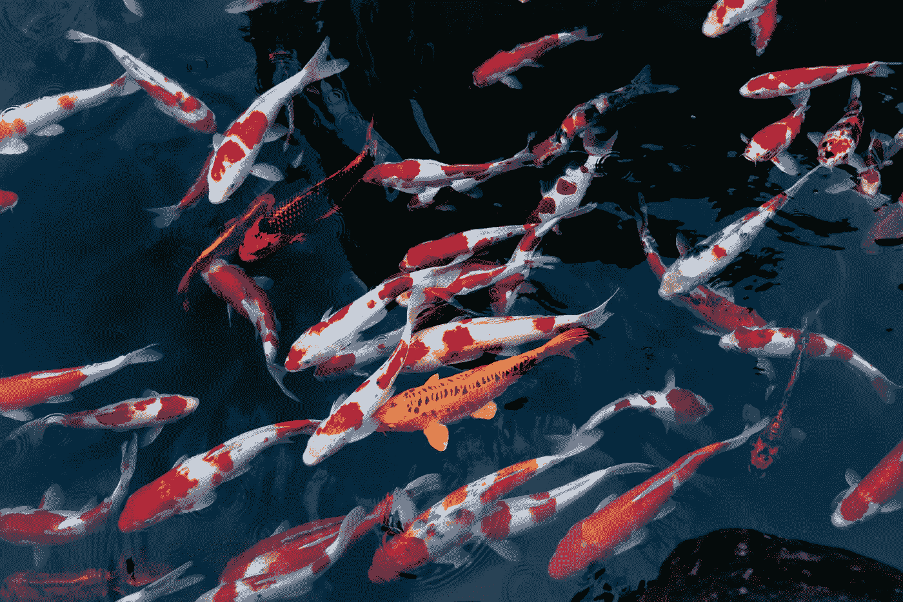
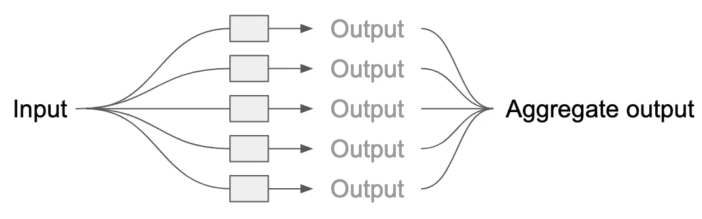
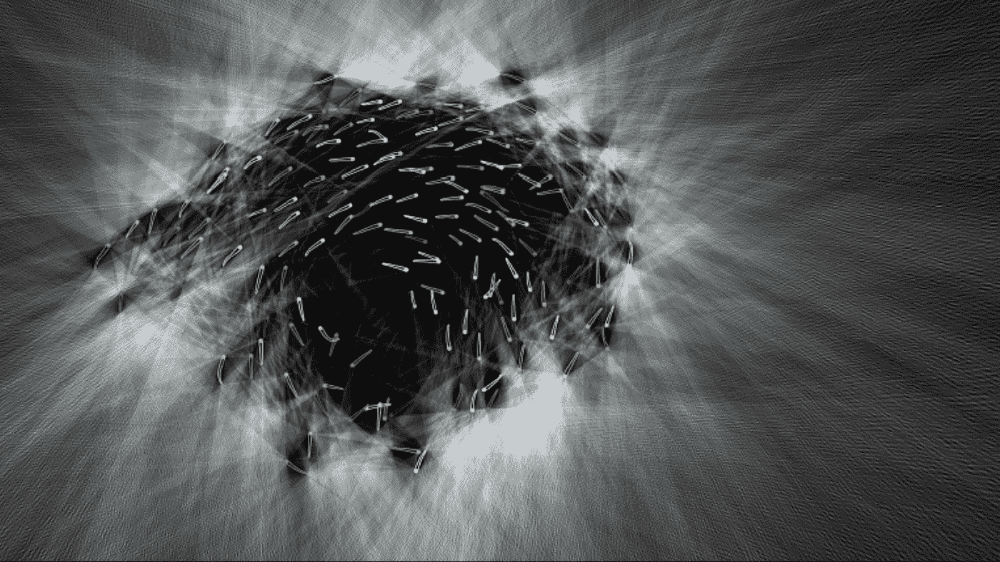
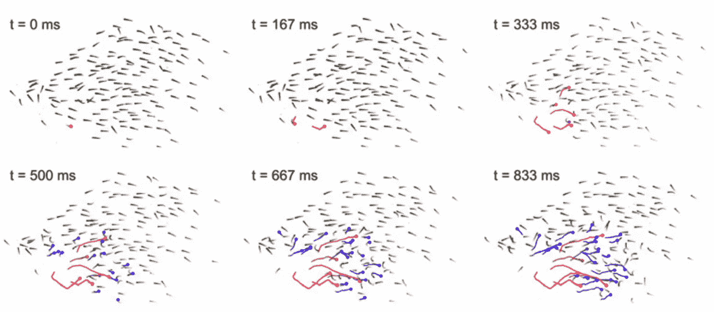
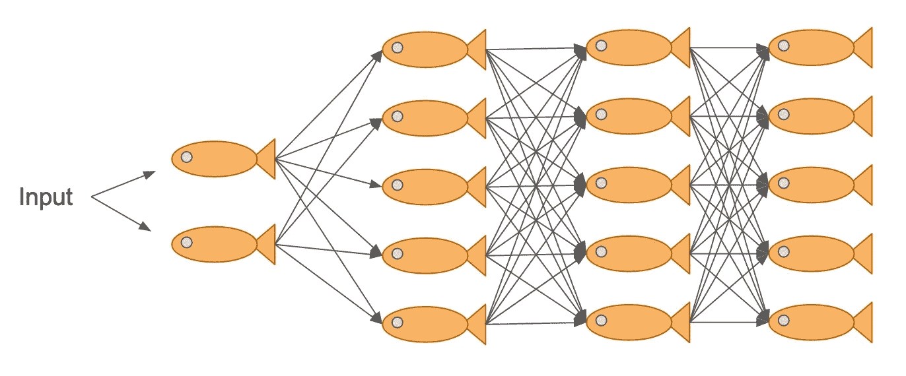

# 作为集成学习算法的鱼群

> 原文：<https://towardsdatascience.com/fish-schools-as-ensemble-learning-algorithms-4ab5da240e62?source=collection_archive---------17----------------------->

## 总的来说是准确的

照片由来自 [Pexels](https://www.pexels.com/photo/school-of-koi-fish-2131828/?utm_content=attributionCopyText&utm_medium=referral&utm_source=pexels) 的[光阮荣](https://www.pexels.com/@quang-nguyen-vinh-222549?utm_content=attributionCopyText&utm_medium=referral&utm_source=pexels)拍摄

**动物群体大于它们各部分的总和。当蚁群建造了一个坚固且通风良好的土堆时，单个的白蚁毫无头绪地四处游荡。孤鹤迷失方向，而群鸟成功迁徙。在认知复杂性的范围内，我们经常看到群体层面上出现成员单独无法做到的行为。这怎么可能？**

我花了我的博士学位来研究金色闪光鱼——一种普遍无望且不太聪明的生物——如何形成能够优雅地躲避捕食者的群体。我阅读了几十篇文章和教科书，进行了实验，分析了数据，并与理论家合作，试图弄清楚当谈到鱼时，1+1=3，而不是 2。

当我离开学术界进入数据科学领域时，我获得的所有知识似乎注定要在我大脑的某个角落成为一堆尘封的事实。但是当我开始我的数据科学教育时，我惊讶地看到我研究的 中的 ***决策与*** [***集成学习***](http://www.scholarpedia.org/article/Ensemble_learning) ***算法*** 中的 ***决策之间有一种奇怪的相似之处。***

这篇文章将向你展示弱学习者的集合——无论他们是鱼还是决策树——如何一起形成一个精确的信息处理器。

# 机器

让我们首先讨论机器学习方面，因为你可能比动物更熟悉算法！**集成学习方法使用一组*模型*来生成预测，**而不是一个单一模型。这个想法是模型预测中的误差相互抵消，导致整体预测更加准确。

在下面的示意图中，我们的集合是一组灰色的盒子，每个盒子都是一个模型。为了生成输入的预测值，输入被发送到每个模型，该模型生成一个预测。然后，通过平均(用于回归)或多数投票(用于分类)，这些单独的预测被缩减为一个*集合*预测。

作者图片

一种流行的集成方法是 [**随机森林**](https://en.wikipedia.org/wiki/Random_forest) ，这是一种由几十或几百棵[决策树](https://en.wikipedia.org/wiki/Decision_tree)组成的模型。虽然有很多方法[来配置如何组装森林，但一般的过程是每棵树都根据](https://scikit-learn.org/stable/modules/generated/sklearn.ensemble.RandomForestClassifier.html)[引导的](https://machinelearningmastery.com/a-gentle-introduction-to-the-bootstrap-method/)观察和特征的随机子集进行独立训练。(如果我们对每棵树使用相同的数据，我们每次都会创建相同的树！)

结果是模型的集合，**每个模型对训练数据的理解*略有不同*。**这种变化至关重要。单个决策树很容易变得过度适应它们的训练数据，沉迷于它们样本中的模式，而这些模式在更广阔的世界中不一定存在。但是因为集合由许多树组成，当计算集合预测时，这些误差倾向于彼此抵消。

# 该理论

随机森林增强的准确性可以概括为[群众的智慧](https://en.wikipedia.org/wiki/Wisdom_of_the_crowd)。这个概念可以追溯到 1906 年马萨诸塞州普利茅斯的一个牲畜交易会上，当时举办了一场猜公牛体重的比赛。近 800 名农民给出了他们最好的估计。统计学家弗朗西斯·高尔顿爵士后来检查了这些猜测，并观察到尽管个人估计差异很大，但估计的平均值比任何个人猜测都更准确。高尔顿继续在他著名的《大众之声》论文中正式阐述他的理论。

照片由[像素](https://www.pexels.com/photo/brown-bull-on-green-glass-field-under-grey-and-blue-cloudy-sky-139399/)的[皮克斯拜](https://www.pexels.com/@pixabay)拍摄

要让群众的智慧发挥作用，有两个关键要求。首先是**个人必须*改变他们的信息*。如果每个人都有相同的信息，团队的决定不会比个人的更准确。这甚至会导致群体成员对他们的[回音室](https://en.wikipedia.org/wiki/Echo_chamber_(media))过于自信，从而导致一般的*不太准确的决策。[1]***

第二个要求是**个人评估必须独立于*和*。如果这 800 名农民在投票前与他们的邻居商议，独特观点的数量将会减少到几百个，甚至可能只有几十个，因为人们的观点开始相互影响。个性张扬的人的意见会比沉默寡言的人的意见更有分量；罕见的信息将被丢弃，以利于常识。**

在某种程度上，这些农民就像一个随机的森林，需要几十年的时间来培养。在他们的一生中，每个农民都学会了如何将牛的各种特征——角的大小、肩高——与体重对应起来。在交易会上，每个农民都选择了一个新的数据点，并独立地进行估算。然后，高尔顿将他们的回答汇总成一个最终的预测，从而完成了类比。

# 鱼

虽然群众的智慧可以解释牛展会，但对于我们的 shiners 来说，这个故事变得更加微妙。随机森林并不是描述鱼群的正确算法，一个主要原因是:一条鱼所拥有的关于其环境的信息与其邻居有很强的相关性。

想想下面的图片，一所学校有 150 个金闪闪发光的人。使用光线投射算法对每个发光器的视野进行了近似，只有实际离开该组的光线被着色为白色。

图片来自[罗森塔尔等人 2015 年](https://www.pnas.org/content/pnas/suppl/2015/03/24/1420068112.DCSupplemental/pnas.1420068112.sapp.pdf)的补充信息

首先跳出来的是，学校内部是外界信息的死区——这些鱼只看到*其他鱼*。第二件要注意的事情是，即使对于 T2 看到外面的闪光者来说，彼此附近的个体也在接收关于他们周围环境的基本相同的信息。

当只有极少数关于外部世界的独立数据点时，像这样的一群人怎么可能做出明智的决定，决定是向左还是向右，探索食物还是躲避捕食者？(然后*协调*那几十个群龙无首的成员！)然而，尽管个体的信息在空间上是自相关的，这阻碍了群体的智慧，但还是有一些闪亮的群体[有效地找到了避难所](https://kops.uni-konstanz.de/bitstream/handle/123456789/36982/Berdahl_0-387565.pdf?sequence=1)和[调节了对风险的反应](https://www.pnas.org/content/pnas/116/41/20556.full.pdf)。

不幸的是，[这些问题没有简单的答案](https://core.ac.uk/download/pdf/82291278.pdf)！集体行为领域正在努力试图理解简单的局部互动如何导致复杂的群体行为。但我认为有两类机器学习算法可以解释鱼群如何做它们所做的一些方面。

**首先是** [***助推*合奏学习**](https://quantdare.com/what-is-the-difference-between-bagging-and-boosting/) **。**随机森林使用 bagging，这涉及到并行地独立训练每个模型。另一方面，像 [AdaBoost](https://blog.paperspace.com/adaboost-optimizer/) 和 [XGBoost](https://machinelearningmastery.com/gentle-introduction-xgboost-applied-machine-learning/) 这样的方法依次训练模型*，后面的模型从前面模型的错误中学习。成群游动的鱼[很快学会从其他鱼的错误中识别出捕食者](https://d1wqtxts1xzle7.cloudfront.net/38450274/Manassa_and_McCormick_2012b.pdf?1439341938=&response-content-disposition=inline%3B+filename%3DSocial_learning_and_acquired_recognition.pdf&Expires=1622730506&Signature=HAbYEHdliiZBK3N-aEQrqrquAcQEGr10BJutxdWqY9vX-WzY9VWGhQnucCIY9pfMSeVx75dD~u-mJEpd9mrMOv2v1miXZdTlsGTQE4ljmUeIODE3InJ9gypfgEFcmXyyi4Ilxe87SP~xr0iZLwpXzU-g1fB8F8LEfyG4c4V6aKvrEWVe-ZQXQXuSPnT9xkz2HGt7Odv431L-sVoziQ7KrGE8PxlxsljWU71mdGOxrnheXoXMED5YUEvf89n9KeFEuKSkMIVTvkkgJXtGhWQrPGxZZNex3Lknz2UvGzaUfmvUTLZOpNlPudHRY5gVRY9cplglDYiw7Kd87OIfRZ4grw__&Key-Pair-Id=APKAJLOHF5GGSLRBV4ZA)，而理解环境线索的鱼通常最终会[决定群体运动的方向](https://www.researchgate.net/profile/Stephan-Reebs/publication/285599716_Can_a_minority_of_informed_leaders_determine_the_foraging_movements_of_a_fish_shoal/links/5a33f2ba45851532e82c989a/Can-a-minority-of-informed-leaders-determine-the-foraging-movements-of-a-fish-shoal.pdf)。*

*第二种可能性是鱼群就像一个巨大的神经网络。(从生物神经元到人工神经网络，再到鱼群……我们又兜了一圈！)当谈到避免被捕食时，许多鱼类会做出惊吓反应，即一种超快速、反射性的逃离令人惊恐的刺激的爆发。[2]这些反应是会传染的，通常会导致一连串的惊吓，其速度比攻击捕食者还要快。*

**

*令人震惊的瀑布。图片来自[罗森塔尔等人 2015](https://www.pnas.org/content/pnas/early/2015/03/24/1420068112.full.pdf?with-ds=yes)*

*这里有趣的一点是，群体成员的*输出*(即它们是否会惊吓)作为邻近鱼类的*输入*来决定它们是否应该惊吓。特别是对于在群体深处的鱼来说，几乎没有个人信息来验证波浪是假警报还是迎面而来的捕食者，对这些社会线索做出适当的反应可能意味着生死。*

*我们通常认为人工神经网络是模仿*生物*神经网络，但在某种程度上，*整个群体*在处理关于其环境中风险的信息时充当一组神经元。但更令人着迷的是，这些神经元可以改变它们网络的结构，从而改变信息的处理方式。*

*在我的一篇论文中，我和我的同事展示了闪灵人通过改变个体之间的*间距*来调节他们对威胁的反应，而不是对是否对邻近的惊吓做出反应的内部计算。这意味着，群体结构本身，而不是个人，控制着随机的启动是螺旋上升为全面的级联，还是悄无声息地失败。*

**

**神经网络的一个神经网络决定去哪里吃饭。作者图片**

# *结论*

*动物群体如何完成个体无法完成的行为？这是集体行为领域整天思考的中心问题，集合了生物学、心理学、物理学和计算机科学试图回答这个问题。在这篇文章中，我们讨论了一个简单的集体智慧的例子，在这个例子中，对一头牛体重的独立估计导致了一个更准确的总体估计。然后我们浏览了鱼群集体计算的表面，鱼群的无定形结构在处理周围信息时不断变化。*

*有兴趣了解更多信息吗？看看[狒狒如何民主地做出运动决定](https://science.sciencemag.org/content/348/6241/1358/tab-pdf)，[创新行为在野生鸟类中代代相传](https://www.researchgate.net/profile/Lucy-Aplin/publication/269189563_Experimentally_induced_innovations_lead_to_persistent_culture_via_conformity_in_wild_bird/links/5735d90808ae298602e0920b/Experimentally-induced-innovations-lead-to-persistent-culture-via-conformity-in-wild-bird.pdf)，或者[黏菌如何通过优化资源分配来重建东京地铁图](https://math.mit.edu/~dunkel/Teach/18.S995_2014F/paper_suggestions/science_tero.pdf)。一定要去马克斯·普朗克动物行为研究所的[集体行为部](https://collectivebehaviour.com/)看看最新的很酷的集体行为研究。*

*最好，
马特*

# *脚注*

## *1.该理论*

*如果你从未在网上遇到不同的世界观，或者你只看到它被框定为属于一个白痴，那么你很可能在回音室。这种情况在很大程度上是不可避免的，因为社交网络往往会自我隔离，这意味着你需要寻找更客观的世界观所需的不同观点。*

## *2.鱼*

*为了在杂草中获得超级，实际上可能有多条神经通路用于启动，其中一些具有更精细的运动控制。至少，发光的人会因不同的强度而吃惊。但是当量化一个群体中的信息传播时，将震惊二值化为“是的，这条鱼受惊了”和“不，他们没有”是一个很好的近似*