# 鱼重预测(初学者回归分析)——第一部分

> 原文：<https://towardsdatascience.com/fish-weight-prediction-regression-analysis-for-beginners-part-1-8e43b0cb07e?source=collection_archive---------8----------------------->

## 如何使用顶级线性 ML 算法(线性回归、套索回归和岭回归)构建 ML 回归模型


雷切尔·希斯科在 [Unsplash](https://unsplash.com?utm_source=medium&utm_medium=referral) 上拍摄的照片

# **目录**

[简介](#5676)
[第 1.1 部分——构建 ML 模型管道。](#7482)
[第 1.2 部分——分析算法和方法。](#5108)
∘ [什么是线性模型？](#cf37)
∘ [算法对比](#22ca)
∘ [评价](#a6b5)
[结论](#6e35)
[参考文献](#753b)

# **简介**

今天，我们将使用线性模型，根据鱼的物种名称、垂直长度、对角线长度、交叉长度、高度和对角线宽度来预测(估计)鱼的重量。我将介绍解决问题的顶级城镇方法，我在之前的[文章](https://medium.com/@gkeretchashvili/how-to-start-your-data-science-machine-learning-journey-2af667e96d1)中解释过。首先在 1.1 部分我将建立一个模型，然后在 1.2 部分我将尝试解释每个算法和方法是如何工作的。这是一个适合初学者的回归分析问题。了解这类问题的主要构建原则和方法，有助于构建自己的 ML 回归模型如(房价预测等。)

# 第 1.1 部分—构建 ML 模型管道。

一般来说，构建 ML 模型分为 8 个步骤:如下图所示。

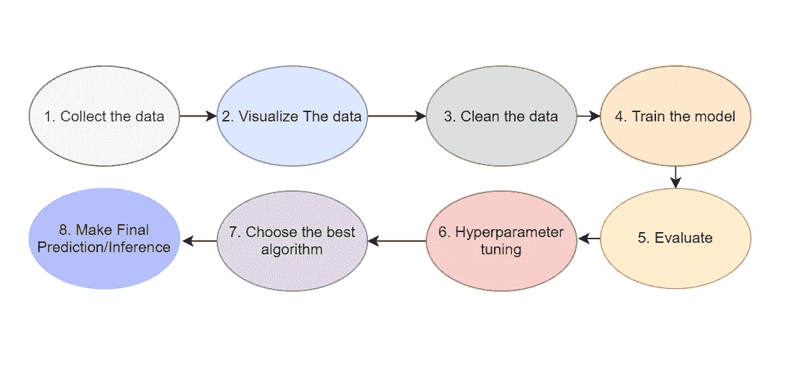

通常，数据科学家将 80%的时间花在前三步(也称为解释性数据分析-EDA)。大多数 ML 应用程序都遵循这一流程。简单应用和高级应用的区别在于 EDA 步骤。所以我们就按照上面提到的流水线，以解决权重预测问题为例。

**第一步:收集数据**

数据是可以从 [Kaggle](https://www.kaggle.com/aungpyaeap/fish-market) 下载的公共数据集。

```
**import** pandas **as** pd
**import** seaborn **as** sns
**import** matplotlib.pyplot **as** plt
**from** itertools **import** combinations
**import** numpy **as** np
data **=** pd**.**read_csv("Fish.csv")
```

**第二步:可视化数据(问自己这些问题并回答)**

*   数据看起来怎么样？

```
data**.**head()
```

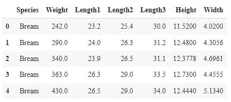

作者图片

*   数据是否有缺失值？

```
data**.**isna()**.**sum()
```


作者图片

注意:如你所见，在这种情况下，因为问题是针对初学者的，所以我们没有丢失值，然而，情况并不总是这样。在接下来的文章中，我们将有丢失值的数据，并有可能理解如何处理它。

*   数字特征的分布是什么？

```
data_num **=** data**.**drop(columns**=**["Species"])

fig, axes **=** plt**.**subplots(len(data_num**.**columns)**//**3, 3, figsize**=**(15, 6))
i **=** 0
**for** triaxis **in** axes:
    **for** axis **in** triaxis:
        data_num**.**hist(column **=** data_num**.**columns[i], ax**=**axis)
        i **=** i**+**1
```

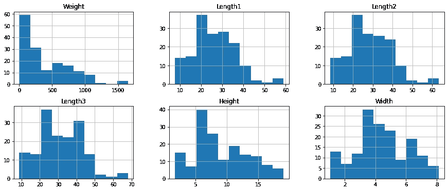

正如你所看到的，发行版是不错的。目标变量(权重)似乎有点不平衡，可以通过一些方法来平衡这些值。这是一个有点高深的话题，让我们暂时忽略它。

*   目标变量(重量)相对于鱼种的分布情况如何？

```
sns**.**displot(
  data**=**data,
  x**=**"Weight",
  hue**=**"Species",
  kind**=**"hist",
  height**=**6,
  aspect**=**1.4,
  bins**=**15
)
plt**.**show()sns**.**pairplot(data, kind**=**'scatter', hue**=**'Species');
```

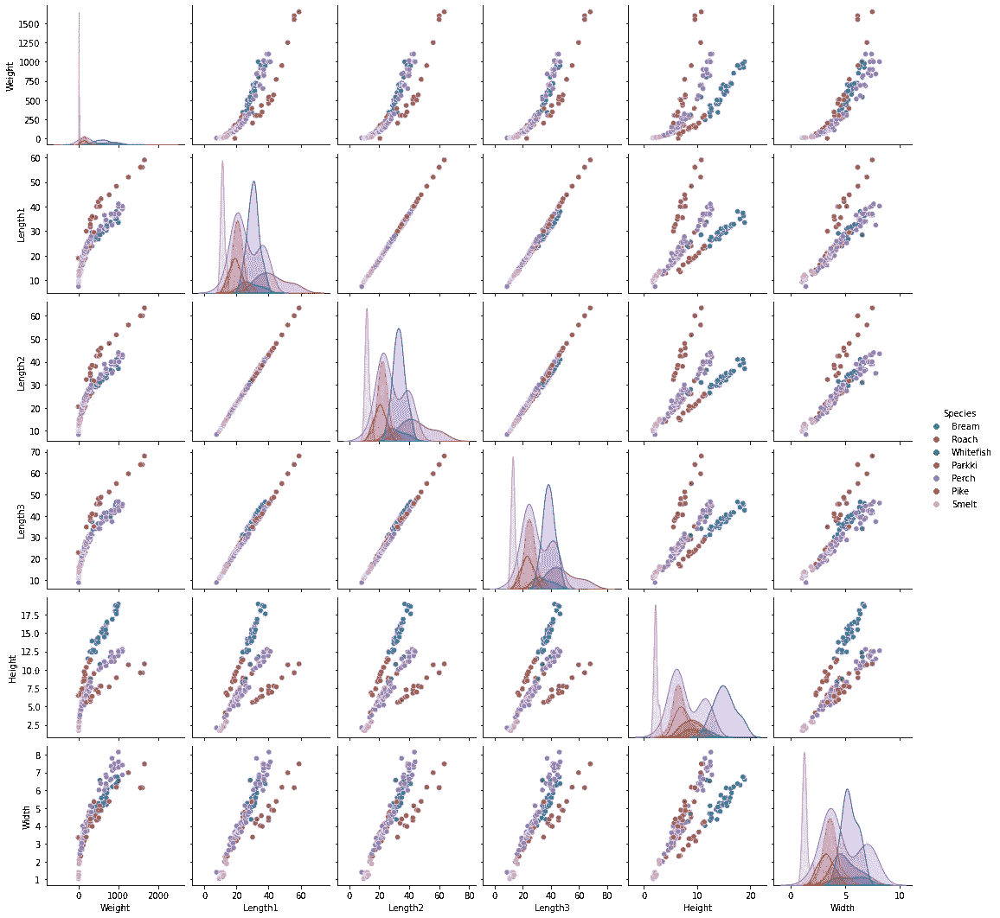

关于物种的目标变量分布表明，有些物种，如狗鱼，与其他物种相比具有巨大的重量。这种可视化为我们提供了关于“**物种”**特征如何用于预测的额外信息。

*   目标变量和特征之间的相关性是什么？

```
plt**.**figure(figsize**=**(7,6))
corr **=** data_num**.**corr()
sns**.**heatmap(corr, 
            xticklabels**=**corr**.**columns**.**values,
            yticklabels**=**corr**.**columns**.**values, annot**=True**)
plt**.**show()
```

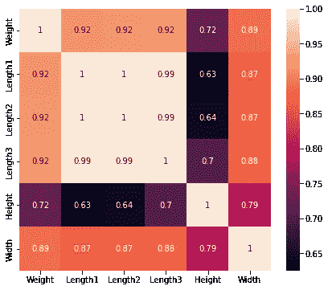

列的成对相关显示所有数字特征与权重正相关。这意味着长度或宽度越高，重量就越大。这似乎也符合逻辑。

**第三步:清理数据**

```
**from** sklearn.model_selection **import** train_test_split
**from** sklearn.compose **import** make_column_transformer
**from** sklearn.preprocessing **import**  OneHotEncoder, StandardScaler 

**from** sklearn.linear_model **import** LinearRegression, Ridge, Lasso
**from** sklearn.metrics **import** mean_squared_error, mean_absolute_error, r2_score

ct **=** make_column_transformer(
    (StandardScaler(),['Length1','Length2','Length3','Height','Width']), *#turn all values from 0 to 1*
    (OneHotEncoder(handle_unknown**=**"ignore"), ["Species"])
)
*#create X and y values*
data_cleaned **=**   data**.**drop("Weight",axis**=**1)
y **=** data['Weight']

x_train, x_test, y_train, y_test **=** train_test_split(data_cleaned,y, test_size**=**0.2, random_state**=**42)
print(x_train**.**shape, x_test**.**shape, y_train**.**shape, y_test**.**shape)X_train_normal **=** pd**.**DataFrame(ct**.**fit_transform(x_train))
X_test_normal **=** pd**.**DataFrame(ct**.**transform(x_test))
```

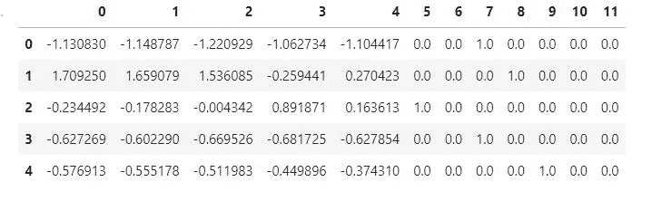

使用 OneHotEncoder 将**物种**列转换为 7 个特征。数字特征被缩放是因为线性模型喜欢缩放。(我将在文章的 1.2 部分解释细节)

**第四步:训练模型**

```
**def** models_score(model_name, train_data, y_train, val_data,y_val):
    model_list **=** ["Linear_Regression","Lasso_Regression","Ridge_Regression"]
    *#model_1*
    **if** model_name**==**"Linear_Regression":
        reg **=** LinearRegression()
    *#model_2*
    **elif** model_name**==**"Lasso_Regression":
      reg **=** Lasso(alpha**=**0.1,tol**=**0.03)

    *#model_3*
    **elif** model_name**==**"Ridge_Regression":
        reg **=** Ridge(alpha**=**1.0)
    **else**:
        print("please enter correct regressor name")

    **if** model_name **in** model_list:
        reg**.**fit(train_data,y_train)
        pred **=** reg**.**predict(val_data)

        score_MSE **=** mean_squared_error(pred, y_val)
        score_MAE **=** mean_absolute_error(pred, y_val)
        score_r2score **=** r2_score(pred, y_val)
        **return** round(score_MSE,2), round(score_MAE,2), round(score_r2score,2)model_list **=** ["Linear_Regression","Lasso_Regression","Ridge_Regression"]
result_scores **=** []
**for** model **in** model_list:
    score **=** models_score(model,X_train_normal,y_train, X_test_normal,y_test)
    result_scores**.**append((model, score[0], score[1],score[2]))
    print(model,score)
```

在上面的代码中，我们训练了不同的模型，并测量了均方误差(MSE)、平均绝对误差(MAE)、R 得分的准确性。

**第五步:评估**

```
df_result_scores **=** pd**.**DataFrame(result_scores,columns**=**["model","mse","mae","r2score"])
df_result_scores
```


最佳模型的 MSE 和 MAE 值低，R 值高。结果显示，在该数据集中，简单线性回归的表现优于 Lasso 回归和岭回归。

**步骤 6:超参数调整**

在这种情况下，基本线性回归模型的超参数可以被认为是学习率。它被实现为一个 [SGDRegressor](https://scikit-learn.org/stable/modules/generated/sklearn.linear_model.SGDRegressor.html) ，它更新学习率和权重。所以现在最好是为山脊或套索做超参数调整。让我们做岭回归，看看它是否会击败简单线性回归的分数。

```
from scipy.stats import loguniform
from sklearn.model_selection import RepeatedKFold
from sklearn.model_selection import RandomizedSearchCVspace = dict()
space['solver'] = ['svd', 'cholesky', 'lsqr', 'sag']
space['alpha'] = loguniform(1e-5, 50)
model = Ridge()cv = RepeatedKFold(n_splits=5, n_repeats=3, random_state=1)search = RandomizedSearchCV(model, space, n_iter=100, 
     scoring='neg_mean_absolute_error', n_jobs=-1, cv=cv,                 random_state=42)
result = search.fit(X_train_normal, y_train)print('Best Score: %s' % result.best_score_)
print('Best Hyperparameters: %s' % result.best_params_)
```

最好成绩:-75 分。36860.78868688667

最佳超参数:{'alpha': 0.24171039031894245，' solver': 'sag'}

现在让我们拟合这些超参数，看看结果。

```
reg = Ridge(alpha=0.24171039031894245, solver ="sag" )
reg.fit(X_train_normal,y_train)
pred = reg.predict(X_test_normal)
score_MSE = mean_squared_error(pred, y_test)
score_MAE = mean_absolute_error(pred, y_test)
score_r2score = r2_score(pred, y_test)
to_append = ["Ridge_hyper_tuned",round(score_MSE,2), round(score_MAE,2), round(score_r2score,2)]
df_result_scores.loc[len(df_result_scores)] = to_append
df_result_scores
```

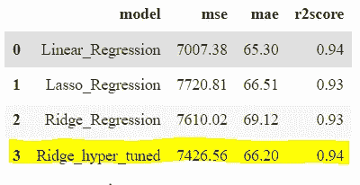

超参数改进了以前的缺省岭结果，但是，它仍然不如简单的线性回归。

**第七步:选择最佳模型和预测**

```
*# winner model*
reg **=** LinearRegression()
reg**.**fit(X_train_normal,y_train)
pred **=** reg**.**predict(X_test_normal) plt**.**figure(figsize**=**(18,7))
plt**.**subplot(1, 2, 1) *# row 1, col 2 index 1*
plt**.**scatter(range(0,len(X_test_normal)), pred,color**=**"green",label**=**"predicted")
plt**.**scatter(range(0,len(X_test_normal)), y_test,color**=**"red",label**=**"True value")
plt**.**legend()

plt**.**subplot(1, 2, 2) *# index 2*
plt**.**plot(range(0,len(X_test_normal)), pred,color**=**"green",label**=**"predicted")
plt**.**plot(range(0,len(X_test_normal)), y_test,color**=**"red",label**=**"True value")
plt**.**legend()
plt**.**show()
```

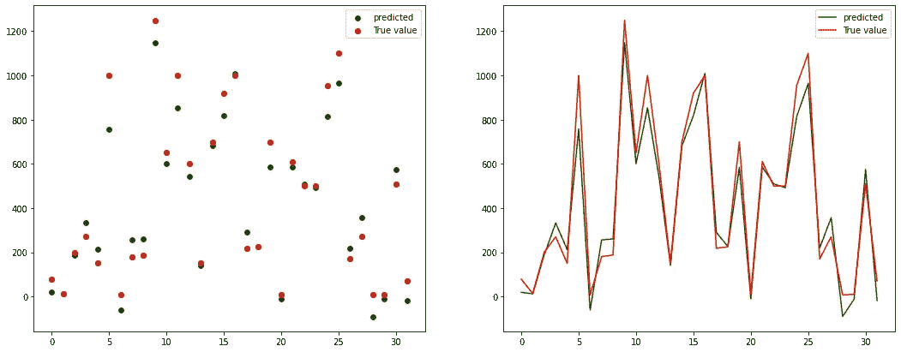

为了评估 MSE、MAE 和 R2score，我们需要将预测和实际预测可视化。为什么？因为只有 MSE 或 MAE 分数，我们不能理解模型有多好。所以在上面的可视化中，预测和真值真的很接近。这意味着模型运行良好。

# **第 1.2 部分—** 分析算法和方法。

在这一部分，我将解释以上算法、方法和评估背后的所有理论部分。

## **什么是线性模型？**

术语线性模型意味着模型被指定为特征的线性组合。线性回归、套索回归和岭回归都是线性算法。

*   **什么是线性回归？**

线性回归是基于自变量 x 预测目标变量 Y 的 ML 监督学习算法，我们举一个简单的例子，计算一下如何弄清楚它的工作原理。比如 X 是工作经验，Y 是工资。

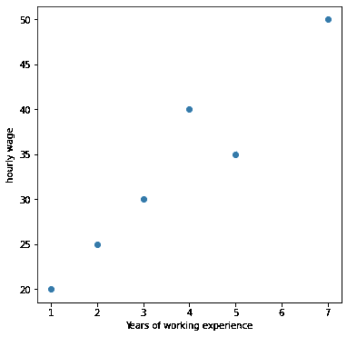

作者图片

从这个形象化的例子中，我们可能很容易理解工作经验和薪水之间的关系——如果一个人有更多的经验，他们会赚更多的钱。

我们有一个线性回归的假设函数

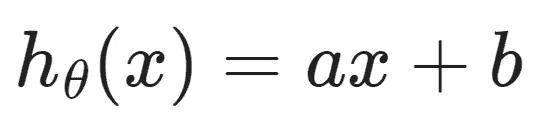

其中 a 和 b 是可训练参数(也称为系数、权重)。

a-y 轴上的截距

b —是一个斜率

**目标**:找到 a 和 b，使得我们最小化成本函数，这与普通的最小二乘法相同(在 Sklearn 中)


在下图中，我们可以直观地了解算法是如何工作的。在第一个特征中，我们有一个假设函数 h(x) = 32，然后计算 OLS，我们更新参数并生成假设函数 h(x) = 1.6x +29，最后它达到 h(x) = 3.6 +20。对于每个参数更新，目标是最小化 OLS。

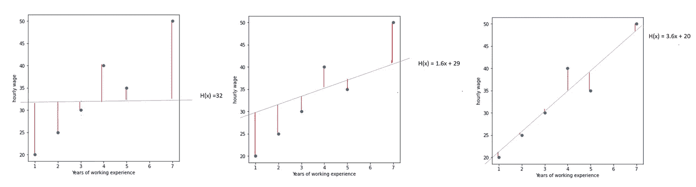

作者图片

我们如何更新 a 和 b 的值来最小化 MSE？

我们使用**梯度下降**算法更新 a 和 b，直到收敛。但是首先什么是**梯度**？

> 梯度衡量的是当你稍微改变输入时，函数的输出会有多大的变化——Lex frid man(MIT)

简而言之，梯度测量关于成本函数的所有权重的变化。它是一个函数的斜率，斜率越高，模型学习得越快。但是如果梯度为零，权重不再更新，因此算法停止学习。


a 由第二部分更新，第二部分是学习率和梯度乘法。学习率对找到局部最小值有巨大的影响。当学习率太大时，它会导致在函数的局部最小值之间来回跳跃，而如果学习率太低，它将达到局部最小值，但会花费太多时间。

*   **拉索回归**

Laso 是线性回归的一个微小修改。它执行 L1 正则化，这意味着它添加了相当于系数幅度绝对值的惩罚。我们为什么需要它？因为它最终将大的权重降低到小的，小的权重降低到几乎为零。理论上，当我们在训练数据中有很多特征并且我们知道并非所有特征都重要时，可以使用这种方法。Lasso 回归将有助于从大量特征中识别出几个最重要的特征。

*   **岭回归**

岭回归也是使用 L2 正则化对线性回归的轻微修改，这意味着它从权重平方值的总和中对模型进行惩罚。因此，这导致系数的绝对值减小，并且具有均匀分布的系数。我们为什么需要这个？如果我们有一些特征，并且我们知道它们都可能影响预测，我们可以在这种情况下使用岭回归。

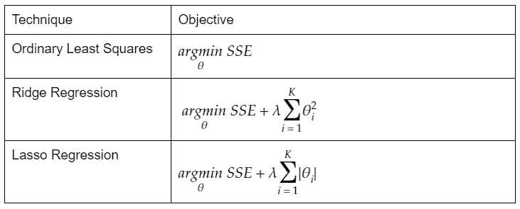

所以线性回归是没有正则化的(对参数没有惩罚)。它有时会对某些特征赋予较高的权重，从而导致小数据集中的过度拟合。这就是为什么使用套索回归(与 L1 正则化相同)或岭回归(L2 正则化)模型来调整独立变量的权重。一般来说，如果数据特征的数量远小于样本数量(#特征<< #rows) then it is likely that simple linear regression would work better. However, if a number of features are not much less than a number of samples it will tend to have high variance and low accuracy, in that case, Lasso and Ridge are more likely to work better.

## Comparison of the Algorithms

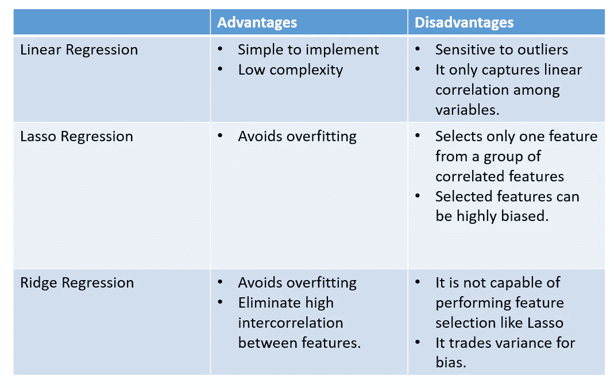

image by author

## **评估**

所有回归类型的模型都有相同的评估方法。最常见的是均方误差、平均绝对误差或 R 评分。我们举个例子，手工算一下每个分数。

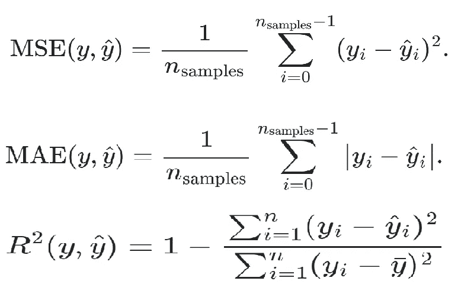

y_true = [1，5，3]

y_pred = [2，3，4]

MSE(y_true，y _ pred)= 1/3 *[(1–2)+(5–3)+(3–4)]= 2()

MAE(y_true，y _ pred)= 1/3 *[| 1–2 |+| 5–3 |+| 3–4 |]= 1.33

R2score(y_true，y _ pred)= 1—[(1–2)+(5–3)+(3–4)]/[[(1–3)+(5–3)+(3–3)]]= 0.25

我们的目标是找到一个具有低 MSE 或 MAE 和高 R2 得分(最好是 1)的模型。

# **结论**

没有现成的公式来检测每个任务和数据集选择哪种算法。这就是为什么尝试几种算法并对每一种算法进行评估仍然很重要。但是，我们需要知道每个算法背后的直觉。正如理论所说，由于我们有大约 160 个数据点，只有 12 个特征，线性回归更有可能工作得更好，事实也是如此。然而，由于在训练特征之间有很高的线性相关性，这就是为什么 Lasso 和 Ridge 也有不错的结果。在未来的文章中，我将对不同种类的数据集进行同样的尝试，让我们看看分数将如何变化。

我的 GitHub 库链接的代码是[这里是](https://github.com/gurokeretcha/Fish-Weight-Prediction-Beginners)。

# 参考

[1]【www.geeksforgeeks.org】T2， [ML |线性回归(2018)](https://www.geeksforgeeks.org/ml-linear-regression/)

[2] GAURAV SHARMA，5 [您应该知道的回归算法—入门指南！](https://www.analyticsvidhya.com/blog/2021/05/5-regression-algorithms-you-should-know-introductory-guide/) (2021)

【3】徐文伟，[Sklearn 中的线性回归、套索、山脊、ElasticNet 有什么区别？](/whats-the-difference-between-linear-regression-lasso-ridge-and-elasticnet-8f997c60cf29) (2019)

[4] Niklas Donges，[梯度下降:机器学习最流行算法的介绍](https://builtin.com/data-science/gradient-descent) (2021)

[5] L.E. MelkumovaS.Ya. Shatskikh，[比较岭估计和套索估计用于数据分析](https://reader.elsevier.com/reader/sd/pii/S1877705817341474?token=FE0D4CB2D87828BAAAE606D88D046F7A5D8101C5B27EF6423BAD046D59731B290A304BE066796D2E95B589067B802C2C&originRegion=eu-west-1&originCreation=20211220161106) (2017)第三届国际会议“信息技术和纳米技术

[6] Jason Brownlee，[随机搜索和网格搜索的超参数优化](https://machinelearningmastery.com/hyperparameter-optimization-with-random-search-and-grid-search/) (2020)，机器学习掌握

[7]Aarshay Jain，[Python 中脊和套索回归的完整教程](https://www.analyticsvidhya.com/blog/2016/01/ridge-lasso-regression-python-complete-tutorial/) (2016)

[8]scikit-learn.org， [1.1。线性模型](https://scikit-learn.org/stable/modules/linear_model.html)

[9]scikit-learn.org， [3.3.4。回归指标](https://scikit-learn.org/stable/modules/model_evaluation.html#mean-squared-error)