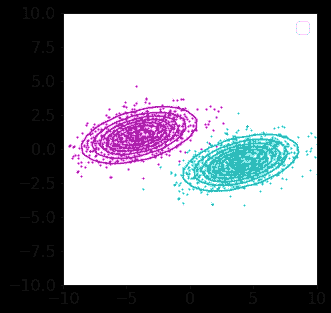
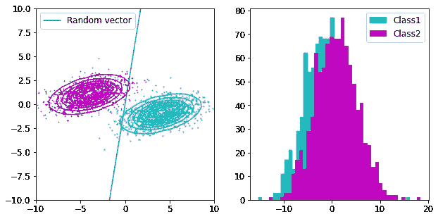
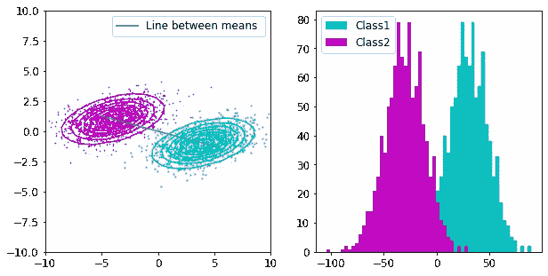
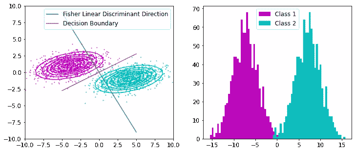
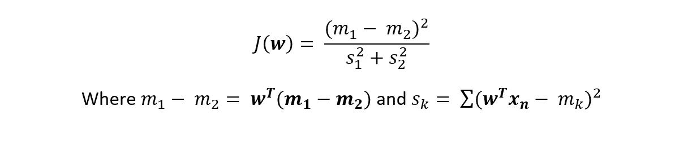
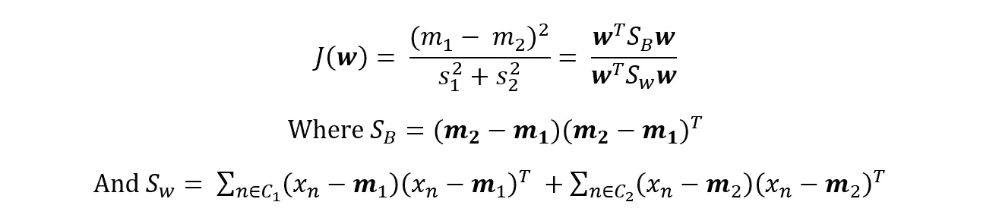
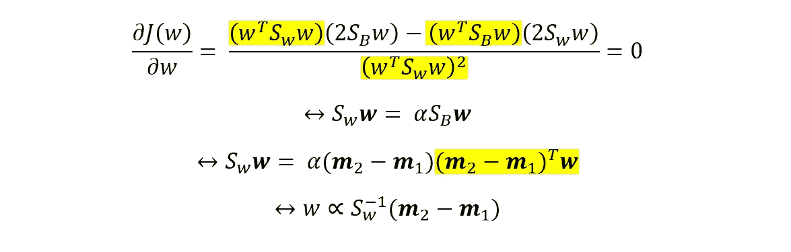

# 费雪线性判别式:直观解释

> 原文：<https://towardsdatascience.com/fishers-linear-discriminant-intuitively-explained-52a1ba79e1bb?source=collection_archive---------0----------------------->

## 机器学习基础

## 线性判别分析的基础 Fisher 线性判别的直观解释

塞缪尔·伯克在 [Unsplash](https://unsplash.com?utm_source=medium&utm_medium=referral) 上的照片

LDA 是一种广泛使用的基于 Fisher 线性判别式的降维技术。这些概念是机器学习理论的基础。在本文中，我将介绍一个使用 Fisher 线性判别式的分类器示例，并推导出 Fisher 准则的最佳解决方案。最后，我将 LDA 作为一种降维技术与 PCA 进行了比较。

# 介绍

训练分类器包括找到最佳分离数据的权重向量。如何定义这种分离是分类器不同的原因。在[最小二乘分类器](/derivation-of-least-squares-regressor-and-classifier-708be1358fe9)中，我们找到最小化均方误差的向量，并通过优化算法(如随机梯度下降)进行优化。在 Fisher 的线性判别式中，我们试图根据分布来分离数据，而不是根据每个数据点来调整权重向量。

# 费希尔线性判别式

为了理解线性判别分析，我们需要首先理解费希尔的线性判别。

Fisher 的线性判别式可以用作监督学习分类器。给定标记的数据，分类器可以找到一组权重来绘制决策边界，从而对数据进行分类。 **Fisher 线性判别式试图找到最大化投影数据类别之间的间隔的向量。**最大化**“**分离”可能会有歧义。Fisher 线性判别式遵循的标准是最大化投影均值的距离，最小化投影类内方差。

# 我们的使命

让我们设置一个问题，如果你能完成它，你就会理解费希尔的线性判别式！

作者图片

这里有两个二元高斯模型，它们具有相同的协方差矩阵和不同的均值。**我们希望找到最能分离数据投影的向量。**让我们画一个随机向量，并绘制投影。

作者图片

请记住，我们看到的是数据在向量(权重向量和数据矩阵的点积)上的投影，而不是决策边界。数据在这个随机权重向量上的投影可以绘制成直方图(右图)。正如您在将数据投影到矢量上并绘制直方图时所看到的，这两类数据没有很好地分开。我们的目标是找到右边图像中两个分布的最佳分割线。

为了分离这两个分布，我们可以首先尝试最大化投影平均值之间的距离，这意味着平均而言，这两个分布彼此尽可能远。让我们在两个平均值之间画一条线，并将投影的直方图绘制到这条线上。

作者图片

这已经好多了，但是数据的投影还没有完全分离。为了完全分离它们，Fisher 线性判别式在最大化均值间投影的同时最小化投影的类内方差。它试图最大化我们之前讨论的方法来分离它们，但是也试图使分布尽可能紧密。这样可以更好地分离，如下图所示。

作者图片

如你所见，数据的投影被很好地分开了。我们可以从权重向量中取一个正交向量来创建决策边界。决策边界告诉我们，在边界的任何一边，数据都可以被预测为一个或另一个类。对于具有相同协方差矩阵的多元高斯分布，这产生了最佳分类器。

# 费希尔标准

既然我把问题形象化了，我们就可以用方程的形式正式表达这些概念。

作者图片

最大化费希尔准则包括找到最大化上述等式的权重向量。最大化这个方程相当于我们之前看到的。最大化意味着最大化分子(投影均值之间的距离)和最小化分母(类内方差)。我们可以在等式中代入均值和协方差，并将费雪准则改写如下。

作者图片

上述等式在权重向量 w 的分子和分母中具有二次形式。我们可以通过微分和等于零来使 J 相对于 w 最大化。

作者图片

我们不关心标量，因为我们总是可以在以后规格化向量。上面突出显示的项是标量，因此被吸收到常数α或最后一行的比例符号中。由此，我们知道，当权重向量 w 与上述表达式成比例时，它使费雪准则最大化。在前面的例子中，我用这个比例找到了费雪的判别线性方向。

# 线性判别分析(LDA)

之前，我们将数据投影到权重向量上，并绘制了直方图。这种从 2D 空间到直线的投影降低了数据的维数，这就是 LDA。LDA 使用 Fisher 线性判别式来降低数据的维数，同时最大化类别之间的分离。它通过最大化均值之间的距离和最小化类内方差来做到这一点。

# PCA 与 LDA

那么 LDA 与其他降维技术相比如何呢？另一种非常常见的降维方法是 PCA，它可以最大限度地将信息量传递到更小的维度上。PCA 使用通过奇异值分解找到的主成分，而不是 Fisher 的线性鉴别方向。主成分是最大化投影数据变化的方向(这不考虑数据的类别)。LDA 会考虑数据中的类别，而 PCA 则不会。

选择什么样的降维技术需要你正确理解这些技术和你正在处理的问题。希望这篇文章对你的第一部分有所帮助。

# **结论**

在这篇文章中，我解释了 Fisher 的线性判别式，以及如何将它用作分类器和降维。我强调费希尔的线性判别式试图在低维空间中最大化类的分离。这与 PCA 等其他降维技术有着本质的不同，它不考虑数据的类成员关系。

# 支持我

希望这对你有所帮助，如果你喜欢它，你可以[跟随我！](https://medium.com/@diegounzuetaruedas)

您也可以成为 [**中级会员**](https://diegounzuetaruedas.medium.com/membership) 使用我的推荐链接，访问我的所有文章以及更多:[https://diegounzuetaruedas.medium.com/membership](https://diegounzuetaruedas.medium.com/membership)

# 你可能喜欢的其他文章

[卷积层 vs 全连接层](/convolutional-layers-vs-fully-connected-layers-364f05ab460b)

[傅立叶变换:直观的可视化](/fourier-transforms-an-intuitive-visualisation-ba186c7380ee)