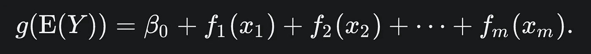
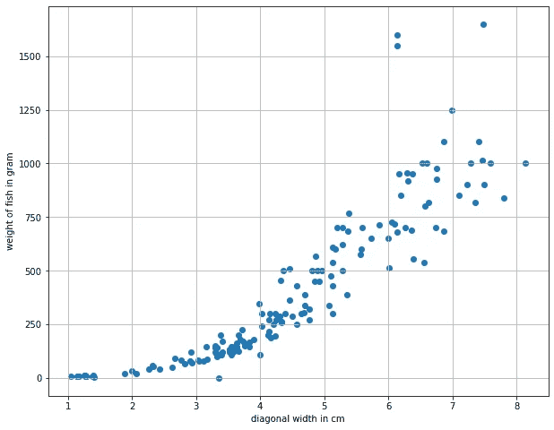
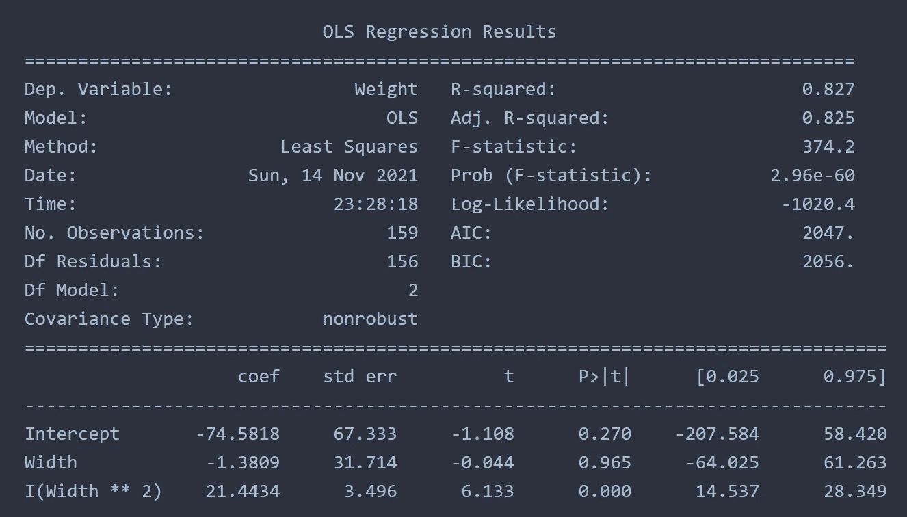
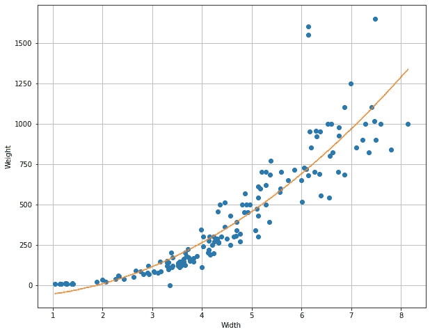
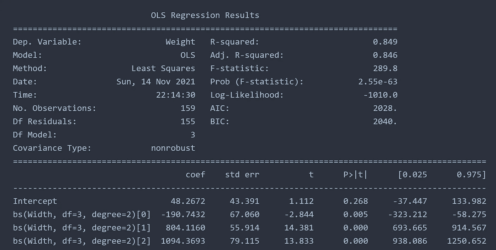
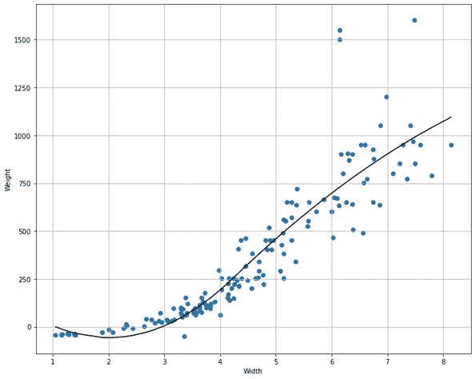
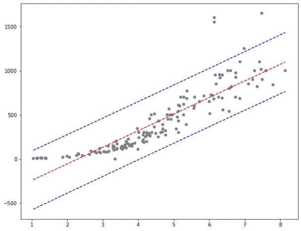
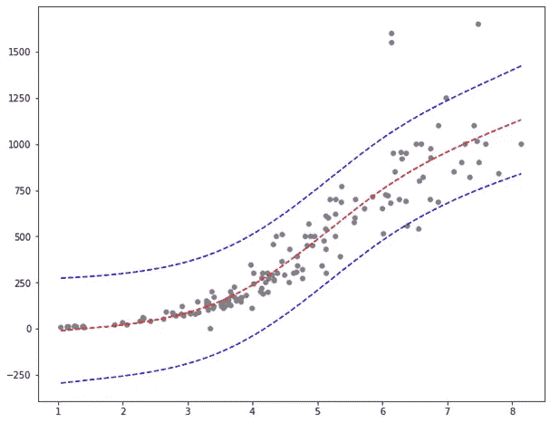

# 利用广义加性模型拟合非线性关系

> 原文：<https://towardsdatascience.com/fit-non-linear-relationship-using-generalized-additive-model-53a334201b5d?source=collection_archive---------18----------------------->

## 利用 pyGAM 包

图片来自 [unsplash](https://unsplash.com/photos/s03sK2VLNpc)

> **简介**

各种变量之间的真实世界关系大多是非线性的，理解这种关系对于最佳预测是至关重要的。谁有这种关系的洞察力，谁就能正确预测市场，并为任何低迷做好准备。它不仅对商业分析至关重要，对临床研究、社会研究、工程应用等也同样重要。在本文中，我将向读者介绍广义可加模型(GAM)的实现，并与线性、多项式和样条回归模型进行比较。读者就能理解它对正确预测未来趋势的重要性。

> **简要背景**

线性和多项式回归是回归分析的基础。对于非线性关系，多项式拟合工作得非常好，并且当存在对过度拟合的优化时，可以预见下一个数据点。过度拟合是机器学习爱好者的噩梦。当多项式过度拟合局部数据点时，它在进行预测时会变得混乱。基本上，过度拟合的模型不能正确预测，并且在应用测试数据时表现不佳。在这些情况下，线性模型可以是一个很好的替代品，并且可以降低误差。对于回归模型，还有其他问题，如异方差。如果有人感兴趣，我还有另外一篇文章。

 [## 回归模型中的异方差性

### 使用统计模型检查异方差性

towardsdatascience.com](/heteroscedasticity-in-regression-model-21d9f5a93e59) 

先说多项式和样条回归的利弊。多项式回归是非线性曲线拟合的基本分析方法。其背后的数学比简单的线性回归更复杂，但比样条回归更简单。多项式回归受到[龙格效应](https://en.wikipedia.org/wiki/Runge%27s_phenomenon)的影响，即数据集的端点与模型不同步，当应用回归时，结果变化很大。当在模型中使用高阶多项式时，这种现象尤其明显。多项式回归的一个更复杂的版本是样条回归。这种方法首先识别中间节点，然后使用数据点找到节点之间的最佳拟合。当使用 3 节时，这些点通常是第 25、50 和 75 个百分点。读者可以阅读下面的文章，以获得更多关于样条回归的见解。

 [## 简单样条回归:节点间的多项式

### 使用 python 的 statsmodels 库

towardsdatascience.com](/simply-spline-regression-polynomials-between-knots-3d007523ad99) 

一种更灵活的建模技术是广义加性模型，它可以在不指定节点位置的情况下部署。维基百科对它的定义如下:

> 一种广义线性模型，其中线性响应变量线性依赖于某些预测变量的未知光滑函数，人们的兴趣集中在对这些光滑函数的推断上。

来源:[维基百科](https://en.wikipedia.org/wiki/Generalized_additive_model)

简而言之，这里的结果不是加权和，而是一些任意函数的和。在本文中，我将展示使用多项式、样条和 GAM 拟合非线性关系的区别。

> **数据集**

出于用 python 实现的目的，我将利用来自 Kaggle 的[鱼数据集](https://www.kaggle.com/mathchi/study-polynomial-regression/data)。给定变量之间存在非线性关系。数据集可供公众使用，许可在这里描述(Apache 2.0)。

> **使用 pyGAM 实现**

首先，需要安装 pyGAM 包。鱼的数据提供了鱼的重量和宽度之间的下列相关性。

作者图片

我有兴趣使用多项式拟合、样条拟合和 GAM 来拟合这种非线性依赖关系。

> **多项式回归**

感兴趣的变量之间的关系非常明显。鱼的宽度越大，鱼的重量就越重。数据可以线性拟合，但标准误差会很高。此外，由于数据集的性质，还会存在异方差。这似乎是一种锥形关系，数据的变化最初非常紧密，但后来，偏差变得很大。让我们用二阶多项式来拟合这个模型。

二阶多项式拟合。作者图片

看起来曲线很适合给定的数据。这种趋势似乎在增加，无论宽度值有多高，由于二阶相关性，重量也会高很多。但是，情况总是这样吗？一条宽 9 厘米的鱼的重量是~1700 克吗？我们能做出更好的模型吗？

> **样条回归**

让我们使用 3 个自由度和节点之间的二阶多项式在同一数据集上实现样条回归。

与多项式回归相比，拟合稍好，因为 R 平方值增加了。下图显示的拟合与上面的多项式模型非常相似。这种配件在较高的一侧具有某种展平效果。在较低的一边，它表现不好，因为趋势是向上的。如果鱼的宽度小于 1 厘米，它的重量不能高于 1 厘米宽的鱼。

样条回归。作者图片

> **广义可加模型**

在这种方法中，我们不需要定义结。这种决策具有灵活性，多项式字符串会自动绑定在一起。这可以使用 pyGAM 包来实现。当使用线性拟合时，我们得到以下结果。

线性游戏

该模型不会像多项式模型那样高估较高的数据点。让我们用 20 条样条曲线进行多项式拟合。

用 20 条样条曲线 GAM。作者图片

在上述所有方法中，最后一个数字最符合数据。例如，如果我们想知道一条 1.7 厘米宽的鱼的重量，预测会更准确。对于使用 GAM 的多项式拟合，标准误差将更小。

> **结论**

我们讨论了多项式和样条回归，并与 GAM 进行了比较。使用 GAM 时，无需手动指定结。这为拟合提供了更大的灵活性，因为它会自动用给定数量的样条拟合多项式。这基本上是过程的自动化，其中不需要选择中间点作为结。在实现回归模型时必须足够小心，应该比较不同的方法并调整超参数以获得最佳结果。

[Github 页面链接](https://mdsohelmahmood.github.io/2021/11/17/GAM.html)

> **参考:**

[pyGAM 文档](https://pygam.readthedocs.io/en/latest/notebooks/tour_of_pygam.html)

[Fish 数据集](https://www.kaggle.com/mathchi/study-polynomial-regression/data)