# 健身导航器

> 原文：<https://towardsdatascience.com/fitness-navigator-7ca25de7757?source=collection_archive---------32----------------------->

## 提高模型质量的 5 种方法

如果你只练腹肌，你不可能有很好的体形。相反，如果你和你的健身教练一起制定一个计划并努力执行，你可以更快地出现在海滩上，脸上带着微笑。

机器学习模型也是如此。每个人都知道你必须调整模型参数(例如神经网络权重)来获得一个好的模型。但这不是影响模型质量的唯一选择。我们将后退一步，探索其他改进方法。其中一些在某些机器学习问题中得到了广泛的应用，但其他一些仍然处于雷达之下。

下面是我对 J. Kukač ka，V. Golkov 和 D. Cremers 的一篇伟大论文的反思， [**深度学习的正则化:一个分类学**](https://arxiv.org/abs/1710.10686) (2017) [1]。

# 什么是最佳匹配？

当我们看下面的图片时，什么是“好的”适合就变得很清楚了:模型捕捉一般的数据模式，但是对给定数据不合理的模式不太敏感。

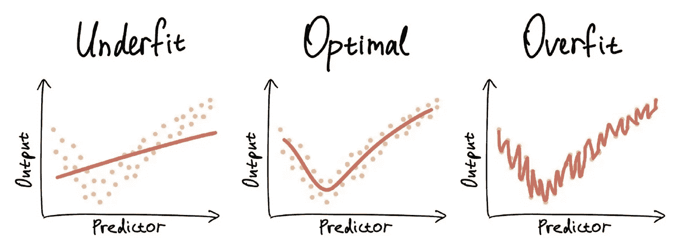

(1)最佳拟合。作者图片

**模型复杂性**，即模型参数的数量，控制模型学习复杂数据模式的能力。但是当你将一个简单的数据输入到一个复杂的模型中时，会导致**过度拟合**——模型试图利用它的“冗余”参数，最终“记忆”数据点。并且当模型对新的数据点做出推断/预测时，记忆通常是不好的。**欠拟合**发生在相反的情况下——当一个简单的模型被输入一个复杂的数据。这也是不好的，因为不足的模型不能捕捉复杂的数据模式。

**当模型复杂性与数据复杂性平衡时，获得最佳拟合**。实现平衡是一个挑战，因为模型学习训练数据样本中的模式，但最终目标是对新数据样本(即分布可能不同的测试数据)进行高质量的预测。但是正如我们在下面看到的，有很多方法可以达到这种平衡。

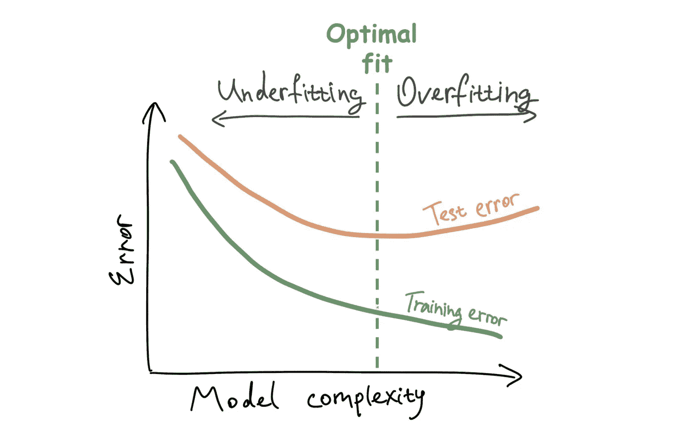

(2)训练-测试误差权衡。作者图片

实现最优/最佳匹配的指导原则称为**结构风险最小化**【2】。它控制模型复杂性(正则化)和拟合训练数据的质量(经验风险/误差)之间的权衡。风险这个词指的是我们可能要为预测不准确付出的抽象代价。

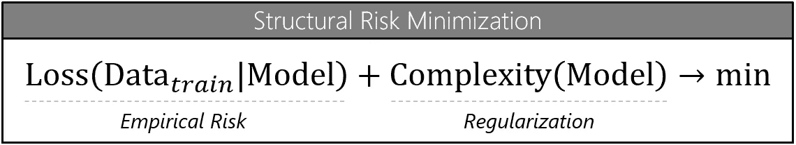

(3)结构风险最小化。作者图片

# 如何衡量契合度的好坏？

我们可以通过合计实际数据和模型预测之间的偏差来量化我们对拟合的感知。每个偏差，即误差代表特征空间中的距离，距离的定义取决于问题的上下文和领域。

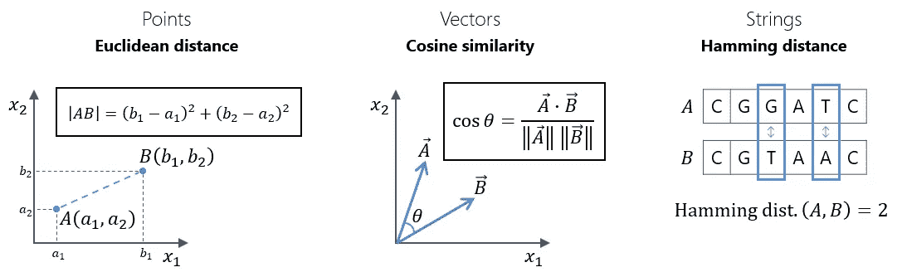

(4)不同特征空间中的误差函数的例子。作者图片

我们在选择误差/损失函数时非常灵活。然而，在实践中，我们用来调整模型参数以最小化误差的优化算法存在局限性，通常它们只能对全局连续和可微分的损失函数起作用。

除了误差之外，我们可能想要通过针对不期望的模型结构的**正则化/** 惩罚来说明我们对模型架构或参数的偏好。

将误差和罚值结合在一起，我们获得了对给定数据的模型性能的度量— **成本函数**。它反映了模型对数据的拟合程度以及我们对模型本身的偏好。在训练阶段，我们的目标是**最小化该函数，以获得更好的拟合**。

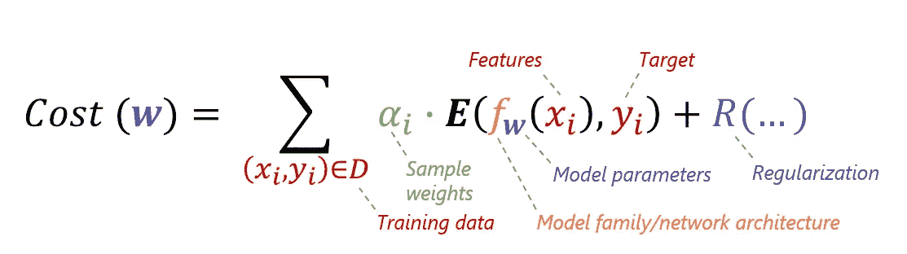

(5)成本函数，一般形式。作者图片

下面你可以看到一个在许多回归问题中使用的流行成本函数:MSE 损失函数结合 L2 权重正则化。

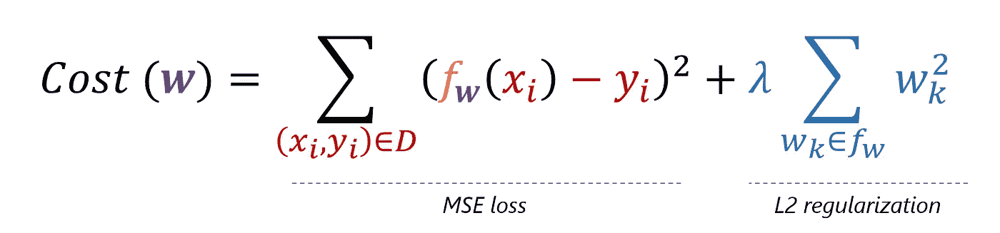

(6)作为 MSE + L2 的成本。作者图片

# 在成本函数中导航

让我们考虑重新设计成本函数的不同选项，以便解决最佳拟合过程中的各种挑战。

**(1)数据转换**

数据转换有两个概念:保留数据表示(**数据扩充**)和不保留数据表示(**特征工程**)。在训练和测试期间，两者都可以应用于模型输入、内部参数和输出。

(7)数据转换。作者图片

从这个角度来看，Droupout 和批处理规范化等技术源自与数据预处理或对扩充输入的聚合预测相同的原理。

许多特征工程和数据扩充技术是特定于领域的，但是通过将一个领域的技术应用于另一个领域的问题也可以获得令人印象深刻的结果。例如，通过傅立叶或小波变换将音频信号转换为图像，然后应用为计算机视觉问题设计的卷积神经网络(CNN)。

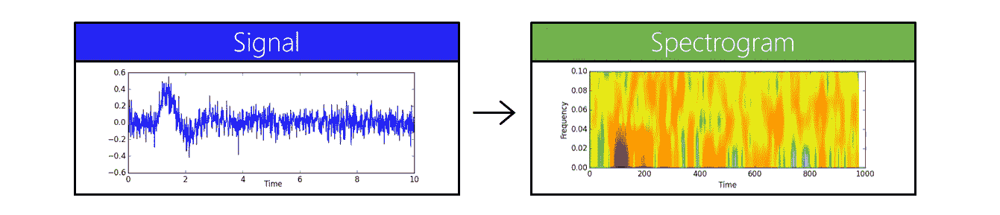

(8)将问题域从信号处理转向图像处理。作者图片

论文中列出的最违反直觉的技术之一是**向训练数据添加随机噪声** —矛盾的是，在噪声分布的某些条件下，它改善了模型质量并增加了其鲁棒性。

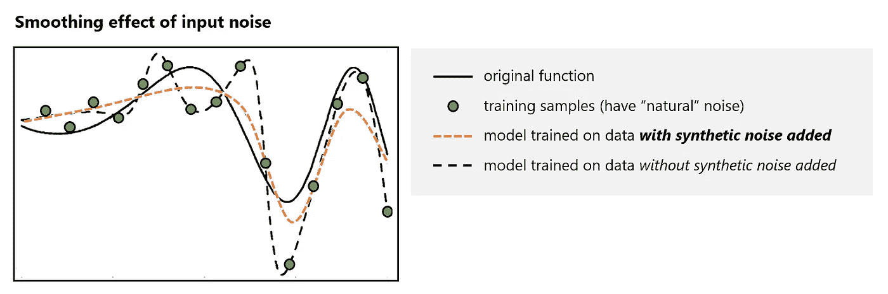

(9)输入噪声的平滑效果。图片由作者提供，基于论文“反向传播训练期间添加噪声对泛化性能的影响”[3]中的图片

**(2)型号**

你的幻想是模型原型/网络架构的唯一限制。此外，你可以创建一个元模型，通过不同的集成技术结合不同基础模型的预测:**装袋，助推和堆叠**。

通常模型是讨论的焦点，所以今天我们跳过它。我只是建议思考一下 T4 的《神经网络动物园》。

**(3)损失函数(一个样本的误差)**

如上所述，问题域意味着损失函数的选择。然而，即使使用领域不可知的损失函数，例如用于回归的 MSE 和用于分类的交叉熵，通常也可以实现足够的模型质量。

在不平衡数据的情况下，考虑影响**类权重**是有意义的——这也可以通过在数据变换级别(1)上的下采样/过采样来实现。

影响**样本权重**对于时间序列预测尤其重要——这是平滑数据异常或关注数据中最新模式的便捷方式。

**(4)正则化项**

正则项**独立于目标**，因此可以针对未标记的样本进行计算，而损失函数则不能。这种区别允许通过以**半监督学习**的方式组合标记和未标记的数据来提高模型的鲁棒性。

基于权重衰减的正则化术语是最流行的:L1，L2。

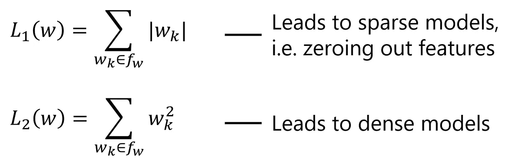

(11) L1，L2 正规化条款。作者图片

正则化的思想也应用于模型选择的信息标准。例如，在 Akaike 准则中，我们可以观察到模型参数数量的损失[4]。

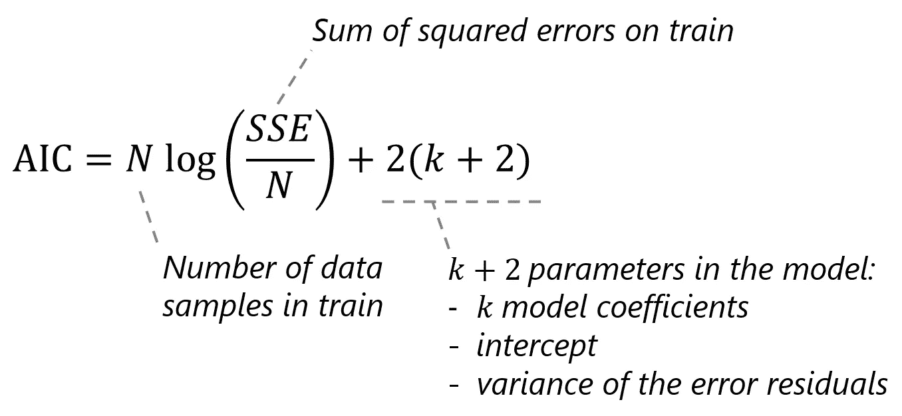

(12)阿凯克准则。作者图片

**(5)优化算法**

优化算法本质上是搜索模型参数的工具，该模型参数在训练数据集上传递成本函数的最小值。

最基本的优化算法是**梯度下降(GD)** 。它基于这样的想法，一个函数的导数是一个指向该函数局部最大值的向量。因此，相反方向的步骤会导致局部最小值，这正是我们所希望的。

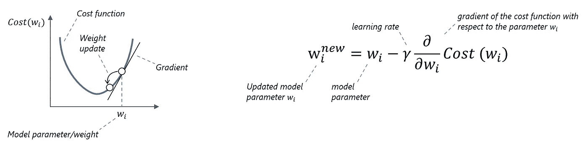

(13)梯度下降。作者图片

在经典的梯度下降法中，所有的训练样本都用于每次参数更新——我们通常有一条正确方向的路径，但是学习可能非常慢。相反，使用所有训练样本中的一个样本或子样本可以提高训练速度，但是对于最小化代价函数来说，我们会经历更多的颠簸。这种算法变异被称为**随机梯度下降(SGD)** 。

有很多方法可以升级一个基本的随机梯度下降优化器。其中一些在每个参数的基础上考虑梯度的一阶和二阶矩:**自适应梯度算法** (AdaGrad)、**均方根传播** (RMSProp)和 **Adam** 。

另一个有趣的高级方法是**快照集成**方法。它旨在利用成本函数的多个局部最小值而不是一个全局最小值——所获得的模型是具有对应于局部最小值(快照)的参数的模型的集合。快速&有效的局部最小值搜索是通过循环改变学习率来实现的:这里我们不是恒定的学习率，而是首先降低学习率以达到局部最小值，保存模型快照，然后显著提高学习率以跳出最小值并移动到下一个局部最小值，重复该过程。

正如我们在上面的方法中看到的，优化器的**停止标准**不是一个显而易见的话题。**模型参数的初始化**也是至关重要的，可以显著加快训练程序。

除了上述优化器之外，还有一类优化器将成本函数视为“黑盒”，并使用代理模型来近似它。当成本函数的梯度很难计算或不存在时，这很有用。这一类中最受欢迎的技术是**贝叶斯优化** —它通过用高斯过程近似成本函数而得出的每个新样本来更新关于成本函数的先验信念【6】。

## 技术等效

值得注意的是，有时影响成本函数不同组成部分的方法是等价的。例如，小方差高斯噪声的注入是雅可比损失的近似。文[1]中还有很多例子。

# 结论

通常，我们关注可以提高模型质量的特定组件，例如模型权重。但是通常当你解决一个真正的问题时，就没有这样的限制了。成本函数只是一种工具，帮助我们将目标传达给计算机/优化算法。只要它 1)能帮助我们更好地概括数据模式，2)能被输入到优化算法中，我们就有能力操纵它的所有组件。所以，下次当你在长时间的模型训练后感到停滞不前时——检查一下其他能给你带来质量提升的选项。

# 参考

[1]扬·库卡卡，弗拉基米尔·戈尔科夫和丹尼尔·克雷莫斯，[深度学习的正规化:分类学](https://arxiv.org/abs/1710.10686) (2017)

[2]谷歌，机器学习速成班，[正规化](https://developers.google.com/machine-learning/crash-course/regularization-for-simplicity/l2-regularization)

[3]郭忠·安(1996)，在反向传播训练期间增加噪声对泛化性能的影响

[4]罗伯·J·海曼，乔治·阿萨纳索普洛斯，[预测:原理与实践](https://otexts.com/fpp2/selecting-predictors.html)

[5]黄，g .，李，y .，普莱斯，g .，刘，z .，霍普克罗夫特，J. E .，&温伯格，K. Q .，《快照集:训练 1，免费获得 M》(2017 年)

[6]马丁·克拉瑟，[贝叶斯优化](http://krasserm.github.io/2018/03/21/bayesian-optimization/) (2018)

*特别感谢 Stepan Zaretsky，他早些时候向我介绍了这篇论文[1]，甚至验证了一些关于模型受益于噪声注入的结果。*