# R 中拟合点过程模型

> 原文：<https://towardsdatascience.com/fitting-point-process-models-in-r-263db85e12dc?source=collection_archive---------14----------------------->

## 理解和实现对数高斯考克斯过程

图片由来自 unsplash 的[米哈里·科尔斯](https://unsplash.com/@mihaly_koles)拍摄

在[之前的帖子](https://medium.com/p/263db85e12dc/edit)中，我们了解了**泊松点过程模型**以及如何将其融入`Stan` & `spatstat`。在泊松点过程模型中，我们假设每个点相互独立。由于自然喜欢使我们的生活复杂化，这一假设很少得到满足，我们需要考虑我们的观察之间的任何依赖性，以使我们的统计模型正确。

在查看**对数高斯考克斯过程**之前，先看一下**考克斯过程**在概念上是有见地的。

# 加载库

要重现本教程，您将需要这些库:

# 考克斯过程

在**非均匀泊松过程**的情况下(我们在第一部分描述过)，强度函数在空间上变化，但由确定性强度函数给出:

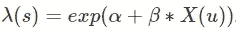

作者图片

在 **Cox 过程**的情况下，强度测量可以是**非负随机变量或随机场**的实现:

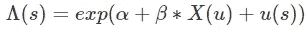

作者图片

u(s)是随机函数(即一些噪声)。这解释了为什么**考克斯过程**也被称为**双随机泊松过程**。

为了生成 Cox 过程的实现，我们需要生成底层随机函数λ(s)的实现，它也被称为**驱动强度**。

下面的函数`genDat_cox`将产生一个 Cox 过程的代。你可以将它与第一部分的`genDat_ppp`进行比较，我们基本上只是添加了一些噪声或一个**随机场**。

我们为可复制的结果和参数值设置了一个随机种子。注意，这次我们还指定了噪声的参数。

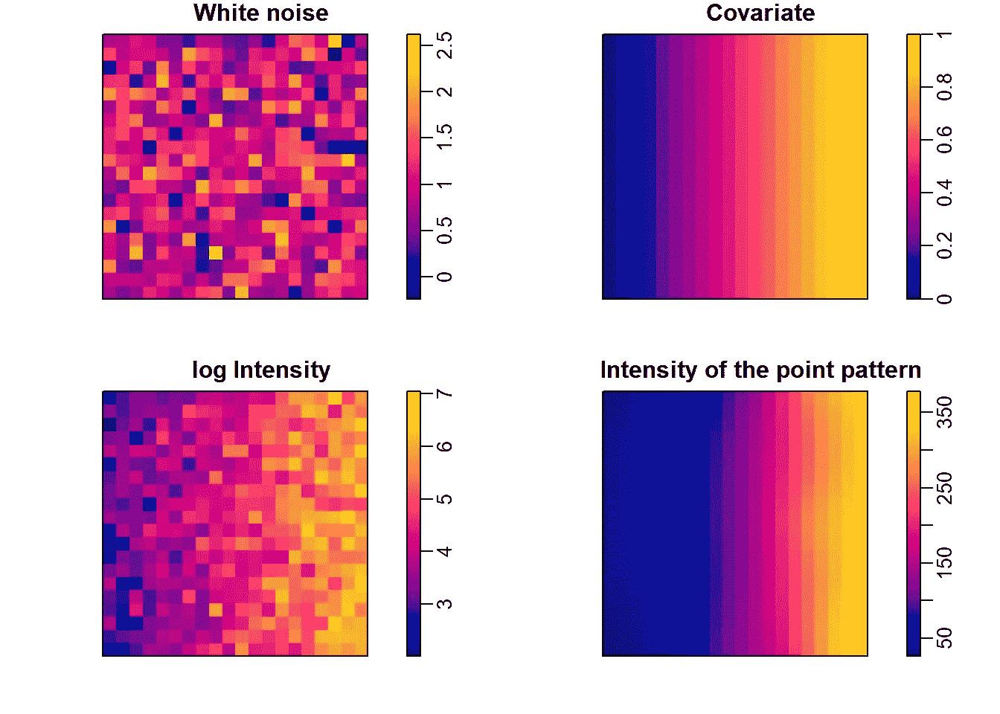

作者提供的图片

现在让我们在 Stan 中拟合模型，看看是否可以恢复我们的参数。下面的 Stan 代码并不比拟合**非齐次泊松点过程**的代码复杂多少，我们只需要增加一个参数σn 来估计噪声。我们假设噪声正态分布，均值为 0，标准差为σn:噪声=N(0，σn)

> *注意，我们需要接受截距为 b0 + mean_noise，误差为 0。随机效应的平均值是不可能的。这就是所谓的不可识别性问题(详见* [*此链接*](https://mc-stan.org/docs/2_18/stan-users-guide/collinearity-section.html) *)。*

我们现在可以拟合模型:

从输出中我们可以看到，模型成功地恢复了我们之前指定的参数。

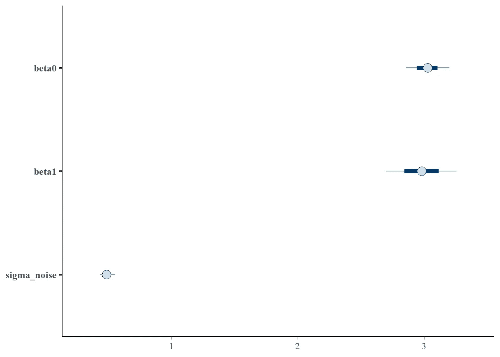

作者图片

注意，如前所述，在模型输出中，β0=截距+噪声，这与我们指定的参数值一致:β0=2，噪声=1

由于我们已经编写了一些代码在`generated quantities`块中进行预测，我们可以绘制预测的强度，并将其与 Cox 过程的实际强度进行比较。

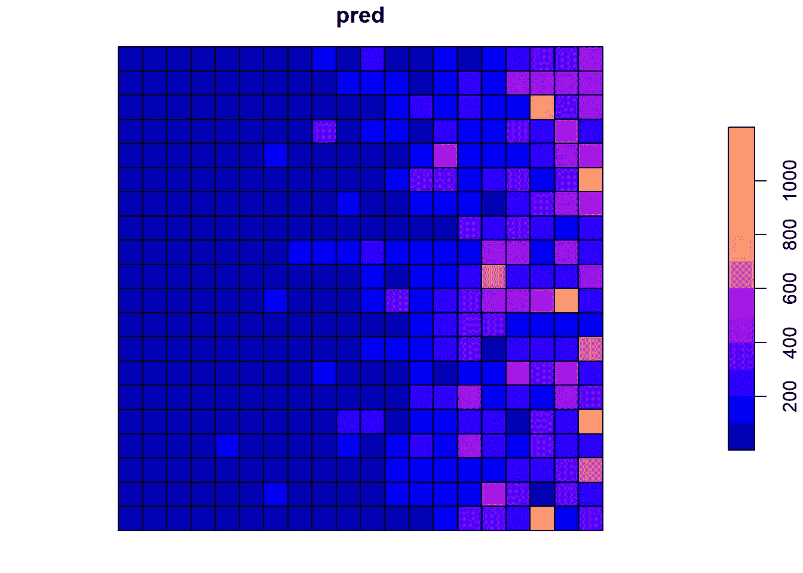

作者图片

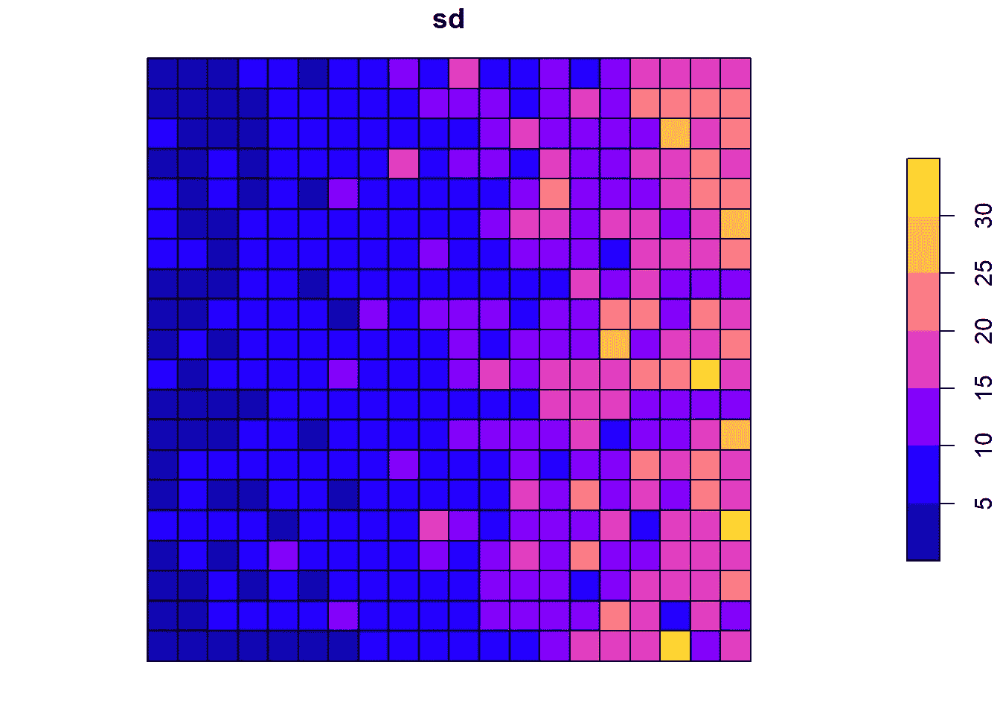

作者图片

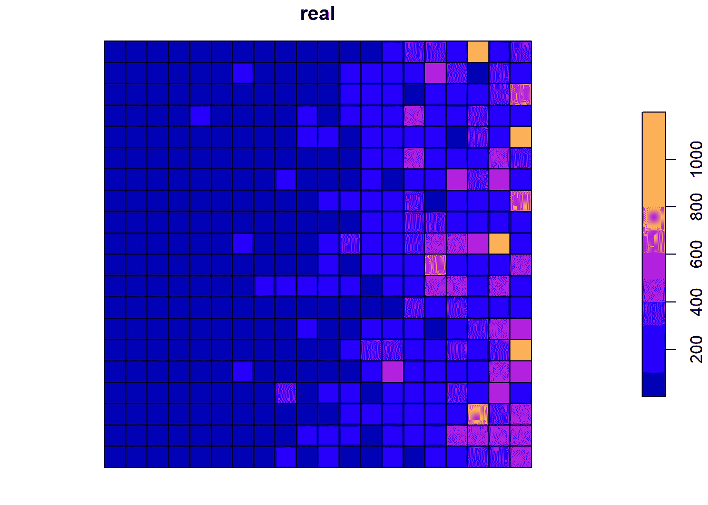

作者图片

当然，由于模型的随机性，我们不会得到与真实模式完全相同的模式。

# 对数高斯考克斯过程

让我们增加复杂性。我们定义对数高斯 Cox 过程(LGCP)是一种双重随机结构，由泊松点过程组成，其随机对数强度由**高斯随机场**给出。这意味着这一次，来自前述 Cox 过程的**非负随机变量**是一个**高斯随机场**(或 GRF)。这听起来比现实中更可怕。

当我们模拟 cox 过程时，我们首先在研究区域创建了一些随机噪声，这是我们的**随机场**:

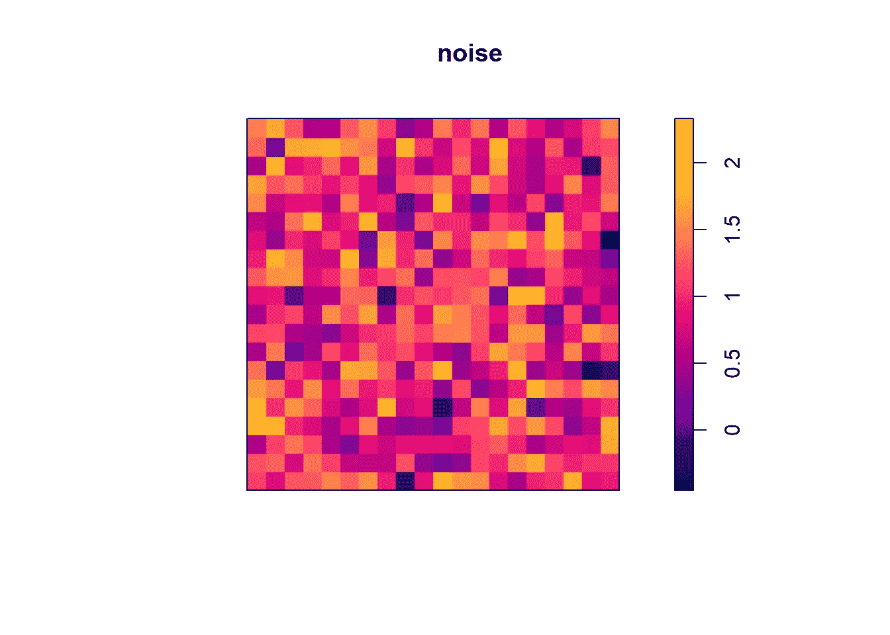

作者图片

噪声值**完全随机分布**。在高斯随机场中，噪声值**不是随机分布的**，而是遵循二元高斯分布。这意味着观察值是相互关联的。实际上，这意味着这个**随机变量**将使观测值聚集在空间的某个区域。将会有“热点”和“冷点”，在“热点”处，GRF 的值将会很高并且将会“吸引”观测。

我们可以通过**平滑我之前定义的噪声来创建一个 GRF:**

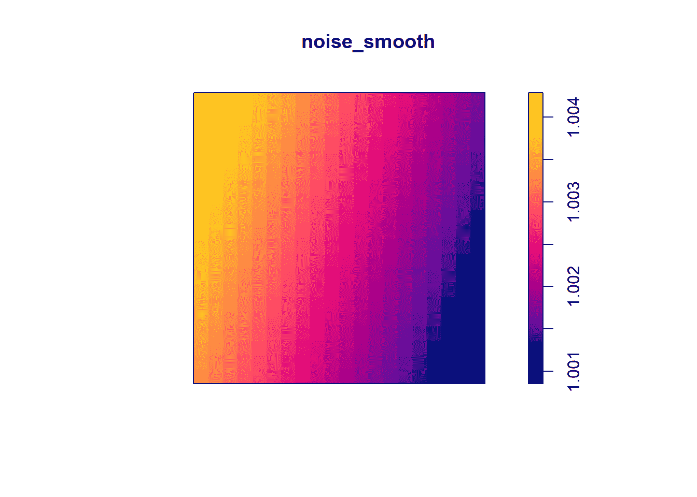

作者图片

我们现在可以清楚地想象“热点”和“冷点”。

如果不考虑 GRF，我们就会有**空间相关性**(如果你在二维空间工作)并且观察结果不是相互独立的，这会扰乱我们的统计模型。通常这会导致较低的可信/置信区间，并使我们对结果过于自信。

直观上，我们可以认为，如果由于**空间相关性**，彼此靠近的观测值更加相似，那么我们需要定义一个函数，使得**空间相关性**随着距离而减小。为此，我们可以使用诸如**指数协方差函数**、**指数二次协方差函数**或 **Matèrn 协方差函数**之类的函数。我们将在下一节中更详细地了解这一点。

我们可以使用`spatstat`包中的函数`rLGCP`来模拟 GRF 的实现。我们在下面的`genDat_lgcp`函数中使用了它:

我们定义了参数并模拟了对数高斯 Cox 过程。

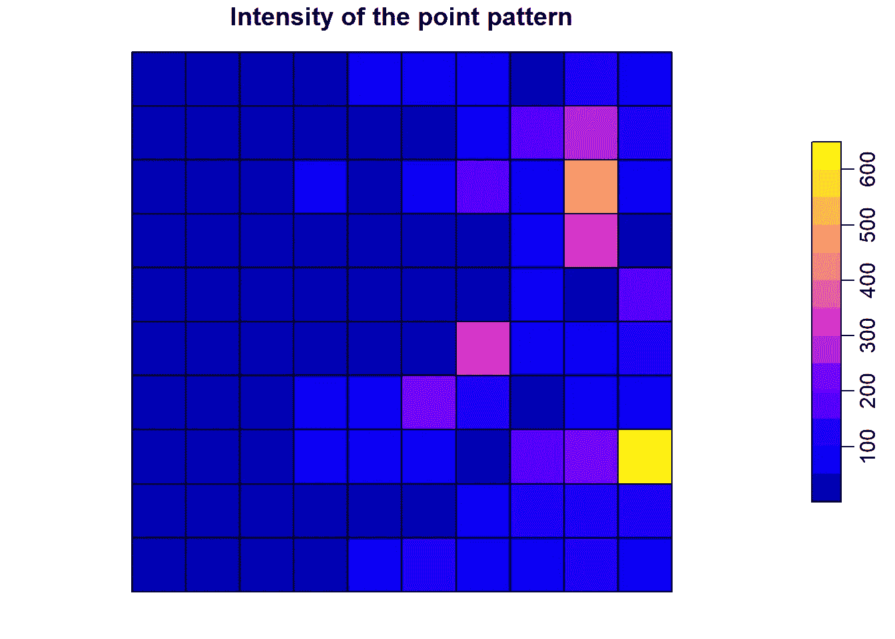

作者图片

现在是做推论的时候了，说明点与点之间的空间相关性！

# 指数协方差函数

我们首先通过假设两点之间的协方差遵循**指数协方差结构**来构建模型。这意味着两点之间的相关性呈指数下降:

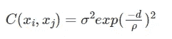

作者图片

*   σ是相关性的方差
*   d 是两点之间的距离
*   ρ是相关性下降的速率。如果它很大，则意味着相关性迅速降低。

在 Stan 中，我们编写了将说明`function`块中高斯随机场的函数。看一看吧，内容很丰富。

请注意，您可以随意调整相关函数，因此，如果您认为假设两点之间的相关性呈指数下降是错误的，您可以更改第 10 行中指定的公式:

这是完整模型的样子:

为了拟合 Stan 中的模型，我们首先需要计算点之间的距离矩阵。这将是来自 GP 函数的`matrix x`参数。因为我们有网格单元而不是点，所以我们计算网格单元的质心的距离。

我们现在已经拥有了符合 Stan 模型的所有元素。注意，我给`stan`函数添加了一些参数。我将`adapt_delta`设置为 0.999，将`max_treedepth`设置为 13。虽然我不知道它们目的的具体细节，但它们有助于模型正确收敛。

模型需要一些时间来运行(这是一个非常小的数据集！)但是我们能够恢复所有参数。为了了解协方差降低的距离，我们可以使用参数值来绘制曲线图:

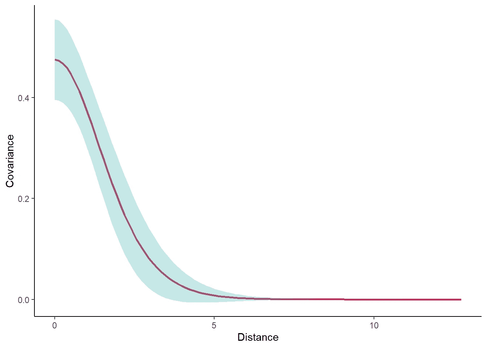

作者图片

我们可以看到，在距离接近 5 个单位时，相关性变为零。

# 指数二次协方差函数

而在第一个模型中，我们有更多的灵活性，斯坦有一个预定义的相关函数，使编码更简单。`cov_exp_quad`使用**指数二次协方差函数**，这是另一个非常常见的协方差函数，其中:

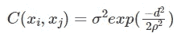

作者图片

更详细的解释见[标准函数参考](https://mc-stan.org/docs/2_22/functions-reference/covariance.html)。

# 安装 LGCP 的快速替代方案🚀

有可能更有效地(或至少更快速地)拟合对数-高斯 Cox 过程。对数高斯 Cox 过程可能特别长，因为估计高斯场需要一些时间。一些方法寻求**近似**高斯场，减少计算时间。如果你对此感兴趣，可以看看 Stan 中可能用到的[谱近似](https://discourse.mc-stan.org/t/approximate-gps-with-spectral-stuff/1041)和 [R-INLA](http://www.r-inla.org/) 使用的随机偏微分方程。

# 喜欢这个故事吗？

如果你对空间统计、深度学习和更广泛的数据科学感兴趣，你可以在我的 [Twitter](https://twitter.com/benjamincretois) 或我的 [Linkedin](https://www.linkedin.com/in/benjamin-cretois-187a9483/) 上关注我！