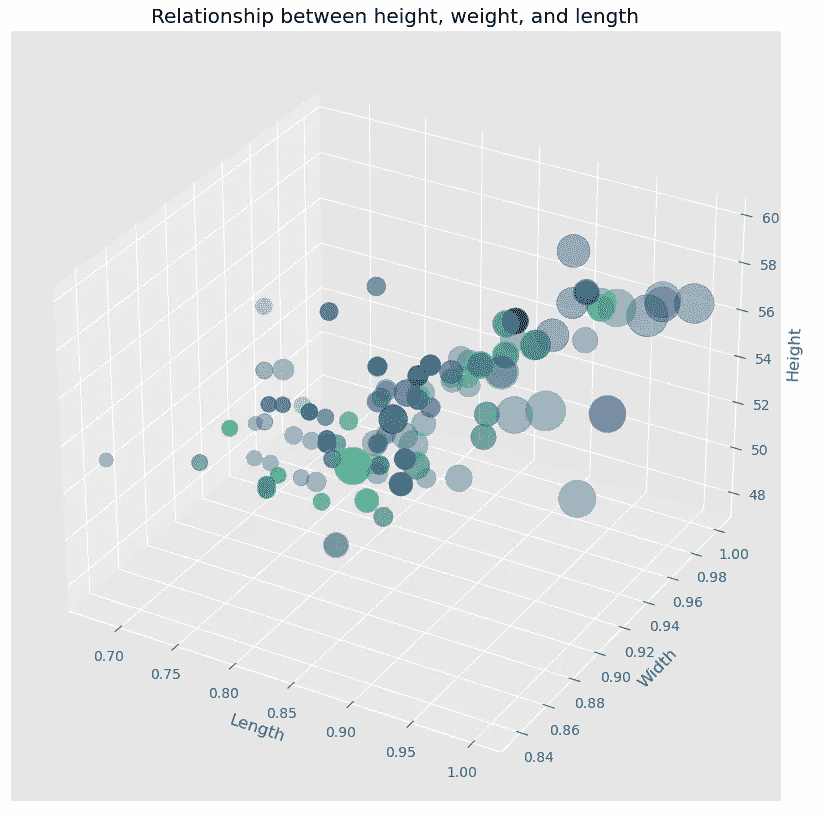
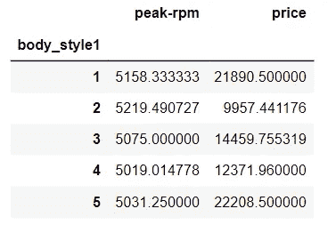
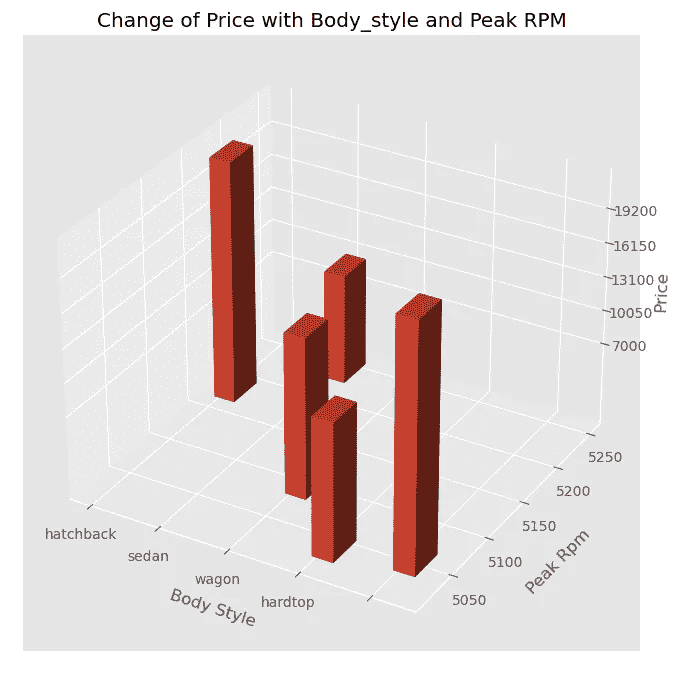
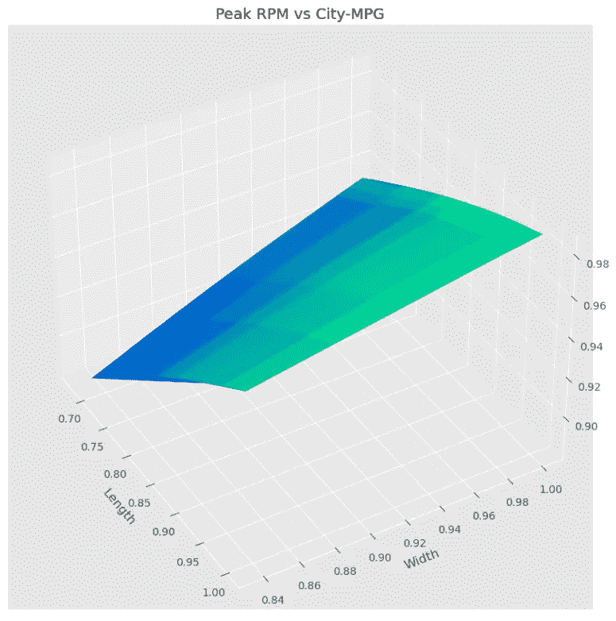
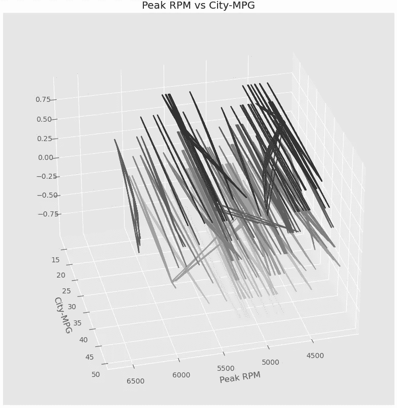
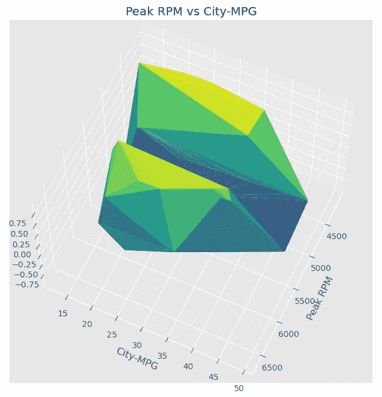

# Python 中的五个高级绘图— Matplotlib

> 原文：<https://towardsdatascience.com/five-advanced-plots-in-python-matplotlib-134bfdaeeb86?source=collection_archive---------3----------------------->


西蒙·李在 [Unsplash](https://unsplash.com?utm_source=medium&utm_medium=referral) 上的照片

## 带示例的交互式 3d 绘图

由于显而易见的原因，数据可视化可能是数据科学中使用最广泛的特性。可视化是呈现和理解数据的最佳方式。因此，拥有大量可视化工具是一个好主意。因为不同的视觉化在不同的情况下是合适的。在本文中，我将分享 Matplotlib 中五个 3d 可视化的一些代码。

> 我假设，你知道 Matplotlib 中的 2d 绘图。所以，我就不去过多讨论了。本文将简单演示如何制作这五个情节。

我将在本文中演示五个 3d 图:

1.  散点图
2.  等值线图表
3.  三面图
4.  表面图
5.  条形图

我在这篇文章中使用了来自 Kaggle 的数据集。

## 资料组

如果你想自己运行这段代码，请随意从这个链接下载数据集[。这是一个开放的数据集，这里提到的是](https://www.kaggle.com/fazilbtopal/auto85)。

首先导入必要的包和数据集:

```
import pandas as pd
import numpy as np
from mpl_toolkits import mplot3d
import matplotlib.pyplot as pltdf = pd.read_csv("auto_clean.csv")
```

数据集相当大。所以我不会在这里展示任何截图。以下是该数据集的列:

```
df.columns
```

输出:

```
Index(['symboling', 'normalized-losses', 'make', 'aspiration', 'num-of-doors','body-style', 'drive-wheels', 'engine-location', 'wheel-base',  'length', 'width', 'height', 'curb-weight', 'engine-type', 'num-of-cylinders', 'engine-size', 'fuel-system', 'bore', 'stroke', 'compression-ratio', 'horsepower', 'peak-rpm', 'city-mpg', 'highway-mpg', 'price', 'city-L/100km', 'horsepower-binned', 'diesel', 'gas'] ,dtype='object')
```

让我们转到绘图部分。

## 散点图

散点图非常简单明了。我假设你知道二维散点图。要制作一个 3d 散点图，我们只需要使用' scatter3D '函数并传递 x、y 和 z 值。我选择使用 x、y 和 z 值的高度、宽度和长度。

为了添加更多的信息，也为了添加一些样式，我将把价格作为大小参数传递。我觉得散点图有不同大小的气泡和不同的颜色看起来很好看。同时，尺寸包含了更多的信息。

因此，泡沫越大，价格越高。同样的图将给出价格如何随高度、宽度和长度而变化的想法。颜色也随着峰值转速而变化。

```
%matplotlib notebook
fig = plt.figure(figsize=(10, 10))
ax = plt.axes(projection="3d")
ax.scatter3D(df['length'], df['width'], df['height'], 
             c = df['peak-rpm'], s = df['price']/50, alpha = 0.4)
ax.set_xlabel("Length")
ax.set_ylabel("Width")
ax.set_zlabel("Height")
ax.set_title("Relationship between height, weight, and length")
plt.show()
```



作者图片

> 该图是交互式的，有助于更好地理解数据:

作者制作的动画

## 条形图

条形图总是有用的。但是当它是 3D 条形图时，可能会更有用。在这里，我将根据车身风格和峰值转速来标出价格。为此，需要做一些数据准备。首先，体型是一个范畴变量。body_style 列的值如下:

```
df['body-style'].unique()
```

输出:

```
array(['convertible', 'hatchback', 'sedan', 'wagon', 'hardtop'],
      dtype=object)
```

这些字符串需要替换为数值:

```
df['body_style1'] = df['body-style'].replace({"convertible": 1,
                                             "hatchback": 2,
                                             "sedan": 3,
                                             "wagon": 4,
                                             "hardtop": 5})
```

现在，我将找到每种车身类型的平均峰值转速和价格。

```
gr = df.groupby("body_style1")['peak-rpm', 'price'].agg('mean')
```

输出:



对于 3d 条形图，我们显然需要将 x、y 和 z 值传递给 bar3d 函数，如您所料。但它也要求 dx，dy 和 dz。

首先，考虑将要放置横条的 2d 平面，这里我们只能使用 x 和 y 值，z 值为零。因此，我们将在 x 轴上使用 body_style1，在 y 轴上使用 peak-rpm，如前所述，在 2d 平面上 z 值为零。

接下来，我们应该指定条形的大小。我在 x 轴上使用宽度 0 .3，在 y 轴上使用宽度 30，高度将是价格列的值。这意味着，

dx = 0.3

dy = 30

dz = gr['价格']

下面是条形图的代码片段:

```
%matplotlib notebook
x = gr.index
y = gr['peak-rpm']
z = [0]*5colors = ["b", "g", "crimson", 'r', 'pink']dx = 0.3 * np.ones_like(z)
dy = [30]*5
dz = gr['price']fig = plt.figure(figsize=(10, 8))
ax = fig.add_subplot(111, projection="3d")
ax.set_xticklabels(['convertible', 'hatchback', 'sedan', 'wagon', 'hardtop'])
ax.set_xlabel("Body Style", labelpad = 7)
ax.set_yticks(np.linspace(5000, 5250, 6))ax.set_ylabel("Peak Rpm", labelpad=10)ax.set_zlabel("Price")
ax.set_zticks(np.linspace(7000, 22250, 6))
ax.set_title("Change of Price with Body_style and Peak RPM")ax.bar3d(x, y, z, dx, dy, dz)
```



作者图片

以下是条形图的完整视图:

作者制作的动画

这里是条形图！

## 表面图

对于这种类型的绘图，一维 x 和 y 值不起作用。因此，我们需要使用“meshgrid”函数从两个一维数组中生成一个矩形网格。

该图显示了 3d 设置中两个变量之间的关系。

我选择看这个图的长宽关系。以下是该表面图的代码:

```
def z_function(x, y):
    return np.sin(np.sqrt(x**2 + y**2))plt.figure(figsize=(10, 10))
ax = plt.axes(projection="3d")x = df['length']
y = df['width']X, Y = np.meshgrid(x, y)
Z = z_function(X, Y)
ax.plot_surface(X, Y, Z, rstride=1, cstride=1,
               cmap='winter', edgecolor='none')
ax.set_xlabel("Length")
ax.set_ylabel("Width")
ax.set_title("Peak RPM vs City-MPG")
ax.view_init(65, 30)
```



作者图片

> 这是表面图的完整视图

作者制作的动画

## 等值线图表

也许你已经知道二维等高线图。在这里，我用 3d 等高线图展示了峰值转速和城市英里数之间的关系。

在这个例子中，我对 z 值使用了 sin 函数。你可以用余弦函数试试。

以下是代码片段:

```
%matplotlib notebook
def z_function(x, y):
    return np.sin(np.sqrt(x**2 + y**2))
plt.figure(figsize=(10, 10))
ax = plt.axes(projection="3d")
x = df['peak-rpm']
y = df['city-mpg']
X, Y = np.meshgrid(x, y)Z = z_function(X, Y)
ax.contour3D(X, Y, Z, rstride=1, cstride=1,
               cmap='binary', edgecolor='none')
ax.set_xlabel("Peak RPM")
ax.set_ylabel("City-MPG")
ax.set_title("Peak RPM vs City-MPG")
ax.view_init(60, 35)
plt.show()
```



作者图片

> 这是这个等高线图的完整视图

作者制作的动画

请尝试对 z 函数使用余弦，并查看使用相同数据时余弦等值线的外观。

## 三面图

让我们看看三冲浪图是什么样子的。我们不需要网格网格的三冲浪图。简单的一维数据适合 x 和 y 方向。

这是代码。

```
%matplotlib notebookplt.figure(figsize=(8, 8))
ax = plt.axes(projection="3d")x = df['peak-rpm']
y = df['city-mpg']
z = z_function(x, y)
ax.plot_trisurf(x, y, z,
                cmap='viridis', edgecolor='none');
ax.set_xlabel("Peak RPM")
ax.set_ylabel("City-MPG")
ax.set_title("Peak RPM vs City-MPG")
ax.view_init(60, 25)
plt.show()
```



作者图片

> 这是整个情节的轮廓

作者制作的动画

## 结论

这是我想在这篇文章中分享的五个情节。我希望您将在自己的项目中使用它们。

欢迎随时关注我的推特(Twitter)和我的新 T2 YouTube 频道(T3)。

## 更多阅读

</convolutional-neural-network-good-understanding-of-the-layers-and-an-image-classification-example-a280bc02c13e>  </a-complete-anomaly-detection-algorithm-from-scratch-in-python-step-by-step-guide-4c115e65d54e>  </all-the-datasets-you-need-to-practice-data-science-skills-and-make-a-great-portfolio-74f2eb53b38a>  </an-overview-of-performance-evaluation-metrics-of-machine-learning-classification-algorithms-7a95783a762f>  </detailed-guide-to-multiple-linear-regression-model-assessment-and-inference-in-r-e9b183b1441> 