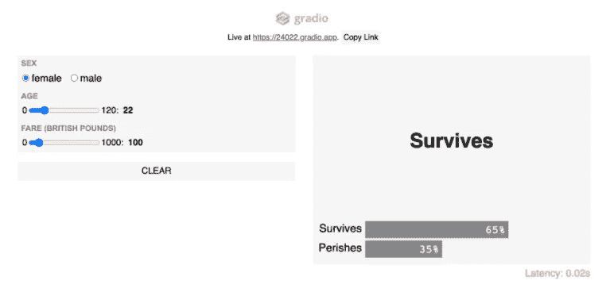

# 每个数据科学家都应该避免的五个坏习惯

> 原文：<https://towardsdatascience.com/five-bad-habits-every-data-scientist-should-avoid-d2099a16b978?source=collection_archive---------15----------------------->

## 以及如何预防！

玛利亚·特内娃在 [Unsplash](https://unsplash.com/?utm_source=unsplash&utm_medium=referral&utm_content=creditCopyText) 上拍摄的照片

没有人喜欢坏苹果。

也没有人喜欢坏习惯。

在我的数据科学之旅中，我和其他几个刚起步的人一起学习和成长。回想起来，我意识到我们许多人都有一些常见的坏习惯。

所以，我想和你分享这五个坏习惯，这样你就可以防止自己陷入其中。

让我们开始吧！

# 1)没有完全理解你试图解决的业务问题。

这是大多数数据科学家(包括我自己)在开始时都会犯的一个非常普遍的问题。为什么？通常，当人们了解数据科学并开始他们的第一个数据科学项目时，他们试图解决的问题 1)很简单，2)很简单(即训练营/教程)。

例如，如果你考虑 Kaggle 比赛，主持人清楚地概述了问题是什么，什么数据是可用的，以及要优化什么指标。不幸的是，这完全歪曲了现实。

在现实世界中，更有可能的情况是，您会收到模糊的指示，尤其是如果您正在与一个不太懂数据科学的团队一起工作。举个例子，你可能会被告知“量化营销活动”或“预测欺诈交易”，但没有更多细节。

## 如何预防

在直接跳到数据之前，花一些时间收集信息。**在开始任何类型的数据科学项目之前，确保你能回答这些问题**:

*   我试图解决什么业务问题？
*   这是什么数据科学问题？例如，二元分类与多级分类
*   如何定义成功，如何衡量成功？
*   谁是领域专家？谁是利益相关者？
*   这种模式将如何使用？此外，它将如何在业务流程或产品中实现？

通过回答这些问题，你会对你想要达到的目标有一个更好的理解，并且你不太可能不得不退回和重复某些步骤。

# 2)急于完成你的数据科学项目。

这与第一点有关，但也适用于[机器学习生命周期](https://www.datarobot.com/wiki/machine-learning-life-cycle/)中的所有其他阶段。具体来说，有两个阶段是许多数据科学家倾向于匆忙完成的:数据探索和模型验证。

## 数据探索

与第一点类似，许多数据科学家也倾向于忽略这个阶段。回到我的 Kaggle 示例，竞赛主持人非常清楚地说明了每个功能代表什么，您不必担心数据是如何生成的，或者有什么数据——因此在这种情况下，不完全需要“数据探索”的概念。

然而，在现实中，您将不得不花费更多的时间来探索哪些数据是可用的，数据是如何生成和转换的，以及数据的一般特征是什么。

需要回答的重要问题包括:

*   有哪些特征变量可用，目标变量是什么？
*   每个特征代表什么？
*   数据是如何产生的？管道/扯皮流程是怎样的？
*   所选数据的特征是什么(观察值数量、变量数量、时间尺度、数据类型等)。)
*   是否存在缺失值？怎么处理他们？
*   有没有异常值？他们为什么在那里？

## 模型验证

就像你在软件工程中执行几个测试一样(单元、端到端、集成等等。)，模型验证允许你*测试*你的机器学习模型。因此，您希望确保您正在彻底地测试(验证)它，并且您的测试(验证)是健壮的。

以下是关于模型验证以及如何改进模型验证的几点:

1.  如果您只是将数据集拆分为定型集和测试集，那么实际上应该将数据集拆分为定型集、验证集和测试集。验证集的目的是让您可以调整超参数，将测试集留给最终测试。[首席决策科学家@ Google 的 Cassie Kozyrkov](https://medium.com/u/2fccb851bb5e?source=post_page-----d2099a16b978--------------------------------) *在上面有一个惊人的视频* [*这里*](https://www.youtube.com/watch?v=pGlQLMPI46g) *。*
2.  更进一步，您可以使用 k-Fold 交叉验证等技术来进一步最小化采样偏差，并最终防止训练集过度拟合。
3.  除了交叉验证之外，您还应该花一些时间用您自己的输入手动测试模型。

[Gradio 拍摄的图像(经许可)](https://www.gradio.app/hub/aliabid94/hub-titanic)

具体来说，我喜欢做的就是用 [**Gradio**](https://www.gradio.app/) 快速为我的机器学习模型创建一个 web UI。我发现 Gradio 在验证我的模型时非常有用，原因如下:

*   它允许我交互式地测试模型的不同输入。
*   它允许我从领域用户和领域专家(他们可能不是编码人员)那里得到反馈
*   它需要 3 行代码来实现，并且可以通过公共链接轻松分发。

像这样使用图书馆的最大好处是，它也是给你的同事留下深刻印象的好方法😏。我向你保证，用它来部署你的模型，比把你那破烂的 Jupyter 笔记本送过去好 100 倍！

# 3)试图用最复杂的模型来解决你的问题。

如果你看过我之前的文章，*[*想成为数据科学家，不要从机器学习开始*](/want-to-be-a-data-scientist-dont-learn-machine-learning-28e418d9af2f) *，*你可能还记得我的观点，“机器学习不是每个数据科学家问题的答案。”*

*这一点与此相似，但有进一步的发展。如果你可以在三周内建立一个准确率为 95%的模型，而在三个月内建立一个准确率为 99%的模型，你认为大多数企业会选择哪个？*

*一般来说，他们更有可能选择第一个选项。为什么？因为模型性能不是构建模型时的唯一因素。还有一些因素，如实现时间、易解释性和可维护性等。*

*因此，如果您可以用 if/else 语句构建一个简单的基于规则的模型来解决手头的问题，为什么还要为一个 10 层的神经网络费心呢？*

## *如何预防*

*在大多数情况下，最好构建最简单的模型，并确定构建下一个最佳替代方案是否超过成本。要给出一个简单的框架，请依次问自己以下问题:*

1.  *我的问题能用简单的 Python 脚本或 SQL 查询解决吗？*
2.  *我的问题可以用决策树(if/else 语句)解决吗？*
3.  *我的问题可以用简单的机器学习模型来解决吗，比如线性回归或随机森林？*

*如果这三个问题的答案都是否定的，那么你可以考虑你的 10 层神经网络😉。*

# *4)试着全靠自己。*

*作为一名数据科学家，最大的好处之一就是你被赋予了很大的自主权。但是，如果你不愿意向他人寻求建议、帮助和反馈，这很容易导致失败。*

*当理解业务问题时，你必须与利益相关者交谈以理解他们的需求。在探索数据时，您可能需要与领域专家交流，以了解特定的特性以及它们是如何被吸收的。当验证你的模型时，你最好想从别人那里得到反馈。*

## *如何预防*

*这里没有神奇的解决方法，但是要学会接受别人的想法、观点和知识。你对面临的问题了解得越多，你就越有可能成功解决它！*

# *5)没有有效地传达你的方法和见解*

*这一点包含两个更小的点。*

*对于数据科学家来说，很难用普通人能够理解的方式来翻译他们的知识和见解。也就是说，您必须能够以非技术人员能够理解的方式交流技术术语和建模技术。如果你花时间建立了一个伟大的模型，你应该多花一点时间来有效地沟通，这样人们才能认可你的努力！*

*第二，正如我前面提到的，数据科学家一般都有很大的独立性。然而，您必须不断地与其他利益相关者沟通，让他们了解您的思维过程、您对模型的任何假设，并获得反馈。否则，您可能最终得到一个不能解决当前问题的模型。*

## *如何预防*

*花点时间把你的思维过程分解成更容易理解的形式，比如一篇文章、一张幻灯片或一个网络界面，这与我之前的观点相关。使用像 [Gradio](https://www.gradio.app/) 这样的库可以帮助提高模型的可解释性，并从非技术利益相关者那里获得反馈。*

# *感谢阅读！*

*这是我的另一篇固执己见的文章，所以你可以随意从中得到你想要的，但我希望你会发现这很有见地。想要直接跳到有趣的东西，即建模，是如此诱人，但请记住，这只是数据科学家日常工作的一小部分**！***

***一如既往，我祝你学习一切顺利:)***

*****不确定接下来该读什么？我为你挑选了另一篇文章:*****

*** [## 2021 年成为数据科学家的完整 52 周课程

### 连续 52 周，每周学点东西！

towardsdatascience.com](/a-complete-52-week-curriculum-to-become-a-data-scientist-in-2021-2b5fc77bd160) 

**链接到 Gradio:**

 [## 格拉迪欧

### 首页入门文档 ML 示例 Hub 博客讨论联系方式 Gradio 允许您快速创建可定制的…

www.gradio.app](https://www.gradio.app/) 

# 特伦斯·申

*   ***如果你喜欢这个，*** [***跟我上媒***](https://medium.com/@terenceshin) ***了解更多***
*   ***有兴趣合作吗？让我们连线上***[***LinkedIn***](https://www.linkedin.com/in/terenceshin/)
*   ***报名我的邮箱列表*** [***这里***](https://forms.gle/tprRyQxDC5UjhXpN6) ***！******