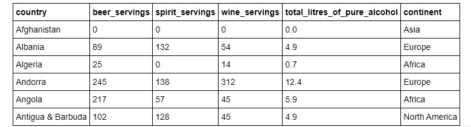
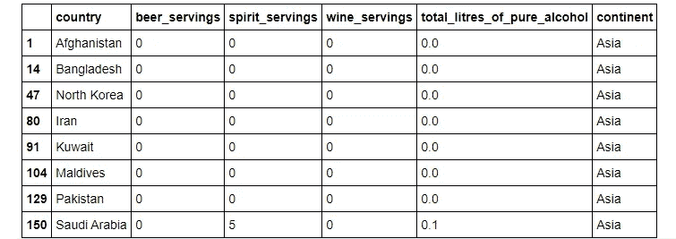
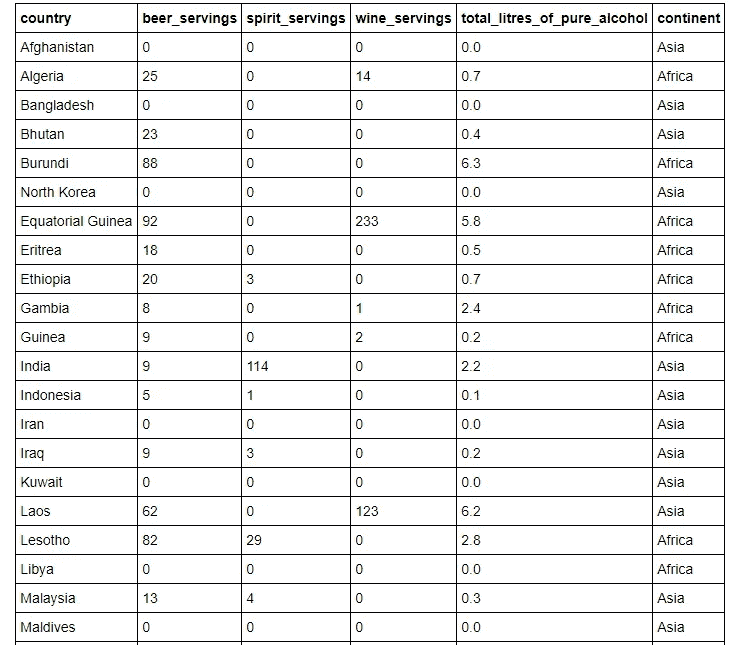
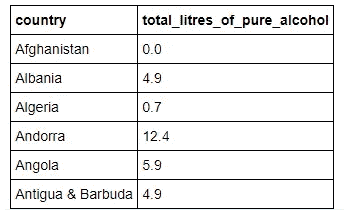
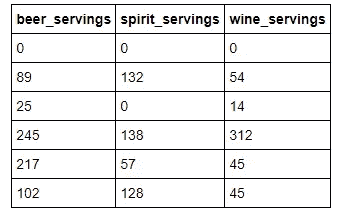
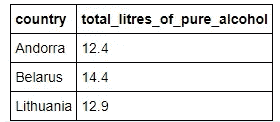
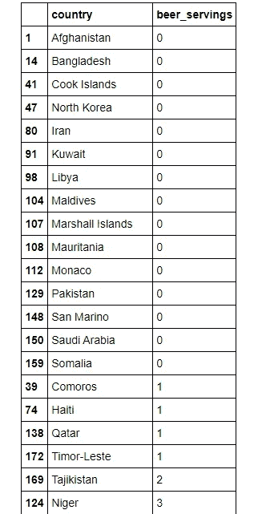
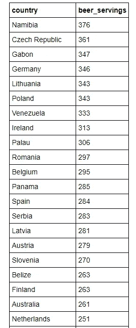
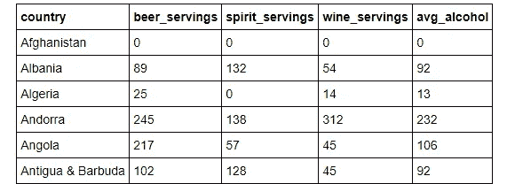
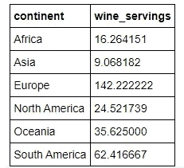

# R 中 dplyr 入门的 5 个基本命令

> 原文：<https://towardsdatascience.com/five-basic-commands-to-getting-started-with-dplyr-in-r-c8b0451ad916?source=collection_archive---------35----------------------->

## Dplyr 相当于 Python 中的 Pandas 库，可以轻松地进行数据探索和操作


杰夫·西普曼在 [Unsplash](https://unsplash.com?utm_source=medium&utm_medium=referral) 上的照片

我开始了我的数据科学之旅，学习如何使用 Pandas 库，事实上，它有着令人喜爱的一切-它易于使用，简单明了，并且具有几乎任何涉及操作和探索数据框的任务的功能。

见鬼，我甚至在 YouTube 上制作了一个完整的视频系列，教其他人如何使用熊猫。随便看看(不要脸的塞)！

[](/pandas-zero-to-hero-a-beginners-tutorial-to-using-pandas-f64e57386c7c) [## 熊猫零到英雄-使用熊猫的初学者教程

### 熊猫零到英雄是一个视频教程系列，旨在教初学者友好的方式使用熊猫

towardsdatascience.com](/pandas-zero-to-hero-a-beginners-tutorial-to-using-pandas-f64e57386c7c) 

然而，最近，我发现自己在 R 上花了越来越多的时间，主要是因为我在准备精算考试，但我也很好奇，想了解人们在 R 中使用的 Pandas 等效工具。

现在，如果您正在寻找 Python 与 R 的辩论，那么这篇文章不是您要找的。就我个人而言，我认为你可以添加到工具箱中的工具越多，你就变得越好，或者用数据科学的术语来说，你知道的语言或库越多，作为一名数据科学家，你就变得越灵活和有效。

此外，在现实世界中，并不总是由你来决定你想为一个特定的项目使用哪种语言，所以扩展你的知识和技能真的没有坏处。

# Dplyr 功能

正如我提到的，对于那些已经熟悉熊猫的人来说，dplyr 在功能上非常相似。有人可能会说 dplyr 编写和解释起来更直观，尤其是在使用链接语法时，这一点我们将在后面讨论。

如果您完全是新手，不要担心，因为在本文中，我将分享 5 个基本命令来帮助您开始使用 dplyr，这些命令包括:

1.  过滤器
2.  挑选
3.  安排
4.  使突变
5.  概括

除了这些命令，我还将演示 base R 方法来获得相同的结果，以突出 dplyr 的可读性。

事不宜迟，我们开始吧！

# 导入 dplyr 库和饮料数据集

如果您的计算机上还没有安装 dplyr，您可以通过以下命令进行安装。

```
install.packages("dplyr")
```

一旦你安装了这个库，我们现在就可以导入 dplyr 以及我们将在本教程中使用的数据集，按国家分类的饮料[数据集](https://raw.githubusercontent.com/justmarkham/pandas-videos/master/data/drinks.csv)。

```
library(dplyr)
drinks = read.csv("http://bit.ly/drinksbycountry")
head(drinks) 
```



该数据集包含世界上 193 个国家的酒精消费信息。

# 命令 1:过滤

filter 命令允许我们保留符合某些指定标准的行，通常是 and/or。

## 和标准

假设我们想查看没有啤酒供应的亚洲国家。

```
# Base R approach
drinks[drinks$continent == "Asia" & drinks$beer_servings == 0, ]# Dplyr approach
filter(drinks, continent == "Asia", beer_servings = 0)
```



## 或标准

假设现在我们想查看没有烈酒供应或没有葡萄酒供应的国家。

```
# Base R approach
drinks[drinks$spirit_servings == 0 | drinks$wine_servings == 0, ]# Dplyr approach
filter(drinks, spirit_servings == 0 | wine_servings == 0)
```



# 命令 2:选择

接下来，我们有 select 命令，它允许我们按名称选择列。

假设，我们想查看国家的前 6 行和纯酒精的总升数列。

```
# Base R approach
head(drinks[, c("country", "total_litres_of_pure_alcohol")])# Dplyr approach
head(select(drinks, country, total_litres_of_pure_alcohol))
```



为了使 select 命令更加健壮，我们还使用了以下内容来按名称匹配列:

*   开始于
*   以...结尾
*   比赛
*   包含

这里，我想选择包含单词 *servings* 的列。

```
head(select(drinks, contains("servings")))
```



# 额外好处:通过%>%链接多个操作

我之前谈到了 R 相对于 Python 的可读性优势。这个优势很大程度上归功于能够通过%>% 语法将多个操作链接在一起。

链接方法不是将不同的操作嵌套在一行代码中，这有时会变得混乱和难以阅读，而是提供了一种更直观的方法来编写和解释操作。

思考这个过程的一个好方法是想象你在一个工厂，每个操作就像一个工人，他是这个庞大制造过程的一部分，负责一个非常具体的任务。一旦他完成了他的任务，他就把它传递给下一个工人去执行他们的任务，如此等等，直到最终产品被交付。

还值得分享一下%>%的 Windows 快捷键，那就是 Ctrl+Shift+M。

现在，假设我们希望选择国家和纯酒精总升数列，并筛选纯酒精量超过 12 升的行。

```
# Nesting method
filter(select(drinks, country, total_litres_of_pure_alcohol), total_litres_of_pure_alcohol > 12)# Chaining method 
drinks %>% 
    select(country, total_litres_of_pure_alcohol) %>% 
    filter(total_litres_of_pure_alcohol > 12)
```



正如我们所看到的，链接显著提高了代码的可读性，尤其是当有许多命令在运行时。

链接也可以用来替换 dplyr 之外的 R 命令中的嵌套。例如，假设我们要计算两组数字之间的均方根误差，精确到小数点后五位。

```
# Create two vectors
set.seed(42)
x = runif(10); y = runif(10)# Nesting method
round(sqrt(mean((x-y)^2)), 5)# Chain method
(x-y)^2 %>% mean() %>% sqrt() %>% round(5)
```

在这里，你应该得到 0.36466 的 RMSE。

# 命令 3:排列

接下来，我们有一个不言自明的命令。它有助于按升序或降序排列行。

假设我们想在每个国家从最低到最高点啤酒。

```
# Base R approach
drinks[order(drinks$beer_servings), c("country", "beer_servings")]# Dplyr approach
drinks %>% 
    select(country, beer_servings) %>% 
    arrange(beer_servings)
```



或者，对于降序，我们需要使用 *desc。*

```
drinks %>% 
    select(country, beer_servings) %>% 
    arrange(desc(beer_servings))
```



# 命令 4:变异

命令 4 是 mutate，它允许我们创建新的变量，这些变量是数据框中现有变量的函数。

假设我们想添加一个新的变量，叫做平均酒精，它就是啤酒、烈酒和葡萄酒之间的平均份量。

```
# Base R approach
drinks$avg_alcohol = round((drinks$beer_servings + drinks$spirit_servings + drinks$wine_servings) / 3)
head(drinks[, c("country", "beer_servings", "spirit_servings", "wine_servings", "avg_alcohol")])# Dplyr approach
drinks %>% select(country, beer_servings, spirit_servings, wine_servings) %>% mutate(avg_alcohol = round((beer_servings + spirit_servings + wine_servings) / 3)) %>% head()
```



# 命令 5:总结

最后但同样重要的是，summarise 命令使用聚合函数将变量缩减为值。聚合函数的一些示例包括最小值、最大值、中值、众数和平均值。

在这里，让我们看一个例子，我们想计算平均葡萄酒服务的大洲。

```
# Base R approach
aggregate(wine_servings ~ continent, drinks, mean)# Dplyr approach
drinks %>% 
    group_by(continent) %>% 
    summarise(avg_wine = mean(wine_servings, na.rm = TRUE))
```



# 结论

总之，在本文中，我们学习了 dplyr 库的 5 个基本命令，这些命令使我们能够探索和转换数据帧。这 5 个命令是:

1.  过滤器
2.  挑选
3.  安排
4.  使突变
5.  概括

此外，我们还看到了如何通过%>%操作符部署链接方法，以使我们的代码更易于编写和阅读。

我希望你喜欢这篇文章，并从中获得一些有用的东西。请随意查看我关于如何使用 r 的其他教程文章。

[](/back-to-basics-linear-regression-in-r-3ffe4900482b) [## 回归基础——R 中的线性回归

### 线性回归是统计学中最基本的知识之一，下面是如何用 R

towardsdatascience.com](/back-to-basics-linear-regression-in-r-3ffe4900482b) [](https://medium.com/swlh/customer-segmentation-using-k-means-clustering-in-r-a74d512a4cfa) [## 基于 R 中 K-均值聚类的客户细分

### 强大的 k-means 算法初学者指南

medium.com](https://medium.com/swlh/customer-segmentation-using-k-means-clustering-in-r-a74d512a4cfa) 

保重，继续学习！