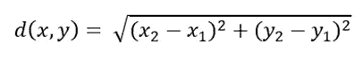
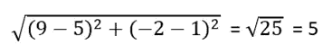
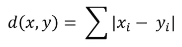
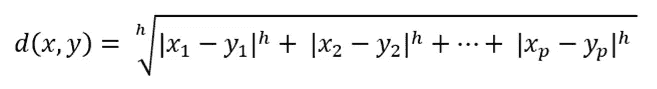
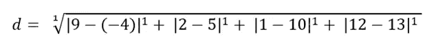
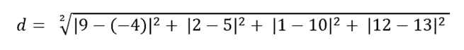
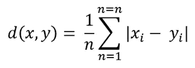
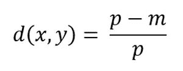
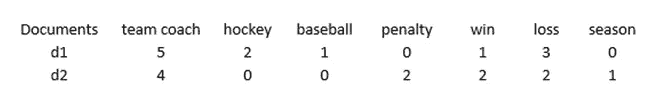
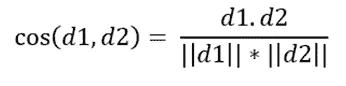

# 数据科学中五种常见的距离度量，包括公式和示例

> 原文：<https://towardsdatascience.com/five-common-distance-measures-in-data-science-with-formulas-and-examples-da492e201a66?source=collection_archive---------25----------------------->

在 [Unsplash](https://unsplash.com?utm_source=medium&utm_medium=referral) 上由[预照明 SeTh](https://unsplash.com/@7seth?utm_source=medium&utm_medium=referral) 拍摄的照片

## 欧几里德距离、曼哈顿距离、闵可夫斯基距离、汉明距离、余弦相似度，无需编码

距离计算是数据科学中的一个常见元素。许多机器学习算法都是基于距离度量的。虽然现在你不需要手动计算距离。有一些包和函数可以用来做这件事。但是，仍然有必要了解不同的距离度量是如何工作的，以便知道哪种距离度量适合您的项目。

这篇文章将着重于给出一个关于不同距离度量的坚实的数学概念。这样，当你需要使用距离测量时，你就能清楚地知道幕后发生了什么。这非常有助于理解哪种距离测量对什么目的有用。

这将涵盖以下距离测量:

1.  欧几里得距离
2.  曼哈顿距离
3.  闵可夫斯基距离
4.  汉娩距
5.  余弦相似性

让我们深入细节！

## 欧几里得距离

非常常用，可能我们很多人都记得初中或高中的时候用过。欧几里得距离实际上是两点之间的直线长度。如果已知两点的笛卡尔坐标，则可以使用勾股定理计算距离。

公式如下:

这是两个点 x 和 y : (5，1)，(9，-2)。使用欧几里得距离，这是这两点之间的距离:

但是重要的是要记住欧几里德距离也有一些缺点。欧几里德距离不是尺度不变的。因此，基于要素的单位，距离可能会有偏差。

> 这就是为什么在应用欧几里德距离之前有必要对数据进行归一化。

欧几里德距离对于 2 维或 3 维数据可能是有帮助的，但是对于更高维度不是很有帮助。

## 曼哈顿距离

曼哈顿距离对于在统一网格(如城市或棋盘)上描述对象的向量尤其有用。一个例子是计算出租车在城市中两点之间的最短距离。它被计算为两个向量之间的绝对差之和。公式如下:

这里有一个 x 和 y:

x = [3，6，11，8]

y = [0，9，5，3]

x 和 y 之间的曼哈顿距离:

d = | 3–0 |+| 6–9 |+| 11–5 |+| 8–3 | = 3+3+6+5 = 17

曼哈顿距离在更高维度的数据中效果更好。但是不太直观。虽然这不是什么大问题。

## 闵可夫斯基距离

另一种流行的距离测量方法。如果你看看这个公式，你会发现它同时代表了欧几里德距离和曼哈顿距离。先来讨论一下公式。

这里，x 和 y 是两个 p 维数据对象，h 是顺序。这样定义的距离也称为 L-h 范数。

如果‘h’为 1，则成为曼哈顿距离，如果 h = 2，则成为欧几里德距离。

这里有一个例子:

x = [9，2，-1，12]

y = [-4，5，10，13]

当 h = 1 时，该公式成为曼哈顿距离公式，称为 L-1 范数:

当 h= 2 时，该公式成为欧几里德距离公式，也称为 L-2 范数:

如您所见，Minkowski 距离代表基于“h”值的其他距离度量。因此，应根据 h 值采取谨慎措施。如果是欧几里德距离，就需要把缺点考虑进去。

## 汉娩距

汉明距离对于寻找两个二进制向量之间的距离很有用。在数据科学或机器学习中，你会经常遇到一次性编码数据。汉明距离在这些情况和许多其他情况下都是有用的。

公式是:

这里 n 是 x 或 y 的长度，它们应该有相同的长度。如果 x 和 y 是:

x = [0，1，0，1]

y = [1，1，0，0]

那么 x 和 y 之间的距离是:

d =(| 0–1 |+| 1–1 |+| 0–0 |+| 1–0 |)/4 = 1+0+0+1 = 2/4 = 0.5

这里 4 是 x 或 y 的长度，两者都有 4 个元素。

从上面的例子中可以看出，向量需要有相同的长度。

> **名义属性的相似性度量**

几乎类似的想法可以用于寻找标称特征或向量之间的距离。

其中 m 是匹配的数量，

p 是 x 或 y 的长度。

例如，x 和 y 是 Polly 和 Molly 的一些回答:

x = ['高'，' A '，'是'，'亚洲']

y = ['high '，' A '，' yes '，' Latino']

这里有四个元素，其中三个是相同的。x 和 y 之间的距离是:

d =(4–3)/4 = 1/4 = 0.25

现在，如果我们需要相似性而不是不相似性或距离，它只是距离的对立面。所以 x 和 y 之间的相似性是:

相似度= 1–0.25 = 0.75

## 余弦相似性

余弦相似度尤其用于自然语言处理。它表示两个向量之间角度的余弦，并确定两个向量是否指向几乎相似的方向。现在，这里的矢量是什么？一份文件可以由数千字组成。向量是文档中单词的频率。如果我们有五个文档，五个文档将有五个由单词频率组成的向量。这里有一个例子:

让我们找出 d1 和 d2 之间的余弦相似性

公式如下:

这里，d1.d2 表示两个向量 d1 和 d2 的点积。

D1 . D2 = 5 * 4+2 * 0+1 * 0+0 * 2+1 * 2+3 * 2+0 * 1 = 28

| | D1 | | =(5 * 5+2 * 2+1 * 1+0 * 0+1 * 1+3 * 3+0 * 0)* * 0.5 = 6.32

| | D2 | | =(4 * 4+0 * 0+0 * 0+2 * 2+2 * 2+2 * 2+1 * 1)* * 0.5 = 5.39

cos(d1，d2) = 28 / (6.32*5.39) = 0.82

这就是我们如何得到余弦相似度的。

## 结论

还有许多其他的距离测量方法。我试着为这篇文章挑选一些非常常见的。非常感谢您的阅读。

欢迎在推特上关注我，喜欢我的 T2 脸书页面。

## 更多阅读

 [## Python 和 R 语言的数据科学和数据分析系列项目

### 探索性数据分析、机器学习、自然语言处理和计算机视觉项目

towardsdatascience.com](/series-of-projects-on-data-science-and-data-analytics-in-both-python-and-r-76db3fea9b7e)  [## ggplot2 中的数据可视化集合

### 对初学者来说也是很好的学习材料

towardsdatascience.com](/a-collection-of-data-visualizations-in-ggplot2-3648a6ba71bc)  [## 练习数据科学技能和制作优秀投资组合所需的所有数据集

### 大量不同种类的数据集

towardsdatascience.com](/all-the-datasets-you-need-to-practice-data-science-skills-and-make-a-great-portfolio-74f2eb53b38a)  [## 熊猫时间序列分析终极指南

### 在 Pandas 中执行时间序列分析所需的所有 Pandas 功能。您也可以将此用作备忘单。

towardsdatascience.com](/an-ultimate-guide-to-time-series-analysis-in-pandas-d511b8e80e81)