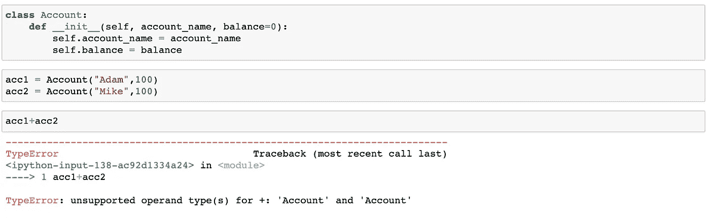
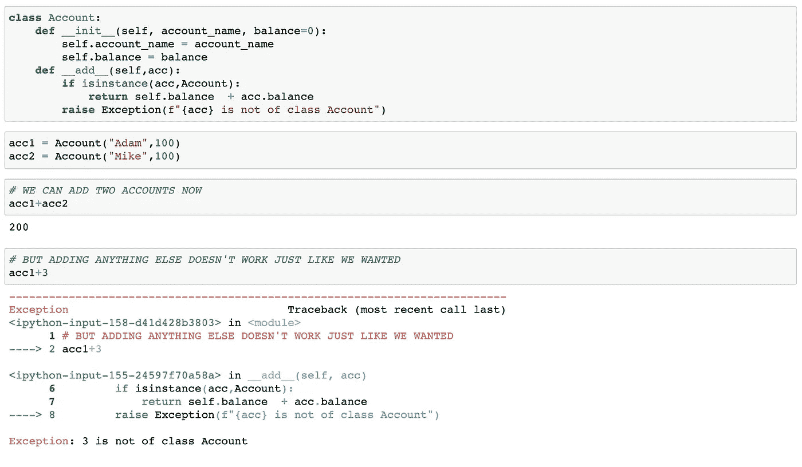
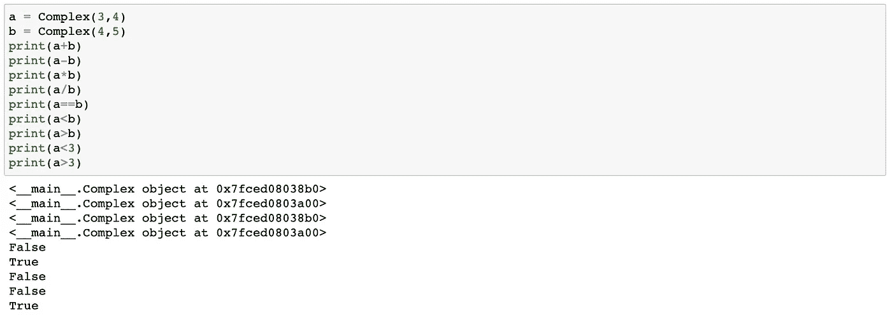
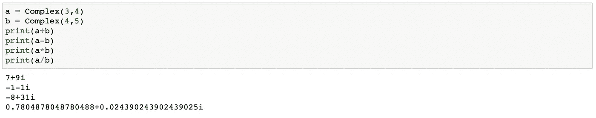
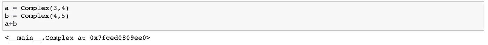
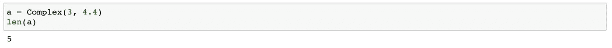
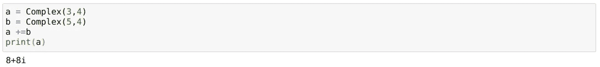
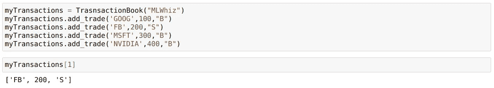

# 你应该知道的 Python 中的五个 Dunder 方法

> 原文：<https://towardsdatascience.com/five-dunder-methods-in-python-you-should-know-about-8ae7a45fa85d?source=collection_archive---------14----------------------->


图片来自 [Pixabay](https://pixabay.com/?utm_source=link-attribution&utm_medium=referral&utm_campaign=image&utm_content=5310589) 的 [Joshua Woroniecki](https://pixabay.com/users/joshuaworoniecki-12734309/?utm_source=link-attribution&utm_medium=referral&utm_campaign=image&utm_content=5310589)

## Dunder 方法也称为魔术方法，是理解 Python 所必需的

在我的上一篇[文章](/object-oriented-programming-explained-simply-for-data-scientists-ce2c7b5db1d?source=post_stats_page-------------------------------------)中，我谈到了面向对象编程(OOP)。我特别提到了一个神奇的方法`__init__`,在 OOP 术语中也称为构造方法。

`__init__`的神奇之处在于，每当一个对象被自动创建时，它就会被调用。但从任何意义上来说，它都不是唯一的。Python 为我们提供了许多其他神奇的方法，我们最终甚至在不知道它们的情况下使用了它们。曾经在列表中使用过`len()`、`print()`或`[]`运算符吗？你一直在用邓德的方法。

在这篇文章中，我将谈论五个最常用的魔法函数或*“dunder”*方法。

## 1.符魔战法:`__add__ , __sub__ , __mul__ , __truediv__ , __lt__ , __gt__`

Python 中的一切都是对象，从数据类型`int`、`str`、`float`到我们在数据科学中使用的模型。我们可以在一个对象上调用方法，比如这个 str 对象

```
Fname = "Rahul"# Now, we can use various methods defined in the string class using the below syntaxFname.lower()
```

但是，正如我们所知，我们也可以使用`+`操作符来连接多个字符串。

```
Lname = "Agarwal"
print(Fname + Lname)
------------------------------------------------------------------
RahulAgarwal
```

***那么，加法运算符为什么起作用呢？*** 我的意思是 String 对象遇到加号怎么知道该怎么做？在`str`类里怎么写？同样的`+`操作在整数对象的情况下以不同的方式发生。因此 ***运算符+在字符串和整数的情况下表现不同*** *(喜欢的人称之为—运算符重载)。*

那么，我们可以添加任意两个对象吗？让我们试着从我们的初级 Account 类中添加两个对象。



由于**Account**类型的对象不支持操作数+,因此如预期的那样失败。但是我们可以使用我们的神奇方法`__add__`将`+`的支持添加到我们的 Account 类中

```
class Account:
    def __init__(self, account_name, balance=0):
        self.account_name = account_name
        self.balance = balance
    def __add__(self,acc):
        if isinstance(acc,Account):
            return self.balance  + acc.balance
        raise Exception(f"{acc} is not of class Account")
```

这里我们给我们的类添加了一个神奇的方法`__add__`，它有两个参数——`self`和`acc`。我们首先检查`acc`是否是 class account，如果是，当我们添加这些帐户时，我们返回余额的总和。如果我们向 account 添加除 account 类对象之外的任何东西，我们将看到一个描述性错误。让我们试一试:



因此，我们可以添加任意两个对象。事实上，我们也有各种各样的其他运营商不同的魔术方法。

*   `__sub__`为减法(`-`)
*   `__mul__`用于乘法运算(`*`)
*   `__truediv__`为除法(`/`)
*   `__eq__`为相等(`==`)
*   `__lt__`为小于(`<`)
*   `__gt__`为大于(`>`)
*   `__le__`为小于或等于(`≤`)
*   `__ge__`为大于等于(`≥`)

作为一个运行示例，我将通过创建一个名为`**Complex**`的类来处理复数，从而尝试解释所有这些概念。不要担心`Complex`只是这个类的名字，我会尽量保持简单。

所以下面，我创建一个简单的方法`__add__`，把两个复数相加，或者一个复数加一个`int/float`。它首先检查被添加的数字是否属于类型`int`或`float`或`Complex`。根据要添加的数字的类型，我们进行所需的添加。我们还使用`isinstance`函数来检查另一个对象的类型。请务必阅读评论。

它可以用作:

```
a = Complex(3,4)
b = Complex(4,5)
print(a+b)
```

你现在应该能够理解下面的代码，它允许我们将`add`、`subtract`、`multiply`和`divide`复数和标量(`float`、`int`等)进行运算。).看看这些方法如何依次返回一个复数。以下代码还提供了使用`__eq__`、`__lt__`、`__gt__`比较两个复数的功能

你真的不需要理解所有的复数数学，但是我已经在这门课上尝试使用了大部分的魔法方法。也许通读一下`__add__`和`__eq__`一。

现在我们可以使用我们的`Complex`类:



## 2.但是为什么复数会打印成这个随机的字符串呢？— __str__ 和 __repr__

啊！你抓到我了。这让我们看到了另一个 dunder 方法，它让我们在我们的对象上使用 print 方法，这个对象叫做`__str__`。主要思想还是当我们调用`print(object)`时，它调用对象中的`__str__`方法。下面是我们如何在我们的`Complex`类中使用它。

```
class Complex:
    def __init__(self, re=0, im=0):
        self.re = re
        self.im = im .....
    ..... def __str__(self):
        if self.im>=0:
            return f"{self.re}+{self.im}i"
        else:
            return f"{self.re}{self.im}i"
```

我们现在可以重新检查输出:



所以现在，我们的物体以一种更好的方式打印出来。但是，如果我们在笔记本中尝试执行下面的操作，就不会调用`__str__`方法:



这是因为我们没有在上面的代码中打印，因此没有调用`__str__`方法。在这种情况下，会调用另一个名为`__repr__`的神奇方法。我们可以在我们的类中添加它，以获得与打印相同的结果(我们也可以用不同的方式实现它)。这是邓德方法中的邓德方法。相当不错！！！

```
def __repr__(self):
    return self.__str__()
```

## 3.我会抓到你的。那么，len 方法也是这样工作的吗？__len__

`len()`是另一个非常适合字符串、列表和矩阵等等的函数。为了在我们的复数类中使用这个函数，我们可以使用`__len__`魔法方法，尽管在这种情况下，这并不是一个有效的复数用例，因为按照文档,`__len__`的返回类型需要是一个`int`。

```
class Complex:
    def __init__(self, re=0, im=0):
        self.re = re
        self.im = im ......
    ...... def __len__(self):
        # This function return type needs to be an int
        return int(math.sqrt(self.re**2 + self.im**2))
```

下面是它的用法:



## 4.但是赋值操作呢？

我们知道`+`操作符是如何处理对象的。但是你想过为什么下面的`+=`会起作用吗？例如

```
myStr = "This blog"
otherStr = " is awesome"myStr**+=**otherStr
print(myStr)
```

这让我们想到了另一组邓德方法，称为赋值邓德方法，包括`__iadd__`、`__isub__`、`__imul__`、`__itruediv__`和许多其他方法。

因此，如果我们只是将下面的方法`__iadd__`添加到我们的类中，我们也能够进行基于赋值的添加。

```
class Complex:
    .....
    def __iadd__(self, other):
        if isinstance(other, int) or isinstance(other, float):
            return Complex(self.re + other,self.im)
        elif  isinstance(other, Complex):
            return Complex(self.re + other.re , self.im + other.im)
        else:
            raise TypeError
```

并将其用作:



## 5.你的类对象能支持索引吗？

有时对象可能包含列表，我们可能需要索引对象以从列表中获取值。为了理解这一点，让我们举一个不同的例子。假设你是一家帮助用户交易股票的公司。每个用户将有一个每日交易簿，其中包含用户一天的交易/交易信息。我们可以通过以下方式实现这样一个类:

```
class TrasnsactionBook:
    def __init__(self, user_id, shares=[]):
        self.user_id = user_id 
        self.shares = shares
    def add_trade(self, name , quantity, buySell):
        self.shares.append([name,quantity,buySell])
 **def __getitem__(self, i):
        return self.shares[i]**
```

你注意到这里的`__getitem__`了吗？这实际上允许我们在这个特定类的对象上使用索引，使用:



根据我们使用的指数，我们可以得到用户完成的第一笔交易或第二笔交易。这只是一个简单的例子，但是当您使用索引时，您可以设置您的对象来获得更多的信息。

## 结论

Python 是一种神奇的语言，Python 中有很多即使是高级用户也可能不知道的构造。邓德方法可能就是其中之一。我希望通过这篇文章，你能很好地了解 Python 提供的各种 dunder 方法，并理解如何自己实现它们。如果你想了解更多的 dunder 方法，看看 Rafe Kettler 的博客。

如果你想了解更多关于 [Python](https://amzn.to/2XPSiiG) 的知识，我想从密歇根大学调出一门关于学习 [**中级 Python**](https://coursera.pxf.io/0JMOOY) 的优秀课程。一定要去看看。

我以后也会写更多这样的帖子。让我知道你对这个系列的看法。在 [**媒体**](http://mlwhiz.medium.com/) 关注我或者订阅我的 [**博客**](https://mlwhiz.ck.page/a9b8bda70c) 了解他们。一如既往，我欢迎反馈和建设性的批评，可以通过 Twitter [@mlwhiz](https://twitter.com/MLWhiz) 联系

此外，一个小小的免责声明——这篇文章中可能会有一些相关资源的附属链接，因为分享知识从来都不是一个坏主意。

这个故事最初发表在[内置](https://builtin.com/data-science/dunder-methods-python)上。