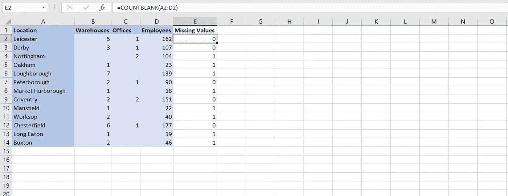
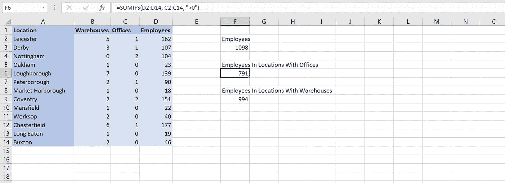
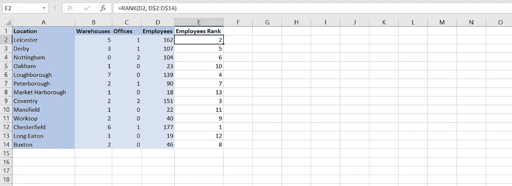

# 数据分析师的五个基本 Excel 函数

> 原文：<https://towardsdatascience.com/five-essential-excel-functions-for-data-analysts-9bee6fd73ab9?source=collection_archive---------21----------------------->

## 是时候增强你的电子表格肌肉了。

# Excel 对数据分析师很有用

很多数据科学家和数据分析师会经常告诉你，要想打入行业，就要学习 Python 或者 R。但是著名的电子表格应用软件 Microsoft Excel 仍然很受欢迎——在分析数据方面，有时比编程语言更好。一个好的 Excel 电子表格应该将复杂的原始数据转换成组织中任何人都能理解的可读文档。在本文中，我们将了解所有数据分析师都应该知道的五个基本 Excel 函数。

# 计数空白

原始数据可能是杂乱的，有时它可能包含丢失的值，尤其是当这些数据是在现实世界中收集的时候。在 Python 中，我们可以使用 isna()之类的方法来检测丢失的值。但是，在 Excel 中使用 COUNTBLANK 函数也可以做到这一点。

COUNTBLANK 将计算给定范围内空白单元格的数量。

使用 COUNTBLANK 函数检查缺失值。图片作者。

该 Excel 函数的公式为:

> =COUNTBLANK(范围)

# 苏米夫斯

最著名和最基本的 Excel 函数之一是 SUM 函数。有时我们可能希望使用 SUM，但是也使用一个标准将单元格从求和中排除。这就是 SUMIFS 的用武之地。

SUMIFS 允许我们对给定范围内的值求和，但只对符合给定条件的值求和。根据需要，可以为该函数提供任意多的标准。

使用 SUMIFS 函数计算不同地点的雇员数。图片作者。

该 Excel 函数的公式为:

> =SUMIFS(sum_range，criteria_range1，criteria1，…)

# 等级

RANK 函数可用于返回某个数值在与其他数值列表进行比较时的排名。在数据分析中，排序对于了解特定值在有序数组中的位置非常重要。还有一个类似的函数 PERCENTRANK，它以数据集范围的百分比形式返回排名。

需要注意的是，如果在给定的列表或数组中找不到值，Excel 将返回#N/A 错误。对于 PERCENTRANK 来说，情况并非如此。

使用 RANK 函数按员工数量对地点进行排名。图片作者。

该 Excel 函数的公式为:

> =RANK(数字，列表)

# 纵向查找函数

VLOOKUP 是任何数据分析师都应该知道的最重要的功能之一。它可以用来检索或查找垂直排列的表格中的数据。这非常有用，因为它可以用来自动查找另一个电子表格中的数据，只要每行都有一个 ID。

表的 ID 列必须是第一列。VLOOKUP 函数中的第三个参数可用于引用包含要检索的数据的列。需要注意的是，这个参数在 Excel 中是从 1 开始的。这意味着值 2 将得到第 2 列，值 3 将得到第 3 列，依此类推。这与 Python 中的列表索引不同，后者是基于 0 的。

VLOOKUP 函数中的另外两个参数指的是查找值(或正在检索的行的 ID)和表本身的范围。

使用 VLOOKUP 函数查找不同位置的数据。图片作者。

该 Excel 函数的公式为:

> =VLOOKUP(查找值，表数组，列索引号)

# IFERROR

如果您要向公司中的其他人展示 Excel 电子表格，那么当函数中出现错误时，在单元格中使用默认值会很有用。当其他用户不理解错误的含义时，或者当计算中出现错误(如默认为 0)时单元格的值已知时，这可能特别有用。

IFERROR 函数可以做到这一点。这个函数只接受两个参数，第一个是函数，第二个是函数抛出错误时的默认值。如果函数没有抛出错误，那么值将正常输出。

使用 IFERROR 函数处理 Excel 错误。图片作者。

该 Excel 函数的公式为:

> =IFERROR(值，值 _if_error)

现在你知道了！这是数据科学家和数据分析师应该知道的 Microsoft Excel 的五个基本功能。尽管您需要知道这五个函数，但是请记住，还有许多 Excel 函数可以使用，并且通常有一个函数可以完成您的工作。

VLOOKUP 是最臭名昭著的功能之一，在工作描述和面试中会被问到。SUMIFS 之类的函数非常常见，几乎在所有有用的电子表格中都可以找到它们。事实上，本文中的所有函数在数据分析中都很常见。您认为还有其他 Excel 函数对于数据分析是必不可少的吗？下面分享一下。