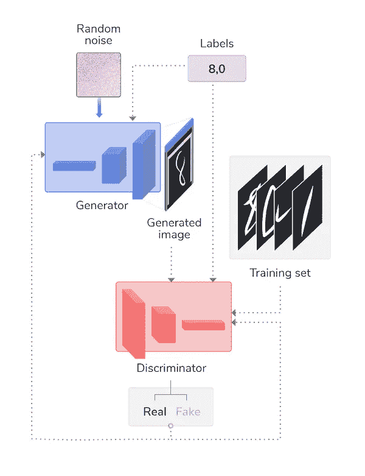
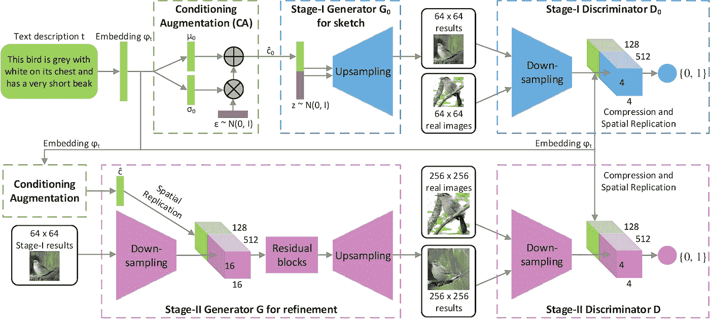
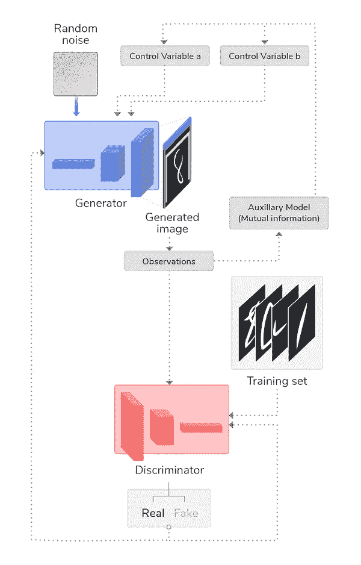
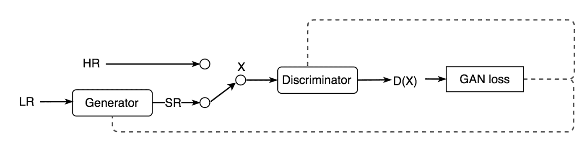
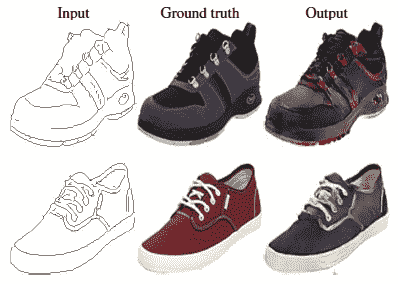
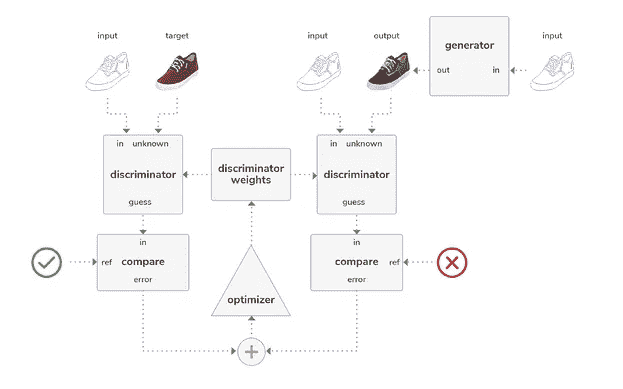
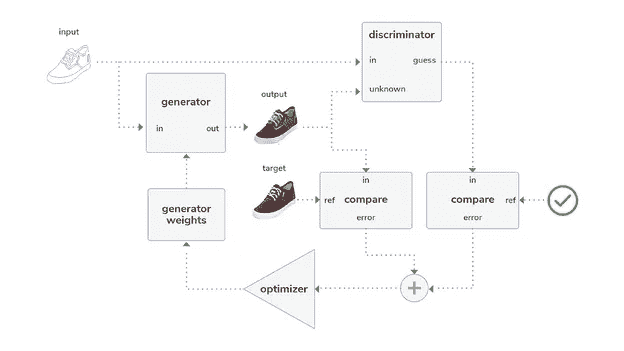

# 更好的图像处理

> 原文：<https://towardsdatascience.com/five-gans-for-better-image-processing-fabab88b370b?source=collection_archive---------4----------------------->

## 机器学习从业者越来越多地转向 GANs 的力量进行图像处理，了解这五个。

机器学习实践者越来越多地转向图像处理的生成对抗网络(GANs)的力量。真正受益于使用 GANs 的应用程序包括:从基于文本的描述中生成艺术和照片、放大图像、跨域传输图像(例如，将白天场景改为夜晚场景)以及许多其他应用程序。为了实现这样的结果，已经设计了许多增强的 GAN 架构，它们具有自己的独特特征来解决特定的图像处理问题。

我们选择近距离观察这五个今日头条的 gan，因为它们提供了广泛的功能，从放大图像到从基于文本的描述创建全新的图像:

*   条件 GAN
*   堆叠氮化镓
*   信息最大化
*   超分辨率氮化镓
*   Pix2Pix

如果你需要快速复习 GAN，请查看我们的博客[探索生成对抗网络](https://blog.perceptilabs.com/exploring-generative-adversarial-networks-gans)，在那里我们回顾了 [GAN](https://en.wikipedia.org/wiki/Generative_adversarial_network) 如何训练两个神经网络:*生成器*和*鉴别器*，它们学习生成越来越逼真的图像，同时提高其将图像分类为真假的能力。

# 条件 GAN

标准 GANs 的一个挑战是无法控制生成的图像类型。生成器简单地从随机噪声开始，并且随着时间的推移重复地创建希望趋向于表示训练图像的图像。

一个*条件 GAN* (cGAN)，通过利用标签数据(又名*类标签*)等附加信息来解决这个问题。这也可以导致更稳定或更快的训练，同时潜在地提高生成图像的质量。例如，一个带有不同类型的蘑菇图像和标签的 cGAN 可以被训练成只产生和辨别那些准备采摘的蘑菇。由此产生的模型可以作为工业机器人计算机视觉的基础，用于寻找和采摘蘑菇。如果没有这样的条件，标准 GAN(有时称为*无条件 GAN* )仅仅依赖于将潜在空间中的数据映射到生成图像的数据。

实现 cGANs 有不同的方法，但一种方法是通过向鉴别器和生成器输入类标签来调节它们。以下示例显示了用于生成手写数字图像的标准 GAN，该标准 GAN 使用标签数据进行了增强，以仅生成数字 8 和 0 的图像:

***图 1*** *:一个 cGAN，其中类标签被输入到生成器和鉴别器以控制输出。图像由***感知。**

*这里，标签可以被[一键](https://hackernoon.com/what-is-one-hot-encoding-why-and-when-do-you-have-to-use-it-e3c6186d008f)编码以去除平凡性，然后作为附加层输入到鉴别器和生成器，在那里它们然后与它们各自的图像输入连接(即，与生成器的噪声连接，以及与生成器的训练集连接)。因此，在训练期间，两个神经网络都以图像类别标签为条件。*

***概要**:当您需要控制生成的内容时，请使用 cGAN(例如，生成训练数据的子集)。*

# *堆叠氮化镓*

*如果我们能让电脑为我们画一幅画，那不是很酷吗？好吧，这就是 *Stacked GAN* (StackGAN)背后的灵感，在论文 *StackGAN:利用堆叠生成对抗网络进行文本到照片级逼真图像合成*中有所描述。*

*在这篇论文中，作者将 StackGAN 描述为一个基本的两阶段草图细化过程，类似于画家使用的先画出一般元素，然后再细化的过程:*

> *第一阶段 GAN:它根据给定的文本描述勾画出物体的原始形状和基本颜色，并从随机噪声向量中绘制背景布局，产生低分辨率图像。*
> 
> **第二阶段 GAN:它纠正第一阶段低分辨率图像中的缺陷，并通过再次阅读文本描述来完成物体的细节，产生高分辨率照片级图像。**

*作者提供了其模型架构的以下概述:*

**

****图 2:****stack gan 模型架构概述，图片* [*来源*](https://github.com/hanzhanggit/StackGAN/blob/master/examples/framework.jpg) *。**

*虽然使用常规 GAN 可以解决这一问题，但输出图像可能缺乏细节，并且分辨率可能会较低。StackGAN 的两阶段架构基于 cgan 的思想来解决这一问题，正如作者在他们的论文中所述:*通过再次对第一阶段的结果和文本进行调节，第二阶段的 GAN 学习捕捉第一阶段 GAN 忽略的文本信息，并为对象绘制更多细节。从粗略对准的低分辨率图像生成的模型分布的支持具有与图像分布的支持相交的更好的概率。这是第二阶段氮化镓能够产生更好的高分辨率图像的根本原因。**

*要了解 StackGAN 的更多信息，请查看作者的 [GitHub repo](https://github.com/hanzhanggit/StackGAN) ，他们在这里提供了模型以及鸟类和花卉的图像。*

***概要**:当你需要从一个完全不同的表现形式(例如，从基于文本的描述)生成图像时，使用 StackGAN。*

# *信息最大化*

*与 cGAN 类似，*信息最大化 GAN* (InfoGAN)利用附加信息来提供对生成内容的更多控制。在这样做的过程中，它可以通过无人监督的训练学会理清图像的各个方面，如发型、物体的存在或情绪。然后，该信息可以用于控制所生成图像的某些方面。例如，给定一些戴眼镜的人脸图像，可以训练 InfoGAN 为眼镜解开像素，然后使用它生成戴眼镜的新人脸。*

*使用 InfoGAN，一个或多个*控制变量*与噪声一起输入到发生器。使用包含在称为*辅助模型*的附加模型中的[互信息](https://en.wikipedia.org/wiki/Mutual_information)来训练生成器，该辅助模型与鉴别器共享相同的权重，但是预测用于生成图像的控制变量的值。这种交互信息是通过对发生器生成的图像进行*观察*获得的。与鉴别器一起，辅助模型训练生成器，使得 InfoGAN 学习生成/识别伪图像与真实图像，并且捕获所生成图像的显著属性，使得它学习改进图像生成。下图总结了这种架构:*

**

****图 3:*** *对 InfoGAN 架构的总结。图像由* [*感知。*](http://www.perceptilabs.com)*

*有关 InfoGAN 的更多信息，请查看这篇文章。*

***概要**:当你需要将图像的某些特征分解出来，合成为新生成的图像时，可以使用 InfoGAN。*

# *超分辨率氮化镓*

*图像增强领域正在发展，越来越依赖于机器学习(ML)算法，而不是双三次插值等传统的统计方法。一种*超分辨率 GAN* (SRGAN)就是这样一种 ML 方法，可以将图像升级到超高分辨率。*

*SRGAN 利用 GANs 的对抗性，结合深度神经网络，来学习如何生成放大的图像(分辨率高达原始图像的四倍)。这些产生的*超分辨率*图像具有更好的准确性，并且通常获得较高的[平均意见得分](https://en.wikipedia.org/wiki/Mean_opinion_score) (MOS)。*

*为了训练 SRGAN，首先将高分辨率图像下采样为低分辨率图像，并输入到生成器中。然后，生成器会尝试将该图像升采样到超分辨率。鉴别器用于将生成的超分辨率图像与原始高分辨率图像进行比较。鉴频器的 GAN 损耗然后反向传播到鉴频器和发生器，如下所示:*

**

****图 4:*** *SRGAN 架构。LR =低分辨率图像，HR =高分辨率图像，SR =超分辨率图像，X =输入到鉴别器，D(X)= HR 和 SR 之间的鉴别器分类，图像* [*来源*](https://jonathan-hui.medium.com/gan-super-resolution-gan-srgan-b471da7270ec) *。**

*发生器使用多个卷积神经网络( [CNNs](https://www.perceptilabs.com/docs/convolution_tutorial) 和[resnet](https://www.perceptilabs.com/docs/textile_usecase)，以及批量标准化层和激活函数的 ParametricReLU。这些方法首先对图像进行下采样，然后对其进行上采样以生成超分辨率图像。类似地，鉴别器使用一系列 CNN 以及密集层、泄漏 ReLU 和 sigmoid 激活来确定图像是原始高分辨率图像还是生成器输出的超分辨率图像。*

*要了解更多关于 SRGANs 的信息，请查看这篇文章。*

***总结**:当您需要放大图像，同时恢复或保留精细、高保真的细节时，请使用 SRGAN。*

# *Pix2Pix*

*正如我们在博客[中讨论的，机器学习被用于图像处理和计算机视觉的五大方式](https://blog.perceptilabs.com/top-five-ways-that-machine-learning-is-being-used-for-image-processing-and-computer-vision#Object_Instance)，对象分割是一种将数字图像中的像素组划分为*片段*的方法，这些片段可以作为一个或多个图像中的对象进行标记、定位，甚至跟踪。*

*分割也可用于*将*输入图像转换为输出图像，用于各种目的，例如从标签图合成照片，从边缘图重建对象，以及对黑白图像进行着色。*

*分割可以使用 *Pix2Pix* 来完成，这是一种用于图像到图像翻译的 cGAN，其中 [PatchGAN](https://paperswithcode.com/method/patchgan) 鉴别器首先被训练来分类使用这些翻译生成的图像是真是假，然后被用来训练基于 [U-Net](https://perceptilabs.com/docs/u-net_usecase) 的生成器来生成越来越可信的翻译。使用 cGAN 意味着该模型可以用于各种翻译，而无条件的 GAN 需要额外的元素，如 L2 回归，以调节不同类型翻译的输出。*

**

****图 5:*** *使用 Pix2Pix 着色的例子。在这里，鞋子的黑白图纸(输入)与它们的训练数据(地面真实)一起显示，Pix2Pix 生成的图像(输出)，图像* [*来源*](https://arxiv.org/abs/1611.07004) *。**

*下图显示了在给黑白图像着色的情况下，如何首先训练 Pix2Pix 中的鉴别器:*

**

****图 6:*** *先在 Pix2Pix 架构中训练鉴别器。图像由* [*感知器*](http://www.perceptilabs.com) *组成。**

*这里，黑白图像作为*输入*被提供给生成器，该生成器产生彩色版本(*输出*)。鉴别器然后执行两个比较:第一个比较输入与*目标*图像(即，与表示地面真实情况的训练数据)，第二个比较输入与输出(即，生成的图像)。然后一个*优化器*根据两次比较的分类误差调整鉴别器的权重。*

*现在训练了鉴别器，然后可以用它来训练发生器:*

**

****图 7:*** *使用训练好的鉴别器训练 Pix2Pix GAN 中的发生器。图像由***感知。***

**这里，输入图像被输入到发生器和鉴别器中。(经过训练的)鉴别器将输入图像与发生器的输出进行比较，并将输出与目标图像进行比较。优化器然后调整生成器的权重，直到它被训练到生成器能够在大部分时间欺骗鉴别器的程度。**

**关于 Pix2Pix 的更多信息，请看这篇[文章](https://neurohive.io/en/popular-networks/pix2pix-image-to-image-translation/)。另外，请务必查看这个 [GitHub repo](https://github.com/phillipi/pix2pix) 。**

****总结**:当你需要将源图像的某个方面转换成生成的图像时，使用 Pix2Pix GAN。**

# **结论**

**GANs，更具体地说是它们的鉴别器和发生器，可以用多种方式构建，以解决各种各样的图像处理问题。以下总结可帮助您选择适合您应用的 GAN:**

*   ****cGAN** :控制(例如，限制)GAN 应该训练的分类。**
*   ****StackGAN** :使用基于文本的描述作为创建图像的命令。**
*   ****InfoGAN** :理清您想要生成的图像的具体方面。**
*   ****SRGAN** :在保持精细细节的同时，放大图像。**
*   ****pix2pix** :分割和转换图像(例如，给图像着色)。**

****您目前与哪种类型的甘一起工作？****

**感知实验室的 [GAN 组件](https://www.perceptilabs.com/docs/components)目前提供基本的 GAN 功能，如我们的 [GAN 教程](https://www.perceptilabs.com/docs/gan_tutorial)所示。随着我们继续增强 PerceptiLabs，我们很想知道您希望增加对这些不同 GAN 架构的什么类型的支持。有空的话，请通过 [PerceptiLabs 论坛](https://forum.perceptilabs.com/)的[总](https://forum.perceptilabs.com/c/general-questions/6)或[问题/反馈](https://forum.perceptilabs.com/c/bugs-crashes-site-feedback/8)频道告诉我们。**