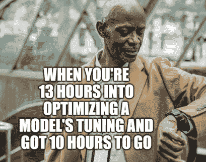
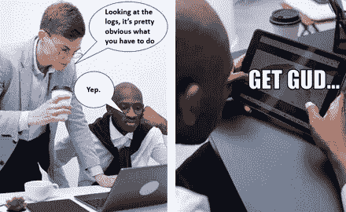

# 我作为一个傻瓜学到的五个经验教训有助于掌握数据科学

> 原文：<https://towardsdatascience.com/five-lessons-ive-learned-as-a-meathead-to-help-pick-up-data-science-93d7ee369108?source=collection_archive---------35----------------------->

> *当你广知道，你就在万物中看到它*—宫本武藏，《五环之书》**

**

*有趣的事实:右边的那两个人赌我举不起来，输了 20 美元*

*一年多前，我开始了我的数据科学之旅，这主要是为了让我在全球疫情期间以更有成效的方式保持忙碌，相比之下，我更早的计划是试图让它成为一个 Twitch streamer ( *我没有合适的相机设置*)。从那以后，我完成了[几门课程](http://www.dataquest.io)，[做了几个项目](https://github.com/Vibe1990)，并且[写了我的经历](https://michael-hoang17.medium.com/)。虽然其他人可能已经完成了更多，但这仍然是一个不错的进步。*

*然而，随着事情开始恢复到我所在的世界的一种新的正常状态，这意味着我的一些其他激情的回归，即举起真正沉重的 s#*t。虽然知道我终于可以回到他们身边很棒，这几乎是我在勒布朗·詹姆斯在 NBA 打球的时候一直在做的事情，但我不禁想起了我在这次新的努力中在这些追求中所学到的一些东西。*

*所以，我想为什么不让“**麦克叔叔**”分享一些经验来帮助你在这条道路上取得进步。*

# *第一课:“任何方法都会让你成功。坚持就好！”*

*听着，世界上有成百上千种方法可以让你去你想去的地方。无论是[节食](https://pubmed.ncbi.nlm.nih.gov/31525701/)和[训练](https://www.ncbi.nlm.nih.gov/pmc/articles/PMC6950543/)计划让你获得足够的提升，成为岩石的替身，还是像《权力的游戏》中的那个巨人一样提升，与学习数据科学相关的目标也是如此。例如，通过了解数据科学获得足够的体面，以便在 FANG 公司找到一份工作。有很多方法可以爬上这座众所周知的山。*

**

*原始图片来自[flo·马德雷布纳](https://www.pexels.com/photo/two-man-hiking-on-snow-mountain-869258/)来自[佩克斯](http://www.pexel.com)*

> *"你一定会喜欢那些‘免费’的分时度假介绍，对吗？"*

*见鬼，只要登录 Instagram、Tik Tok 或 YouTube，你就会发现至少有 10 个人都以不同的方式做到了这一点。当然，可能会有一些方法，你可能会比其他人更喜欢一些方法，一些[证据显示多模态方法特别有效，](https://www.nature.com/articles/s41598-017-06237-5)但总的来说它们都有效。然而，每种方法在功效方面的共性都植根于依从性。*

*合规是一门科学。它在许多结果中扮演着重要的角色，比如健康结果的[治疗](https://pubmed.ncbi.nlm.nih.gov/12218770/)以及学习，如这里的[和这里的](https://files.eric.ed.gov/fulltext/ED537948.pdf)[和](https://files.eric.ed.gov/fulltext/ED504556.pdf)所示。由于影响法规遵从性的因素各不相同，因此没有单一的方法来解决这一问题，关键是要能够识别所有潜在的因素，并提供变通解决方案来充分利用您自己的情况。*

*请注意，我没有提到任何关于效率或有效性的内容。这是因为你手头的工作可能不会那么高效或有效，尤其是当你有很多事情要做的时候。虽然你的进步速度可能会比别人慢很多，但这仍然是进步。只要进步在发生，你仍然会到达你的目的地。只是需要你一段时间。糟糕，我知道有些人两年计划已经进行了 5 年。重要的是要认识到这一点，接受它，并有弹性度过难关，直到实现目标。*

# *第二课:“你必须赢得进步的权利。”*

*让我们面对现实吧，在我们内心深处，都有某种程度的“A 型”人格驱使我们想要尽快成功。在另一个世界，这意味着在一两年内尝试获得 315 磅(144 公斤)的卧推，而数据科学等同于尽快获得一份数据分析师/科学家/工程工作。或者，也许想要到达这样一个点，即你可以开始为实际决策、人工智能相关的自动化设计机器学习模型，或者进入具有神经网络的深度假货的古怪世界。*

**

*由[小野幸树](https://www.pexels.com/photo/crop-black-man-checking-time-on-wristwatch-near-metro-station-5648064/)在 [Pexel](http://www.pexel.com) 上拍摄的原始图像*

> *“如果你知道，你就知道”*

*虽然这种心态令人钦佩，但它也可能是一把双刃剑。值得注意的是，这表现在为了尽可能快地进步而学习的时候忽略了一些细节。这通常发生在达到一个特定的里程碑之后，一旦达到这个里程碑，下一个里程碑就一直在你的脑海中。*

*重要的是要认识到，达到这一成就等同于能力，而不是才干。如果一个人把这误认为是后者，它只会成为学习进程停滞的催化剂，并在反复暴露于你目前的技能无法解决的困境时最终放弃冒险。*

**

*由 [Kajetan Sumila](https://unsplash.com/photos/-wlnJlh5CCk) 在 [Unsplash](http://www.unsplash.com) 上拍摄的原始图像*

*要变得有能力，需要一个人在彻底的实验和尝试下，通过有意识的应用，持续合理地产生想要的结果。这方面的一个例子是通过使用不同“脏度”级别的各种数据集(包括图像/文本/数字数据集)来重复数据争论过程，或者引入计时元素来亲自查看完成该过程需要多长时间。这些场景是任何与数据相关的职位在招聘过程中经常遇到的。因此，时不时地用同样的方法来学习，看看自己到底在哪里是值得的。*

# *第三课:“当你做过一次，重新开始总是更容易。”*

*好吧，从零开始做任何事情总是最难的。在什么都不知道和理解甚至最简单的任务的明显困难之间，会既疲惫又令人沮丧，这太糟糕了。所以，毫不奇怪，一旦我们度过了那个“ *noobie* 阶段，我们就再也不想经历那个阶段了。*

*嗯，有时候生活会以一种有趣的方式把扳手放进去。无论是工作/学校的事情，需要你立即关注的不可预见的紧迫问题，还是在进一步通知之前身体不适，我们都可能会落后于最初的行动计划，我们的技能也会退步。学习数据科学没有什么不同，只是你不会因为学习而受到身体伤害。嗯，我希望不是。*

**

*原始图片由[凯拉·伯顿](https://www.pexels.com/photo/aggressive-black-man-bullying-ethnic-male-groupmate-6147133/)在 [Pexel](http://www.pexel.com) 上拍摄*

> *“这可能是唯一的现实场景，在这个过程中你会受到身体伤害。*

*在这些时刻最重要的事情是知道你总是可以回到它。当然，你可能最终会意识到你忘记的比你学到的更多，并且不得不做大量的谷歌搜索，比你愿意承认的还要多，但这没关系。你仍然可以回忆起一些对你来说不再陌生的事物。你不能从零开始！把这当成某种长期裁员的一线希望吧。*

# *第四课:“如果你不去追踪它，你不可能取得任何真正的进步！”*

*没有什么经得起时间考验的不朽之作是通过没有计划地做某事而取得的，而没有确保某些标准得到满足，计划就无法执行。就像那些在每次会议后总是在笔记本上写下他们的进度的人一样，你也需要在你的学习之旅中做同样的事情。虽然这在一定程度上与建立坚持长期计划的责任感有关，但它也可以作为一个日志来观察哪些方面需要改进，以便让你朝着最终目标前进。*

**

*米哈伊尔·尼洛夫在[佩克斯](http://www.pexel.com)上拍摄的原始图像([左](https://www.pexels.com/photo/marketing-businessman-man-person-6930573/)和[右](https://www.pexels.com/photo/marketing-businessman-man-person-6930601/)*

*在我的情况下，我在日志中记录我在任何给定的一天完成的不同数据科学相关任务的种类，并记录我的表现(即，任务的难易程度、完成时间等)。).在一段合理的时间后，我会回头看看我的日志，看看是否有任何不尽如人意的地方需要改进。如果是这样的话，我可以制定一个行动计划，主要集中在发展薄弱环节，最终成为优势。*

*鉴于一个机器学习模型只和收集的数据一样好，你自己的学习进度也可以这么说。*

# *第五课:“做傻事是可以的。少做几次就好了。”*

*我相信，作为任何值得做的冒险的一部分，你最终会在某个时候做一些非常愚蠢的事情。正常情况下，这与你 20 多岁时高估自己的不可战胜感相一致，但在学习的背景下，这可能源于最大化学习进度的强烈愿望。虽然可能看起来不像，但“学习数据科学”等同于在宿醉 AF 或做任何 f#*k 这是的时候试图获得一个新的卧推个人记录。*

**

*来自 [Pexel](http://www.pexel.com) 的 [Mikhail Nilov](https://www.pexels.com/photo/a-couple-painting-on-a-canvas-7719076/) 的原始图片*

*其中最明显的形式是连续长时间(6 个多小时)、深入的疯狂学习会议，或者编写复杂的数据项目，在这些项目中，除了[ *插入最喜欢的品牌* ]能量饮料，你什么都不用做。你知道我说的那些。你开始慢慢从机器人先生变成拉米·马雷克。*

*现在，我不会说不要这样做，因为有时会需要这样做，或者当期望的最终目标有时会实现时，它们不会实现任何东西。我也不会说它们不令人满意，因为完成马拉松或铁人三项肯定会令人满意。然而，我会质疑，考虑到权衡利弊，所有这些真的有必要吗？难道我们不能在不通过冥府之门的情况下接近这一切，最终得到同样的结果吗？*

*当然可以。这只是一个关于它的策略和策略的问题。这意味着建立有用的习惯/行为，适当的项目规划，以及关注生产力和健康的指导方针。其中包括:*

*   *设定 90 分钟的上限来完成任何给定的任务，然后在任务之间留出 15 分钟的间隔*
*   *制定一个可行的粗略计划，并保持保守*
*   *通过关注每项任务后的感受，将累积的精神压力分散到更长的时间里。如果你觉得因为精疲力竭而需要长时间休息，那就好好休息一下吧！*
*   *优先考虑完成工作的质量，而不是完成工作的数量。更多并不总是更好；有时候，这意味着未来的自己需要做更多的事情。*

*正如一位世界著名的脊椎专家曾经说过的，“在事情发生之前，你只能做几次这样的事情，所以要选择什么时候做，什么时候不做”。*

# *这就是了。*

*我作为一个傻瓜的五个简单的教训被用在了这个新的尝试中。当然还有很多。然而，我觉得这些是最切中要害的。*

*那么，我的数据科学学习伙伴们，你们呢？你从自己身上学到了什么，你用在了学习这个领域的其他激情上？*

*欢迎在下面评论，让我知道你的想法。*

*如果你对联系感兴趣，请联系我的 LinkedIn。*

*感谢阅读，并期待一些其他有趣的东西来。*