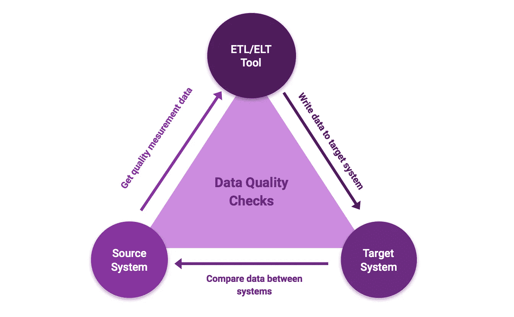

# 五种主要的数据项目类型

> 原文：<https://towardsdatascience.com/five-main-data-project-types-2f8037269dd8?source=collection_archive---------33----------------------->

## 观点—您将遇到的典型数据项目

## 从事数据领域的工作，有哪些典型的项目？

照片由[迪伦自由](https://unsplash.com/@d4rock?utm_source=unsplash&utm_medium=referral&utm_content=creditCopyText)在 [Unsplash](https://unsplash.com/s/photos/pine?utm_source=unsplash&utm_medium=referral&utm_content=creditCopyText)

在我从事数据分析和大数据领域的工作期间，我反复遇到了五种基本类型的项目。我想在这篇文章中介绍这些，并描述它们的特点。

## 数据存储和管道

在对数据做任何事情之前，您必须将数据从源系统转移到目标系统，例如数据仓库或湖。在这里，大多数 ETL 或 ELT 项目是必要的。不能低估这些数据处理或数据管道，因为您必须考虑:

*   **可用性:**源系统何时可用？你必须考虑维护周期、停机时间等。
*   **Load Times** :从源系统加载数据需要多长时间，我的进程在满负荷的情况下访问源系统需要多长时间？
*   **不同的数据结构**:在大数据的新世界中，基于列的非关系数据库和数据仓库正在兴起。
*   **业务脉络**:除了这些技术点，你还应该对源系统背后的一般业务有一点了解。

此外，构建容错且可监控的流程当然也很重要。

数据质量测量流程—作者提供的图片

## 数据分析和科学

这种类型的项目通常以报告、仪表板或机器学习服务结束。在这里，分析师或科学家比数据工程师更重要。除了较小的 PoC，还可能存在较大的项目。尤其是当最初的数据分析必须自动化和标准化时，最初的数据分析可能是在第一步通过 Jupyter Notebook 进行的。然后，这些项目就像其他软件项目一样，在一个已建立的、可扩展的平台上高效地展开。

集成的数据湖和分析平台—作者图片

## 数据应用

这里，重点是首先生成数据的系统。这里的相关问题是，例如，如何提高源系统中主数据的质量。因为大家都知道数据进来了，马上又出来了。BI 和分析部门还应与 IT 或系统的产品所有者密切合作。例如，可以通过对系统进行调整来纠正缺失的信息。例如，如果我需要来自商店系统的元信息，这可以在下一个开发周期中考虑。

## 安全性、访问和监控

除了这三种类型的项目之外，对我来说还有另一种数据项目类型，那就是与系统上的安全操作和安全性有关的一切。对我来说，这里必须考虑以下关键领域:

*   **数据保护:**例如，我如何保护 GDPR 数据？
*   **监控**:我的系统在工作吗，谁有权限？
*   **数据安全:**是否有固定的暂存区，是否有备份？
*   **成本监控:**比如有没有异常？

无论如何，这些都是每个数据平台都需要考虑的任务，而且通常规模更大，作为单独的项目来执行。然而，对我来说，最重要的一点是能够在一个安全可信的环境中执行数据计划。而且也是为了避免诸如不遵守 GDPR 的处罚。

## 成本优化

系统上的大量数据和大量用户需要花钱。通过迁移到云，这些通常可以减少，但前提是应用程序得到有效利用。例如，这一领域的项目可以是:

*   成本监控
*   数据结构和查询的优化
*   数据存储和归档的优化

特别是对于像 Google BigQuery AWS Redshift 或 Snowflake 这样的新系统，以嵌套形式存储数据并定期归档数据是有意义的。还建议为自助 BI 工具设置成本监控，以便识别用户和可能的反模式。

## 摘要

在我的职业生涯中，我经常遇到前面提到的五种数据项目类型。他们每个人都有自己独特的挑战和特点。因此，人们必须考虑它们，以便为它们各自的计划和最终结果找到完美的数据项目类型。