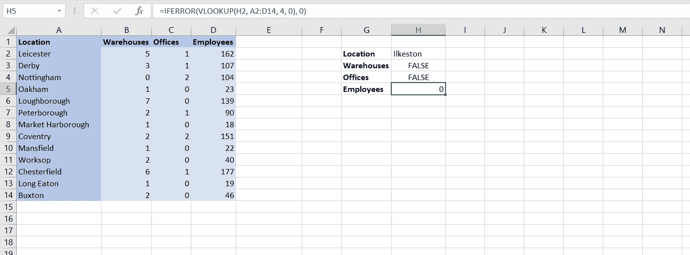
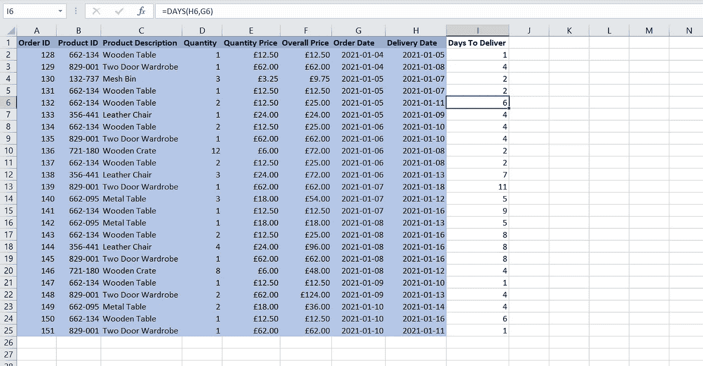
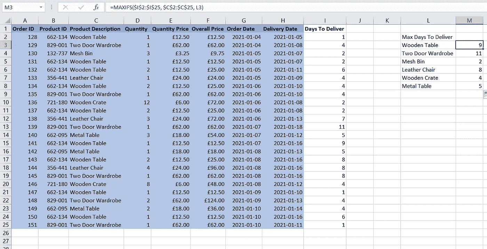
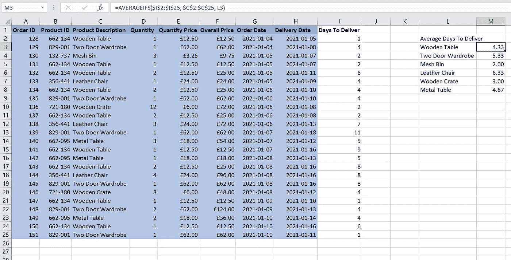
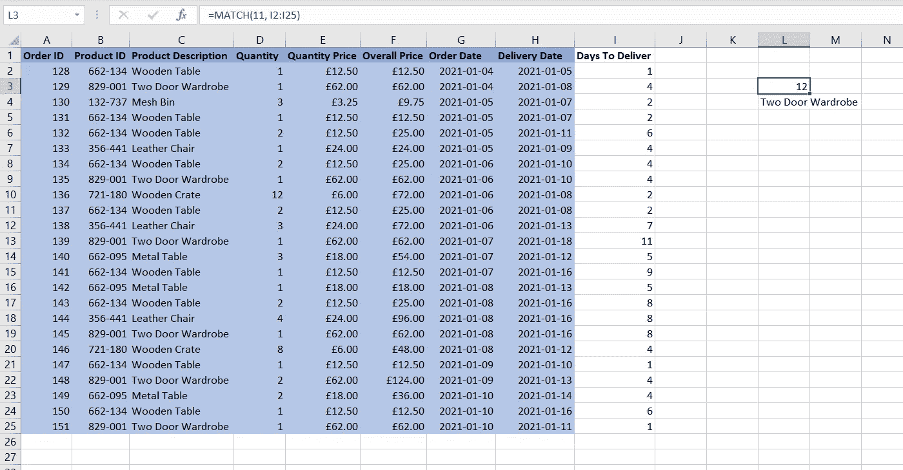
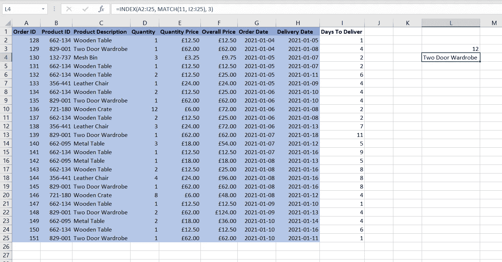

# 数据分析师的十个基本 Excel 函数

> 原文：<https://towardsdatascience.com/five-more-essential-excel-functions-for-data-analysts-b9fed9135ea8?source=collection_archive---------5----------------------->

## 您不需要为每个数据任务都使用 Python

虽然 Python 是数据科学领域的主导工具，但 Excel 是一种方便易用的方法来执行分析或向利益相关者显示信息。由于 Microsoft Excel 在商业世界中广泛使用，并且界面对于许多没有数据背景的人来说是熟悉的，因此它对于需要与企业中的其他部门共享的分析和报告非常有用。

在本文中，我们将探讨十个 Excel 函数，以获得软件的更多功能，并在 Excel 中快速执行常见的数据分析任务。

# 计数空白

原始数据可能是杂乱的，有时它可能包含丢失的值，尤其是当这些数据是在现实世界中收集的时候。在 Python 中，我们可以使用 isna()之类的方法来检测丢失的值。但是，在 Excel 中使用 COUNTBLANK 函数也可以做到这一点。

COUNTBLANK 将计算给定范围内空白单元格的数量。

使用 COUNTBLANK 函数检查缺失值。图片作者。

该 Excel 函数的公式为:

> =COUNTBLANK(范围)

# 苏米夫斯

最著名和最基本的 Excel 函数之一是 SUM 函数。有时我们可能希望使用 SUM，但是也使用一个标准将单元格从求和中排除。这就是 SUMIFS 的用武之地。

SUMIFS 允许我们对给定范围内的值求和，但只对符合给定条件的值求和。根据需要，可以为该函数提供任意多的标准。

使用 SUMIFS 函数计算不同地点的雇员数。图片作者。

该 Excel 函数的公式为:

> =SUMIFS(sum_range，criteria_range1，criteria1，…)

# 等级

RANK 函数可用于返回某个数值在与其他数值列表进行比较时的排名。在数据分析中，排序对于了解特定值在有序数组中的位置非常重要。还有一个类似的函数 PERCENTRANK，它以数据集范围的百分比形式返回排名。

需要注意的是，如果在给定的列表或数组中找不到值，Excel 将返回#N/A 错误。对于 PERCENTRANK 来说，情况并非如此。

使用 RANK 函数按员工数量对地点进行排名。图片作者。

该 Excel 函数的公式为:

> =RANK(数字，列表)

# 纵向查找函数

VLOOKUP 是任何数据分析师都应该知道的最重要的功能之一。它可以用来检索或查找垂直排列的表格中的数据。这非常有用，因为它可以用来自动查找另一个电子表格中的数据，只要每行都有一个 ID。

表的 ID 列必须是第一列。VLOOKUP 函数中的第三个参数可用于引用包含要检索的数据的列。需要注意的是，这个参数在 Excel 中是从 1 开始的。这意味着值 2 将得到第 2 列，值 3 将得到第 3 列，依此类推。这与 Python 中的列表索引不同，后者是基于 0 的。

VLOOKUP 函数中的另外两个参数指的是查找值(或正在检索的行的 ID)和表本身的范围。

使用 VLOOKUP 函数查找不同位置的数据。图片作者。

该 Excel 函数的公式为:

> =VLOOKUP(查找值，表数组，列索引号)

# IFERROR

如果您要向公司中的其他人展示 Excel 电子表格，那么当函数中出现错误时，在单元格中使用默认值会很有用。当其他用户不理解错误的含义时，或者当计算中出现错误(如默认为 0)时单元格的值已知时，这可能特别有用。

IFERROR 函数可以做到这一点。这个函数只接受两个参数，第一个是函数，第二个是函数抛出错误时的默认值。如果函数没有抛出错误，那么值将正常输出。

使用 IFERROR 函数处理 Excel 错误。图片作者。

该 Excel 函数的公式为:

> =IFERROR(值，值 _if_error)

# 天

如果您曾经处理过与时间相关的数据，您会知道有几个关键的计算会在您的工作中重复出现。其中之一是计算两个日期之间的天数。在 Excel 中，我们可以用 DAYS 函数来实现这一点。

DAYS 函数将两个日期作为参数，并以整数形式返回它们之间的天数。

这个函数有用的一个场景是计算订购产品和交付产品之间的时间。对于销售产品的企业来说，这是一个重要的指标，所以 Excel 提供了一个简单的方法来计算它是一件好事。

使用天数函数计算交付产品的天数。图片作者。

该 Excel 函数的公式为:

> =天数(结束日期，开始日期)

# MAXIFS

在商业中，找到一个变量的最大值是非常重要的。从知道一年中最忙的一天到一家企业一天中获得的最大利润——计算最大利润有很多原因。

有时，您可能只想计算数据子集的最大值。在这种情况下，您可以使用 MAXIFS 函数对您想要取最大值的数据进行约束。

在下面的例子中，我们使用 MAXIFS 来查找交付每种产品的最大天数。约束被放置在数据集的每一行中的产品上。

使用 MAXIFS 函数获得每个产品的最大交货时间。图片作者。

该 Excel 函数的公式为:

> =MAXIFS(max_range，criteria_range_1，criteria_1，…)

# 平均寿命

前面我们探讨了使用 SUMIFS 来过滤数据的总和。我们还研究了 MAXIFS 来做同样的事情，但是使用了最大值。到目前为止，您可能已经发现 Excel 中可以使用许多不同的 IF 函数。

其他一些有用的 IF 函数包括 COUNTIFS、MINIFS 和普通的 IF 函数。一个经常出现的函数是 AVERAGEIFS 函数，它用于计算平均值。

在下面的例子中，我们使用 AVERAGEIFS 函数来计算每个产品的平均交付时间。

使用 AVERAGEIFS 函数获得每个产品的平均交付时间。图片作者。

该 Excel 函数的公式为:

> =AVERAGEIFS(average_range，criteria_range_1，criteria_1，…)

# 比赛

有时，了解数据值出现的特定列或行会很有用。我们将在文章的后面查看一个用例，但是首先，我们将介绍允许我们这样做的函数。

MATCH 函数用于确定一个值在给定数组中的位置。重要的是要记住这个结果是相对于数组的开始的，所以结果 4 不一定意味着你要找的值在电子表格的第 4 列或第 4 行；它将位于给定范围的第四个位置。

使用 MATCH 函数获取数据集中的特定行。图片作者。

该 Excel 函数的公式为:

> =MATCH(值，数组)

# 指数

INDEX 是一个通常与前面的 MATCH 函数一起使用的函数。它们可以一起用于根据给定的标准获取查找表中的值，类似于 VLOOKUP 函数。但是，在单一查找函数失败的某些情况下，可以使用这两个函数，例如当查找值不在范围的第一行/列中时。

INDEX 函数本身用于返回给定行号和索引号的单元格的值。

在下面的例子中，我们可以看到 MATCH 函数用于获取产品在 11 天内交付的行，然后 INDEX 函数用于获取该行的产品描述。

结合匹配和索引功能进行查找。图片作者。

该 Excel 函数的公式为:

> =INDEX(数组，行号，列号)

# 结论

现在你知道了！使用该软件进行数据分析的人必须知道的十个 Excel 函数。如果您在 Excel 中进行大量工作，这十个功能将会非常频繁地出现，既然您知道如何执行常见任务，就没有理由不使用该软件。

虽然您将很好地利用本文中提到的所有函数，但我建议您密切关注匹配和索引的配对。这是 Excel 世界中极其常见的函数配对，只要稍加练习就很容易做到。

如果匹配/索引配对对您来说很难使用，那么从 VLOOKUP 开始，并理解该功能的不同用例。

您认为对于 Microsoft Excel 来说，还有哪些尚未提到的功能是必须了解的？请在下面的评论中提及它们。