# Python 中五个必须知道的字符串方法

> 原文：<https://towardsdatascience.com/five-must-know-string-methods-in-python-e97925d12eec?source=collection_archive---------32----------------------->

## 使用 PYTHON 进行实际数据分析

## 完美地处理数据分析项目中的字符串

奥马尔·弗洛雷斯在 [Unsplash](https://unsplash.com/collections/9318300/la-reyna?utm_source=unsplash&utm_medium=referral&utm_content=creditCopyText) 上拍摄的照片

我遇到的最常见的数据类型是 String，在 Python 中用 ***str*** 表示。Python 提供了 30 多个内置函数⚡️来操作字符串，让我们的生活变得更简单。了解这些函数不仅有助于数据分析，还能保持代码的简单性。通过这个故事，我将带你了解 5 个必须知道的字符串操作方法，并分享一些移动中的*技巧*💡来弹奏琴弦。

这个故事的要点是—

📌你将掌握五种必须知道的字符串操作方法
📌获得 30 多个字符串方法的单幅图片说明
📌包含所有字符串方法的 Jupyter-notebook

字符串是我所有项目中最常见的数据类型。知道这些字符串操作方法，总是帮助我加快我的分析。

在深入之前，我先告诉你一个字符串最简单的定义。

> "在 Python 中，用单引号或双引号括起来的都是字符串."

字符串是一个字符序列。字符可以是任何东西——数字、字母、符号和空格。

💡单引号还是双引号？
当字符串中没有*单引号*字符时，两者的行为完全相同。这张图片更好地解释了这个场景。

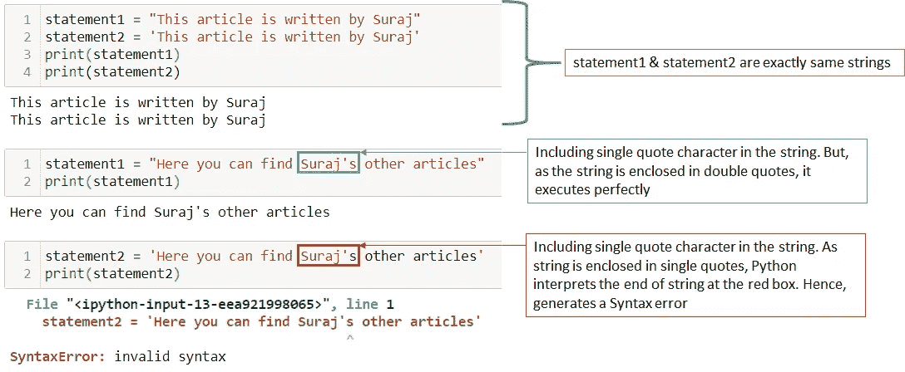

Python 中字符串的单引号和双引号(图片由作者提供)

字符串表示数据中的文本，因此可以是任意长度。可以对字符串执行各种操作，例如查找字符串中的特定字符、替换文本中的单词、改变字符串的大小写(例如小写——大写)、拆分字符串或连接它们以获得新字符串。

让我们开始吧…

# Python 中的字符串格式()

可以使用 *format()* 方法生成格式化的输出。它允许使用简单的占位符进行格式化。很多时候，有一种情况，你需要格式化一个特定的值，并把它插入到字符串中。

下面是这个场景的经典案例，打印一个输出字符串，其中包含来自数据分析的一些数字和单词。在这种情况下，使用 *format()* 方法将数字和单词格式化并插入到输出字符串中。

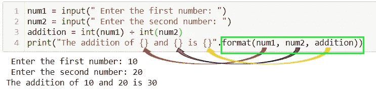

Python 中字符串格式()的经典案例(图片由作者提供)

如上例所示，`.format()` 中提到的变量(标有绿色方块)包含一些值，这些值将被插入到 print 语句的占位符中，以完成输出字符串。在 Python 中，占位符由*花括号{}* 表示。

现在，让我告诉你如何在你的分析项目中使用 f*format()*方法。下面是实现 *format()* 方法的 4 种方法。

以上所有实现 *format()* 方法的方式的输出都是一样的。你可以在下图中查看。

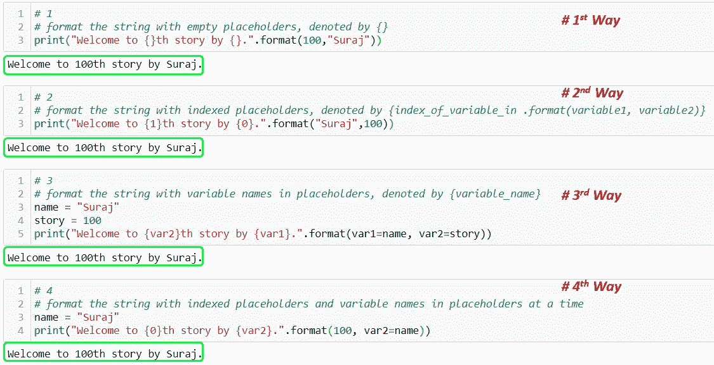

实现 String format()方法的四种方式(图片由作者提供)

尽管如此，寻找💡更简单的实现*格式()*？

那你应该去 f 弦。它也被称为*格式的* *字符串文字。*这种 f 字符串在要格式化的字符串开头有一个字母`***f***` ，在字符串中有多个占位符`***{}***` 。看看下面，

上例的简化视图如下图所示。

Python 中的 f 字符串(图片由作者提供)

# Python 中的字符串替换()

在我的一个项目中，当我探索 google 评论数据时，我想用默认字符串替换评论中的一些垃圾文本。我利用`str.replace()`来保持代码的整洁。

*Python 中的字符串是不可变的* →因此原始字符串不能被改变。因此，所有方法都会生成字符串的副本，对其执行操作并将其作为输出返回。

语法来了——
`str.replace(old_substring, new_substring)`

这个`str.replace()`返回原始字符串的副本，其中`old_substring`被替换为 my `new_subsstring`。让我用一个例子来说明这一点。

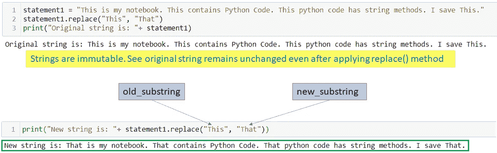

Python 中的字符串替换()

简单？哦，等等，你注意到了？原始字符串中的所有 old _ substrings 都被替换为 new_substring。如果，💡我只想改变原字符串中 old_substring 的前两次出现？

然后是第三个也是可选的参数`str.replace()`。它指定了用新的子串替换旧的子串的次数

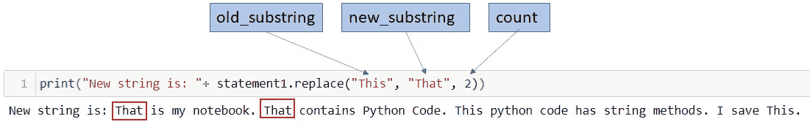

用 count 替换()字符串(图片由作者提供)

这就是你用这个`replace()`方法能做的全部。

# Python 中的字符串连接()

在浏览 google reviews 数据时，我想将餐馆、地区、城市和邮政编码的名称连接起来，形成一个完整的地址作为单个字符串。方法`join()`在那里帮助我。它很快将一个字符串连接到另一个字符串，形成预期的输出。

这个方法的语法非常简单:`separator.join(arg)`

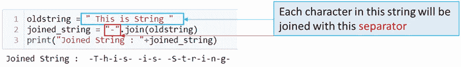

字符串连接()(图片由作者提供)

正如您在这里看到的，方法`join()`只接受一个参数，并且它必须是*，这意味着它可以是一个字符串、一个列表或一个元组。分隔符可以是逗号、空格、冒号，甚至是其他字符串。*

*再看一下下面的例子，*

*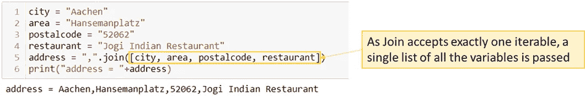*

*带有列表的字符串连接()*

*这里每个字符串都有很好的定义，简单地将一个字符串列表传递给`join()`。让我给你展示一下，在熊猫的数据框架中事情是如何运作的。这是另一个例子，*

*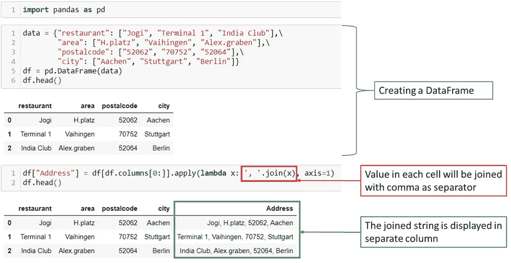*

*Pandas 数据帧中的字符串连接()*

**Woohoo！！**

*所有的列合并成一列，我得到了餐馆的完整地址。在每一行中，所有单元格都用逗号和空格作为分隔符连接在一起。*

*在上面的例子中，还可以看到一个经典案例💡如何将代码编写成多行，以及如何使用函数。*

# *Python 中的字符串 split()*

*方法`split()`与方法`join()`完全相反。与`join()`不同，split()在指定的分隔符或分隔符上分隔字符串。*

*在 split()中提到分隔符也是可选的。因此，如果你没有提到任何分隔符，默认的分隔符是空格，字符串将被分割在每个空格上。作为输出，您将得到一个分隔字符串的列表。*

*有了这个背景，你可能已经考虑过语法了。`any_string.split(separator, number_of_splits)`
在语法中可以看到，split()还接受另一个可选的参数数目的拆分。因此，如果设置为 1，意味着将返回两个分开的字符串。*

*一个例子更好地解释了这一点。*

*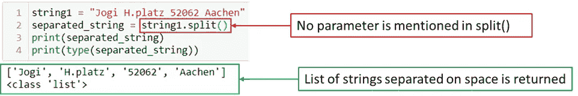*

*字符串拆分()(图片由作者提供)*

*让我们来看另一个例子，在 split()中提到了两个可选参数*

*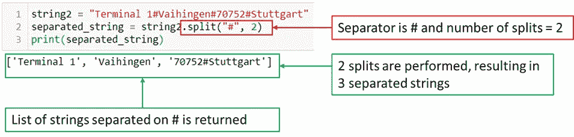*

*带所有选项的字符串拆分()*

*如上图所示，在`*string2*`上执行了 2 次分割。第一次分割在分隔符`#`第一次出现时进行，第二次分割在`#`第二次出现时进行。在处理文本数据时，Split()是一个非常方便的工具。*

*为了新冠肺炎数据分析项目，我抓取了一个流行的网页来收集所有的数据。不出所料，我在国名的开头和结尾看到了一些不需要的字符。我用`replace()`去掉了这些不需要的字符，但是字符串开头和结尾的随机数量的空格怎么办？*

****【strip()***来救我了！💡*

*strip()可以被视为 split()的一种特殊情况，专门用于从字符串的开头和结尾删除空格。strip()移除字符串开头和结尾的空格。*

*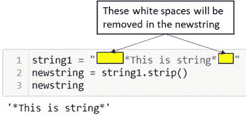*

*strip()(图片由作者提供)*

*但是，如果您希望只删除字符串开头或结尾的空格，那么 strip()又有两个子类型— `lstrip()`和`rstrip()`*

**

*字符串带()子类型(图片由作者提供)*

*您仍然可以尝试结合 split()、strip()和 replace()来进行各种数据转换，并获得所需的结果。愉快的实验。*

*让我们使用`find()`方法在给定的字符串中寻找一些特定的单词和数字。*

# *Python 中的字符串 find()*

*当我自动化我的第一个数据分析项目时，我曾经得到一个字符串作为输出，并且我需要在这个字符串中找到一个特定单词的位置。就在那个时候，我第一次使用了`find()`这个方法。*

*由于该方法的目的是在主字符串中搜索特定的子字符串并返回其索引，`find()`接受 1 个强制参数和 2 个可选参数。它带有语法:
`string.find(substring, start_position, end_position)`*

*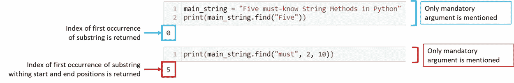*

*字符串查找()(图片由作者提供)*

*上图清楚地解释了方法`find()`如何返回主字符串中子字符串第一次出现的索引。*

*但是，如果子字符串不在主字符串中，或者不在给定的起始和结束位置范围内，该怎么办呢？*

*别担心！！！见下图。💡*

*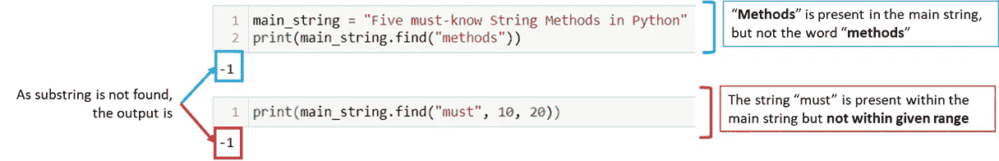*

*找不到子字符串时(作者图片)*

*如果在给定的主字符串中没有找到子字符串，Python 返回 **-1** 。*

*仅此而已！！在我所有的项目中，我发现这 5 个字符串方法最有用。掌握这些肯定能加快你的数据分析速度。*

> *_________ _ _ _ 图像比语言更有说服力 _ _ _ _ _ _ _ _ _*

*📌是时候用 **30+** 字符串方法生成单个图像了。通过这张图片，您可以了解 Python 中的所有字符串方法，并可以作为快速参考。*

*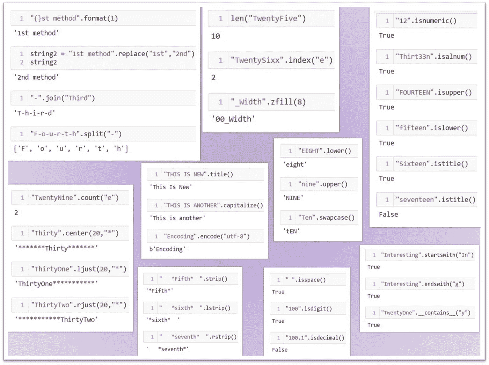*

*一张图中的所有字符串方法(图片由作者提供)*

*📌如你所见，这些是我的[笔记本](https://github.com/17rsuraj/data-curious/blob/master/TowardsDataScience/String_functions_Suraj_Gurav.ipynb)的真实快照。*

*💡有兴趣了解更多关于数据争论的知识吗？？这里有一个关于它的快速阅读。*

* [## 数据争论—从原始到干净的转变

### 简单的三个字的解释

towardsdatascience.com](/data-wrangling-raw-to-clean-transformation-b30a27bf4b3b)* 

*长话短说，*

*通过我的故事，我向你介绍了五个必须知道的字符串方法。掌握了这些方法，我已经使我的数据分析更快更简单，希望它也能帮助你。*

*一如既往，我乐于接受反馈，并了解您在项目中使用的其他更快的数据分析方法。*

## *感谢您的时间和阅读！*

*📚在这里看看我关于数据分析的其他文章。*

1.  *[五个 Excel 函数加快数据分析](/five-excel-functions-for-faster-data-analysis-19d88e5395e4)*
2.  *[Python 中的标签编码器和 OneHot 编码器](/label-encoder-and-onehot-encoder-in-python-83d32288b592)*
3.  *[使用 Python 的 SQL 数据库](https://medium.com/analytics-vidhya/sql-database-with-python-5dda6c9a0c8d)*
4.  *[网页抓取—制作您自己的数据集](/web-scraping-make-your-own-dataset-cc973a9f0ee5)*
5.  *[假设检验& p 值](/hypothesis-testing-p-value-13b55f4b32d9)*
6.  *[加入表格](/join-the-tables-ab7fd4fac26b)*