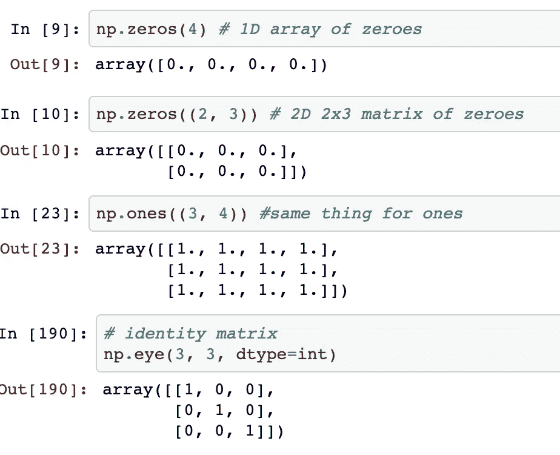
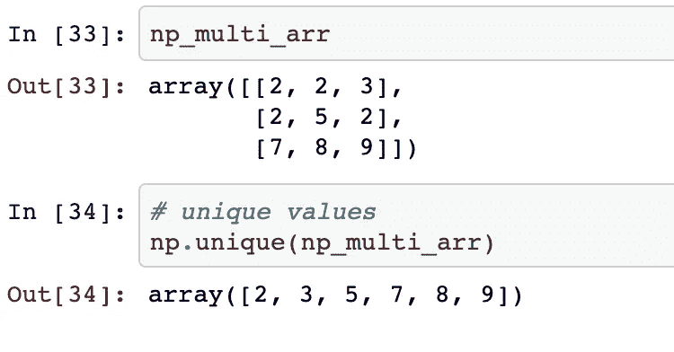
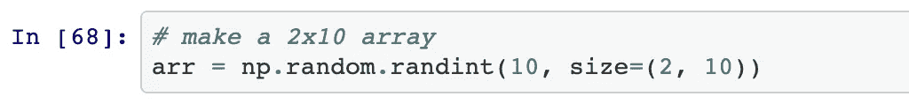
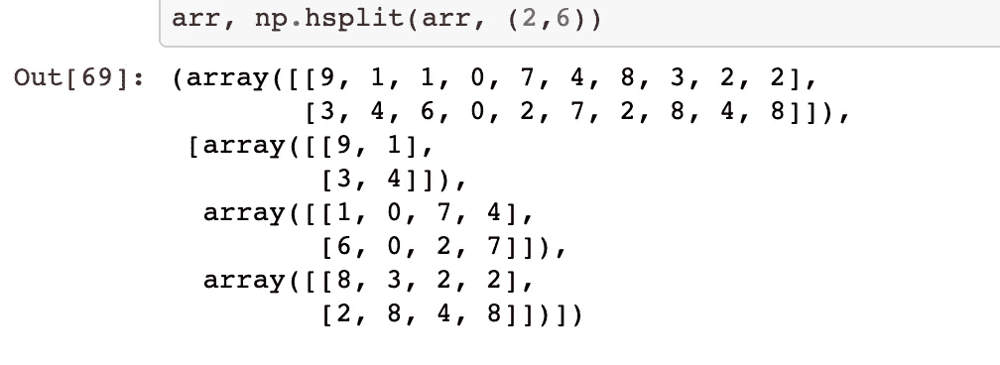
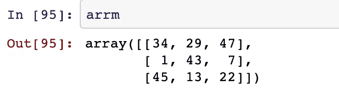
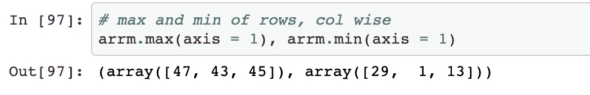
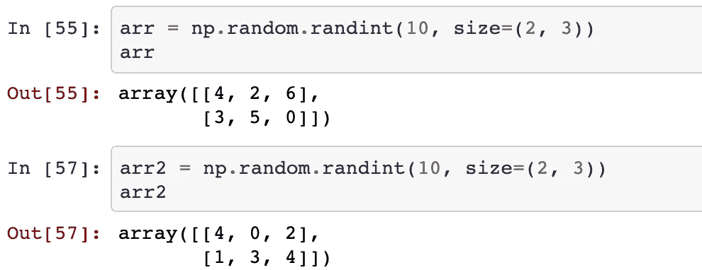
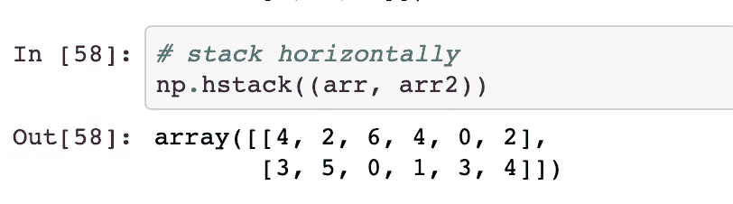
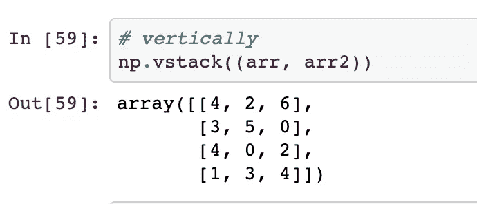

# 五个数字函数为您节省时间

> 原文：<https://towardsdatascience.com/five-numpy-functions-you-should-understand-e0e35704e7d2?source=collection_archive---------23----------------------->

## 如何堆叠你的数组水平和垂直，找到唯一的值，分裂你的数组和一些更有效地使用 Numpy 的技巧。


泰勒·尼克斯在 Unsplash[拍摄的照片](https://unsplash.com?utm_source=medium&utm_medium=referral)

Numpy 可以说是数据科学中使用最多的库，正好和熊猫一脉相承。这是您在每个数据科学项目中导入的第一个库，根据我的经验，只需要知道一些函数，就可以用最少的*搜索*来快速修改您的数组，这非常有帮助。

```
import numpy as np
```

因此，打开你的 Jupyter 笔记本和你最喜欢的笔记应用，在你阅读这篇文章的时候记下这些功能。它们将在你未来的项目中派上用场。

我们走吧！👇

# 制作特殊阵列

在这个类别中，我包含了三个 numpy 函数:

*   制作一个零数组:

```
np.zeros((2, 3)) # make a 2x3 matrix of zeroes
```

*   制作一个 1 的数组:

```
np.ones((2,3))
```

而且，

*   做一个身份的方阵:

```
*# identity matrix*
np.eye(3, 3, dtype=int)
```



特殊 numpy 数组函数

# 在数组中查找唯一值

要查找并获得数组中所有唯一值的列表，只需记住一个简单的函数:

```
np.unique(arr) # get unique values in arr
```



numpy 数组中的唯一值

很方便，不是吗？

# 垂直和水平拆分数组

将一个数组分成相等的两部分对于随机抽取您正在处理的数据的一部分非常有用。

我们首先定义一个简单的数组:



数组定义

然后，我们把它分开:

```
np.hspit(arr, (tuple of columns to split with))
```



numpy 数组分裂

同样，您也可以通过 **vsplit** 函数进行垂直分割。

```
np.vsplit(arr, 5)
```

# 寻找最小值和最大值

考虑这样一个数组:



示例 numpy 数组

然后，我们可以通过以下方式获得最大值和最小值:



numpy 数组最大值、最小值

如果您输入`axis = 0`，它将按行计算最大值和最小值，而不是按列。

# 堆叠阵列

一个在另一个的上面或者一个在另一个的旁边，numpy 具有各种堆叠两个或更多阵列的功能。

让我们先定义两个简单的数组:



两个 numpy 阵列

然后，我们可以通过以下方式将它们水平堆叠:

```
np.hstack((arr, arr2))
```



阵列的水平堆叠

同样，对于垂直堆叠，您可以这样做:

```
np.vstack((arr, arr2))
```



阵列的垂直堆叠

## 结束…

下一步是什么？你应该继续记忆这些方法吗？不尽然，因为一旦你开始在下一个项目中的一些数据上练习它们，你会在适当的时候自动记住它们。不需要额外的努力。

既然您已经知道了这种很酷的 numpy 函数的存在，我建议您继续自己尝试它们。也许你会发现一些我在这篇文章中没有探究的巧妙的小技巧？一切都归结于一些练习。它可以是奇妙的，也很有趣！

> 独自踏上数据科学之旅是艰难的。我分享我从这些每周文章中学到的一些小知识。[跟我来](https://medium.com/@ipom)让我们一起让学习变得有趣！😃

此外，这里是我所有数据科学故事的代码库。快乐学习！⭐️

这是我的另一篇文章，你可能想看看:

</26-datasets-for-your-data-science-projects-658601590a4c>  

此外，请随意访问⭐️，并跟随[这个 repo](https://github.com/yashprakash13/Python-Cool-Concepts) 访问我制作的完整 Numpy Cheatsheet 和我将来会包含的其他很酷的 Python 概念。快乐阅读！

你可以在 [LinkedIn](https://www.linkedin.com/in/yashprakash13/) 和 [Twitter](https://twitter.com/csandyash) 上和我联系。