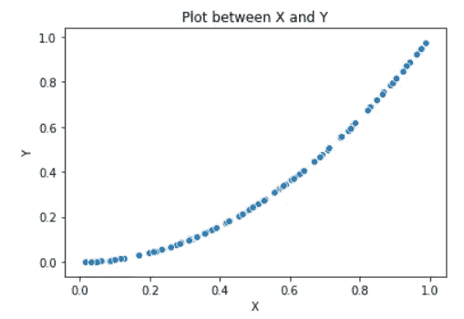
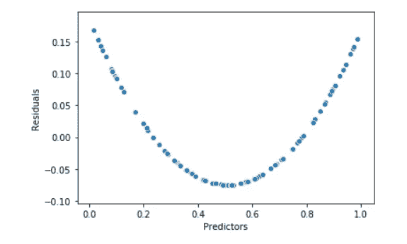
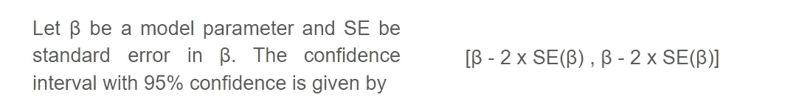
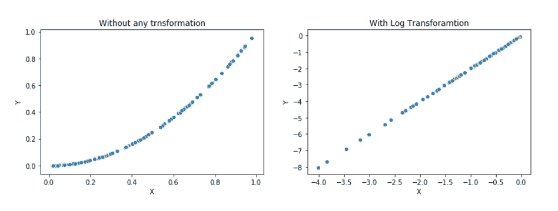
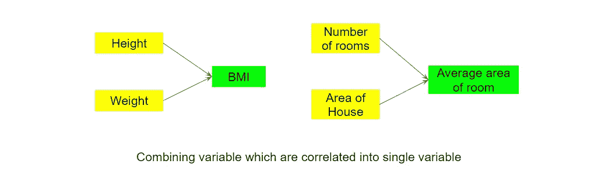
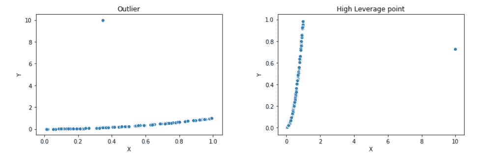

# 线性回归面临的五大障碍

> 原文：<https://towardsdatascience.com/five-obstacles-faced-in-linear-regression-80fb5c599fbc?source=collection_archive---------6----------------------->

## 当您在数据集上训练线性回归模型时，可能会出现这五个障碍。


让我们从**黄色、**危险的颜色到**黄色、**阳光和幸福的颜色。(照片由[凯西·蒂博](https://unsplash.com/@cthiebs?utm_source=unsplash&utm_medium=referral&utm_content=creditCopyText)在 [Unsplash](https://unsplash.com/s/photos/hurdle?utm_source=unsplash&utm_medium=referral&utm_content=creditCopyText) 上拍摄)

线性回归是最简单的机器算法之一。可解释性和易于训练的特点使这种算法成为机器学习的第一步。线性回归不太复杂，是理解更高级和复杂算法的基本概念之一。

要知道什么是线性回归？我们如何训练它？我们如何获得最佳拟合线？我们如何解读它？以及我们如何评估拟合的准确性，您可以访问以下文章。

[](/magic-of-calculus-linear-regression-ad84686371c3) [## 微积分的魔力:线性回归

### 人类行为异常地拥有优秀的知识和技术储备。我们试图理解并产生…

towardsdatascience.com...](/magic-of-calculus-linear-regression-ad84686371c3) 

在了解了线性回归的基本直觉之后，某些概念让它变得更加迷人，更加有趣。这些还提供了对算法缺陷、其影响和补救措施的深入理解。并且，我们将在文章中探讨这些概念。

我们都知道，线性回归涉及一些假设。这些假设使得该算法的结构非常简单。然而，这就是为什么它有许多缺陷，为什么我们需要研究和理解这些缺陷的原因。

## 本文讨论了训练线性模型时可能出现的问题，以及处理这些问题的一些方法。

本文范围内的五个问题是:

1.  *反应-预测值关系的非线性*
2.  *误差项的相关性*
3.  *误差项的非常数方差【异方差】*
4.  *共线性*
5.  *异常值和高杠杆点*

# 响应-预测值关系的非线性

## 来源:

这个问题的原因是线性回归中涉及的一个假设。线性的**假设，**表明预测值和响应之间的关系是线性的。

如果反应和预测值之间的实际关系不是线性的，那么我们得出的所有结论都是无效的。此外，模型的准确性可能会显著下降。

那么，我们该如何处理这个问题呢？

## 补救措施:

解决上述问题的方法是绘制**残差图。**

**残差图**是残差(实际值和预测值之间的差值)和预测值之间的图。

一旦我们绘制了剩余图，我们将寻找一个模式。如果一些模式是可见的，那么在反应和预测之间存在非线性关系。而且，如果图显示随机性，那么我们就在正确的道路上！

在分析了模式的类型之后，我们可以使用非线性变换，比如平方根、立方根或对数函数。这在一定程度上消除了非线性，并且我们的线性模型表现良好。

## 示例:

让我们试着用一条直线来拟合一个二次函数。我们将使用 NumPy 生成一些随机点，并将它们的平方作为响应。

```
import numpy as np
x = np.random.rand(100)
y = x*x
sns.scatterplot(x,y)
```

让我们看看 x 和 y 之间的散点图(图 1)。



图一

现在，让我们尝试用一个线性模型来拟合这个数据，看看残差和预测值之间的关系。

```
from sklearn.linear_model import LinearRegression
model = LinearRegression()
model.fit(x.reshape(-1,1),y.reshape(-1,1))
predictions = model.predict(x.reshape(-1,1))
residual = y.reshape(-1,1) - predictions
```



图 2

我们可以在残差图中看到二次趋势。这种趋势有助于我们识别数据中的非线性。此外，我们可以应用平方根变换来使数据更适合线性模型。

如果数据是线性的，那么你会得到随机的点。残差的性质将被随机化。在这种情况下，我们可以继续这个模型。

# *误差项的相关性*

## 来源:

线性模型的一个主要假设是误差项不相关。“**不相关**项表示一个观测值的误差符号与其他观测值无关。

误差项之间的相关性可能由于几个因素而出现。例如，如果我们观察人的体重和身高。错误的相关性可能是由于他们所吃的食物、他们所做的运动、环境因素或者他们是同一家庭的成员而发生的。

当误差相关时，模型会发生什么变化？如果误差项相关，则模型系数中的标准误差会被低估。因此，置信区间和预测区间将比它们应有的范围更窄。

要了解更多信息，请参考下面的例子。

## 补救措施:

解决方法与上述问题相同，**残差图**。如果在残差图中可以看到一些趋势，这些趋势可以表示为一些**函数**。因此，它们是相关的！

## 示例:

为了理解相关性对置信区间的影响，我们应该注意两点。

1.  当我们估计模型参数时，会涉及到一些误差(标准误差:SE)。这种误差是由于对样本总体特征的估计而产生的。**该误差与观察次数的平方根成反比**。
2.  置信度为 95%的模型参数的置信区间相差两个标准误差。(请参考图 3)



图 3 模型参数的置信区间。

现在，假设我们有 **n** 个数据点。我们计算标准误差(SE)和置信区间。现在，我们的数据翻倍了。因此，我们将有成对的观测值和误差项。

如果我们现在重新计算 SE，那么我们将计算它对应于 **2n** 的观测值。这样一来，标准误差就会低一个因子根 **√2** (SE 与观测次数成反比)。并且，我们将获得更窄的置信区间。

# *误差项的非常数方差【H*eteroscedasticity*】*

## 来源:

这个问题的来源也是一个假设。假设误差项具有恒定方差，也称为**同质性。**

一般来说，情况并非如此。我们通常可以从**残差图**中漏斗形状的存在来识别误差中的非恒定方差，或异方差。在图 2 中，漏斗表示误差项具有非恒定方差。

## 补救措施:

一种可能的解决方案是使用对数和平方根等凹函数来转换响应。这种转换导致响应变量的收缩，从而减少异方差。

## 示例:

让我们尝试将对数变换应用于问题 1 中生成的点。



图 4 凹面转换

我们可以观察到一个转化后的线性趋势。因此，我们可以通过应用凹函数来消除非线性。

# 共线性

**共线性**指两个或多个预测变量相互关联的情况。例如，我们可以发现身高和体重、房子面积和房间数量、经历和收入之间的一些关系，以及许多其他关系。

## 来源:

在线性回归中，我们假设所有的预测因子都是独立的。但通常情况恰恰相反。预测值是相互关联的。因此，有必要研究这个问题并找到可行的解决方案。

当独立性假设被忽略时，会出现以下问题:

1.  我们无法推断预测因素对反应的个别影响。因为它们是相互关联的，一个变量的变化会影响另一个变量的变化。因此，模型参数的精度显著下降。
2.  当模型参数的精度下降时，我们所有的结论都变得无效。我们不能说出响应和预测值之间的实际关系，因此，模型精度也会降低。

## 补救措施:

这个问题有两种可能的解决方法。

1.  **删除变量**:我们可以从回归中删除有问题的变量。直觉是，共线性意味着该变量提供的信息在其他变量存在的情况下是多余的。因此，我们可以不做太多的妥协就放弃这个变量。
2.  **组合变量**:我们可以将两个变量组合成一个新变量。这些技术是特征工程。例如，将体重和身高合并得到身体质量指数(身体质量指数)。



图 5 组合相关变量

# *离群值和高杠杆点*

异常值和杠杆点的存在极大地影响了线性回归。它们的发生可能有多种原因。它们的存在极大地影响了模型的性能。这也是线性回归的局限性之一。

**异常值**:对于某个给定的预测因子 x，异常值是对响应 y 的异常观察

**高杠杆点**:与异常值相反，高杠杆点被定义为对预测值 x 的异常观察。



图 6 散点图中的异常值和高杠杆点

有几种技术可用于识别异常值。这包括四分位距、散点图、残差图、四分位-四分位图、箱线图等。

由于这是线性回归的一个局限性，因此采取必要的措施至关重要。一种方法是剔除异常值。但是，这可能会导致一些信息丢失。我们还可以使用特征工程来处理异常值。

# 摘要

在本文中，我们看到了使用线性回归时的五个问题。我们已经看到了每个问题的来源、影响和解决方案。

虽然线性回归是最基本的机器学习算法，但它在学习新事物方面有着广阔的空间。对我来说，这些问题为线性回归提供了不同的观点。

希望了解这些问题，能在你解决任何问题的时候，给你提供新颖的见解。

你也可以检查线性回归的完整播放列表。

# 快乐学习！