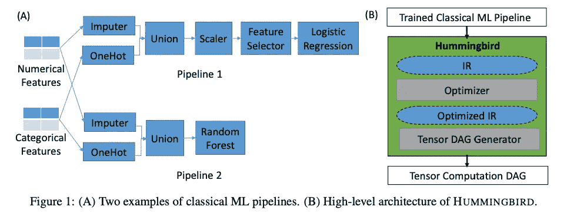
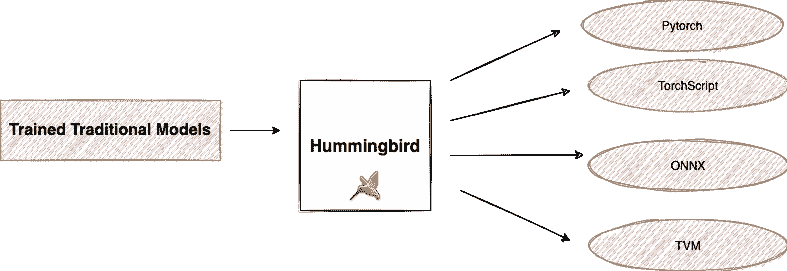
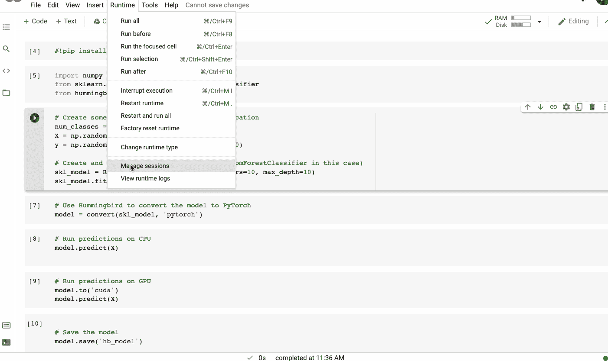
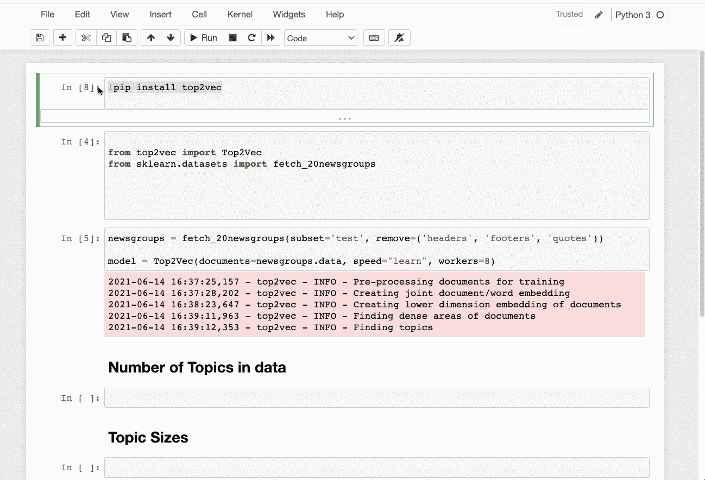
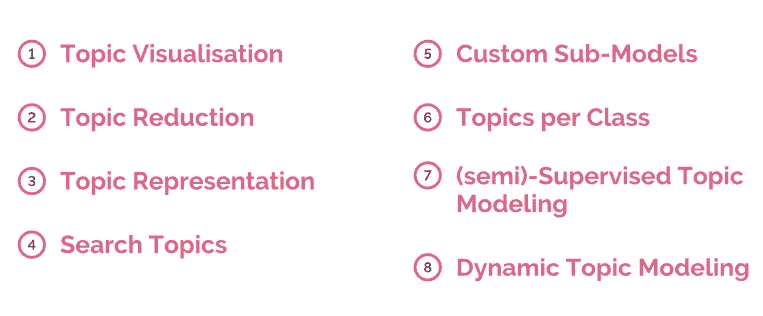
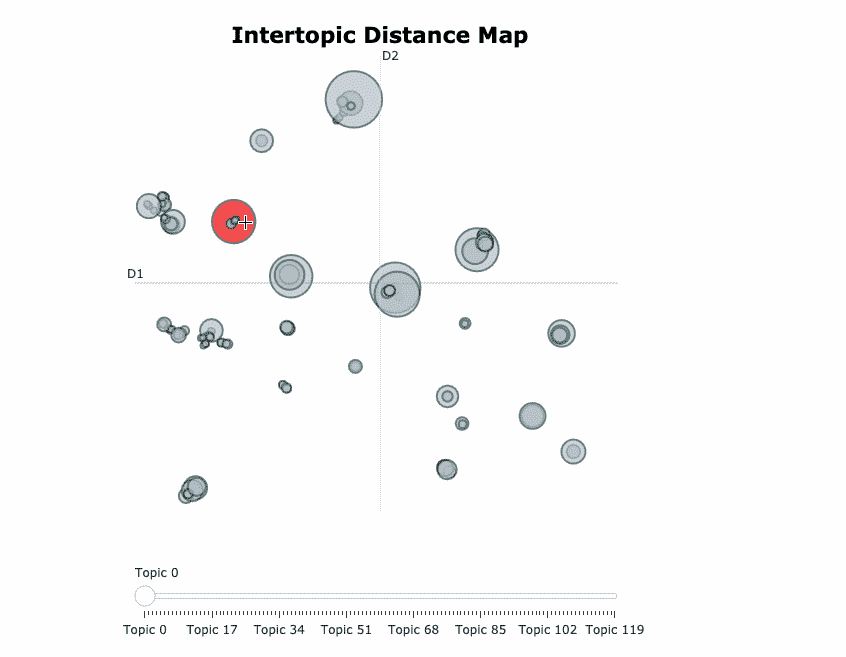
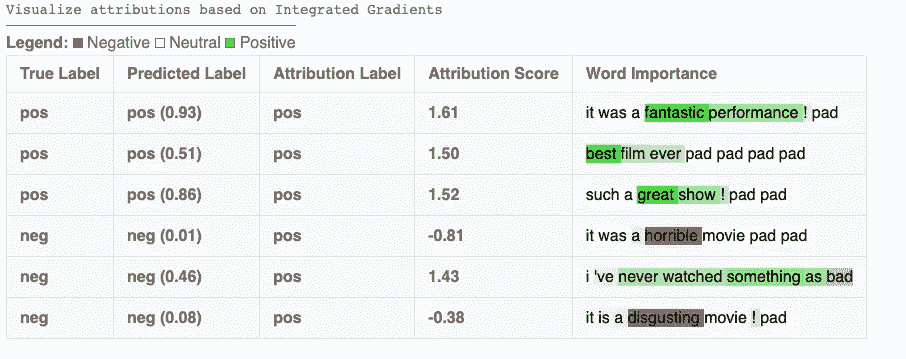
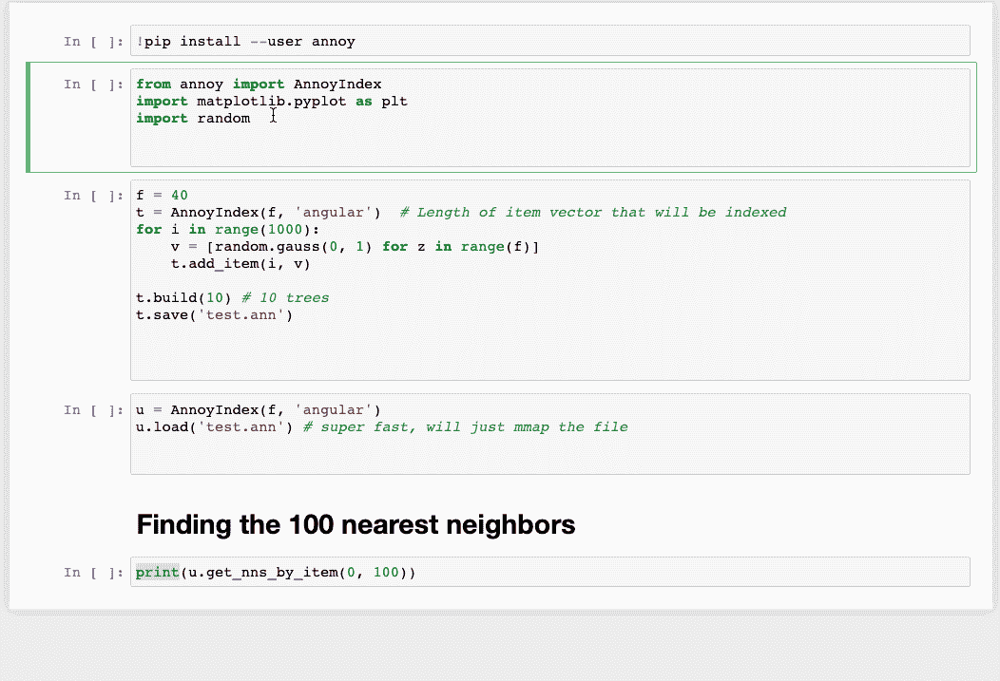

# 五个值得一试的开源机器学习库

> 原文：<https://towardsdatascience.com/five-open-source-machine-learning-libraries-worth-checking-out-c47f95d2d014?source=collection_archive---------37----------------------->

## 五个库的旋风之旅，这可能是对您的数据科学堆栈的一个很好的补充

[丹尼尔](https://unsplash.com/@setbydaniel?utm_source=medium&utm_medium=referral)在 [Unsplash](https://unsplash.com?utm_source=medium&utm_medium=referral) 上的照片

开源是机器学习的支柱。它们携手并进。没有开源兄弟会的贡献，这个领域的快速发展是不可能的。机器学习社区中许多广泛使用的工具都是开源的。每年都有越来越多的图书馆加入这个生态系统。在本文中，我快速浏览了我最近遇到的一些库，它们可能是对您的机器学习堆栈的一个很好的补充。

# 1️⃣.蜂鸟

Humminbird 是一个用于将训练好的传统机器学习模型编译成张量计算的库。这意味着你可以利用 GPU 和 TPU 等硬件加速，即使是传统的机器学习模型。这在几个层面上都是有益的。

*   用户可以受益于在神经网络框架中实现的当前和未来的优化；
*   用户可以从本机硬件加速中受益；
*   用户可以从拥有支持传统和神经网络模型的独特平台中受益；
*   用户不必重新设计他们的模型。

蜂鸟库高层架构|来源:[官方论文](http://Compiling Classical ML Pipelines into Tensor Computations for One-size-fits-all Prediction Serving)

此外，Hummingbird 还在 Sklearn API 之后提供了一个方便的统一“推理”API。这允许用 Hummingbird 生成的模型交换 Sklearn 模型，而不必更改推理代码。

*Hummingbird* 根据作者转换您训练过的传统 ML |图像

## 🛠 Github

*   [https://github.com/microsoft/hummingbird](https://github.com/microsoft/hummingbird)

## 🔬论文:

*   [为](https://arxiv.org/abs/2010.04804)服务的统一机器学习预测的张量编译器。
*   [将经典的 ML 管线编译成张量计算，以实现“一刀切”的预测服务](http://learningsys.org/neurips19/assets/papers/27_CameraReadySubmission_Hummingbird%20(5).pdf)。

## 📋博客

[使用 Hummingbird 将传统机器学习管道标准化为张量计算](/standardizing-traditional-machine-learning-pipelines-to-tensor-computation-using-hummingbird-7a0b3168670)

## 💻演示

蜂鸟的语法非常直观和简洁。要在 DNN 框架上运行您的传统 ML 模型，您只需要`import hummingbird.ml`并将`convert(model, 'dnn_framework')`添加到您的代码中。下面是一个使用 [scikit-learn 随机森林](https://scikit-learn.org/stable/modules/ensemble.html#forest)模型和 [PyTorch](https://pytorch.org/) 作为目标框架的例子。

使用一个 [scikit-learn 随机森林](https://scikit-learn.org/stable/modules/ensemble.html#forest)模型和 [PyTorch](https://pytorch.org/) 作为目标框架使用 Hummingbird |图片由作者提供

# 2️⃣.Top2Vec

文本文档包含大量信息。手动筛选很难。主题建模是工业中广泛使用的一种技术，用于在大量文档中自动发现主题。一些传统的和最常用的方法是[潜在狄利克雷分配](https://en.wikipedia.org/wiki/Latent_Dirichlet_allocation) (LDA)和[概率潜在语义分析(PLSA)。](https://en.wikipedia.org/wiki/Probabilistic_latent_semantic_analysis)然而，这些方法都有缺点，比如没有考虑单词的语义或顺序。Top2vec 是一种利用联合文档和单词语义嵌入来寻找主题向量的算法。以下是作者要说的话:

> 这种模型不需要停用词表、词干或词汇化，它可以自动找到主题的数量。得到的主题向量与文档和单词向量一起嵌入，它们之间的距离表示语义相似度。我们的实验表明，top2vec 找到的主题比概率生成模型更具信息量和代表性。甚至，预先训练的通用语句编码器和 BERT 语句转换器也可以用于编码。

一旦训练了 Top2Vec 模型，我们可以执行以下操作:

Top2Vec |作者图片的功能

## 🛠 Github

[https://github.com/ddangelov/Top2Vec](https://github.com/ddangelov/Top2Vec)

## 🔬纸

[Top2Vec:主题的分布式表示](https://arxiv.org/abs/2008.09470)

## 📜文档:

[https://top2vec.readthedocs.io/en/latest/index.html](https://top2vec.readthedocs.io/en/latest/index.html)

## 💻演示

这里有一个在[20 个新闻组数据集](https://scikit-learn.org/0.19/datasets/twenty_newsgroups.html)上训练 Top2Vec 模型的演示。这个例子取自他们的官方 Github 回购。

在[20 个新闻组数据集](https://scikit-learn.org/0.19/datasets/twenty_newsgroups.html) |作者图片上训练 Top2Vec 模型的演示

# 3️⃣.贝尔托皮奇

[**BERTopic**](https://github.com/MaartenGr/BERTopic)**是另一种主题建模技术，它利用 BERT 嵌入和基于类的 TF-IDF 来创建密集的集群，允许轻松解释主题，同时保留主题描述中的重要单词。它还支持类似于 [LDAvis](https://cran.r-project.org/web/packages/LDAvis/index.html) 的可视化。这里是对 BERTopic 功能的一个快速总结。**

****

**BERTopic |作者图片的功能**

## **🛠 Github**

**[https://github.com/MaartenGr/BERTopic](https://github.com/MaartenGr/BERTopic)**

## **🔬证明文件**

**[https://maartengr.github.io/BERTopic/](https://maartengr.github.io/BERTopic/)**

## **📋博客**

*   **[使用 BERT 进行主题建模](/topic-modeling-with-bert-779f7db187e6?source=friends_link&sk=0b5a470c006d1842ad4c8a3057063a99)**
*   **[与 BERTopic 的互动主题建模](/interactive-topic-modeling-with-bertopic-1ea55e7d73d8?sk=03c2168e9e74b6bda2a1f3ed953427e4)**

## **💻演示**

**在[20 个新闻组数据集](https://scikit-learn.org/0.19/datasets/twenty_newsgroups.html)上训练`BERTopic`模型后生成的主题的[可视化](https://maartengr.github.io/BERTopic/tutorial/visualization/visualization.html)**

****

**用 BERTopic |作者图片可视化主题**

# **4️⃣.Captum**

**Captum 是为 [PyTorch](https://pytorch.org/) 设计的模型可解释性和理解库。Captum 在拉丁语中的意思是*理解*，它包含了 PyTorch 模型的集成渐变、显著图、smoothgrad、vargrad 和其他的通用实现。此外，它可以快速集成用特定领域库构建的模型，如 torchvision、torch text 等。Captum 还提供了一个名为 Insights 的网络界面，便于可视化和访问我们的许多可解释性算法。**

****

**解释文本模型:使用 Captum 的 IMDB 情感分析| [图片来自文档](https://captum.ai/tutorials/IMDB_TorchText_Interpret)**

> **Captum 目前处于测试阶段，正在积极开发中！**

## **🛠 Github**

**[https://github.com/pytorch/captum](https://github.com/pytorch/captum)**

## **🔬证明文件**

**[https://captum.ai/](https://captum.ai/)**

## **🎤幻灯片**

*   **他们来自 NeurIPS 2019 的幻灯片可以在[这里](https://github.com/pytorch/captum/blob/master/docs/presentations/Captum_NeurIPS_2019_final.key)找到**
*   **他们来自 KDD 2020 指南的幻灯片可以在这里找到。**

## **💻演示**

**以下是我们如何通过 Captum Insights 在 CIFAR10 上分析样本模型:**

****

**通过 Captum Insights 分析 CIFAR10 上的样本模型|作者图片**

# **5️⃣.烦恼**

**骚扰代表[近似最近邻居](http://en.wikipedia.org/wiki/Nearest_neighbor_search#Approximate_nearest_neighbor)。它是用 C++构建的，但是附带了 Python、Java、Scala、R 和 Ruby 的绑定。Annoy 用于在高维空间中进行(近似)最近邻查询。尽管许多其他库也执行同样的操作，但 airy 附带了一些很棒的插件。它创建基于文件的大型只读数据结构，这些数据结构被映射到内存中，这样许多进程可以共享相同的数据。由埃里克·伯恩哈德森开发的 Annoy 被用于 Spotify 的音乐推荐，并被用于搜索相似的用户/商品。**

> **我们在高维空间中有数百万首歌曲，所以内存使用是首要考虑的问题**

## **🛠 Github**

**https://github.com/spotify/annoy**

## **🎤幻灯片**

*   **[来自纽约机器学习会议的演讲](http://www.slideshare.net/erikbern/approximate-nearest-neighbor-methods-and-vector-models-nyc-ml-meetup)关于骚扰**

## **💻演示**

**下面是我们如何使用 Annoy 来查找 100 个最近的邻居。**

****

**使用作者的图片寻找 100 个最近的邻居**

# **包裹**

**这些是我觉得有趣、有用、值得分享的库。我相信您会想探索它们，看看如何在您的工作领域中使用它们。尽管我们已经有数不清的库需要修补，探索新的库总是有趣和有见识的。**

***👉有兴趣看我写的其他文章。这个* [*回购*](https://github.com/parulnith/Data-Science-Articles/blob/main/README.md) *包含了我分类写的所有文章。***