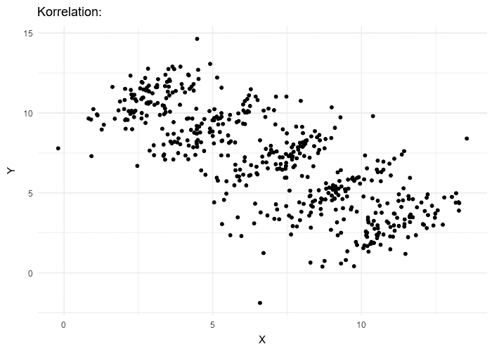
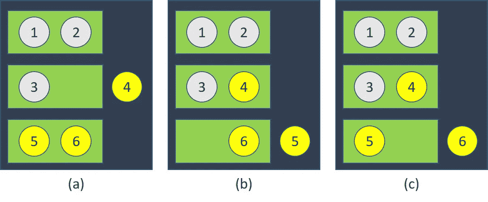
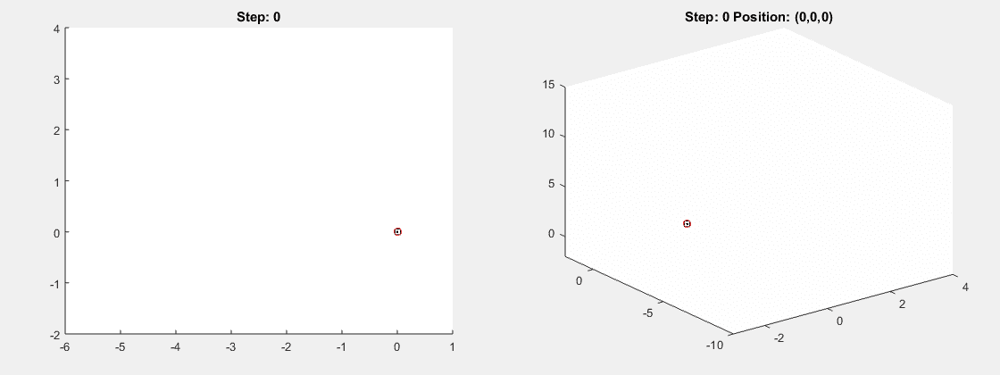

# 可能会让你困惑的五个悖论

> 原文：<https://towardsdatascience.com/five-paradoxes-with-probabilities-that-will-puzzle-you-2f71201d6ee8?source=collection_archive---------3----------------------->

## 还是能智胜他们？

来自 [Pexels](https://www.pexels.com/de-de/foto/erstaunlicher-formeller-mann-der-laptop-bildschirm-betrachtet-3760809/?utm_content=attributionCopyText&utm_medium=referral&utm_source=pexels) 的 Andrea Piacquadio 的照片

在我们的日常生活中，我们不断处理不确定的情况。因此，至少在潜意识里，我们一直面临着概率。此外，似乎我们对概率有很好的直觉。或者我们真的有吗？

我们知道，将一枚硬币抛 100 次，结果大约是 50 个正面和 50 个反面。此外，我们很清楚，在国外度假时偶遇朋友的概率非常低，尽管不是零。**然而，有些情况下，从概率论中得出的正确预测完全违背直觉。**

让我们深入探讨概率论和统计学中的五个悖论，它们产生的结果看似荒谬，但却是真实的。

# 1.生日悖论

图片来自 [Unsplash](https://unsplash.com/photos/fIHozNWfcvs)

你在一个朋友的聚会上，有 30 个人出席。两个人同一天过生日的概率有多大？你的直觉是什么？我的第一个猜测是有一些机会，但应该有点低。

现在，[生日悖论](https://en.wikipedia.org/wiki/Birthday_problem)是关于以下问题的:

> 多少人需要参加聚会，这样我们至少有 50%的机会两个人一起过生日。

这个悖论假设一年中的每一天都同样可能是一个随机的人的生日。

**令人惊讶的答案是 23！只需要有 23 个人在场，就有至少 50 %的机会让两个人分享他们的生日。对于你朋友的 30 人生日聚会，其中两人生日相同的概率实际上超过 70 %！**

# 2.辛普森悖论

假设我们是生意伙伴。我们在全市拥有五家不同的咖啡店。作为一种营销策略，我们向最忠诚的顾客发放代金券，希望他们会回报我们，买更多的咖啡。

然而，我们在代金券应该值多少钱的问题上意见不一。为了找出什么是最好的选择，我们发放不同价值的代金券。我们收集了在接下来的一个月里我们从每一位忠实顾客那里获得了多少利润的数据。

一个月后，一切似乎都清楚了:对于我们的五家咖啡店中的每一家，我们都可以看到这样的趋势:优惠券价值越高，我们从相应的客户那里获得的利润就越多。

**然而，当综合所有五家商店的数据时，趋势似乎完全相反:**优惠券价值越高，我们从客户那里获得的利润就越少。怎么会这样呢？

辛普森悖论的直观解释。图片来自[维基百科](https://en.wikipedia.org/wiki/Simpson%27s_paradox)。

这正是[辛普森悖论](https://en.wikipedia.org/wiki/Simpson%27s_paradox):

> 当数据被组合时，出现在不同数据组中的趋势可能消失。

# 3.伯特兰盒子悖论

如果你熟悉 Montey Hall 问题，[这个悖论](https://en.wikipedia.org/wiki/Bertrand%27s_box_paradox)还是挺像的。在我们面前有三个盒子:

来自 [Good Ware](https://www.flaticon.com/authors/good-ware) 的图标

一个盒子里有两枚银币，一个盒子里有两枚金币，一个盒子里有一枚金币和一枚银币。我们不知道哪些硬币在哪个盒子里。现在，我们随机挑选一个盒子，然后从盒子里盲目地抽出一枚硬币。**是金币！**

现在，问题是:

> 我们盒子里的第二枚硬币也是金币的概率有多大？

我第一次遇到问题时天真的**(而且错了)**回答是。我想，因为我们抽到了一枚金币，所以我们的盒子要么是装有两枚金币的盒子，要么是装有混合金币的盒子。在第一种情况下，我们会抽取另一枚金币，而在第二种情况下，我们不会。因此，我推测概率应该是。

> 真正的可能性是⅔.

原因是，我们抽取的第一枚金币可能是混合盒子中的唯一一枚金币，也可能是纯金色盒子中的第一枚金币，或者是纯金色盒子中的第二枚金币。而在这三种可能性中的两种，我们会抽取另一枚金币。

伯特兰盒子悖论的直观解释。图片来自[维基百科](https://en.wikipedia.org/wiki/Bertrand%27s_box_paradox)。

# 4.领带悖论

圣诞节假期后，你回到办公室，戴着你作为礼物得到的新领带。你的同事鲍勃也在圣诞节得到了一条领带。你们都不知道领带的价格。你们开始争论谁得到了更贵的礼物。

> 鲍勃和你同意打赌:你要去看看领带的价格。得到较贵领带的人必须把领带给较便宜的人。

两条领带——哪一条更贵？来自 [Freepik](https://www.freepik.com/) 的图标

**鲍勃认为赌注对他有利:**他赢/输的几率是 50/50。如果他输了，他就失去了领带的价值。然而，如果他赢了，他赢的比他领带的价值还多。

**但从你的角度来看，你可以做完全相同的推理，得出赌约对你有利的结论。**

> 但是，这个赌注不可能对你和鲍勃都有利。那么错在哪里呢？

为了解决领带悖论，我们必须将领带的价格纳入计算:假设一条领带价值 100 €，另一条价值 50 €。如果鲍勃赢了，他就赢了一条价值 100 €的领带。如果他输了，这意味着他拥有更昂贵的领带，只是失去了 100 €。所以可能的得失抵消了，赌注实际上对谁都没有好处。

# 5.随机漫步

这最后一个事实通常不被列为悖论，但我认为它是如此迷人和令人困惑，以至于它必须被列入这个列表。

想象一只蚂蚁在一张无限长的纸上。每过一秒钟，蚂蚁就会随机走进四个可能方向中的一个(向前、向后、向左或向右)。每个方向的可能性都是一样的。**这种情况就是所谓的对称 2D 随机漫步。2D，因为纸是二维的。**

我们也可以想象蚂蚁不在一张纸上，而是在一串织物上。在这种情况下，蚂蚁只能向前或向后移动，我们将面临一个 **1D 随机漫步**。

类似地，我们可以想象一个 **3D 随机行走**，其中我们的“行走者”是一只无人机或一只鸟，它随机地向六个方向移动(向前/向后、向左/向右、向上/向下)。

2D 随机漫步(左)和三维随机漫步(右)的可视化。Vipul Lugade 的图片[【1】](https://matlabgeeks.com/tips-tutorials/two-dimensional-random-walk-in-matlab/)[【2】](https://matlabgeeks.com/tips-tutorials/random-walk-in-matlab-for-any-number-of-dimensions/)。

现在的问题是:

> 一个步行者回到起始位置的概率是多少？

令人惊讶的答案是，对于布料上的蚂蚁(1D)和纸张上的蚂蚁(2D)来说，概率是 1。但是对于这只鸟来说，它有可能永远离开而不再回来。这也适用于第 4、5、6 维度……

令我难以置信的是，步行者总是在第 1 和第 2 维返回，但这种模式从第 3 维开始就被打破了。我可以看数学，但不得不承认，在直觉层面上，我仍然没有完全理解它。数学家左师·卡库塔尼对此笑着评论道:

> 喝醉的人会找到回家的路，但喝醉的鸟可能会永远迷路。
> ——左师·角谷

觉得这个故事有趣？你可以在这里成为媒介会员来支持我的写作:[medium.com/@mmsbrggr/membership](https://medium.com/@mmsbrggr/membership)。你将获得所有媒体的访问权，你的部分会员费将直接支持我的写作。

欢迎在 LinkedIn 上向我提出私人问题和评论。如果你喜欢这篇文章，让我告诉你我的时事通讯:[marcelmoos.com/newsletter](https://marcelmoos.com/newsletter)。