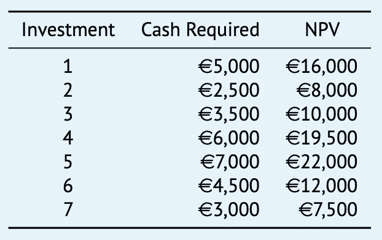
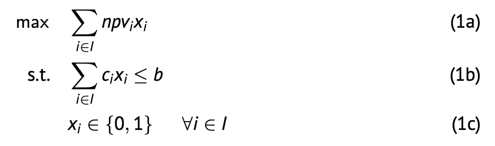

# 五个问题将帮助你更好地为整数线性规划建模

> 原文：<https://towardsdatascience.com/five-questions-that-will-help-you-model-integer-linear-programs-better-3256731a258c?source=collection_archive---------31----------------------->

## 一种将现实世界问题公式化为数学模型的结构化方法，如背包问题

[Zan](https://unsplash.com/@zanilic?utm_source=unsplash&utm_medium=referral&utm_content=creditCopyText) 在 [Unsplash](https://unsplash.com/s/photos/five?utm_source=unsplash&utm_medium=referral&utm_content=creditCopyText) 上的照片

你可能听说过经典的数学问题，比如**旅行推销员问题**或者 **0/1 背包问题**。解决这类优化问题有几种选择，但最基本的一种是试图找到**精确解**。为此，大多数数学家应用**整数线性规划**，简称 ILP。当我在一门大学课程中被介绍到这一点时，我感到非常困惑。通常教授会给我们一个详细的问题陈述，这个问题陈述可以归结为少于十行的 ILP。诀窍是将这种现实生活中的问题转换成数学模型。和我的同学一起，我发现这样做很有挑战性。幸运的是，在这个过程中，我们开发了一个包含五个问题的列表，这使得我们能够以结构化的方式分析问题。更重要的是:它使得写下实际的模型变得更加容易。在本文中，我将详细解释这种方法，以便帮助您建模下一个 ILP。这将通过将它直接应用到现实生活中的一个问题来实现:0/1 背包问题。首先，这里有五个问题:

1.  有哪些**套**？
2.  **参数**有哪些？
3.  什么是**决策变量**？
4.  优化的**目标**是什么？
5.  我应该记住哪些**约束**？

## 问题陈述

一位投资者正在考虑七项投资。在下图中，你可以找到每项投资所需的现金和净现值。

投资机会，来源: [R. Roberti](https://www.linkedin.com/in/roberto-roberti-0a5079b2/) 来自 VU 阿姆斯特丹。

投资者有 15，000€可用，并希望以这样一种方式投资，即总净现值最大化，而不超过可用现金。投资可以接受，也可以不接受，但不能部分接受。给你的问题是:*应该买哪些投资？*

## 设置

本质上，集合是元素的**集合。元素可以是任何东西:城市，病人，卡车，你能想到的。通常，当阅读问题陈述时，集合是什么就变得很清楚了。在本例中，表格显示了一组**投资**，因此这将是我们的集合。我们将用字母 *I* 来指代这一组。**

## 因素

一个参数也可以被称为一个**变量**，并且包含一个特定的值，通常连接到其中一个集合。这可以是任何东西。在我们的例子中，它是每项投资所需的现金和净现值，分别记为 *cᵢ* 和*npvᵢ**。*注意下标 *i* 表示 *c* 和 *npv* 的投资。最后，有一个参数与其中一组无关，但却非常重要:投资预算 *b* 。

## 决策变量

顾名思义，决策变量是一个可以被**决策者**改变**的变量。在 ILPs 中，这样做是为了最大化(或最小化)目标函数。因此，根据问题陈述，你应该寻找应该由你做出的选择。在我们的例子中，问题的最后一句话指出:*应该购买哪些投资？*数学上，我们用二元变量 *xᵢ* 来表示投资 *i* 是买(1)还是不买(0)。**

## 目标

数学模型的目标通常用**目标函数**量化。最大化这个函数是常见的，但是最小化归结为相同的想法。我们示例的目标是最大化投资者投资组合的 NPV。对于每一笔投资，都要确定是买还是不买，如果是，就要把相应的 NPV 加到我们的总收益里。这在下图的 1a 行中完成:它对所有投资求和，并将决策变量 *xᵢ* 与参数 *npvᵢ* 相乘。毕竟，如果 *xᵢ* 等于 0，什么都不会增加，但是当 *xᵢ* 等于1 时就会增加。注意 *max* 写在目标函数之前，明确目标是最大化。

## 限制

如果没有限制，只有线(1a)的 ILP 将决定进行所有投资。然而事实并非如此:有一个现金预算 *b* 不能超过。所以，所有投资所需的现金不能大于这个 *b* 。类似于第(1a)行，通过对所有投资求和并乘以决策变量 *xᵢ* 和参数 *cᵢ.来计算所需的总现金*

## 在数学符号中…

ILP 的数学符号，来源: [R. Roberti](https://www.linkedin.com/in/roberto-roberti-0a5079b2/) 来自 VU 阿姆斯特丹。

最后一行(1c)称为**完整性约束**，告诉我们决策变量可以得到什么样的值。在这种情况下，它是一个二元变量，因为我们正在解决 **0/1** 背包问题。

## 但是投资者呢？

将问题陈述转换成实际的 ILP 后，您可能想知道背包问题的解决方案是什么。理想情况下，你会选择投资 1、2 和 5，它们需要€14，500 英镑(剩下€500 英镑)，€的总净现值为 46，000 英镑。

## 下次……

所以，我想让你带回家的是我们遵循的**结构化方法**。每次阅读问题陈述时，试着问自己这五个问题。如果你已经这样做了几次，对更复杂的 ILP 建模和分析就会变得容易得多。所以下次当你遇到旅行推销员问题、背包问题或布景问题时，你知道该怎么做！