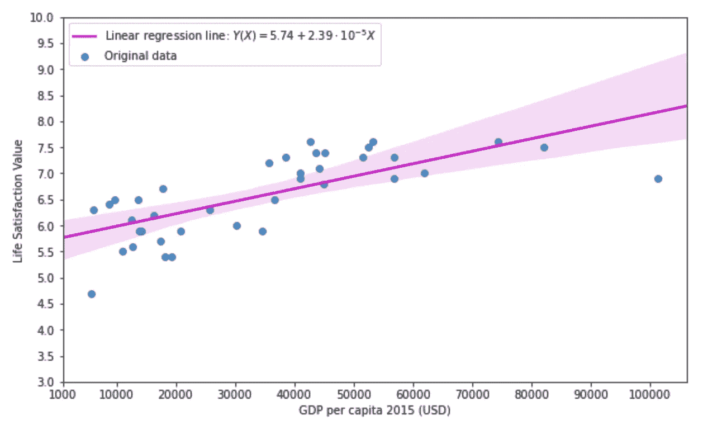
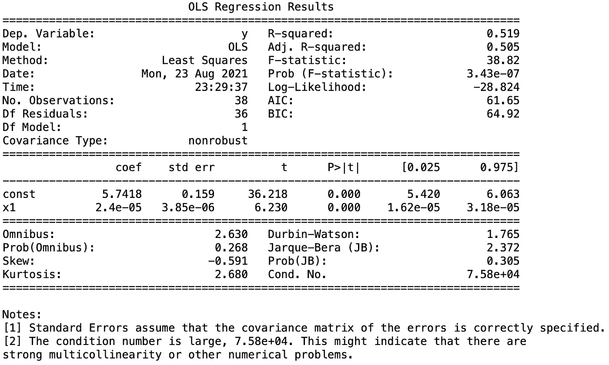

# 每个数据科学家都必须知道的五个回归 Python 模块

> 原文：<https://towardsdatascience.com/five-regression-python-modules-that-every-data-scientist-must-know-a4e03a886853?source=collection_archive---------1----------------------->

## [入门](https://towardsdatascience.com/tagged/getting-started)



图一。使用 **seaborn** python 库(图由作者出于教育目的创建)绘制的生活满意度值与人均 GDP 的曲线图，如第 5 节所示。彩色区域代表线性回归线的 95%置信区域。

# 介绍

R 回归是统计建模、数据科学和机器学习中一个非常重要的概念，它有助于通过使用特定的数学最小化标准，在自变量(或预测值) ***x*** 、因变量(或简单输出)*y(****x****)*之间建立一种可能的关系。有几种类型的回归用于不同的情况，其中最常见的是线性回归。其他类型的回归包括逻辑回归、非线性回归等。

在 Python 中，有几个库和相应的模块可用于执行回归，具体取决于遇到的具体问题及其复杂性。在本文中，我将总结 Python 中可以用来执行回归的五个最重要的模块和库，并讨论它们的一些局限性。这里我假设读者了解 Python 和它的一些最重要的库。

# 1.NumPy 的 polyfit

NumPy 代表 *Numerical Python* 可能是涉及数组的数值计算中最重要和最有效的 Python 库。除了一些数值计算的操作，NumPy 还有一个模块可以执行简单的线性回归和多项式回归。为了使事情更清楚，最好给出一个涉及 NumPy 数组的具体示例，这些数组表示如下的真实数据:

```
**import** numpy **as** npx = np.array([ 56755.72171242,  44178.04737774,  40991.80813814,   8814.00098681, 43585.51198178,  13574.17183072,   6175.8760297 ,  17829.69832237, 53254.85637009,  17522.23018625,  42784.69836164,  36638.18492916, 41086.72967373,  18167.77372717,  12706.89121489,  52564.42917946, 61995.42280258,  35776.79516181,  30230.22630213,  34524.46986093, 13774.60527391,  14258.22933451, 101376.49657434,   9616.64500569, 45175.23189338,  38615.99518491,  74355.51585756,  12578.49547344, 19242.3664711 ,  16310.988409  ,  20881.76692993,   5734.63362915, 25732.01836475,  51545.48360953,  82081.59716162,  11006.2497364 , 44974.83187718,  56839.38177423])y = np.array([7.3, 7.1, 6.9, 6.4, 7.4, 6.5, 6.3, 6.7, 7.6, 5.7, 7.6, 6.5, 7.0, 5.4, 5.6, 7.5, 7.0, 7.2, 6.0, 5.9, 5.9, 5.9, 6.9, 6.5, 7.4, 7.3, 7.6, 6.1, 5.4, 6.2, 5.9, 4.7, 6.3, 7.3, 7.5, 5.5, 6.8, 6.9])
```

NumPy 数组 x 表示给定国家的人均 GDP(美元),数组 y 表示给定国家人民的生活满意度值。生活满意度值在[0，10]的范围内，其中值 10 对应于最大满意度，而值 0 表示完全没有满意度。几个国家的生活满意度和人均 GDP 之间的关系的细节可以在[我的 GitHub 页面](https://github.com/DamianEjlli)上找到。

如上所述，NumPy 库提供了一个选项，允许用户通过使用最小二乘法作为最小化标准来执行线性回归(简单和多项式)。做这个回归的模块是 polyfit: [**np.polyfit(x，y，deg，rcond=None，full=False，w=None，cov=False)**](https://numpy.org/doc/stable/reference/generated/numpy.polyfit.html) **。**x 数组的形状是(M，)，而 y 数组的形状是(M，K)，其中 M 和 K 是正自然数。此外， **np.polyfit()** 可以使用“ **deg = n** ”指定多项式回归的次数，还可以计算*协方差矩阵*，该矩阵提供了关于多项式回归系数的重要信息。 **polyfit** ，使用最小二乘法拟合数据，并在内部存储拟合过程中发现的线性回归系数。为了绘制线性回归函数，需要通过函数 **np.poly1d()将已经找到的多项式系数转换成多项式函数。**

例如，现在我使用 **np.polyfit()** 函数对上面的 x 和 y 数组执行简单的线性回归( *n = 1* )并绘制结果。我使用以下 Python 代码:

```
[In]: **import** matplotlib.pyplot **as** plt
[In]: p = np.poly1d(np.polyfit(x, y, 1))
[In]: x_line = np.linspace(np.amin(x), np.amax(x), 200)
[In]: plt.scatter(x, y)
[In]: plt.plot(x_line, p(x_line))
[In]: plt.show()
```

您可以在您的计算机上运行上面的 Python 代码来显示简单线性回归的曲线图，但是，为了清楚起见，这里我没有显示曲线图。此外， **polyfit** 为用户提供了了解线性回归系数的可能性。事实上，如果您在上面的代码中显示变量 p，您将得到下面的线性回归线，公式如下:

```
[In]: print(p)[Out]: 2.4e-05 x + 5.742
```

因此，用 **np.polyfit()** 进行线性回归的结果是一条线性回归线( *y(x) = a + bx* )，截距为 *a* =5.741(精确值)，斜率为 *b* =2.39e-05(精确值)。print(p)命令给出一个近似值显示。

**polyfit** 模块对于拟合简单线性回归和 n 次多项式回归非常有用。但是，它不允许用户使用带有多个预测变量的线性回归，即多元回归。因此， **np.polyfit()** 不能用于混合相互作用项，只能用于自相互作用项。此外，它没有给用户直接*计算的可能性:确定系数 *R* 以评估拟合优度，皮尔逊相关系数 *r，*假设检验的 *p* 值，以及与回归系数相关的样本误差。*

# 2.科学回归

SciPy 是一个 Python 库，代表科学 Python。它是学术界和科学工业中使用的最重要的科学计算库。该库包含几个用于特定目的的模块。在这些模块中，[**scipy . stats()**](https://docs.scipy.org/doc/scipy/reference/stats.html)**模块是关于统计建模最重要的一个模块。[**scipy . stats()**](https://docs.scipy.org/doc/scipy/reference/stats.html)**模块有一个完全专用于线性回归的子模块，它符合语法:[**scipy . stats . linregresse()**](https://docs.scipy.org/doc/scipy/reference/generated/scipy.stats.linregress.html)**并使用最小二乘法作为最小化标准。******

******现在来看看**Lin regressive**的运行情况，我再次使用上面的数组 x 和 y，并使用下面的 Python 代码:******

```
**[In]: **import** scipy **as** sp
[In]: regr_results = sp.stats.linregress(x, y)
[In]: print(regr_results)[Out]: LinregressResult(slope=2.3996299825729513e-05, intercept=5.741754353755326, rvalue=0.720287195322656, pvalue=3.4265564700646986e-07, stderr=3.851624914535862e-06, intercept_stderr=0.15853194959552008)**
```

****从上面的 Python 代码中可以看出，**Lin regressive**模块给出线性回归的结果作为输出，其中截距值为， *a* = 5.741，斜率值为 *b* = 2.39e-05。 *a* 和 *b* 的这些值与前面章节中使用 NumPy 的 **polyfit** 模块得到的值相同。另外，**Lin regressive**计算皮尔逊相关系数 *r* (值为 rvalue = 0.72)、p 值(pvalue = 3.42e-06)、斜率的标准差 *b* (stderr = 3.85e-06)、截距项的标准差*a*(intercept _ stderr = 0.15)。显式计算和 Python 代码可以在[我的 GitHub 页面](https://github.com/DamianEjlli)找到。****

****如上所示，**Lin regressive**模块向 **polyfit** 模块提供线性回归的附加结果。linregress 的唯一缺点是不支持多元回归。它只支持简单的线性回归。此外，它没有为用户提供直接*预测未在最小二乘法中使用的特性的新值的选项，如下面第 5 节中的 scikit-learn 库。*****

# ****3.统计模型的 OLS 和最小二乘法****

****[**stats model**](https://www.statsmodels.org/stable/index.html)**s**库/模块是 **scipy.stats** 模块的扩展，主要用于将模型拟合到给定的数据集。这个模块可能是关于一般回归，特别是线性回归的最完整的模块。该模块非常灵活，它为用户提供了几个选项来执行特定的统计计算。****

****正如我在第 2 节和第 3 节中所做的那样，我使用 **statsmodel** 来执行简单的线性回归，方法是使用上述 x 和 y 数组，并使用最小二乘法作为最小化标准，使用 [**OLS**](https://www.statsmodels.org/stable/examples/notebooks/generated/ols.html) 模块。我使用以下 Python 代码:****

```
**[In]: **import** statsmodels.api **as** sm
[In]: x = sm.add_constant(x) # Adds an intercept term to the simple linear regression formula
[In]: lin_model = sm.OLS(y, x)
[In]: regr_results = lin_model.fit()
[In]: print(regr_results.results)[Out]: [5.74175435e+00 2.39962998e-05]** 
```

****用上面的代码打印结果后，我得到了 x 和 y 数组上简单线性回归的截距 *a* = 5.741 和斜率 *b* = 2.39e-05 的值。 **OLS** 模块隐式使用最小平方最小化方法来计算回归系数。人们可以注意到， *a* 和 *b* 的值与之前用其他方法在第 1 节和第 2 节中发现的值一致。****

****使用 python 命令**print(regr _ results . summary())**可以获得回归结果的更详细描述，其中结果表如图 2 所示。如您所见，汇总表给出了线性回归结果的详细信息，包括:决定系数 *R* ，截距值 *a* 及其标准差，斜率值 *b* 及其标准差， *t* 得分值，p 值，置信区间等。****

********

****图二。使用 **statsmodel** 库的 **OLS** 模块进行简单线性回归的结果表。****

******OLS** 模块和它的等价模块[**ols**](https://www.statsmodels.org/stable/generated/statsmodels.formula.api.ols.html)**(在本文中我没有明确讨论 **ols** 模块)比**Lin regressive**模块有优势，因为它们可以执行多元线性回归。另一方面，模块 **ols，**的缺点是它没有选项*直接*预测新值 *y* 对于预测器**x _ I的新值(至少我不知道)。此外， **OLS** 模块的另一个缺点是，必须使用命令 **sm.add_constant()** 为线性回归显式添加一个常数项。 [**线性 _ 模型。另一方面，OLS**](https://www.statsmodels.org/stable/generated/statsmodels.regression.linear_model.OLS.html) 模块为用户提供了在给定设计矩阵的情况下预测新值的可能性，类似于 scikit-learn 的**线性回归**模块。********

# **4.scikit-learn 的线性回归**

**scikit-learn 是统计/机器学习的最佳 Python 库之一，它适用于拟合和进行预测。它为用户提供了不同的数值计算和统计建模选项。其最重要的线性回归子模块是 [**线性回归**](https://scikit-learn.org/stable/modules/generated/sklearn.linear_model.LinearRegression.html) **。**它使用最小二乘法作为最小化标准来寻找线性回归的参数。**

**正如我在前面几节中所做的那样，我使用数组 x 和 y 进行简单的线性回归。我使用以下 Python 代码:**

```
[In]**: from** sklearn **import** linear_model
[In]: linmodel = linear_model.LinearRegression(fit_intercept=True) 
[In]: linmodel.fit(x.reshape(-1, 1), y)
[Out]: LinearRegression()
```

**上面的 Python 代码使用线性回归来拟合 x 和 y 数组中包含的数据。如果现在需要从 fit 中获取一些参数，就需要编写额外的代码。例如，我想看看拟合过程的截距 *a* 和斜率 *b* 的值。为此，我运行以下 Python 代码:**

```
[In]: (slope, intercept) = (linmodel.coef_[0], linmodel.intercept_)
[In]: print(slope, intercept)
[Out]: 2.3996299825729496e-05 5.741754353755327
```

**如您所见，**线性回归**模块给出了与之前使用其他方法得到的截距 *a* 和斜率 *b* 相同的值。此外，还可以使用 Python 命令*:***print(linmodel . score(x . shape(-1，1)，y))** 计算确定系数 *R* ，其给出的值 *R* = 0.518 与使用图 2 的 **OLS** 模块结果给出的值相同。**

****LinearRegression** 模块的优势在于，它为用户提供了使用 **linmodel.predict()** 命令直接*预测新数据的新值的可能性。这个函数使得**线性回归**模块对于统计/机器学习非常有吸引力。与 **OLS** 模块一样，**线性回归**模块也可以根据需要进行多元线性回归。**线性回归**模块的缺点是，它没有像 **OLS** 模块那样的回归结果汇总表，并且它迫使用户显式地编写新命令来获得重要的统计信息。此外，使用**线性回归**模块进行多项式回归可能相当麻烦，因为在获得回归结果之前需要计算设计矩阵 ***X*** 。在我之前的[文章](https://medium.com/geekculture/understanding-the-bias-variance-error-with-specific-python-examples-145bd3255cfd)中可以清楚地看到这一点。***

# ***5.seaborn 的 regplot***

***s [eaborn](https://seaborn.pydata.org) Python 库是一个非常重要的统计结果可视化库。从技术上讲，它不是一个可以用来计算回归参数的库，正如我在前面几节中所展示的，但是它可以用来图形化地显示一个图中的回归线和置信区域。例如，如果我想绘制在前面部分获得的简单线性回归线，我需要运行以下 Python 代码:***

```
*[In]: **import** seaborn **as** sns
[In]: **import** matplotlib.pyplot **as** plt[In]: fig, ax = plt.subplots(figsize=(10, 6))
sns.regplot(x = x, y = y, ci=95, order=1,line_kws={'label': 'Linear regression line: $Y(X)=5.74+2.39\cdot 10^{-5} X$', 'color': 'm'}, seed=1,truncate=False, label="Original data")
ax.set_xlabel("GDP per capita 2015 (USD)")
ax.set_ylabel("Life Satisfaction Value")
ax.set_xticks([1000, 10000, 20000, 30000, 40000, 50000, 60000, 70000, 80000, 90000, 100000])
ax.set_yticks(np.arange(3.0, 10.5, 0.5))
ax.legend(loc="upper left")*
```

***上述代码的结果与图 1 完全一致，如本文顶部所示。seaborn 的 **regplot** 模块在内部计算线性回归参数的值，并绘制线性回归参数的 95%置信区间(我在上述代码中设置了参数“ci=95 ”)的线性回归直线。此外， **regplot** 模块可以执行多元线性回归和逻辑回归的图形可视化，因为该模块强烈基于 **statsmodel** 库。总的来说，seaborn 的唯一缺点是它没有给用户提供直接*查看使用特定 Python 命令的回归结果的可能性。****

# ***结论***

***在本文中，我总结了最重要的 python 库及其回归模块，并给出了线性回归的具体例子。一个模块相对于另一个模块的优势取决于用户面临的特定问题。对于简单的线性回归和多项式回归， **polyfit** 和**Lin regresse**模块最容易使用，非常方便。另一方面，对于线性回归的详细统计结果来说， **OLS** 和 **ols** 模块可能是最好的，因为它们不难使用，并且在汇总表中给出了大量的回归结果。此外，**线性模型**的 **OLS** 子模块为用户提供了在[线性模型**的帮助下进行预测的可能性。OLS**](https://www.statsmodels.org/stable/generated/statsmodels.regression.linear_model.OLS.html) 模块**。**对于统计/机器学习，scikit-learn Python 库的 **LinearRegression** 模块是最好的模块之一，因为它可以用于进行预测，这是上面提到的大多数其他模块都不具备的功能。如果希望在没有拟合参数值信息的情况下直接绘制统计程序的结果，那么 seaborn 的 **regplot** 模块是最好的选择之一。***

***在我对用于回归的最佳 Python 模块的总结中，我没有包括 Pandas 库，尽管它可以显式地计算线性回归的一些参数，例如皮尔逊系数 *r* 等。，详见[我的 GitHub 页面](https://github.com/DamianEjlli/Data-Science-Project-GDP-and-life-satisfaction)。此外，NumPy 的 [**lsqt**](https://numpy.org/doc/stable/reference/generated/numpy.linalg.lstsq.html) 模块提供了进行一些回归的可能性，但是与上面提到的模块相比，Pandas 库和 **lsqt** 模块都处于较低的级别。***

## ***如果你喜欢我的文章，请与你可能对这个话题感兴趣的朋友分享，并在你的研究中引用/参考我的文章。不要忘记订阅将来会发布的其他相关主题。***