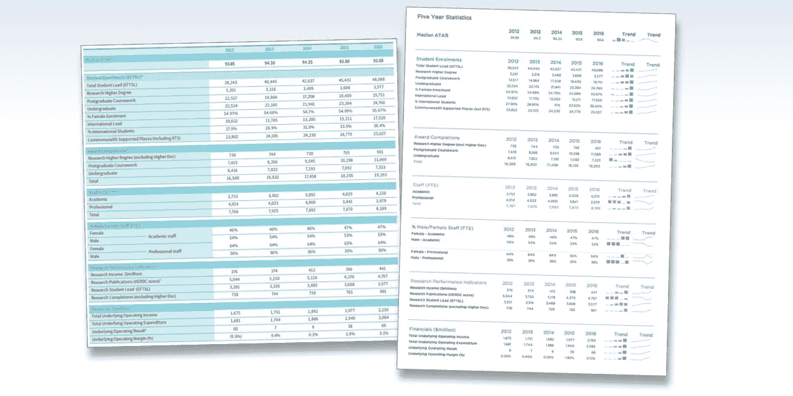
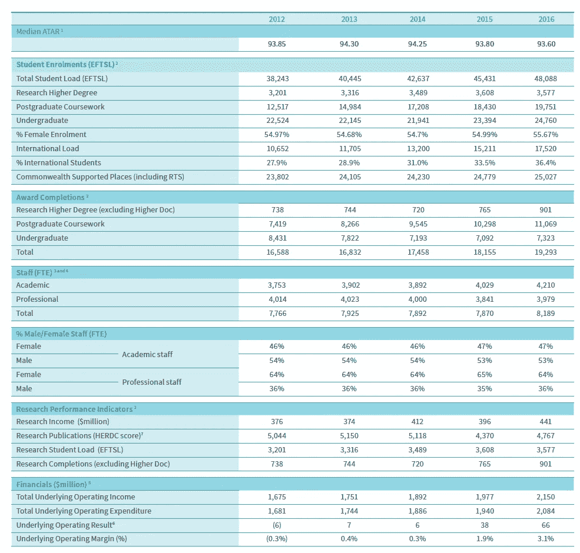
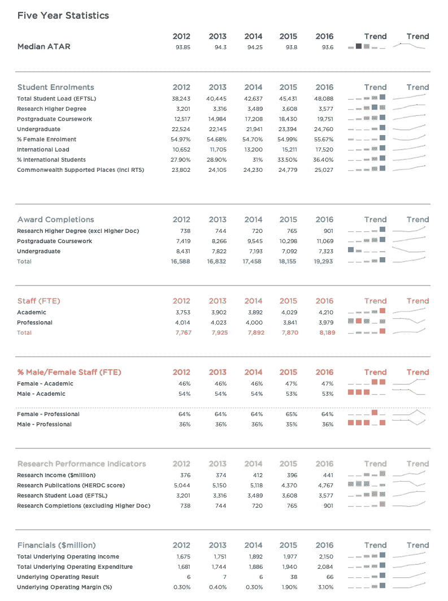
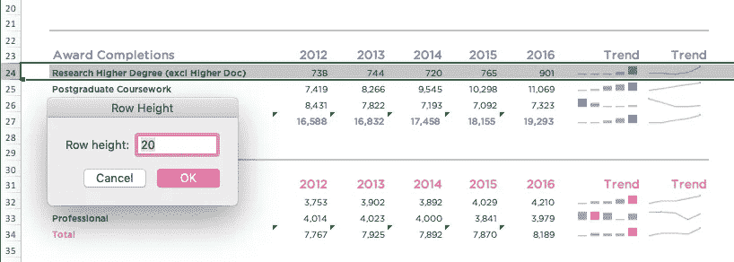
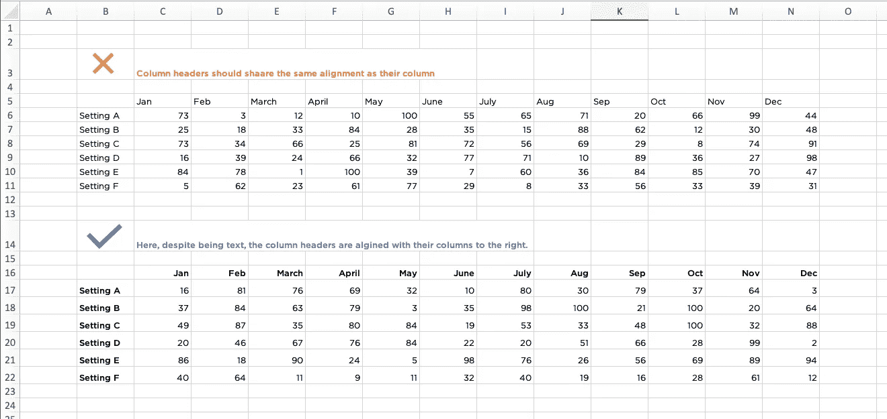

# 设计表格的五条规则

> 原文：<https://towardsdatascience.com/five-rules-for-designing-tables-a953a16e50f3?source=collection_archive---------20----------------------->

## 简单的设计元素让您的电子表格流行起来

设计表格的 5 条规则。作者:Alana Pirrone

让人们对表格或 Excel 电子表格感到兴奋不是一件容易的事情。通常，它们被一排排的数字填满，当人们看到一个数字时，他们的眼睛似乎变得呆滞。您可以将一些简单的设计元素合并到 Excel 表格中，使其更易于读者浏览。

我最近在一份大学报告中看到了这张表，它从几个指标看了他们在过去五年中的表现。虽然这个表格比标准的 Excel 电子表格要好，但我认为我可以更进一步，创造出一些值得兴奋的东西。

之前。在一份大学报告中发现的表格设计。

之后。使用迷你图重新设计表格。

让我们来看看设计表格的五条规则。

# **文本层次**

在你制作的任何设计作品中，创造层次都是至关重要的。我们需要为我们的观众提供一个清晰有序的导航方式。通常最大最粗的部分会最先吸引我们的注意力，也是最重要的，最小最轻的部分最不重要。

在我们的表格设计中，我们可以通过将标题设置为大而粗的字体并放置在左上角来建立文本层次结构。那是我们希望我们的观众开始阅读的地方。我们的下一级文本层次是行标题和列标题。我设计了比标题略小的字体，但仍然是粗体和彩色的。使用颜色有助于将它们与其他数据区分开来，并有助于创建不同的部分。第三层是行副标题。它们的大小和颜色与正文相同，但以粗体显示。表中的其余数据是我们的第四级结构，称为正文。

# 空格

> **“空白用于将属于一起的数据对象与其他数据对象分开，从而对它们进行分组”** —斯蒂芬·诺，给我看看数字。

白色空间充当呼吸空间。仅仅确保 Excel 电子表格中的列之间有空白是不够的，还要考虑行与行之间的空白。这有助于你的读者更有效地阅读这些行。如果数据行靠得太近，我们就很难在不与其他行混淆的情况下跟踪整行数据。在《给我看数字》一书中，Stephen worth 建议将单元格内的行高增加一倍。例如，如果我使用 10 磅的字体，我的单元格高度应该是 20 磅。

行高应该是字体大小的两倍。

# 对齐

作为一个快速的经验法则，所有的文本应该左对齐，所有的数字应该右对齐。显然，这条规则也有例外，但在大多数情况下，这是最有效的。避免使用居中对齐的列，尤其是对于文本，因为我们的眼睛很难浏览带有锯齿状边缘的数据。

列标题应该与其列共享相同的对齐方式，不管是文本还是数字。

列标题应该与其列共享相同的对齐方式，不管是文本还是数字。

# 迷你图

迷你图是由爱德华·塔夫特创造的，被描述为**“小而强烈、简单、只有一个字大小的图形。”对于显示数据趋势的大量数字表格来说，它们是一个完美的补充。在上表中，我使用了折线图和柱形图两种迷你图。我使用迷你图的目的是让读者能够快速浏览内容，找到他们需要的内容，或者在这种情况下，找到我想告诉他们的内容。我在每个迷你图中突出显示了“高点”,以查看它们在过去五年中每个指标的比较情况，以及哪一年最成功。当迷你图的其余部分为灰色时，此高亮颜色效果最佳。**

请注意，迷你图的 Y 轴是由该特定行中数据的最高点和最低点测量的。因此，在迷你图之间进行比较可能不准确。如果您想要始终保持一致的轴，可以在迷你图选项卡下进行更改，方法是单击轴>垂直>并在最小值和最大值下为所有迷你图选择相同。

# 需要考虑的其他几点

*   使用深灰色文本而不是黑色，尤其是当你使用动作或高亮颜色时。它失去了数字和纸张之间的鲜明对比，让我们突出的颜色更具视觉冲击力。
*   只使用一种字体，最好是无衬线字体。读起来简单多了。
*   如果你使用日期，要保持一致。例如，如果你写 2021 年 4 月 1 日，写 01/04/2021 而不是 1/4/2021。这将使您的列中的数字排列得更好。

快乐设计！

*Alana Pirrone 是澳大利亚墨尔本大学的设计和数据可视化顾问、设计和沟通协调员。在 alanapirrone.com.au**了解更多关于 Alana 的信息*