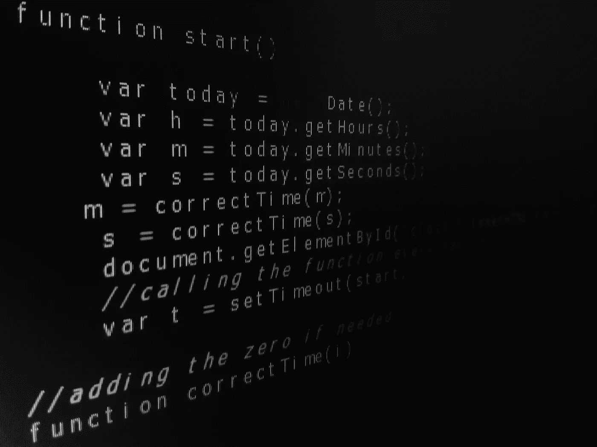

# 99%的初级 Python 开发人员都会陷入五个微妙的陷阱

> 原文：<https://towardsdatascience.com/five-subtle-pitfalls-99-of-junior-python-developers-fall-into-721727a73c55?source=collection_archive---------2----------------------->

## 我曾经是那 99%中的一员。



照片由作者用 Python 编辑的[若热·热苏斯](https://www.pexels.com/@jorge-jesus-137537?utm_content=attributionCopyText&utm_medium=referral&utm_source=pexels)来自[像素](https://www.pexels.com/photo/computer-program-language-text-614117/?utm_content=attributionCopyText&utm_medium=referral&utm_source=pexels)

如果说数据科学是“21 世纪最性感的工作”，那么 Python 无疑是“21 世纪最性感的编程语言”

Python 出色地降低了计算机科学的入门门槛。当你听到有人说“如果你懂英语，你就可以用 Python 编程”，期待各行各业的人都选择数据科学和编程职业。主要是因为有利可图的工作前景；部分原因是社区中流传的数据科学术语——这些术语让人觉得他们在建造火箭船。

Python 无非就是一个工具。编写代码的工具。然而，我必须警告你，亲爱的皮托尼斯塔，你的工作并没有以一个功能代码结束。相反，这只是开始。开始一段艰苦的旅程，制作一件艺术品，希望能让你与一般的 Python 程序员有所不同。

为了帮助您，我整理了大多数初级(和一些中级)Python 开发人员容易陷入的五个陷阱。我将要向您展示的陷阱，无论看起来多么微妙，都有助于获得一段干净、设计良好的代码。最重要的是，他们可能会让你的技术领导说“这个人知道他们在做什么。”

放心吧，我不会说教理论的。相反，我会用代码来支持我的声明，以彻底消除任何一丝疑虑。

## #1.盲目使用集合

集合是不同元素的无序集合。集合检查成员资格的能力非常强大。更正式地说，与复杂度为 O(n)的列表相比，集合的复杂度为 O(1)，这使得它们非常快。除了充当重复过滤器之外，速度可以说是使用集合而不是其他数据结构的主要原因。

一般来说，在使用条件句时，你应该区分集合的优先级。然而，你不应该做的是迭代它们。

类似于下面的例子:

```
from time import timemy_set = {i for i in range(1000000)}start = time()
def even(sample):
    even_list = []
    for num in sample:
        if num % 2 == 0:
            even_list.append(num)
    return even_listeven(my_set)
end = time()
print(f"runtime : {end - start}")
```

输出:

```
runtime : 0.16255903244018555
```

当我遍历一个列表时，我得到了下面的结果:

```
runtime : 0.11905360221862793
```

你可以清楚地看到性能方面的差异。布景很快。但它们并不总是如此。列表得到了很好的优化，可以在循环时以最高的性能运行。

因此，你不应该总是遵循集合更快的假设。有时候事情还是顺其自然。任何其他的调整都会耗费你思考和运行的时间。

## #2.无限循环

当你想听一个事件时，无限循环是你最好的选择。我相信你已经学会使用`**while** True`进行无限循环。至少我一直是。我被告知，在正当理由下，`**while** True`是整洁的、明确的和 Pythonic 式的，这是真的。然而，`**while** True`并不是最有效的无限循环媒体。

`**while** 1`确实是比`**while** True`高效一点。与布尔值 True 相反，1 是一个数字布尔值。因此，性能有所提高。

## #3.用+和 join()连接字符串

如果你没有跟上 Python 的发展趋势，我怀疑你还在使用`+`和`join()`来格式化你的字符串。如果是这样的话，那你就走运了，因为你将摆脱一些旧的坏习惯，接受一种新的更好的字符串操作语法。

看看下面的脚本:

```
from time import timeLINKING_WORD = 'and'start1 = time()
for x in range (1000000):
    friends1 = LINKING_WORD.join(['Jake ', ' Peter'])end1 = time()
print("runtime join():", end1 - start1, "seconds")start2 = time()
for x in range (1000000):
    friends2 = 'Jake '+ LINKING_WORD +' Peter'end2 = time()
print("runtime +: ", end2 - start2, "seconds")start3 = time()
for x in range (1000000):
    friends3 = f"Jake {LINKING_WORD} Peter'"end3 = time()
print("runtime f-: ", end3 - start3, "seconds")
```

结果是:

```
runtime join(): 0.5975692272186279 seconds
runtime +:  0.3718130588531494 seconds
runtime f-:  0.28975749015808105 seconds
```

上面的代码显示了`f-string`与`join()`和`+`相比效率有多高。`f-string`是一种 pythonic 式的、高效的字符串操作语法。

事实上，`f-string`是相当新的。它是在 Python 3.6 中引入的。目前，它是字符串格式化的可靠选择之一。最棒的是，它清晰易用。

## #4.冗长的 If-else 语句

在编程中，没有什么比非结构化、冗长的条件分支更糟糕的了，尤其是当您使用像 Python 这样简洁明了的语言时。

写得不好的语句不仅难以跟踪，而且还会减慢你的程序。

为了让您为难，让我们比较下面的两段代码。

代码 1:

```
from time import time
start = time()for _ in range(1000000):
    a = 10
    b = 5
    if a == 10 and (b == 1 or b == 2 or b == 3 or b == 4 or b == 5 or b == 6):
        pass
    elif (a == 5 or a == 9) and b == 4:
        pass
    else:
        passend = time()print(f"runtime: {end - start}")
```

结果是:

```
runtime: 0.49709439277648926
```

代码 2:

```
from time import time
start = time()for _ in range(1000000):
    a = 10
    b = 5
    if a == 10 and 1 <= b <= 6:
        pass
    elif a in [5, 9] and b == 4:
        pass
    else:
        passend = time()print(f"runtime: {end - start}")
```

结果是:

```
runtime: 0.3018171787261963
```

如您所见，干净的`if-else`语句除了对读者友好之外，还非常有效。

现在让我们分解代码的细节，以找到性能的来源。

首先要考虑的是`in`的使用。和 pythonic 一样快。其次，比较运算符`<= value <=`提供了额外的性能。

现在，您可以看到 Python 如何通过弥合效率和风格之间的差距来杀死它。

## #5.遗忘工具

听说过 Python 的 [gem](https://more-itertools.readthedocs.io/en/latest/index.html) 库吗？如果没有，就见`itertools`。

`itertools`是一个强大的 Python 库。然而，奇怪的是被许多人低估了。`itertools`在概率、线性代数和高效编码方面崛起并大放异彩。

现在，让我们放大一下`itertools`能提供什么。

```
from time import time
import itertoolsLIST = [i for i in range(10000000)]start1 = time()
# standard slicing with lists
LIST[:5000000]
end1 = time()
print(f"runtime lists: {end1 - start1}")start2 = time()
# slicing with itertools
itertools.islice(LIST, 5000000)
end2 = time()
print(f"runtime itertools: {end2 - start2}")
```

结果是:

```
runtime lists: 0.10329008102416992
runtime itertools: 0.0
```

如你所见`itertools`速度很快。这仅仅是因为`itertools`库受到了 Haskell、SML、APL 的启发，它们都非常高效。

请注意，这个例子只是你能从`itertools`中挤出的沧海一粟。

## 结束语

到目前为止，您可能已经注意到了上述缺陷中的一种模式:它们都与性能相关。这正是它们微妙的原因。

众所周知，一般初级开发人员都专注于拥有一个无 bug 的代码。聪明的人倾向于同时考虑代码的正确性和美观性。然而，独特的初级程序员通过将效率放在其他考虑因素之上而使自己与众不同。

这么说，这个岗位注定是论资排辈的捷径。这是因为学长喜欢做事与众不同的人。据我所知，没有多少初级开发人员知道这篇文章中提到的实践。

> “加入人群不需要什么。独立需要一切”——汉斯·汉森

祝你编码好运。