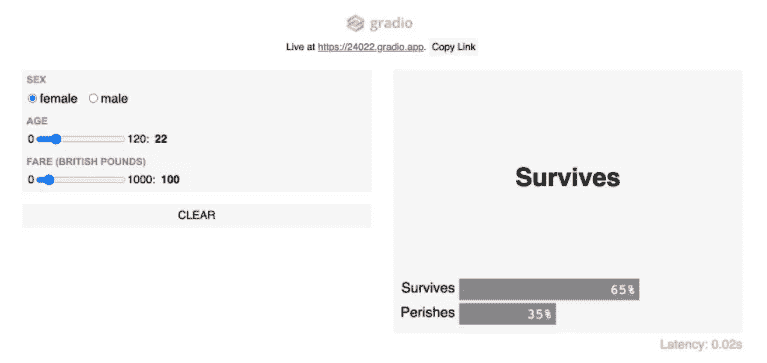

# 部署机器学习模型的五种技术

> 原文：<https://towardsdatascience.com/five-technologies-to-deploy-your-machine-learning-models-bddaad69e0d4?source=collection_archive---------12----------------------->

## 深入现代 ML 部署工具

SpaceX 在 [Unsplash](/?utm_source=unsplash&utm_medium=referral&utm_content=creditCopyText) 上拍摄的

与构建 ML 模型不同，模型部署一直是数据科学中最大的痛点之一，因为它更倾向于软件工程方面，并且对于初学者来说有着陡峭的学习曲线。

然而，近年来，已经开发了一些工具来简化模型部署。在本文中，我们将介绍五种可以用来部署机器学习模型的技术。

*如果你不完全确定什么是模型部署…*

模型部署意味着将机器学习模型集成到现有的生产环境中，该环境接受输入并返回输出，以根据数据做出实际的商业决策。

也就是说，这里有五种技术可以用来部署你的机器学习模型:

# 1.码头工人

Docker 是一个允许你在容器中创建、部署和运行应用程序的平台。您可以将容器视为软件的标准单元，它将应用程序的代码捆绑在一起，以便从一个计算环境快速可靠地运行到另一个计算环境。Docker 还加速了容器化和实现过程，因此它可以用于将 ML 模型部署到其他环境中。我们也可以说它是将代码和依赖项打包到一个称为“容器”的封闭盒子中的过程。

## 赞成的意见

1.  Docker 减轻了调试环境的痛苦。
2.  Docker 有助于加快供应过程。
3.  Docker 社区庞大，资源丰富。

## 骗局

1.  Docker 在非本机环境中存在性能问题。
2.  Docker 在文档方面有一些空白。
3.  Docker 是平台相关的。Windows 容器只能在 Windows 上运行。Linux 容器只能在 Linux 上运行。等等。

# 2.格拉迪欧

[图片由 Gradio 拍摄(经许可)](https://www.gradio.app/hub/aliabid94/hub-titanic)

Gradio 是一个开源的 python 库，它允许我们只需几行代码就可以为我们的机器学习模型、API 或任意函数快速创建易于使用、可定制的 UI 组件。

Gradio 是一个适应性很强的 UI，与 Tensorflow 或 Pytorch 模型结合在一起。它是免费的，而且一个开源框架使任何人都可以迅速获得它。

## 赞成的意见

1.  Gradio 提供了几个可定制的 UI 组件，针对机器学习模型进行了优化。例如，Gradio 提供了易于使用的拖放式图像分类，该分类针对用户进行了高度优化。
2.  设置 Gradio 非常简单快捷。可以通过 pip 直接安装。此外，在 Gradio 中创建接口只需要几行代码。
3.  Gradio 创建了可共享的链接，这可能是在用户面前部署机器学习的最快方式
4.  与其他包不同，Gradio 可以在 Jupyter/Colab 笔记本或独立的 Python 脚本中的任何地方运行。

## 骗局

1.  虽然 Gradio 在官方网站上有很好的文档，但很难找到关于它提供的具体功能的信息和足够的例子。
2.  Gradio 的社区比其他一些软件包要小，所以很难找到关于它的资源。

# 3.库伯内特斯

Kubernetes 是一个用于监督容器化责任和管理的开源平台。我们可以将 Kubernetes 部署定义为 Kubernetes 中的一个资源对象，它向应用程序提供声明性更新。部署允许我们描述应用程序的生命周期，例如，应用程序使用哪些图片，以及应该以何种方式更新这些图片。

## 赞成的意见

1.  Kubernetes 有助于使应用程序运行更加稳定。
2.  利用 Kubernetes 及其庞大的生态系统可以帮助提高效率和生产力。
3.  Kubernetes 可能比它的替代品便宜。

## 骗局

1.  Kubernetes 对于基本的应用程序来说可能是多余的，因为它非常复杂。
2.  向 Kubernetes 的过渡可能是陡峭而繁琐的。

# 4.SageMaker

SageMaker 是一项完全受监管的服务，它使开发人员和数据科学家能够快速有效地构建、训练机器学习模型，并将其部署到任何规模的生产就绪托管环境中。Amazon SageMaker 整合了可以一起使用或自由使用的模块，以构建、训练和部署 ML 模型。

它提供了一个集成的 Jupyter writing notebook 实例，可以简单方便地访问用于调查和分析的数据源，因此您不需要监管任何服务器。此外，它还提供了常见的机器学习算法，这些算法经过改进和优化，可以在分布式环境中针对大量数据有效运行。

## 赞成的意见

1.  SageMaker 从外表上看机器学习模型的发展是不可思议的。这个循环是在一个合乎逻辑的逐步过程中建立起来的。
2.  SageMaker 使训练数据模型变得简单。构建训练和测试样本非常简单。
3.  SageMaker 使机器学习模型的部署比其他开源工具简单得多。

## 骗局

1.  由于 SageMaker 专注于机器学习模型，因此数据科学家可能使用的不同模型可能需要更多的努力才能合并。
2.  SageMaker 在更大的数据集上运行可能需要很长时间。在这种情况下，SageMaker 似乎没有其他工具那么快。

# 5.MLFlow

MLflow 是一个处理 ML 生命周期的开源平台，包括实验、再现和部署。它旨在与任何 ML 库、计算、算法、语言和部署工具一起工作。

## 赞成的意见

1.  它旨在用于任何云环境。
2.  MLflow 与各种开源机器学习框架相结合，包括 Apache Spark、TensorFlow 和 SciKit-Learn。
3.  它跟踪试验和实验，记录和比较参数和结果。
4.  它将 ML 代码捆绑并打包成一个可重用、可复制的结构，以便传授给其他数据科学家或转移到生产中
5.  它监督和部署从各种 ML 库到各种模型服务和推理平台的模型。

## 骗局

1.  MLFlow 不太灵活，因为它不能自动包含风格——风格本质上是 MLflow 可以支持的库/工具。

# 感谢阅读！

不确定接下来要读什么？我为你挑选了另一篇文章:

</introducing-dbt-the-etl-elt-disrupter-4351adc34123>  

**又一个！**

</a-complete-52-week-curriculum-to-become-a-data-scientist-in-2021-2b5fc77bd160>  

# 特伦斯·申

*   ***如果你喜欢这个，*** [***跟我上媒***](https://medium.com/@terenceshin) ***了解更多***
*   ***有兴趣合作吗？让我们连线上***[***LinkedIn***](https://www.linkedin.com/in/terenceshin/)
*   ***报名我的邮箱列表*** [***这里***](https://forms.gle/tprRyQxDC5UjhXpN6) ***！***