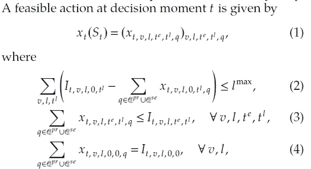
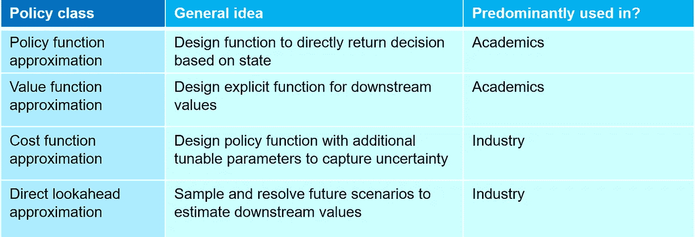

# 商业环境中强化学习需要考虑的五件事

> 原文：<https://towardsdatascience.com/five-things-to-consider-for-reinforcement-learning-in-business-environments-23647a32f01f?source=collection_archive---------23----------------------->

## 强化学习不仅仅可以用于走迷宫和玩棋盘游戏。然而，现实生活中的实现本身就很混乱。

这是一家企业，通过促进合作的开放式办公空间、配有平板电视的舒适休息区和蛇类植物得到认可。在 [Unsplash](https://unsplash.com?utm_source=medium&utm_medium=referral) 上由 [Austin Distel](https://unsplash.com/@austindistel?utm_source=medium&utm_medium=referral) 拍摄的照片

即使是那些完全不熟悉强化学习(RL)的人，也可能知道 DeepMind 的 AlphaGo 是如何在古代棋盘游戏 Go 中击败世界冠军 Lee Sedol 的。对许多人来说，RL 已经成为玩游戏的代名词，无论是国际象棋、超级马里奥，还是简单地穿越冰冻的湖泊。游戏有趣、直观、定义明确，并且通常包含独特的属性，这使得它们对学习算法具有挑战性。毫不奇怪，它们被作为新 RL 技术开发的基准问题。然而，这并不意味着 RL 仅限于*人工智能健身房*。

公司通常关心以最大化利润的方式分配资源。这不是一次性的决定，而是一系列长期的决定，今天做出的决定会影响明天的表现。在这种混合中加入相当多的不确定性，决策往往变得令人烦恼，超出了人类的认知极限。在这种环境下做出明智的决策会让你比竞争对手更有优势，而 RL 在这方面可以有所贡献。然而，在深入研究现实世界的业务问题之前，有一些重要的方面值得考虑。

# 一.成果、成果、成果

是的，三次，因为这可能是第一点、第二点和第三点。诚然，这不仅仅是一点陈词滥调，但这是有原因的。对于企业来说，部署强化学习的目的是为了解决问题。一种算法应该使企业能够**做出更好地定位未来**的决策。如果 RL 不能产生直接的、可衡量的影响，它就没有什么价值。

为了具有实用价值，源自 RL 的(自动化)决策支持也应该**集成到现有的工作流中**。在许多情况下，这意味着使用已经存在的系统。例如，如果确定性规划算法已经存在，简单地添加一些前瞻特征通常比从头开始设计 RL 算法更易于管理。

计算时间自然也是一个相关点。对于战略和战术层面的决策，更长的运行时间是可以原谅的。然而，如果 RL 支持日常运营决策，则必须限制在线运行时间。

# 二。未来必须是可预测和可影响的

> “预测很难，尤其是关于未来的！”—尼尔斯·玻尔

为了能够预测一个过程，它实际上应该是可预测的。当然，每个人都想拥有一个预测股价走势的 RL 算法——至少我想——并告诉你何时买入何时卖出。工厂经理想知道机器零件什么时候坏，以便及时更换。至于任何机器学习算法，**数据实际上应该包含一个可以辨别的模式**。

不用说，应该有足够的高质量数据。正如任何数据科学家所知，'*垃圾输入=垃圾输出【T3]'—RL 算法也不例外。需要大量高质量的数据才能学到有用的东西。一个大型的神经网络可能需要数百万次的观察来正确训练；历史记录可能不足以达到这样的目的。如果一个基本的线性回归实际上会产生更好的结果，不要感到惊讶。*

到目前为止，没有什么新的，但 RL 有一些自己的挑战，没有监督学习的经验。那些曾经试验过重放缓冲区的人很快意识到**一旦确定了更好的政策，许多观察就会变得过时**。一家卡车运输公司可能有大量来自东海岸的数据，但如果政策告诉您探索西部边境，该怎么办？有时候效果很好——例如，你可以根据历史价格数据对许多投资策略进行回溯测试。其他时候，你可能会随意模拟新的结果。尽管有时，一旦偏离当前的实际政策，正确的数据可能就不存在了。

RL 环境通常是[部分确定和部分随机的](/what-are-post-decision-states-and-what-do-they-want-from-us-9e02105b7f40)。如果你能比别人更好地预测或模拟随机过程，你应该能胜过竞争对手。如果你能通过当前的行动更好地为未来做准备，这同样适用。如果你不能预测太多，今天的决定几乎不会影响明天的表现，或者你根本没有数据，RL 可能是错误的方法。

# 三。问题表述是关键

对于棋盘和电脑游戏，问题的定义从一开始就是已知的。相比之下，实践并不能决定问题到底是什么，更不用说如何度量性能了。**定义适当的 KPI**可能是一门艺术。可能有多个重要的绩效指标和利益相关方，需要对它们进行权衡或排序。许多实际问题可以形式化为一个受一组约束的目标函数。我们希望利润最大化，但也要考虑我们的环境足迹。我们希望最大限度地降低成本，但必须保持合同服务水平。对于子流程，定义良好的性能指标可能并不容易。空列车的重新定位似乎对年度利润没有什么影响，但与业务目标的一致性应该存在。RL 算法将努力最大化你定义的目标:小心你想要的。

在与利益相关者交谈，抽象出问题的属性，并定义一个一致同意的目标之后，从数学上表述问题是非常重要的。马尔可夫决策过程和数学规划是这一步的重要框架。

一个**马尔可夫决策过程** (MDP)模型描述了不确定环境中的连续决策。本质上，它定义了*问题状态*(做出决策所需的信息)*动作*(允许的决策)*奖励函数*(决策的贡献或成本)*转换函数*(状态间转换的模型，受决策和随机波动的影响)，以及*目标函数*(我们寻求优化的累积奖励函数)。尤其是对管理环境的分布和决策所需的信息所做的假设在业务环境中是必不可少的。

以**数学程序**的形式表达行动空间通常是方便的(即使没有求解到最优)，因为它非常谨慎地定义了*目标函数*——显然应该与 MDP 中的目标函数一致——以及相应的一组*约束*。如果我们想降低成本，最低服务水平是什么，我们能保持多少订单量，什么样的卡车路线是可行的？现实世界问题的简化是不可避免的，然而[数学编程](/using-linear-programming-to-boost-your-reinforcement-learning-algorithms-994977665902)使得这些简化非常明显。

数学问题形成片段。这里，动作空间被公式化为线性程序[图片由作者提供] [1]

人们可能不同意你对现实的抽象，但是他们不应该有误解这种抽象的空间。

# 四。选择合适的解决方法

在解决方法的选择上，可以发现研究和工业之间的显著差距。学者和研究人员倾向于重视设计努力和数学优雅，而实践者相对更依赖于**蛮力和利用问题结构**。例如，确定性航线调度算法可以用松弛参数来扩展，松弛参数的值通过 RL 来确定。另一个例子是将今天的卡车路线问题求解到最优，并用一个简单的试探法估计本周剩余时间的路线成本。公司通常对问题结构有相当好的想法——这些结构可以在解决方法中加以利用。

尽管鲍威尔的四个政策类别过于简单化[2]，我还是试图在这里做一个粗略的区分:

强化学习的四个策略类的简化[图片由作者提供]

固有的权衡是在设计努力和计算努力之间。尽管存在一些有用的指导方针[3]，但是对于一个给定的问题，不一定有一个“最佳”的政策类别，更不用说一个*通用的*解决方案。不过这是另一个时间的讨论——现在，在构思现实世界 RL 问题的解决方案时，推荐一种开放的思维就足够了。

</the-four-policy-classes-of-reinforcement-learning-38185daa6c8a> [## 强化学习的四个策略类别

towardsdatascience.com](/the-four-policy-classes-of-reinforcement-learning-38185daa6c8a) 

# 动词 （verb 的缩写）行动空间通常很大

照片由 [Graham Holtshausen](https://unsplash.com/@freedomstudios?utm_source=medium&utm_medium=referral) 在 [Unsplash](https://unsplash.com?utm_source=medium&utm_medium=referral) 拍摄

在许多基准 RL 问题中，动作空间通常没有那么糟糕。穿越迷宫只需要一次评估四步棋。一个超级马里奥游戏有更多的按钮组合需要考虑，但仍然是易于管理的。一个国际象棋棋盘有令人眼花缭乱的状态，但在一个单一的棋盘组合中可行的走法数量很少超过 100。简而言之，对于大多数基准问题，动作完全在枚举的限制内，例如，作为行动者或深度 Q 网络的输出。

如前所述，商业决策通常可以归结为资源分配的问题——什么样的资产分配能产生最好的回报？这经常转化为基于向量的决策，其中许多资源同时被分配。如果你有 100 万美元，你如何最好地分配给所有纳斯达克股票？如果您的仓库中有 10，000 件产品，那么下个月您会为每种产品再订购多少件？如果你拥有一个由 1000 辆卡车组成的车队，你如何在全美范围内分配它们？

即使对于这些问题的确定性变体，动作枚举通常也是非常不可行的——**组合优化问题**可能会产生数百万、数十亿或数万亿个可行的动作。尽管有一线希望；很多现实生活中的问题是凸的，甚至是(近似)线性的。这是一个非常强大的属性，通常会使问题的解决变得相当容易。商业解算器可以在有限的时间内解决大量的问题——一个包含数百万个动作的线性程序可能在几秒钟内就可以解决。

尽管如此，即使数学编程也不能总是拯救我们。在几秒钟内做出决定听起来很棒，但如果我们需要数百万次训练观察，这些“几秒钟”真的会累加起来。通常需要(元)试探法和简化假设来处理动作空间。毕竟现实生活很乱。

# 行动纲要

*   RL 解决方案需要**集成到现有的工作流程**中。最终，该算法应该能够改善现实世界中的决策。实际可用性、计算工作量、数据可用性、决策支持中的角色——所有这些因素都需要在一开始就加以考虑。
*   强化学习在部分可控的环境中有意义，并允许预测未来事件。**今天做出的决定应该会对未来产生一定的影响**，而且环境在一定程度上应该是可预测的。如果你不能真正影响或预测未来(或者只是没有数据)，你可能会更喜欢短视的政策或确定性优化。
*   在考虑任何解决方案之前，首先要明确地对问题建模。对于每个利益相关者来说，目标(性能度量)和约束应该非常清楚。马尔可夫决策过程和数学规划是问题公式化的有用框架。
*   花点时间**挑选最合适的解决方法**(策略类)。这需要对手头的问题进行反思。问题结构可以被利用吗？额外的设计工作值得减少计算工作量吗？解决方案是否应该嵌入到现有算法中？
*   准备好**处理大量的行动空间**。资源分配通常需要组合优化。基于向量的问题通常非常大，需要数学规划和启发式归约等技术来保持其可管理性。

# 参考

[1] Van Heeswijk，W.J.A .，Mes，M.R.K .，& Schutten，J.M.J. (2019)。城市合并中心带时间窗的配送调度问题。*交通运输科学*， *53* (1)，203–221。

[2]鲍威尔，W. B. (2019)。随机优化的统一框架。*欧洲运筹学杂志*， *275* (3)，795–821。

[3]鲍威尔(即将露面)。强化学习和随机优化:顺序决策的统一框架。新泽西州霍博肯的约翰·威利父子公司。第 522-525 页。