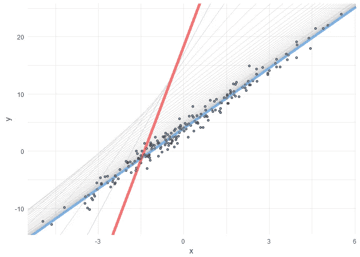

# 作为一名有抱负的数据科学家需要关注的五件事

> 原文：<https://towardsdatascience.com/five-things-to-focus-on-as-an-aspiring-data-scientist-a52ce1d9ce89?source=collection_archive---------20----------------------->

开始学习数据科学可能会令人望而生畏。数据科学家被期望在一个人身上融合几种难以获得的技能，即:统计学、软件工程和分析。当你刚进入这个领域或者想一头扎进去的时候，知道从哪里开始或者关注什么真的很难(相信我，我记得很清楚！).

也就是说，很容易陷入不知所措的困境，以至于你完全推迟或停止了学习之旅。尽管这对你来说是一个可怕的结果。数据科学仍在快速发展，并作为一种技能和一门学科不断进化。

我给你的建议是专注于五项基本技能。剔除新语言、框架和算法的噪音，专注于核心技能，这些技能将加速您作为数据科学家的学习和成长能力。把这些做好，你就能在学习过程中轻松扩展你的技能和知识。

## 1)真正精通 SQL

有这么多有趣的机器学习模型要学习，有这么多问题要解决，很容易忘记成为一名有效的数据科学家实际上需要的核心技能之一。绝大多数数据科学家将拥有自己的数据管道和自己的数据来源，并承担端到端的责任。此外，你永远不应该依赖别人为你提取数据。这可能不是与工作相关的“性感”技能之一，但它是必不可少的(相信我这一点，在 FAANG 公司，你可能会在面试时被测试 SQL，作为最初的筛选任务)。您应该知道如何做的事情:

a)运行基本的选择查询，选择列、分组、过滤和应用聚合函数

b)与其他表连接—知道何时以及为什么使用左连接、内连接和右连接

c)编写子查询/使用临时表

d)使用窗口函数(滞后、超前、优先)。挑战自己，用 SQL 编写一个累积和函数。

## 2)同时学习 R 和 Python

这可能更有争议。很多建议倾向于建议你选择其中一个，或者除了 Python 之外学习一些新的东西，比如 Julia。我的建议是**同时学习 R 和 Python** 。了解其中一种语言是必要的，但是了解这两种语言不仅能帮助你更加突出，还能让你利用每种语言的相对优势更好地解决问题。我不一定建议不要学习像朱莉娅这样的新人，但这不是你在职业生涯开始/早期应该关注的事情。学习每种语言的推荐资源如下。

**R**

r 是一种流行的开源编程语言，广泛应用于工业界和学术界。对于应用统计学、数据分析和数据可视化来说，它是一门伟大的语言。

**在这里下载 R**:【http://cran.us.r-project.org/ 

在这里下载 R studio—R 开发的 IDE:[https://www.rstudio.com/products/rstudio/download/](https://www.rstudio.com/products/rstudio/download/)

RStudio 是一个 R 的集成开发环境，这将使你第一次用 R 编写代码的体验更加愉快和富有成效。当你打开 RStudio 时，它会自动找到你机器上的 R 发行版。

了解一下**潮汐**——[https://www.tidyverse.org/](https://www.tidyverse.org/)

tidyverse 是一个 R 包的集合，它使得许多常见的数据分析/科学任务变得更加简单和直观(操作数据，创建可视化等等)。).这个 DataCamp 教程是一个很好的起点[https://www . data camp . com/community/tutorials/tidy verse-tutorial-r](https://www.datacamp.com/community/tutorials/tidyverse-tutorial-r)你应该从这本书[http://r4ds.had.co.nz/](http://r4ds.had.co.nz/)开始。

**Python**

Python 是一种开源的通用编程语言，近年来变得非常流行，尤其是在机器学习和数据科学领域。它是一种高级语言，意味着你可以编写可读性很高的代码。这使得它非常适合初学者，也相对容易学习。

**在这里下载 Python**:[https://www.continuum.io/downloads](https://www.continuum.io/downloads)

这是 Python 的 anaconda 发行版。它包括该语言的最新版本+许多预装的好东西，如用于数据操作、机器学习、web 抓取和开发的有用的外部包，以及 Jupyter notebook，这是编写 Python 代码的好地方。一旦你下载并安装了它，你就可以通过搜索“Anaconda Navigator”并启动一个 Jupyter 笔记本来开始编写 Python 代码。

以下是学习 python 的一些有用资源:

***用 Python 自动化枯燥的东西:***

这本书可以在网上免费获得，这里:[https://automatetheboringstuff.com/](https://automatetheboringstuff.com/)。它是为完全的初学者准备的，但是可以让你很快上手并运行有趣且有用的任务。

***谷歌的 Python 课程:***

谷歌为新开发人员提供了自己的内部 Python 课程，他们在这里免费提供了所有内容:[https://developers.google.com/edu/python](https://developers.google.com/edu/python)

***Codeacademy 免费在线课程***

这是一个免费的互动课程，教授基础知识:[https://www.codecademy.com/learn/python](https://www.codecademy.com/learn/python)

对于 python 中的数据分析/科学任务，您将需要熟悉 pandas 包——参见下面的 *Python 数据分析书籍推荐。*

## 3)提高你的综合分析技能

探索性数据分析*仍然*是数据科学家增加价值的主要方式之一。不要误解我的意思，构建预测模型非常有价值，但通常情况下，您会通过发现数据中隐藏的模式并将这些见解传达给业务部门来产生最大的影响。考虑如何在分析数据时增加价值的一种方法是通过考虑**指标和杠杆**来接近数据。

通过关注**指标**，你将有一个分析指南，防止你掉进兔子洞和浪费时间。例如，如果你在一家订阅企业工作，在进行分析时，通常应该首先考虑的两个指标是 ***订阅和流失。***

杠杆是企业实际上可以用来推动或改变用户行为的东西。例如，这可能是优惠、促销、内容选择或开放时间。我猜这里的重点是通过 ***控制可控*** *来增加价值。*因此，在分析数据时，你应该思考企业已经或正在做的事情如何影响低层次和高层次的指标。

一旦你采用了**指标和杠杆心态**，它将帮助你更快地专注于执行增值分析。你还需要将这种心态与**强大的分析技能组合**。通过分解数据集来练习——过滤、分组、聚合、排序和应用各种方式或任意转换应该成为你的第二天性。同样，这应该与提高数据可视化技能相结合。就我个人而言，我真的很喜欢 R 和 tidyverse 来做这类工作——在这里可以看到一个快速而整洁的数据分析的例子[。](https://conrmcdonald.medium.com/a-quick-and-tidy-data-analysis-2cf0d42909b3)

## 4)熟悉线性模型

作者图片

随着学习旅程的进行，你将有足够的时间来学习神经网络和基于树的模型，但是如果你刚开始(或者即使你没有！)你应该对线性模型非常熟悉。你应该知道:

1.  如何用自己选择的语言实现它们
2.  如何解释只有一个回归变量的模型中的截距和斜率
3.  如何解释具有多个连续预测值的模型中的截距和斜率
4.  难以解释具有混合连续和分类(虚拟)预测值的模型中的截距和斜率
5.  如何以及何时标准化输入，以及这如何影响解释。

老实说，你应该购买并通过 Gelman 的书[开始工作。](https://www.amazon.co.uk/Analysis-Regression-Multilevel-Hierarchical-Analytical/dp/052168689X/ref=sr_1_4?dchild=1&keywords=gelman+and+hill&qid=1617523487&sr=8-4)

只要真正关注线性模型如何工作，你就可以增加很多价值，解决很多问题，并非常熟悉统计学和机器学习。相信我，这将是你时间的一项非常好的投资。

## **5)学会成为更好的问题解决者**

对于数据科学家来说，善于解决结果不确定的模糊复杂问题是成功的关键。幸运的是，解决问题是一项非常容易学习的技能，作为一名数据科学家，你可以自然而然地发展这项技能。也就是说，这是一项你应该投入时间并寻找机会发展和提高你技能的技能。我发现克劳德·香农的建议在这方面非常有价值。香农建议，要解决问题，你应该:

1.  从不同的角度着手(我可以用哪些不同的方式来想象或描述这个问题)
2.  尝试将其分解为更小的子问题(为了解决问题/开发解决方案，系统中需要工作的组成部分是什么)，以及；
3.  从解决方案到问题逆向工作(例如，这个问题的解决方案看起来像什么或做什么)

为了不断提高你的技能，我建议在你解决了一个棘手的问题之后做一个快速回顾。自我批评。哪些*做错了，哪些做对了*，你将从下一个面临的难题中吸取哪些教训。这个回顾会占用你 5-10 分钟的时间，但是在未来会有巨大的回报。

## 摘要

成为一名数据科学家是一项具有挑战性但值得努力的工作。试着不要让自己对每一个出现的新趋势/算法/编程语言或框架感到不知所措。专注于这里概述的五个基本原则将是一项非常值得的投资，会让你处于一个更好的位置来快速增值，这反过来会让你致力于更大、更有趣的问题。

感谢阅读！如果您有任何想法、问题或评论，请告诉我。