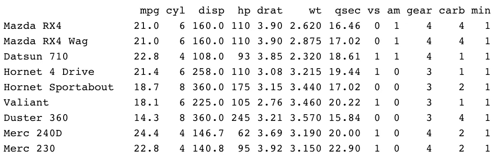
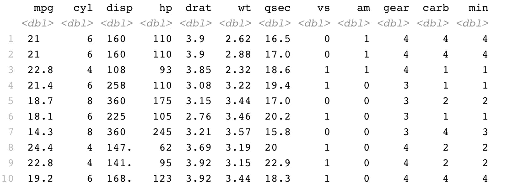
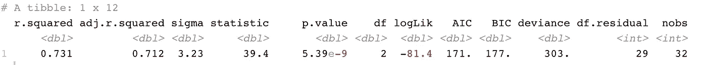
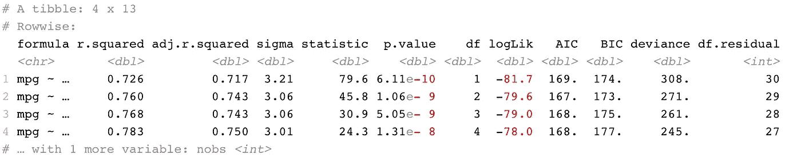
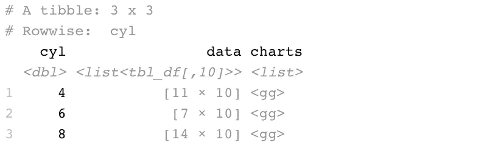
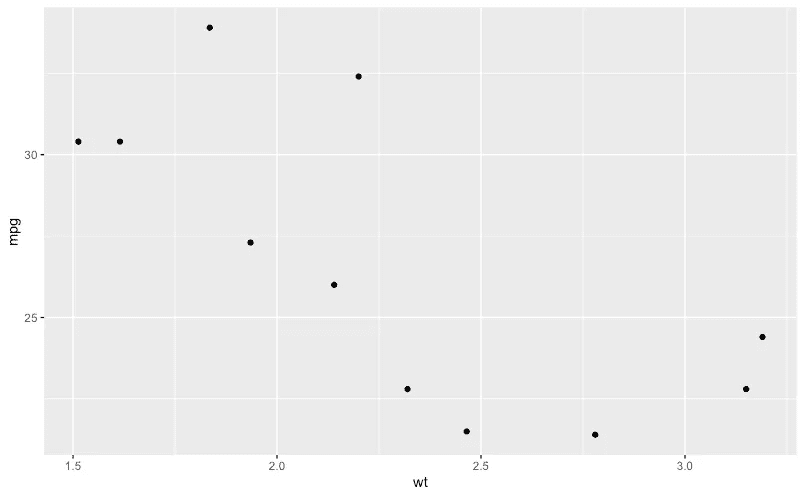
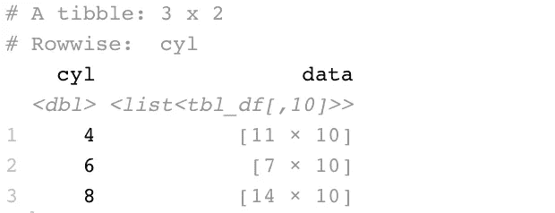
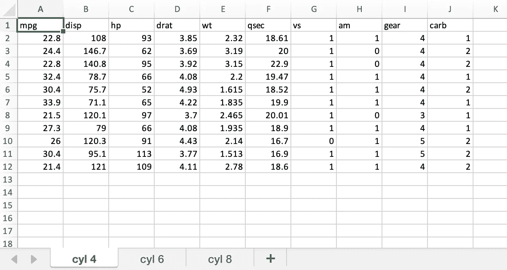
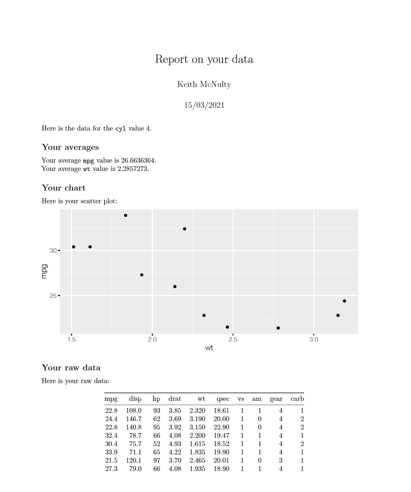

# 你从不知道可以用 dplyr 做的五件事

> 原文：<https://towardsdatascience.com/five-things-you-never-knew-you-could-do-with-dplyr-1b634c0ea745?source=collection_archive---------10----------------------->

## 将 dplyr 插入到基本上任何东西中，在一个命令中执行批处理任务

自从去年发布 dplyr 1.0.0 以来，我非常喜欢尝试这个开创性的 R 包，最近我一直在考虑如何使用 dplyr 对来自数据框的输入运行任何类型的函数。这意味着您可以使用 dplyr 在一个命令(通常非常简单)中执行与数据帧中的行数一样多的操作。

在本文中，我将向您展示如何使用这个概念，在 dplyr 中使用一个管道命令来完成以下任务:

1.  运行许多不同的模型来评估哪一个最适合
2.  创建一批图表
3.  编写任意数量的 csv 文件
4.  用任意数量的工作表编写一个 excel 文件
5.  生成一批 pdf 报告

我想强调的是，这些只是一个更广泛的想法的例子——您可以将 dplyr 与其他包和函数集成，以执行比您最初可能想到的更广泛的任务。希望你能利用这里的例子想出一些其他的用途，让你将来的生活更轻松。

## 0.开始之前

在本文中，我们将使用几个 dplyr 1.0.0+中新增的或大幅改进的关键函数。首先是`rowwise()`。这是在数据帧的各个行上执行操作的一个重要功能。你可以把它想象成按单行分组。

让我们看一个`mtcars`的例子来说明我的意思。如果我们想在`mtcars`的每个观察中取`gear`和`carb`的最小值，你自然可以尝试:

```
library(dplyr)mtcars %>% 
  dplyr::mutate(min = min(gear, carb))
```

然而你得到了这个，这可能不是你想要的:



这是因为默认情况下，dplyr 是按列工作的，所以您的代码正在计算整个两列`gear`和`carb`中的最小值。要跨行工作，您需要使用`rowwise()`:

```
mtcars %>% 
  dplyr::rowwise() %>% 
  dplyr::mutate(min = min(gear, carb))
```

现在我们看到，在返回最小值之前，数据已经按行分组，这正是我们实际想要的。



我想强调的第二个功能是`nest_by()`。这是一个创建嵌套数据行的快捷函数。例如:

```
mtcars %>%
  dplyr::nest_by(cyl)
```

您将看到这创建了一个名为`data`的*列表列*，根据`cyl`的三个不同值，它包含了`mtcars`的三个子集:


当我们现在进入五个例子时，您将看到这两个函数是多么有用。

## 1.**运行许多不同的模型来测试适合度**

R 中的`broom`包包含了一些很棒的函数，可以产生整洁的模型输出。例如，`glance()`函数允许您在一个整洁的表格中轻松查看模型的总体统计数据。例如，这段代码:

```
library(broom)broom::glance(
  lm("mpg ~ cyl + gear", mtcars)
)
```

将为指定的模型生成以下统计数据行。



因此，如果我们想要测试一大堆模型组合的适合度，我们需要做的就是用我们感兴趣的模型组合写一列，并对 broom 进行行方向的变异，以便在一个管道命令中获得它们的所有适合度统计数据:

```
# create a column with model formulas to test
models <- data.frame(
  formula = c(
    "mpg ~ cyl",
    "mpg ~ cyl + disp",
    "mpg ~ cyl + disp + hp",
    "mpg ~ cyl + disp + hp + drat"
  )
)# run them all and get fit statistics
models %>%
  dplyr::rowwise() %>%
  dplyr::mutate(
    broom::glance(lm(formula, mtcars))
  )
```

瞧，你所有的模型都符合统计数据:



## 2.创建一批图表

您可能已经注意到前面的列表列概念。List columns 允许我们将任何类型的对象放入我们使用 dplyr 变异或总结的列中。假设我们想要生成一个图表，显示不同的`cyl`值下`mpg`与`wt`的散点图。我们可以使用嵌套数据将每个图表转换成一个新列:

```
library(ggplot2)scatters <- mtcars %>%
  dplyr::nest_by(cyl) %>%
  dplyr::mutate(
    charts = list(
      ggplot(data, aes(x = wt, y = mpg)) +
        geom_point()
    )
  )
```

这给了我们以下结果:



您可以看到`ggplot2`对象存储在我们新的`charts`列中。如果你想看到一个，你可以简单地调用它:

```
scatters$charts[[1]]
```



## 3.编写一批 csv 文件

你也许能看到我现在要去的地方。假设我们想将不同的嵌套数据帧写入不同的 csv 文件。同样，我们可以改变一个函数，将每个嵌套的数据帧写入一个适当命名的 csv 文件:

```
mtcars %>%
  dplyr::nest_by(cyl) %>%
  dplyr::mutate(
    write.csv(data, paste0("cyl", cyl, ".csv"))
  )
```

这将产生以下不起眼的输出:



但是看看你的项目文件夹，你会发现你的三个 csv 文件就在那里等着你。

## 4.用任意数量的工作表编写一个 Excel 文件

扩展我们正在做的事情，让我们编写一个函数，使用`openxlsx`包将三个嵌套的数据帧放入 Excel 工作簿的不同工作表中:

```
library(openxlsx)write_worksheet <- function(wb, sheet, data) {
  addWorksheet(wb, sheetName = sheet)
  openxlsx::writeData(wb, sheet, data)
}
```

现在我们可以开始一个工作簿，使用`dplyr`将所有内容写入不同的工作表，然后保存它。

```
wb <- createWorkbook()mtcars %>% 
  dplyr::nest_by(cyl) %>%
  dplyr::mutate(
    write_worksheet(wb, paste("cyl", cyl), data)
  )saveWorkbook(wb, "test.xlsx")
```

虽然这个命令的终端输出并不起眼，但是请查看您新编写的`test.xlsx`文件，打开它，您应该会看到:



## 5.生成一批 pdf 报告

现在让我们把几件事情放在一起，用`rmarkdown`批量生成一堆使用`dplyr`的 pdf 报告。首先，我们可以保存一个`template.Rmd`文件，该文件期望接收我们的一个嵌套数据帧(`data`)和一个`cyl`值，计算一些平均值，并在一个基本报告中显示数据和我们的 ggplot 图表。这里是我们的`template.Rmd`文件的内容:

```
---
title: "Report on your data"
author: "Keith McNulty"
date: "15/03/2021"
output: pdf_document
---```{r setup, echo = FALSE}
library(ggplot2)
knitr::opts_chunk$set(echo = FALSE)
```Here is the data for the `cyl` value `r cyl`.## Your averagesYour average `mpg` value is `r mean(data$mpg)`.  
Your average `wt` value is `r mean(data$wt)`.## Your chartHere is your scatter plot:```{r, fig.height = 3}
ggplot(data, aes(x = wt, y = mpg)) +
  geom_point()
```## Your raw dataHere is your raw data:```{r}
knitr::kable(data)
```
```

现在，我们编写一个简单的函数来呈现我们的 R Markdown 报告，用于特定的值`cyl`:

```
library(rmarkdown)# function to write a pdf based on an Rmd template
write_markdown <- function(data, cyl_value) {
  data <- data
  cyl <- cyl_value 
  rmarkdown::render("template.Rmd", 
                    output_file = paste0(cyl, "_report.pdf"))  
}
```

然后我们让`dplyr`再次施展它的魔法:

```
mtcars %>% 
  dplyr::nest_by(cyl) %>% 
  dplyr::mutate(write_markdown(data, cyl))
```

您将看到一些神奇的事情发生，然后您的项目目录中会有三个 pdf 报告，如下所示:



这些显然是使用简单数据集的一般示例，但这里的目的是展示如何将`dplyr`与 R 中的其他函数集成，从而在一个简单的命令中轻松执行大量任务的非常广泛的可能性。我真的鼓励你去探索和玩这个，如果你发现了它的其他有趣的用途，请给这篇文章添加评论，让大家都知道。

最初我是一名纯粹的数学家，后来我成为了一名心理计量学家和数据科学家。我热衷于将所有这些学科的严谨性应用到复杂的人的问题上。我也是一个编码极客和日本 RPG 的超级粉丝。在[*LinkedIn*](https://www.linkedin.com/in/keith-mcnulty/)*或*[*Twitter*](https://twitter.com/dr_keithmcnulty)*上找我。也可以看看我在*[*drkeithmcnulty.com*](http://drkeithmcnulty.com/)*上的博客。*


unsplash.com 的好意