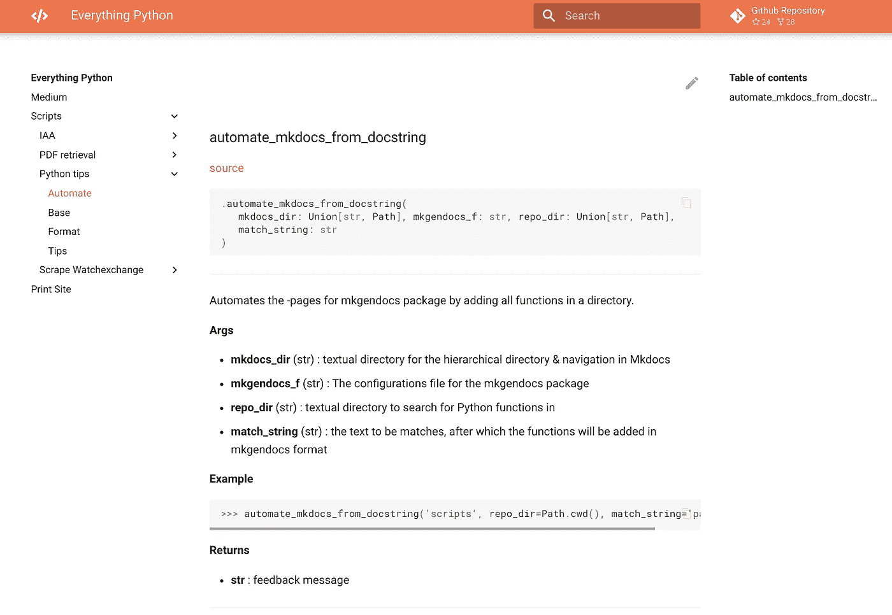
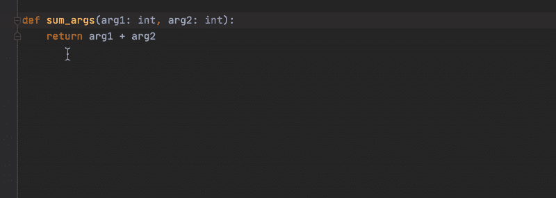
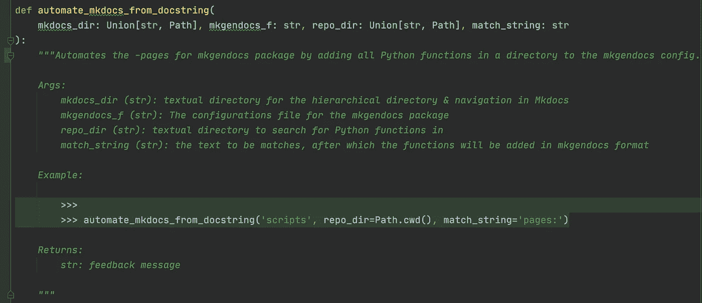
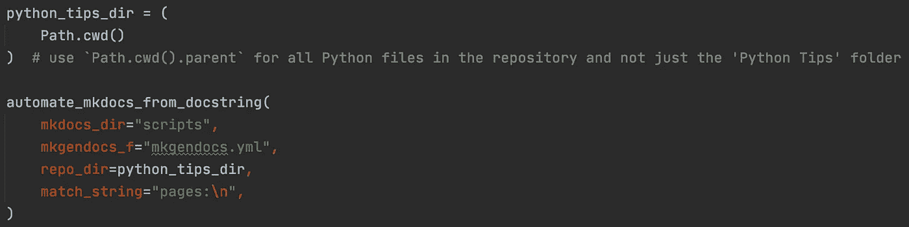
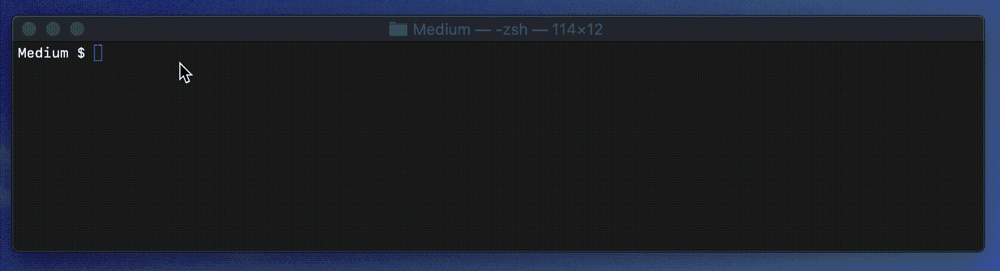
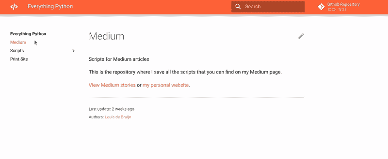

# 自动化 Python 文档的五个技巧

> 原文：<https://towardsdatascience.com/five-tips-for-automatic-python-documentation-7513825b760e?source=collection_archive---------7----------------------->

## 用这五个自动化步骤和预提交 Git 挂钩在 MkDocs & Material 中创建漂亮的 Python 文档



MkDocs 中自动生成的带有 Google 风格 docstring 的函数文档

在这个故事中，您将学习如何通过我们的定制函数、包`mkgendocs`、预提交 Git 钩子和 MkDocs 中的一点魔法从 Python 模块自动生成文档。我们将涉及以下内容

*   MkDocs &材料安装
*   将类型提示自动化到文档字符串
*   使用`mkgendocs`将文档字符串自动转换为 MkDocs
*   自动记录新的 Python 函数
*   在预提交 Git 钩子中将所有东西绑在一起

# MkDocs &材料安装

MkDocs 是一个用于构建项目文档的静态站点生成器，加上 Material 框架，它看起来非常漂亮。首先，我们需要安装一堆包来使用 MkDocs 的所有功能。所有这些包都是 pip 可安装的。

MkDocs 使用一个配置文件`mkdocs.yml`，在这里你可以启用上面安装的所有功能和软件包。请在这里找到我的[。它包括对主题的`/docs`和`/docs_assets`文件夹的引用。](https://github.com/LouisdeBruijn/Medium/blob/master/mkdocs.yml)

# 将类型提示自动化到文档字符串

以前，我写过关于编写 docstrings 的重要性的文章，重点是 Sphinx 文档。

<https://betterprogramming.pub/the-guide-to-python-docstrings-3d40340e824b>  

文档字符串是记录函数的重要工具。Python 3.5+引入了[类型提示](https://docs.python.org/3/library/typing.html)，这是一种直接在函数参数中将静态类型赋给变量的方法。

几个 ide 如 [Pycharm](https://www.jetbrains.com/help/pycharm/using-docstrings-to-specify-types.html) 、 [Visual Studio](https://marketplace.visualstudio.com/items?itemName=njpwerner.autodocstring) 和 [Sublime Text](https://packagecontrol.io/packages/AutoDocstring) 都支持自动生成 docstring。然而，它们还不能从类型提示中推断变量类型，这意味着您必须在文档字符串中填写变量类型和描述。



Pycharm(几乎)自动生成文档字符串

上面显示的是 Pycharm 中使用 [Google 风格的文档字符串](https://google.github.io/styleguide/pyguide.html)的实现。您可以自由使用其他样式(例如 reStructuredText/Sphinx 或 NumPy)，但是我发现了一个专门用于 Google 样式的 docstrings 的包，用于我们接下来的自动化步骤。

对自动化文档字符串的类型提示感兴趣吗？阅读下面的故事👇

</python-type-hints-docstrings-7ec7f6d3416b>  

# 将文档字符串自动转换为 MkDocs


从函数 docstring 自动推断出的 MkDocs 页面

包`mkgendocs`自动将 Google 风格的 docstrings 翻译成带有 Python 函数描述的页面。它使用一个配置文件`mkgendocs.yml`。配置文件如下所示

```
sources_dir: docs
templates_dir: docs/templates
repo: [https://github.com/LouisdeBruijn/Medium](https://github.com/LouisdeBruijn/Medium)
version: masterpages:
  - page: "scripts/base/base.md"
    source: "Python tips/base.py"
    functions:
      - parse_arguments
      - print_df
      - unescape_html
      - equal_array_items
```

使用该软件包的两个手动步骤是

1.  将需要记录的页面、源代码和函数添加到这个`mkgendocs.yml`文件中。
2.  运行`**$** gendocs --config mkgendocs.yml`用这些函数的文档创建静态 MkDocs 页面。

接下来，我们将自动化这两个步骤，首先创建一个脚本来预填充我们的配置文件，然后将这两个步骤附加到一个预提交 Git 挂钩中。

# 自动记录新功能



从文档字符串填充 mkgendocs 配置的函数

首先，我编写了一个带有函数`automate_mkdocs_from_docstring()`的模块`[automate.py](https://github.com/LouisdeBruijn/Medium/blob/master/Python%20tips/automate.py)`，用存储库中模块(脚本)中的所有 Python 函数填充`mkgendocs.yml`配置文件。

`automate_mkdocs_from_docstring()`使用 Pathlib 读取目录中的 Python 脚本并提取函数名。它将模块名和函数名保存在一个字典中，并用它来覆盖`mkgendocs.yml`。这样我们可以自动填充`mkgendocs`包的配置文件。



从 docstrings 到 MkDocs 的自定义自动化步骤

其次，我们将在预提交 Git 挂钩中包含`automate.py`和`**$** gendocs --config mkgendocs.yml`的执行。

# 在预提交 Git 钩子中将所有东西绑在一起

我们的最后一步是将每个自动化步骤添加到`pre-commit-config.yaml`中的 Git 挂钩中。关于预提交 Git 钩子的更多信息，请见下面的文章👇

<https://betterprogramming.pub/4-tips-to-automate-clean-code-in-python-527f59b5fe4e>  

我们将自动生成 MkDocs 页面的两个强制步骤与预提交 Git 挂钩中的`mkgendocs`包一起添加。这些钩子允许我们用一个`entry` bash 命令执行一个 Python 脚本。

这样，当我们在存储库中的任何地方创建或删除 Python 函数时，它们将被自动添加到`mkgendocs`配置文件中，自动创建静态 MkDocs 页面并构建文档网站。



预提交 Git 挂钩中的自动文档

剩下唯一要做的就是用`**$** mkdocs serve`运行我们的 MkDocs 站点，并在 [http://127.0.0.1:8000/找到我们的文档。](http://127.0.0.1:8000/.)

# 结论

通过本文中介绍的自动化步骤，您可以在 MkDocs 中自动创建漂亮的 Python 文档。如果你有任何问题，随时联系我。编码快乐！



包含 MkDocs 和材料的文档站点，图片由作者提供。

寻找更多 Python 干净的编码技巧？在这里找到他们👇

<https://medium.com/analytics-vidhya/seven-tips-to-clean-code-with-python-24930d35927f> 