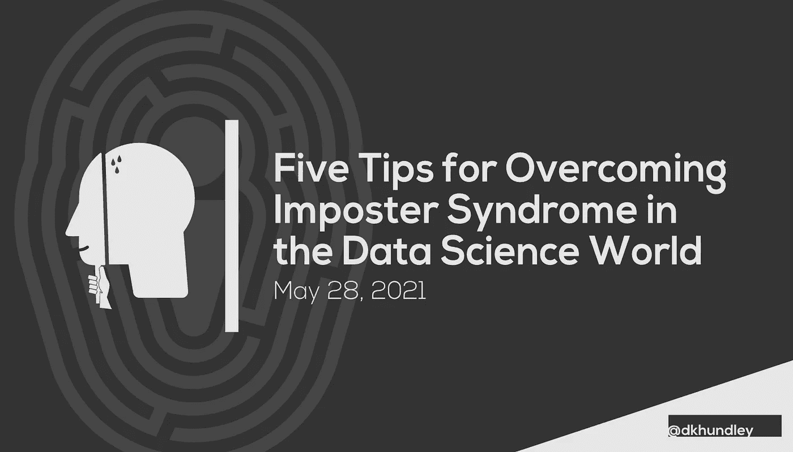

# 在数据科学领域克服冒名顶替综合症的五个技巧

> 原文：<https://towardsdatascience.com/five-tips-for-overcoming-imposter-syndrome-in-the-data-science-world-c4425b0f51b9?source=collection_archive---------9----------------------->

## 就在 18 个月前，我的视角已经从一个非技术性的、面向商业的角色转向了

你好，朋友们！我想我应该从典型的以教程为导向的帖子中稍微休息一下，来涵盖一个不同的主题，这个主题仍然是以数据科学为导向的，并且在我看来是被低估了的。当然，我说的是冒名顶替综合症。如果你对这个概念不熟悉，冒名顶替综合症是指你觉得自己不够好，不能胜任某个特定的职位。这不是一个只局限于数据科学界的概念，但在我看来，我认为数据科学家和机器学习工程师受到冒名顶替综合症的打击最大。

简单分享一下我的个人背景，我已经在一家财富 50 强公司做了 18 个月的机器学习工程师。在担任这个职位之前，我从未担任过任何技术职务。我的本科是工商管理，硕士是组织领导。我之前的角色包括 scrum master、业务架构师和一般业务分析师。

关于我如何步入机器学习的世界，这是一个很长的故事，但我的教育道路完全围绕着替代学习平台。虽然我没有任何与计算机科学或机器学习相关的正式大学学位，但我通过纳米学位、MOOCs 和行业认证了解到了我目前的技能。在建立了工作组合并展示了我在该领域的能力后，我真的很惊讶地收到了一份工作邀请，将于 2020 年 1 月开始我的工作。

但是如果我完全诚实的话…当我第一次开始我的角色时，我觉得完全不合适。请记住，这不仅仅是我在机器学习领域的第一份工作；这是我在计算机科学领域的第一份工作。句号。在最初的几个月里，我觉得自己很沮丧，认为自己永远也不可能胜任这个角色。我经常想，“我到底在这里做什么？”有很多次，我都认真考虑过回归商业导向的角色。老实说，只是因为害怕尴尬，我才没有那样做。

不过，我很高兴自己坚持了下来，因为尽管我不认为自己是任何方面的“专家”，但我在我的角色中已经看到了很多非常出色的成功。我现在领导着一个由其他机器学习工程师组成的小组，最近我被提升为“高级机器学习工程师”。如果你在 2020 年 2 月骗子综合症最严重的时候告诉我这些，我真的不认为我当时会相信。

作为一个真心希望看到其他人在这个领域取得成功的人，我想花些时间来谈谈这个话题，因为闭门造车之后，我知道事实上我不是唯一一个经历过这个的人。在指导了机器学习和数据科学领域的许多人之后，他们中的许多人都表达了同样的担忧。我希望通过这篇文章来分享一些可以帮助你克服自己的冒名顶替综合症的事情。因此，让我们来思考一下关于冒名顶替综合症的五件事。

## 1.由于领域知识和专业技能，每个人在任何数据科学角色中都是新的。

无论你是编写基本的逻辑回归模型还是花哨的深度学习算法，现实情况是，即使你理解引擎盖下的数学，领域知识也绝对是任何数据科学工作成功的关键。从这个意义上说，每个人在加入数据科学领域的新工作时，都必须从头开始。即使一个人只是在同一家公司内从一个部门转到另一个部门，这个人也可能不得不学习一套新的领域知识，这显然使他们在一开始就处于不利地位。即使是经验最丰富的数据科学从业者也无法回避这一点，因此无论这是你的第一份还是第十份数据科学工作，每个人都必须重新开始一套新的领域知识。

## 2.许多数据科学的招聘信息写得很差。

作为一名 Lambda 学校的导师，我和我的一些学员坐下来回顾了他们感兴趣的一些职位，难怪我的学员在看到空缺职位后会感到非常沮丧。我在数据科学职位发布中经常看到两个一般性问题。首先，一份招聘启事显然是由一名没有任何数据科学工作经验的人力资源招聘人员撰写的，其次，这份招聘启事将要求大量的技能。我看到一些帖子会要求候选人精通 Python、Java、Scala、R、C++、Kubernetes、AWS 等等。我和一群非常聪明的人一起工作，让我这么说吧:没有人——包括我自己——会仔细检查每一项想要的技能。而且大多数雇主也不希望看到全部。不要让一系列技能阻碍你申请你感兴趣的职位。

## 3.请记住技术发展的速度有多快。

技术，尤其是在数据科学领域，发展如此之快，以至于即使是经验丰富的从业者也很可能需要随着时间的推移不断磨练他们的技能。想到像 Docker 和 Kubernetes 这样我每天都在使用的东西还没有出现那么久，这有点不可思议。自从大约 18 个月前我开始担任这个角色以来，亚马逊网络服务(AWS)已经为 SageMaker 服务添加了大量新功能，特别是以 SageMaker Studio 的形式。我个人还没有机会学习 SageMaker 工作室的那些东西，但我知道如果我不努力跟上，我就会落后。进化的步伐不会很快放缓，所以请记住，如果你觉得自己很难跟上，那么即使是经验丰富的从业者也很难跟上。

## 4.不要害怕照顾你的心理健康。

这是一件被严重低估的事情，尤其是当你同时应对工作场所之外的压力时。对我个人来说，新冠肺炎进入我的角色仅仅三个月，就在我自己的冒名顶替综合症的顶峰。虽然我并不害怕死于病毒，但我对病毒的潜在连锁反应有很大的压力。这将如何影响经济？这对我未来的就业状况意味着什么？这种病毒会彻底改变人类的未来吗？这是一个糟糕的时机，说实话，我寻求了专业的帮助。我觉得这是我们作为男人特别难以做到的事情，因为这感觉像是示弱。坦率地说，即使在这里输入这些单词也感觉非常脆弱和不舒服，但我认为如果我能帮助影响你获得你需要的帮助，对你说实话是重要的。我知道寻求和接受专业人士对你精神健康的帮助有多难，但这是一个我一点也不后悔的决定，我很高兴我这样做了。

## 5.请记住，所有的专业知识都是一种幻觉。

我必须说，当我打开像《走向数据科学的 T0》这样的出版物时，我自己仍然会经历一种自然的冒名顶替综合症。我知道这有多讽刺，因为我自己也是该出版物的定期撰稿人，但人们为数据科学社区做出的贡献给我留下了深刻的印象。我必须提醒自己的是，知道我自己是社区的贡献者，但不可否认在数据科学的几个方面教育不足，我必须想象大多数人都是这样。这根本不是对任何人居高临下。现实就是要学的东西太多了，我认为一个人不可能学会所有的东西。我们都可能在世界上的某个狭小领域拥有专业知识，但我非常怀疑任何人都是万能的。

伙计们，这篇文章到此结束。我希望在您继续您的数据科学之旅时，它会让您感到鼓舞。记住，我们都必须从某个地方开始；没有人一开始是专家。感谢查看这篇文章，我们可能会在下一篇文章中继续讨论更多的 [Terraform + SageMaker 系列](https://towardsdatascience.com/tagged/terraform-sagemaker)。