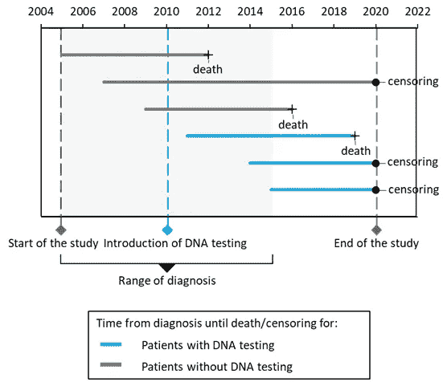
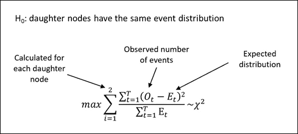

# 数据科学家生存分析的五个技巧

> 原文：<https://towardsdatascience.com/five-tips-on-survival-analysis-for-a-data-scientist-ba9fd97cbb2d?source=collection_archive---------13----------------------->

## 如何在商业中利用生存分析的指南

吉尔·海尔在 [Unsplash](https://unsplash.com?utm_source=medium&utm_medium=referral) 上的照片

# 生存分析预测事件发生的时间

许多分析问题需要预测事件发生的时间。例如，互联网提供商需要知道客户何时会终止合同，以便及时采取行动并防止客户流失。像这样的挑战可以通过生存分析来解决。

生存分析的目标是预测事件发生的时间，并估计“生存概率”。生存分析起源于医学研究，在医学研究中，对患者进行长期随访，直到某一事件发生，例如死亡，这是它被称为“生存分析”的原因。它用于具有右删失的数据集，其中对于样本的子集，事件的发生在研究时是未知的。例如，一名患者仅在 2 个月前进入研究，在研究时，我们不知道他是否会存活 5 个月或 10 年。仅次于存活时间预测，可以描述单个因素对存活的影响。例如，治疗对某种癌症类型的无病生存的影响经常用这种方法来研究。

由于 medium 本身提供了大量关于生存分析理论背景的博客，如果你不熟悉这种技术，我建议你去看看这些博客。在本文中，我将分享我作为数据科学家的经验中关于生存分析的额外技巧。

# 经典回归或分类不适用于右删失数据

选择生存分析的最重要原因是数据集中存在右删失样本。重要的是，右删失数据不使用回归或分类技术进行分析，因为此类分析不考虑删失或事件发生时间[4]。这可能导致得出不正确的结论。这里有一个(过于简化的)例子，说明事情是如何出错的:

假设你在一家 X 医院工作，你想描述影响癌症患者生存的特征。您拥有 2005 年至 2015 年间诊断的患者数据，并跟踪他们的生存情况，直到 2020 年，包括标准的患者特征，如年龄、性别等。然而，在 2010 年，X 医院引入了 DNA 测序，根据患者的 DNA 图谱对其患者进行个性化癌症治疗(参见图 1 的说明性研究概述)。你进行回归分析，得出如下结论:“有 DNA 测序的患者比没有的患者生存率差”。那是因为你的 DNA 测试病人的存活率最高。10 年(2010 年至 2020 年)，而在您的研究中，没有进行 DNA 测试的患者可以存活长达 15 年(2005 年至 2020 年)，这对每组的平均存活率有影响。鉴于几种 DNA 引导的癌症疗法的已知成功，这一结论是出乎意料和不正确的，而且可能传播错误信息。如果忽略了权利审查，这就是可能发生的事情。

作者图片

# 超越考克斯回归揭示了额外的机会

多变量生存分析的首选模型是 Cox 回归。它常用于医学研究，易于解释。它是用编程语言甚至像 SPSS 这样的统计分析软件包来实现的，SPSS 仍然是许多临床医生的最爱。然而，对于回归或分类问题，您可能不会将自己局限于线性或逻辑回归，对于生存分析，您还应该考虑 Cox 回归之外的方法。Cox 回归最重要的局限性在于，它是一种需要几个假设的线性建模技术[5]。如果您的目标是通过使用可能包含非线性关系的复杂数据集来获得高预测性能，则存在更合适的方法。

替代算法的一个例子是随机森林生存分析。随机森林仍然是许多数据科学家的最爱，因为与经典回归相比，它有许多最高级。随机森林建模有许多最高级，包括下面列出的这些:

*   它识别变量之间的非线性关系
*   与受假设限制的方法(如线性、逻辑或 Cox 回归)相比，它需要较少的数据转换
*   它说明了特征之间的相互作用
*   它性能良好，具有大量的功能
*   在有限的时间内，这是一个可行的解决方案

在生存分析中使用随机森林与用于分类或回归的随机森林模型非常相似，即许多树是基于数据集的子样本进行训练的，而预测是基于树的投票进行聚合的。生存特异性部分是模型基于例如对数秩检验，而不是基尼杂质，根据每个子节点中观察到的和预期的事件数之间的差异来评估每个分裂[6]。

作者图片

其他有趣的替代算法是基于例如惩罚 Cox 模型、梯度推进、支持向量机、使用贝叶斯统计的模型等的生存模型(见下一段中的细节)。

# 选择正确的编程语言为分析提供了更多的灵活性

使用 Python 或 R 是数据科学领域正在进行的讨论，每种语言都有其相对于其他语言的特定优势[7–9]。

Python 是一种通用编程语言，因为它提供了更好的稳定性、模块化和代码可读性。由于其深度学习库和更适合生产环境中的模型部署，它在行业中是首选的。

使用 Python 进行生存分析不如在 R 中普遍，因此 Python 在生存模型的选择上提供的自由度更小。然而，尽管数量有限，Python 中仍有很好的生存分析包:

*   [**生命线**](https://lifelines.readthedocs.io/en/latest/) 是一个参数模型包，包括单变量模型的实现以及 Cox 回归。
*   [**sklearn-survival**](https://scikit-survival.readthedocs.io/en/latest/index.html) 包括更复杂或非线性的模型，如可能具有 L1 或 L2 正则化的 Cox 回归、随机森林、梯度推进或支持向量机。
*   [**pysurvival**](https://square.github.io/pysurvival/) 用非常有用的模型评估可视化实现了 10 多个模型，不幸的是，它目前只在 Linux 上可用。

另一方面，R 擅长于统计计算和图形，因此它目前在学术界非常受欢迎。由于生存分析来源于医学研究(学术环境)并经常在其中进行，因此大多数创新都是由该领域发起的。因此，R 提供了各种各样的 [CRAN 包](https://cran.r-project.org/web/views/Survival.html)，其中包含大量的生存模型实现，包括替代算法(例如使用随机森林的生存模型的 **randomForestSRC** 或梯度推进算法的 **mboost** )、Cox 回归的扩展(例如使用正则化的 Cox 模型的 **glmnet** 或 Cox 回归模型的贝叶斯模型平均的 **BMA** )或模型评估包(例如**time AUC**如果需要集成到工业化的生产环境中，可以使用像 Azure Databricks 这样的解决方案大规模运行 R。****

因此，在选择用于分析的编程语言之前，要考虑业务问题、数据和需要交付的最终产品。

# 生存分析可以应用于不同的行业

在数据科学中，回归和分类是“必须知道的”数据分析技术。不幸的是，生存分析不是，也不清楚为什么。个人认为部分原因在名字上，“生存分析”。这表明该分析仅可用于生存预测，因此仅在医学研究中有用。

事实并非如此，因为生存分析实际上是一种非常通用和强大的分析技术。除了大量的健康分析案例，生存分析可以在许多行业中使用。在我们的团队中，我们在几个不同的项目中进行了生存分析:

我们开展了一个关于癌症患者生存预测的健康分析项目。与许多癌症生存研究相比，这个项目涉及生存分析与自然语言处理的整合。我们分析了医疗患者记录中的自由文本，以提取有价值的信息，例如使用正则表达式的特定放射学得分，以及估计填写文档的医生的总体情绪。将这些变量与标准临床数据结合在一起，使得最终模型具有很强的预测性能。

过去，我们也将生存分析应用于客户终身价值(CLV)的计算。CLV 估计在留住客户之前，企业可以从客户那里获得多少收入，它可以用来调整营销活动，在正确的时间瞄准正确的客户。在这个项目中，我们将 CLV 计算为每个客户每个时期的收入，并预测该时期的客户保留率，后者使用生存分析进行建模。这使得企业能够专注于留住他们最有价值的客户，这些客户在未来有流失的风险。

在另一个项目中，我们使用生存分析来预测二手车的受欢迎程度。使用汽车的品牌和车龄，我们对其受欢迎程度进行建模，受欢迎程度被定义为购买汽车前的库存天数。了解品牌和车龄对汽车受欢迎程度的影响有助于企业确定每辆车的最佳售价。

在健康分析之外应用生存分析的其他例子有:

*   类似于客户终身价值计算，有一个关于电信公司客户流失预测的著名案例[10]，其中生存时间对应于客户任期，事件是流失。同样，生存分析可以用来预测雇员终止合同的时间。
*   在金融学中，生存分析可以用于信用风险中违约概率的计算。
*   在工业企业中，生存分析可用于预测机器寿命。

# 结束语

总之，这是数据科学家应该知道的关于生存分析的五件事:

1.  这是一种预测事件发生时间的技术。
2.  **对右删失数据使用**其他数据建模技术，如**回归或分类，会导致有偏见的结果。**
3.  除了 Cox 回归，还有**多种多样的模型可用于生存分析**，具体取决于你的数据集和业务问题。
4.  目前，R 在分析中比 Python 提供了更多的灵活性。
5.  生存分析非常有用，**也在健康分析**之外。

最后，需要提及的是，本文为主观观点。在实践中，当我拿到我的第一个右删失数据集时，这是我想知道的关于生存分析的五个技巧。希望这些小技巧可以帮助到其他数据科学家的工作。

# 参考

[1] S. Dhamodharan，*生存分析|安介绍* (2020)，[https://medium . com/analytics-vid hya/Survival-Analysis-An-Introduction-87 a94c 98061](https://medium.com/analytics-vidhya/survival-analysis-an-introduction-87a94c98061)

[2] T. Zahid，*生存分析—A 部分* (2019)，[https://towards data science . com/Survival-Analysis-Part-A-70213 df 21 c2e](/survival-analysis-part-a-70213df21c2e)

[3] E. Lewinson，*生存分析导论* (2020)，*[https://towardsdatascience . com/Introduction-to-Survival-Analysis-6f 7 e 19 c 31d 96](/introduction-to-survival-analysis-6f7e19c31d96)*

*[4] K. Sawarkar，*生存分析——是什么？* (2019)，[https://medium . com/inside-machine-learning/survival-analysis-CB 5832 ffcd 78](https://medium.com/inside-machine-learning/survival-analysis-cb5832ffcd78)*

*[5] A .卡桑巴拉，*考克斯模型假设*，[http://www.sthda.com/english/wiki/cox-model-assumptions](http://www.sthda.com/english/wiki/cox-model-assumptions)*

*[6] H. Ishwaran，U.B. Kogalur，E.H. Blackstone 和 M.S. Lauer，*随机生存森林* (2008)，[《应用统计年鉴》](https://arxiv.org/pdf/0811.1645.pdf) 2008 年，第 2 卷，№3，841–860*

*[7] R. Cotton， *Python vs. R for Data Science:有什么区别？*(2020)[https://www . data camp . com/community/blog/when-to-use-python-or-r](https://www.datacamp.com/community/blog/when-to-use-python-or-r)*

*[8]数据驱动的科学， *Python 对 R 的数据科学:赢家是..* (2018)，[https://medium . com/@ datadrivenscience/python-vs-r-for-data-science-and-the-winner-is-3 ebb1a 968197](https://medium.com/@datadrivenscience/python-vs-r-for-data-science-and-the-winner-is-3ebb1a968197)*

*[9] B. Karakan，*Python vs R for Data Science*(2020)，[https://towards Data Science . com/Python-vs-R-for-Data-Science-6a 83 e 4541000](/python-vs-r-for-data-science-6a83e4541000)*

*[10] A. Pandey，*生存分析:直觉&在 Python 中的实现* (2019)，[https://towardsdatascience . com/Survival-Analysis-Intuition-Implementation-in-Python-504 FDE 4 fcf 8 e](/survival-analysis-intuition-implementation-in-python-504fde4fcf8e)*