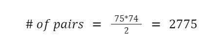
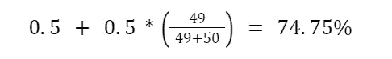

# 90%的人失败的五个棘手的统计和概率谜语

> 原文：<https://towardsdatascience.com/five-tricky-statistics-and-probability-riddles-that-90-of-people-fail-77db1eda2e15?source=collection_archive---------1----------------------->

## 有趣的脑筋急转弯会让你想学统计学

[由故事创造的人矢](https://www.freepik.com/vectors/people)——【www.freepik.com】T2

# 介绍

随着新年的临近，我认为分享一些统计谜语将是开始 2022 年学习之旅的一种有趣方式。

这些谜语不仅发人深省，还能帮助你学习基本的统计学和概率知识。如果你读过我以前的文章，你会知道我是学习统计和概率的巨大倡导者，因为大多数数据科学概念都建立在它的基础上。

因此，我还将介绍一些对您的数据科学职业生涯有所帮助的关键统计概念，包括以下内容:

*   **概率的基本性质**
*   **通用集合和样本空间**
*   **组合和排列**
*   **条件概率**
*   **预期值**

也就是说，这里有四个棘手的统计难题，90%的人第一次都会失败！

## **注:带解释的答案在底部。**

> **请务必点击** [**订阅此处**](https://terenceshin.medium.com/membership) **千万不要错过另一篇关于数据科学指南、技巧和提示、生活经验等的文章！**

# 1.生日问题

谜语:有多少个随机的人需要在同一个房间里，两个人有 99.95%的可能性在同一天生日？

a:75
B:183
C:365
D:500

# 2.两个问题儿童

谜语:假设一个家庭有两个孩子，我们知道其中一个是男孩。家里有两个男孩的概率有多大？

# 3.蒙蒂·霍尔问题

谜语:假设你在一个游戏展上，有三扇关着的门。其中一个后面是一辆汽车，另外两个后面是山羊。考虑以下场景:

1.  你选 1 号门。
2.  游戏节目主持人看着 2 号门和 3 号门，打开了有一只山羊的门。如果他们都有一只山羊，他会随机选择一只。
3.  在用山羊打开一扇门后，游戏节目主持人会让你选择切换到另一扇门或坚持你最初的猜测。

到底该不该换门？

# 4.最大化弹珠的赔率

谜语:假设你被判死刑，但国王给你一条生路，前提是你在下面的游戏中打败他:

1.  假设给你 50 颗红色弹珠、50 颗蓝色弹珠和 2 个空碗。
2.  你的目标是把 100 个弹珠分成两个碗，只要你用光所有的弹珠，你可以选择任何方式。
3.  然后，将随机选择一个碗，然后从选择的碗中随机选择一个弹球。如果弹珠是蓝色的，你活着，但是如果弹珠是红色的，你就死了。

你应该如何划分弹珠，这样你有最大的概率选择一个蓝色的弹珠？

# 5.多色卡片组

谜语:假设你有 40 张四种不同颜色的卡片。具体来说，有 10 张挑卡，10 张橙色卡，10 张绿色卡和 10 张紫色卡。每种颜色的卡片都从一到十编号。随机抽取两张牌。所选的两张牌不是同一个号码或同一个颜色的概率是多少？

> **请务必点击** [**订阅此处**](https://terenceshin.medium.com/membership) **千万不要错过另一篇关于数据科学指南、技巧和提示、生活经验等的文章！**

# 答案

# 1)答:75

为了理解为什么答案是 A: 75，你首先需要理解两个基本的统计学原理:

## 组合

组合被定义为你可以从 n 个对象中选择 r 的不同方式的数量，其中顺序并不重要。这很重要，因为我们想知道给定数量的人的唯一配对(组合)的可能数量。这可以通过下式计算:

作者创建的图像

## 概率的基本性质

概率有几个性质，但是对于这个问题，我们对其中一个特别感兴趣，**补充规则:**

作者创建的图像

如果 A 是集合中的一个事件，那么 A 不发生的概率等于 1 减去 A 发生的概率。

## 为什么答案是 A: 75

现在你已经理解了这两个概念，我们可以开始寻找答案了。

两个人生日不同的概率是 364/365。这是有道理的，因为第二个人和第一个人有 1/365 的机会过同一天生日。我们可以把这个重新措辞，说一对人同一天生日的概率是 364/365。

75 个人，有 2775 对独特的人(组合)。这是使用前面讨论的公式计算的:

作者创建的图像

现在我们知道了**一对**人生日相同的概率，并且我们知道 75 个人创造的独特对的数量是 2775，我们可以计算所有 2775 对生日不同的概率:

作者创建的图像

上面的等式告诉我们，所有对生日不同的概率是 0.05%。

使用互补法则，这相当于说有 1–0.05%的几率，或 99.95%的几率，至少有一对是同一天生日。

因此，答案是 75 人。

# 2) 1/3

为了理解为什么答案是 1/3，你首先需要理解几个概念:泛集和样本空间。

## 通用集

通用集合表示在给定场景中可能发生的所有可能事件(或结果)的集合。例如，滚动单一染料的通用集合为= {1，2，3，4，5，6}。

## 样本空间

样本空间是在给定一组约束的情况下考虑所有可能结果的通用集合的子集。

## 条件概率

条件概率简单地表示一个事件(A)在另一个事件(B)已经发生的情况下发生的概率。它被表示为 P(A|B)。

回到问题上，**通用集合**由以下四种可能的性别组合组成:

1.  男孩和男孩
2.  女孩和女孩
3.  男孩和女孩
4.  女孩和男孩

既然我们知道其中一个是男孩，那么我们的**样本空间**由三种可能性组成:

1.  男孩和男孩
2.  男孩和女孩
3.  女孩和男孩

现在我们可以计算第二个孩子是男孩的**条件概率**假设其中一个已经是男孩。因为这里只有一种可能性，两个孩子都是男孩，概率是 1/3。

# 3)是的，你应该经常换门。

这可以通过观察所有可能性的集合来解释，也就是宇宙集合:

作者创建的图像

这张表显示了在每种可能的情况下会发生什么，基于你选择哪扇门，哪扇门是奖励门，以及你是否切换门。

请注意，当您切换门时，您赢得了 9 个可能场景中的 6 个，相当于 2/3。

因此，你应该经常换门。

# 4)将 1 个蓝色弹珠放在一个碗里，将其他 99 个弹珠放在另一个碗里。

因为有几种可能性我们必须考虑，我们的目标是最大化选择蓝色弹珠的**期望值**。期望值被定义为所有可能值的总和乘以它发生的概率。

选择蓝色弹球的**期望值**可以写成以下等式:

选择碗 1 的可能性*选择碗 1 中的蓝色弹珠的可能性+
选择碗 2 的可能性*选择碗 2 中的蓝色弹珠的可能性

我们的目标是最大化上面的等式。由于选择给定碗的概率为 50%，因此简化为:

0.5 *在碗 1 中选择蓝色弹珠的概率+
0.5 *在碗 2 中选择蓝色弹珠的概率

通过在一个碗里放 1 个蓝色的弹珠，在另一个碗里放另外 99 个弹珠，你获得了 74.75%的最高概率。您可以测试任何其他可能的组合，但不会达到如此高的预期概率。

作者创建的图像

# 5\. 69.2%

假设你从 40 张牌中抽出了第一张牌。它有一些颜色和一些数字。

我们现在有 39 张卡片，其中 9 张与第一张卡片颜色相同，另外 3 张与第一张卡片号码相同。这意味着第二张牌有相同颜色或相同号码的概率等于(9+3)/39 = 4/13。

根据互补规则，这意味着第二张卡**与**不具有相同颜色或相同号码的概率等于 1–4/13 = 0.692 或 69.2%

# 感谢阅读！

> ***务必*** [***订阅此处***](https://terenceshin.medium.com/membership) ***千万不要错过另一篇关于数据科学的指南、诀窍和技巧、生活经验等文章！***

不确定接下来要读什么？我为你挑选了另一篇文章:

 [## 2022 年数据科学家 50+统计面试问答

### 一个更新的资源，为你的面试刷统计知识！

towardsdatascience.com](/50-statistics-interview-questions-and-answers-for-data-scientists-for-2021-24f886221271) 

**还有一个:**

 [## 2021 年 10 大最佳数据可视化

### 关于财富分配、环境、新冠肺炎等等的令人敬畏的可视化！

towardsdatascience.com](/the-10-best-data-visualizations-of-2021-fec4c5cf6cdb) 

# -特伦斯·申

*   ***如果你喜欢这个，*** [***订阅我的媒介***](https://terenceshin.medium.com/membership) ***获取独家内容！***
*   ***同样，你也可以*** [***关注我上媒***](https://medium.com/@terenceshin)
*   [***报名我的个人简讯***](https://terenceshin.substack.com/embed)
*   ***跟我上***[***LinkedIn***](https://www.linkedin.com/in/terenceshin/)***其他内容***