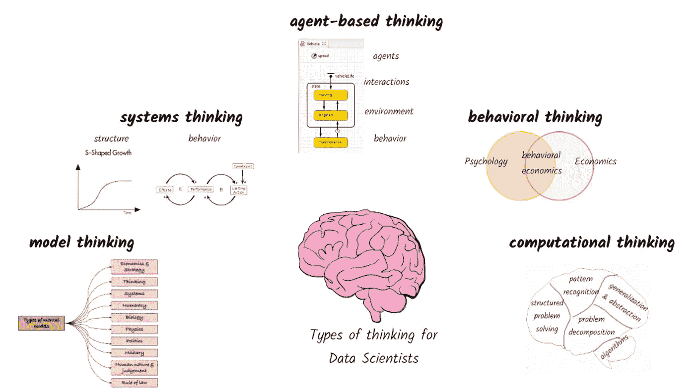

# 高绩效数据科学家的五种思维

> 原文：<https://towardsdatascience.com/five-types-of-thinking-for-a-high-performing-data-scientist-8ab70d70c23b?source=collection_archive---------10----------------------->

## [思考思考(上)](https://towardsdatascience.com/tagged/thinking)

## 从心智模型到计算思维

来源:作者制作

复杂性弥漫于当今社会——无论我们审视经济、在经济中运营的企业、在社会中扮演不同角色的个人，还是我们的物理、社会、政治和工业综合体如何相互作用，我们都不能忽视它的复杂性。没有一个单一或简单的解释可以概括这一切的复杂性。作为数据科学家，我们必须理解这种复杂性，并磨练我们的思维，以隔离重要的东西，忽略不重要的东西，并继续回答向我们提出的关键问题。

在这篇和随后的博客中，我计划详述一些关键的“思考”范例，这些范例帮助我将向我提出的抽象问题概念化，以及我如何能够解决这些问题以产生洞察力。虽然元认知或“思考思考”是一个丰富的讨论话题——我认为这对人工智能的努力至关重要——但我将在本系列中限制我对数据科学家有用的思维范式的关注。

# **模型思维**

作为数据科学家，我们需要的首要技能是根据*模型*进行思考。在最抽象的形式中，模型是对象、属性或过程的任何物理、数学或逻辑表示。比方说，我们想制造一种能够提升重物的飞机引擎。在我们建造完整的飞机发动机之前，我们可能会建造一个微型模型来测试发动机在不同条件下(例如，顶风、物体撞击)的各种属性(例如，燃料消耗、功率)。甚至在我们建造微缩模型之前，我们可能会建造一个三维数字模型，它可以预测用不同材料建造的微缩模型会发生什么。

在每种情况下，都有两个不同的实体——一个*模型*和被建模的*对象*。在第一种情况下，微型模型发动机是整个飞机发动机的模型。在第二种情况下，发动机的数字模型是微型模型发动机的模型。数字模型本身必须模拟飞行物理的不同方面(如推力)。所以模型不需要总是一个对象，它也可以是一个*属性*。例如，引力模型考虑了两个物体的相对质量以及它们质心之间的距离。在这种特殊情况下，模型是一个方程或数学表示。在微型模型发动机的情况下，模型是物理模型。

模型也可以是关于一个*过程*的。例如，一个相当常见的消费者购买过程模型是从认知、考虑、购买和重复购买开始的。这里的模型是一步一步过程的逻辑表示。相同的逻辑表示可以用等式表示，也可以编程为代码。

因此，模型是现实的抽象或值得研究的东西。它们也是我们解释和理解世界的方式。伯克希尔·哈撒韦公司副主席查理·芒格是这种思维方式的最大支持者之一

> “我认为不可否认的事实是，人类的大脑必须在模型中工作。诀窍是让你的大脑比其他人的大脑工作得更好，因为它理解最基本的模型:每单位做最多工作的模型。”“如果你养成了将你正在阅读的内容与正在论证的基本观点联系起来的思维习惯，你就会逐渐积累一些智慧。”

查理·芒格已经充分证明了这种模型思维在商业世界中的价值。这项技能不仅对投资至关重要，也是理解世界的更好方式。这种模型思维对于数据科学家和人工智能研究人员来说也是必不可少的。我们经常需要对人类决策的某些方面进行建模(例如，预测、优化、分类——更多详细信息请参见[2])或对某个过程或现象进行理解(例如，异常行为)。许多不同领域的领域专家——商业、科学(物理、化学、生物)、工程、经济或社会科学——经常要求我们构建模型来理解世界、获得洞察力、做出决策或采取行动。

如果数据科学家能够理解这些领域的心理模型，我们就可以更容易地将它们建模为数学公式、逻辑表示或代码。事实上，有许多关于心智模型的书籍[2-4 ],并且有数百种心智模型被分类。心智模型网站[6]列出了 10 个不同类别下的 339 个模型，包括经济和战略、人性和判断、系统、生物世界、物理世界等。Scott Page 在他的文章[7]中解释了为什么“多模型思考者”做出更好的决策。多模型思考者不仅是更好的决策者，能够思考并基于数百个心智模型构建模型集合的数据科学家也是更好的数据科学家。基本上，拥有一套模型对人类和机器都有好处！！

在这篇文章和随后的文章中，我将挑选一些我发现在商业世界建模中非常有用的心智模型。

图 1:什么是模型思维？(来源:作者出品)

# **系统思维**

在我三十年的商业和技术生涯中，我广泛使用的最有用、最实用、最深刻的心智模型是*系统思维*。它帮助我看到了更大的图景和看似不相关的领域之间的相互关系。我觉得对数据科学家来说，很好地理解系统思维并实践它是至关重要的。彼得·圣吉清晰地总结了什么是系统思维:

> “系统思维是一门学科，用于观察复杂情况下的‘结构’,以及识别高杠杆和低杠杆的变化。也就是说，通过观察整体，我们学会了如何促进健康。为此，系统思维提供了一种语言，它从重构我们的思维方式开始。”

有许多书籍[10-12]甚至多个系列的博客[8，9]描述系统思考。在我自己的作品中，巴里·里士满[12–13]和约翰·斯特曼[11]的作品对我影响最大。我将利用他们的工作来说明它是什么以及为什么它与数据科学家相关。

我们传统的教育课程强调分析性思维——解决问题、将其分解成组成部分、为这些部分开发解决方案并将它们组合在一起的能力。作为顾问，你被不断地敦促在你的思维中要有 MECE(互斥的和集体穷尽的),清晰地提出你的假设，并开发出一套 MECE 选项来解决任何问题。虽然分析和 MECE 思维在理解问题时确实有特定的作用，但我们经常被它蒙蔽，很少质疑它。另一方面，系统思维是 MECE 思维的完美反例。让我们回顾一下系统方法需要的一些关键思维模式。

***动态思维***——根据问题如何随时间演变来强化问题框架的思维模式。静态思维关注的是具体事件，而动态思维关注的是物理或人类系统的行为如何随着时间的推移而变化。思考输入如何随时间变化以及它对输出行为的影响的能力至关重要。

数据科学家通常使用某个时间点的横截面数据来处理问题，以进行预测或推断。不幸的是，考虑到大多数问题周围不断变化的环境，很少有东西可以进行静态分析。静态思维强化了“一劳永逸”的建模方法，这种方法往好了说是误导，往坏了说是灾难性的。即使是简单的推荐引擎和基于历史数据训练的聊天机器人也需要定期更新。理解变化的动态本质对于构建稳健的数据科学模型至关重要。

***系统因思维***——一种思维模式，决定我们系统的边界(即广泛边界)内包括什么，以及要包括什么的粒度级别(即密集边界)。广度和深度的界限取决于我们分析系统的环境，以及什么在决策者的控制之下，什么在他们的控制之外。

数据科学家通常使用提供给他们的任何数据。虽然这是一个很好的起点，但我们还需要了解更广泛的背景，即如何使用模型，以及决策者可以控制或影响什么。例如，在构建机器人建议工具时，我们可以包括许多不同的方面，从宏观经济指标、资产类别表现、公司投资策略、个人风险偏好、个人的生命阶段、投资者的健康状况等。要包含的因素的广度和深度取决于我们是在为个人消费者、顾问、财富管理客户，甚至是政府的政策制定者打造一个工具。更全面地了解不同因素以及它们如何与用户和用户环境相互影响，将有助于我们建立有针对性的模型，并适当地确定它们的范围。

***森林思维***——这种思维模式让我们能够看到“更大的图景”并在必要时进行汇总，同时又不会丢失必要的细节。通常，数据科学家在查看数据的单个元素(例如，单个客户数据)时，会被迫进行逐树思维，而看不到解决所提出的问题需要哪些数据的更大图景。我经常看到这转化为“使用可用数据建立我们可以建立的最佳模型”，而不是探究“可能需要收集什么数据来解决我们的问题”。

***运营思维*** —一种专注于行为在系统中如何表现的运营过程或“因果关系”的思维模式。运营思维的对立面是我之前提到的因素思维或基于列表的思维或 MECE 思维。依赖机器学习作为数据科学的主要或唯一方法很容易导致我们所有人进入因子思维，专注于预测输出变量，而不考虑过程或因果关系。虽然这在许多应用中可能是合适的，但是它们不是普遍适用的。最近对可解释的人工智能的研究是试图重现一些答案是如何得出的过程和基本原理。

***闭环思维***——一种寻求识别系统中反馈回路的思维模式，通过反馈回路某些结果成为原因。占主导地位的“时间如箭一般”是一种强大的思维模式，它限制了我们对商业和科学的思考。数据科学家也未能幸免于这一趋势。系统动力学社区广泛使用的因果循环图和股票流图以及因果推断是数据科学家可以用来脱离直线思维的一些工具。

这些只是系统思考的几个关键模式。Barry Richmond [12，13]还谈到了 ***定量思维******科学思维******非线性思维*** 和 ***万计思维*** 。此外，他还分享了值得研究的沟通和学习原则。

我发现系统思考方法特别有吸引力，原因有几个。首先，它提供了一种可供选择的思维方式，更重要的是，这种思维方式可以将不同的部分联系起来，并且通常会带来解决问题的独特视角。第二，它更加开放，提供多种观点和权衡来进行分析，而不是要求一个唯一正确的答案。这通常会导致更明智的人类决策，而不是脆弱和无法解释的机器决策。第三，它提供了一种更好的解释和交流决策的方式。在后续的文章中，我将举一些具体的例子来说明这些好处。

图 2:什么是系统思维？(来源:作者制作)

# 基于主体的思维

如果你在网上搜索基于主体的思维，你可能在基于主体的思维上找不到多少；取而代之的是，你会看到许多关于 ***基于代理的建模*** (ABM)的引用。虽然 ABM 是我将在以后的文章中探讨的这种思想的具体实现，但我想把重点放在构建这种基于代理的模型之前的思想上。

***基于主体的思维***——一种思维模式，其中我们关注更简单的(或原子的)实体或概念，以及这些实体之间相对简单的交互如何导致涌现的系统行为。与系统思维类似，我们对系统层面的行为感兴趣，但是我们不是从自顶向下的角度观察关系，而是从自底向上的角度分析系统行为。这种思维是以个人为中心的——个人的状态(身体或精神)是什么，个人如何与其环境和其他个人互动，以及这如何改变其状态。这种以个人为中心或基于代理的思想可以应用于物理资产(例如，恒温器可以被认为是代理)、个人消费者(例如，在营销环境中对做出购买决定的个人消费者进行建模)、公司实体(例如，按照自身利益行事以使市场有效的公司)，或者甚至国家政府(例如，基于其比较优势彼此进行贸易的国家)。

系统思维和基于主体的思维可以应用于同一组问题，并产生类似的结果，但从不同的思维模式或心理模型来处理它。例如，众所周知的疾病进展流行病学模型——SEIR(易感、暴露、传染、康复),可以从系统角度或个体角度进行分析。当我们观察整个易感人群、暴露人群等时，我们是在系统水平上工作，如果我们观察每个人的状态，如他们是否已经感染、康复等。我们在基于代理的水平上操作。

当我们想从疾病进展的总体行为转向个体行为时，基于主体的思维成为一种更自然的思维方式。例如，如果我们不仅对总体感染水平感兴趣，而且希望了解哪些人容易感染疾病或特定人的行为(例如，社交距离或戴口罩)，以及它们如何促进疾病发展，基于代理的思维是一种更自然的方法。

基于主体的思维是基于主体的建模(也称为基于主体的模拟或微观模拟系统)、多主体系统和强化学习的基础。因此，数据科学家需要善于从个体代理的角度分析问题，其中个体代理可能是物联网设备或物理资产(更普遍的说法是“数字双胞胎”)或个体决策实体，如消费者、企业等。

我发现基于代理的思维在某些情况下特别有吸引力。首先，当实体或代理的集合是可识别的和异质的时，它提供了一种研究它们行为的直观方式。第二，当实体之间的交互更加本地化时，用基于主体的思维来研究它们就更容易了。第三，当个体行为(或群体行为)比系统行为更重要时，基于主体的思想提供了一种更好的方法。第四，当个体实体以不同的方式适应和改变时，我们最好在个体层面建模，而不是在系统层面。在后续的文章中，我将使用具体的例子来探讨系统和基于代理的思维之间的更多相似之处和不同之处。

图 3:什么是基于主体的思维？(来源:作者出品)

# **行为(经济学)思维**

围绕人性和判断的心智模型集合[6]，通常被称为行为经济学，在我的咨询和人工智能之旅中对我产生了重大影响。有趣的是，人工智能和行为经济学有着共同的祖先。希尔伯特·西蒙的有限理性概念质疑了“人类是理想的理性决策者”的主流观点，相反，他认为我们做出的决定受到我们的思维能力、可用信息和时间的限制[14]。这是行为经济学领域[15-17]的基础，该领域自 20 世纪后期以来一直处于优势地位。西蒙也被认为是人工智能的创始人之一，他在开发启发式程序和人类问题解决方面的工作为未来的符号人工智能系统奠定了基础。用他的话说[14]，

> 有限理性的原则是，与问题的规模相比，人类思维制定和解决复杂问题的能力非常小，而这些问题的解决方案是现实世界中客观理性行为所需要的，甚至是这种客观理性的合理近似。

在过去的几十年里，行为经济学对学术界和商业界产生了深远的影响，包括人类如何做出决策[15]，做出决策的基本过程[16]，他们如何偏离理想的效用最大化经济观点，以及如何引导他们做出符合自身利益的决策[17]。

***行为(经济)思维*** (或简称 ***行为思维*** )是一种思维模式，关注人类*如何真正*做出决策，而不是他们*应该*如何做出决策。当我们使用基于主体的思维时，我们通常需要理解人类如何做出决策(例如，关于购买什么商品、投资多少等的决策)。锚定、违约、跟风效应、损失厌恶、双曲线贴现和大量其他启发法等行为经济学原理试图解释我们在不同情景下如何做出决策。我将在接下来的文章中更详细地探讨这些。

作为一名数据科学家，我发现行为思维在两个具体方面很有用。首先，它帮助我们了解人类如何做出决策，以便我们可以了解数据科学家建立的模型将如何被他们使用，以及更好地采用这些模型所需的解释。第二，它有助于我们在代理内模拟人类决策，以模拟或观察整体行为。这第二个方面可以看作是基于主体的思维的进一步专门化。

图 4:什么是行为思维？(来源:作者出品)

# 计算思维

计算思维这个术语是由西蒙·派珀特[18]在 1980 年首次提出的。然而，计算思维作为计算机科学教育的一个关键组成部分的重要性是在 Jeannette Wing 的一篇论文[10]之后出现的。随着算法思维、科学、工程和商业各个方面的计算方法的出现，计算思维的基础在上个世纪的后半个世纪已经日趋成熟。

***计算思维*** 是一种强调结构化问题求解、问题分解、模式识别、概括和抽象，并能被计算机编码和执行的思维模式。计算思维对工业革命之后的一系列革命产生了深远的影响——计算革命、互联网和智能手机革命，以及现在的大数据、分析和人工智能革命。

虽然我之前讨论的所有思维模式都可以用于理解人类和机器，但计算思维是创建智能系统的核心。或者，我们也可以将计算思维视为编码和实现其他类型思维的机制。因此，作为一名数据科学家，我们必须经常进行计算性思考，并对我们提供的指令保持精确。

图 5:什么是计算思维？(来源:作者出品)

在这篇介绍性文章中，我解释了五种关键的思维模式——每一种都是对前一种的提炼。在接下来的几篇文章中，我们将深入研究这些思维模式的细节，并举例说明如何应用它们来解决商业和科学问题。

**参考文献**

[1]特伦斯格里芬。[我从查理·芒格那里学到了很多关于心智模式和人情世故的东西](https://25iq.com/2015/08/22/a-dozen-things-ive-learned-from-charlie-munger-about-mental-models-and-worldly-wisdom/)。2015 年 8 月 22 日。

[2]阿南德·拉奥。[开发以人为中心的 AI 的十种人类能力和四种智能](https://medium.com/swlh/ten-human-abilities-and-four-intelligences-to-exploit-human-centered-ai-b48c5ea1c8be)。中—启动，2020 年 10 月 10 日。

[3]沙恩·帕里什和里扬农·博比恩。伟大的心智模型第 1 卷:一般思维概念。格子出版公司 2019。

[4]沙恩·帕里什和里扬农·博比恩。伟大的心智模型第 2 卷:物理、化学和生物。格子出版公司 2020。

[5]加布里埃尔·温伯格和劳伦·麦肯。超级思维:心智模型大全。作品集，2019。

用心智模型来理解世界:339 种模型被解释为随身携带在你的头脑中。

[7]斯科特·E·佩奇。[为什么“多模型思考者”做出更好的决策](https://hbr.org/2018/11/why-many-model-thinkers-make-better-decisions)《哈佛商业评论》，2018 年 11 月 19 日。

[8]莱拉·阿卡罗格鲁。[系统思考者的工具:系统思考的六个基本概念](https://medium.com/disruptive-design/tools-for-systems-thinkers-the-6-fundamental-concepts-of-systems-thinking-379cdac3dc6a)。中等——颠覆性设计。2017 年 9 月 7 日。

[9]安德鲁·亨宁。[系统思考第 1 部分——要素、相互联系和目标。中等—更好的系统](https://medium.com/better-systems/systems-thinking-part-1-elements-interconnections-and-goals-27877e1c5975)。2018 年 8 月 1 日。

10 多内拉·梅多斯。系统思维:初级读本。切尔西格林出版社。2008.

[11]约翰·斯特曼。[商业动态:复杂世界的系统思考和建模](https://www.amazon.com/Business-Dynamics-Systems-Thinking-Modeling/dp/007238915X/ref=sr_1_1?dchild=1&qid=1618671289&refinements=p_27:John+Sterman&s=books&sr=1-1)。麦格劳-希尔教育公司。2000.

12 巴里·里士满。与 Stella 一起介绍系统思维。ISEE 系统公司，2004。

13 巴里·里士满。[系统思维中的“思维”。怎么才能让它更容易掌握？](https://thesystemsthinker.com/the-thinking-in-systems-thinking-how-can-we-make-it-easier-to-master/)。系统思考者。

[14]希尔伯特·西蒙。有限理性模型第 1 卷:经济分析与公共政策。麻省理工学院出版社。1984.

[15]丹·艾瑞里。可预测的非理性，修订和扩展版:塑造我们决定的隐藏力量。哈珀·柯林斯，2009 年。

[16]丹尼尔·卡内曼。思考，忽快忽慢。法勒、斯特劳斯和吉鲁，2013 年。

17 理查德·塞勒和卡斯·桑斯坦。推动:改善关于健康、财富和幸福的决定。企鹅图书，2009 年。

[18]西蒙·派珀特。头脑风暴:儿童、计算机和强有力的想法。基础图书公司，1980 年。

[19]珍妮特·温。计算思维。《化学文摘》第四十九届会议的信息通报(3):第 33- 35 页。2006.