# Python 的五个意想不到的行为可能会令人惊讶

> 原文：<https://towardsdatascience.com/five-unexpected-behaviours-of-python-could-be-surprised-70c9b47f5e40?source=collection_archive---------8----------------------->


图片由 [chriszwettler](https://pixabay.com/users/chriszwettler-23331959/?utm_source=link-attribution&utm_medium=referral&utm_campaign=image&utm_content=6780354) 来自 [Pixabay](https://pixabay.com/?utm_source=link-attribution&utm_medium=referral&utm_campaign=image&utm_content=6780354)

## 一些你需要知道的关于 Python 的冷知识

每种编程语言都可能有一些有趣的事实或神秘的行为，Python 也是如此。事实上，作为一种动态编程语言，Python 中有更多有趣的行为。

我敢打赌，大多数开发人员可能从未经历过这些场景，因为我们大多数人会编写“常规”代码。但是，从别人那里知道这些事情，提醒自己避免一些陷阱，还是有好处的。此外，我们可以从这些例子中学习，以更深入地了解 Python。

在本文中，我将演示其中五个有趣的场景。如果你想了解更多，这里还有另外三个:)

</three-mysterious-behaviours-of-python-95c9dffa88fe>  

# 1.“+=”不是原子操作


很不幸，此时此地的图片结束了我在 Pixabay 上的旅程

我们知道 Python 中的 tuple 是一个不可变的对象，所以一旦它被创建，我们就不能改变它的元素。

```
my_tuple = (1,2,3)
my_tuple[0] = 11
```

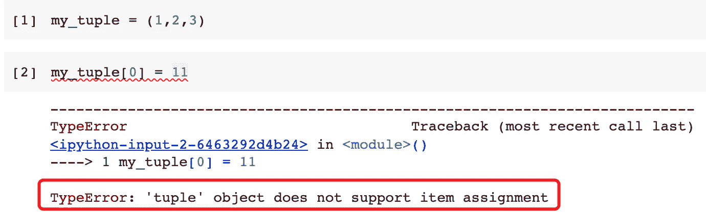

嗯，这是意料之中的。然而，Python 中的列表是可变的。因此，我们可以向列表中添加更多的元素，即使它是元组中的一个元素。毫不奇怪，如果我们用列表作为条目定义一个元组，我们可以用更多的条目扩展其中一个列表。

```
my_tuple = ([1],[2],[3])
my_tuple[2].extend([4,5])
```

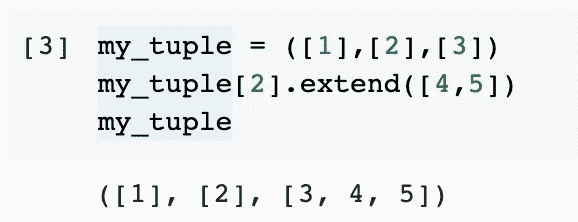

我们使用了`extend()`方法，将一个列表附加到另一个列表。但是，如果我们尝试使用“+=”操作符来扩展列表呢？

```
my_tuple[2] += [6,7]
```

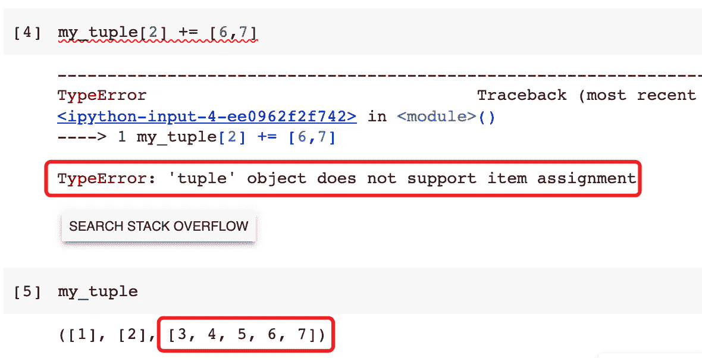

由于元组是不可变的，它不允许我们用新的列表`[3,4,5,6,7]`替换原来的列表`[3,4,5]`。然而，如果我们试图打印元组，我们会发现列表被改变了！

这是因为运算符“+=”不是原子操作。基本逻辑如下。

1.  由于我们使用了“+=”，Python 会将列表`[6,7]`追加到元组中的原始列表。它将在处**发生，因为我们使用了“+=”。**
2.  它将尝试将新列表分配回元组。

好的。该操作不是原子的，它由两个步骤组成:**扩展**和**分配**。第二步赋值将失败，因为元组是不可变的。但是，第一步在适当的位置修改了列表，因此列表已经被更改。

这就是为什么我们看到错误消息，但是元组中的列表已经被更改。

# 2.类属性存储在字典中


图片来自 [Pixabay](https://pixabay.com/?utm_source=link-attribution&utm_medium=referral&utm_campaign=image&utm_content=3486434)

我们知道可以在 Python 类中定义类属性。因为它是一个类属性(在某种程度上类似于其他编程语言中的静态属性)，所以我们可以在没有实例化对象的情况下访问它。

让我们定义一个父类和两个子类。

```
class Parent:
    class_attr = 'parent'class Child1(Parent):
    passclass Child2(Parent):
    pass
```

因为这两个子类是从父类继承的，所以它们也将继承 class 属性。所以，这三者的属性值都是一样的。

```
print(Parent.class_attr, Child1.class_attr, Child2.class_attr)
```

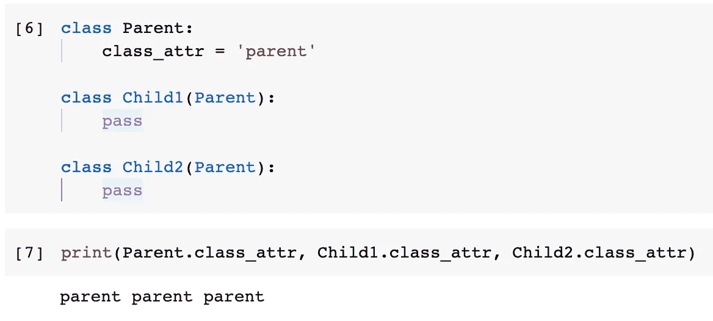

现在，如果我们显式地给子类中的 class 属性赋值，就会显示出区别。

```
Child1.class_attr = 'child1'
```

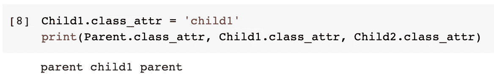

但是，如果我们更改了父类的值，所有其他从未覆盖该类属性的子类也会反映这一更改。

```
Parent.class_attr = 'parent_new'
```

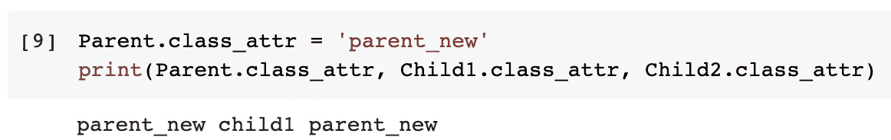

这是因为所有这些类属性都将存储在该类的专用字典中。我们可以使用`__dict__`来访问这本字典。

```
Parent.__dict__
Child1.__dict__
Child2.__dict__
```

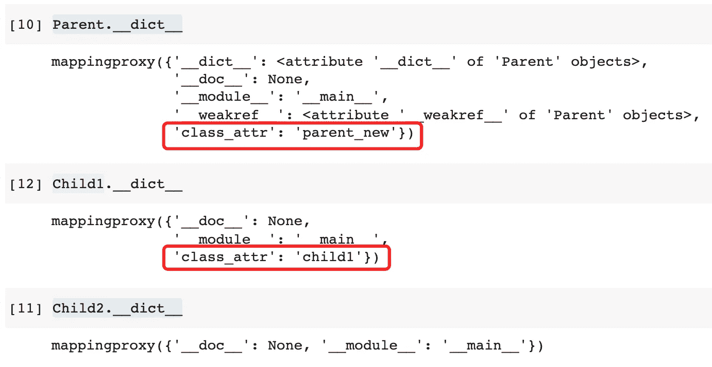

如果我们不覆盖属性，子类的字典中就不会有这样的键值对。然后，它将试图在它的父类中找到它。如果我们给 class 属性分配了一个子类的值，它将在字典中维护它。

# 3.消失的错误信息


图片来自 [Pixabay](https://pixabay.com/?utm_source=link-attribution&utm_medium=referral&utm_campaign=image&utm_content=1037609) 的[Steve buiss NNE](https://pixabay.com/users/stevepb-282134/?utm_source=link-attribution&utm_medium=referral&utm_campaign=image&utm_content=1037609)

与大多数其他编程语言不同，Python maximum 扩展了变量的范围。例如，如果我们在 if-else 条件中定义了一个变量，就可以从它的外部作用域访问它。

```
if True:
    a = 1print(a)
```

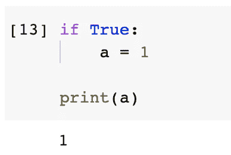

然而，对于一个 try-except 块来说，这是不正确的。

```
try:
    1/0
except ZeroDivisionError as e:
    a = 1print('a =', a)
print('The exception was:', e)
```

在上面的代码中，我们有意触发了一个异常，并在 except 块中捕获了它。然而，消息`e`不再可访问，而普通变量`a`仍然可以访问。

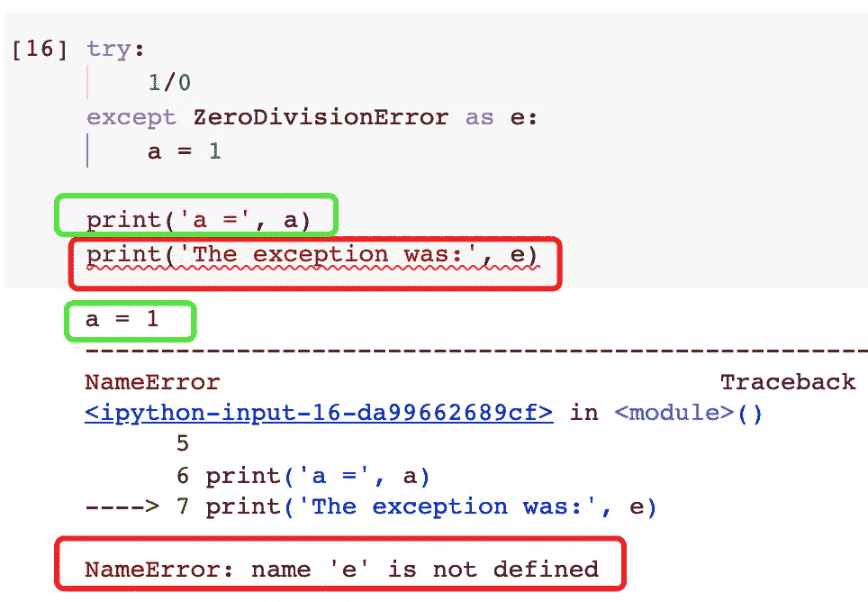

如官方文件所述:

> 当使用`as target`指定一个异常时，它在 except 子句的末尾被清除。异常之所以被清除，是因为有了对它们的回溯，它们与堆栈帧形成了一个引用循环，使该帧中的所有局部变量保持活动状态，直到下一次垃圾回收发生。
> ref:[https://docs . python . org/3/reference/compound _ stmts . html #除了](https://docs.python.org/3/reference/compound_stmts.html#except)

如果我们真的想保留那个错误消息，我们仍然可以通过将它赋给另一个变量来实现，如下所示。

```
err_msg = Nonetry:
    1/0
except ZeroDivisionError as e:
    print('The exception is:', e)
    err_msg = eprint('The exception was:', err_msg)
```

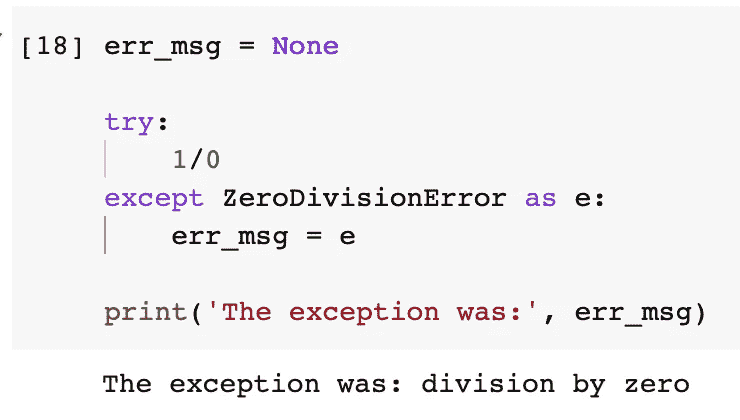

# 4.不可靠的价值转移


图片来自 [Pixabay](https://pixabay.com/?utm_source=link-attribution&utm_medium=referral&utm_campaign=image&utm_content=2779738) 的 [Tommy_Rau](https://pixabay.com/users/tommy_rau-6366094/?utm_source=link-attribution&utm_medium=referral&utm_campaign=image&utm_content=2779738)

NumPy 是 Python 中使用最广泛的库之一。它擅长模拟多维数组。现在，让我们写一个函数来定义一个 NumPy 数组，但不返回它。

```
import numpy as npdef make_array(num):
    np.array([num])
```

我知道，写这样一个函数没有任何意义，但我只是想展示有趣的行为。

现在，让我们使用这个函数创建一个 NumPy 数组，然后使用`np.empty()`函数创建一个只有 1 个值的空数组。同样，让我们显式地指定我们想要空数组中的整数。

```
make_array(12345)
np.empty((), dtype=np.int)
```

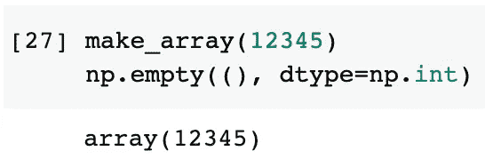

为什么我们能获得这个函数创造的价值？

事实上，NumPy 数组是在函数中创建的。然而，它没有被函数返回，所以这个数组的值变成了“垃圾”。这个垃圾值的内存地址将被释放。换句话说，这个内存地址现在可以用于其他目的。

然后，`np.empty()`函数将创建一个空数组，其中的值占位符指向内存。在这种情况下，将使用最近释放的内存。这就是为什么我们可以在新的空数组中看到值。

# 5.不可见的迭代条件


图片来自[不允许从](https://pixabay.com/users/lmoonlight-236255/?utm_source=link-attribution&utm_medium=referral&utm_campaign=image&utm_content=3260697) [Pixabay](https://pixabay.com/?utm_source=link-attribution&utm_medium=referral&utm_campaign=image&utm_content=3260697) 向图片社出售我的照片

**请注意，这个例子中的代码是完全错误的！这仅用于演示目的！**

让我们定义一个简单的字典，然后循环它。对于这个字典的每个循环，我们希望删除一个键值对并创建一个新的键值对。代码如下(还是那句话，**这种代码的写法不对！**)。

```
my_dict = {1: 1}for key in my_dict.keys():
    del my_dict[key]
    my_dict[key+1] = key+1
    print(key)
    print(my_dict)
```

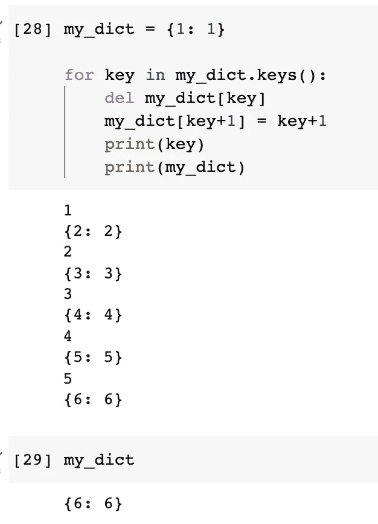

最初的直觉猜测是什么？这会是一个无限循环吗？不，结果相当令人惊讶。

我们认为我们写了一个 bug，它应该是一个无限循环。不过每次都停在 6(Python 3.7)。

对于 Python 字典，通常创建的最小长度是 8。当它达到长度的 2/3 时，词典将自动调整大小。是调整大小导致了迭代的失败。8 * (2/3) = 5.33，正好是我们停下来的数字。

当在第 6 个项目处触发调整大小时，这导致“下一个”键现在位于“更早的”槽中。

# 摘要


图片来自[特朗普](https://pixabay.com/users/phamkhanhquynhtrang-22873796/?utm_source=link-attribution&utm_medium=referral&utm_campaign=image&utm_content=6760871)来自 [Pixabay](https://pixabay.com/?utm_source=link-attribution&utm_medium=referral&utm_campaign=image&utm_content=6760871)

在本文中，我展示了 Python 中五个有趣而神秘的行为，包括类属性、非原子的“+=”操作、在外部作用域中访问 except 错误消息、NumPy 空函数和字典。希望这些例子能引起你的兴趣，尽管从编程的角度来看，有些例子是完全错误的。

如果你觉得这篇文章中的例子很有趣，我会在以后找到更多这样的例子和技巧！

<https://medium.com/@qiuyujx/membership>  

如果你觉得我的文章有帮助，请考虑加入 Medium 会员来支持我和成千上万的其他作者！(点击上面的链接)