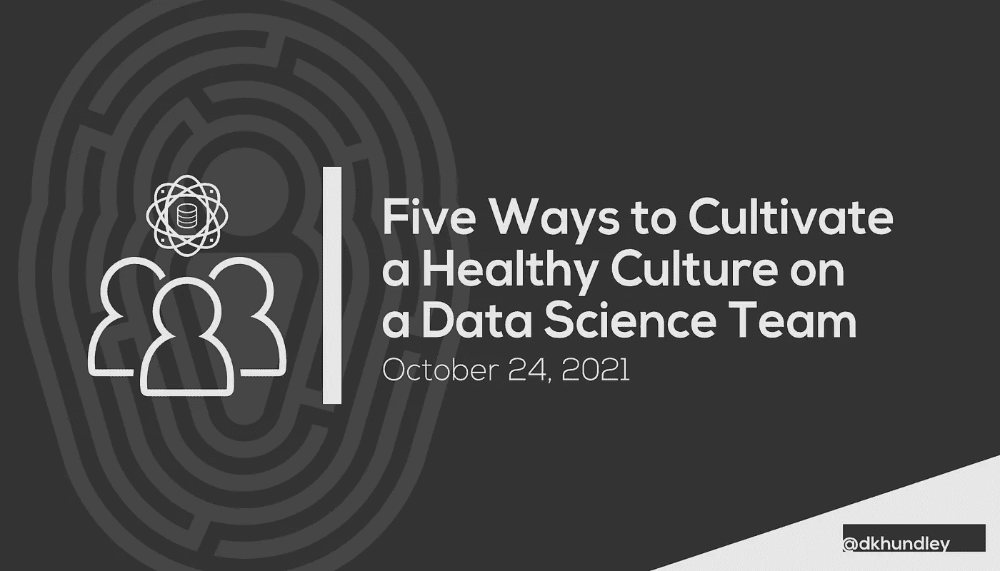

# 在数据科学团队中培养健康文化的五种方法

> 原文：<https://towardsdatascience.com/five-ways-to-cultivate-a-healthy-culture-on-a-data-science-team-4f558c56ed62?source=collection_archive---------12----------------------->

## 帮助您在数据科学团队中培养强大文化的战略方法

大家好！我们今天发布了一个新帖子，将学习新的硬技能放在一边，专注于数据科学领域的一些重要软技能。不言而喻，健康的工作文化对任何工作都很重要，对数据科学家和机器学习工程师来说也是如此。健康的工作文化有助于提高生产力，留住优秀员工，并让你的队友开心。

虽然我现在的日常工作是一名实践机器学习工程师，但你可能不知道的是，我的大部分教育和工作根源都是在商业和领导力方面。简单介绍一下我的背景:几年前，我从面向业务的角色转向了数据科学领域。因此，我实际上没有任何数据或计算机科学领域的正式学位。实际上，我有一个组织领导力的硕士学位，并持有几个以领导力为导向的认证，比如项目管理专家(PMP)、认证 Scrum Master (CSM)等等。

好了，别再自吹自擂了！我分享这一点的唯一原因是，当我进入目前的机器学习工程师角色时，我将许多相同的原则带到了这里，几乎两年后，我真的为我的工作团队感到自豪。他们是一群合作愉快的人，每个人都在教学和互相鼓励方面做得很好。我的团队的生产能力也同样高！

当然，我希望看到每个人都茁壮成长并取得成功，所以我想分享五个策略来帮助培养您自己的数据科学团队的文化。坦率地说，所有这些策略的基本原则对于任何非数据科学的工作都同样重要，但在可能的情况下，我会特别针对数据科学角色对这些策略进行一些战术上的调整。

事不宜迟，让我们开始我们的战略吧！

# 1.优雅地接受所有的想法。

这是名单上的第一名。尽管统计的严谨性等许多事情是该角色的关键要素，但数据科学家通常必须在他们做许多事情的方式上具有创造性。请记住，数据科学家的预测模型与解决业务问题有直接关系，请记住，即使没有数据科学，解决业务问题的方法也往往不止一种。因此，将有不同的选项来协调不同目的的不同模型，不同的建模方法(例如，标准监督学习与深度学习)，等等。

当然，有些想法比其他的更好，但重要的是以同样的优雅程度尊重所有的想法。当你告诉一个人他的想法很愚蠢时，没有什么比这更能让他闭嘴了。这是极其贬低身份的，一个人在未来远不太倾向于分享新的想法。这个人可能对未来的项目有很棒的想法，但他们可能不会分享，因为害怕再次被嘲笑。

这是多层面的损失。这显然是企业的损失，因为他们错过了潜在的好主意，但这也是整个团队的损失。如果团队在分享新想法方面变得僵化，快乐水平肯定会下降，个人完全离开公司的可能性很大。

如果你想在你的团队中培养一种开放的优雅精神，那就从你自己开始吧。即使你不同意某个想法，也要感谢这个人的想法，并展开对话，引导团队提出更好的想法。谁知道呢，也许当初“坏主意”的一部分还能影响更好的方向呢？但是恩典必须从某处开始，没有比和你一起开始更好的地方了。

# 2.考虑定期举行展示新技能的会议。

在上面的策略中，我提到没有什么比贬低一个人更能让他闭嘴。**我会说** **下一件让人很快闭嘴的事是对某个话题缺乏了解**。实话实说:没有人喜欢看起来像个哑巴。我们倾向于过度补偿我们知识的缺乏，要么加倍我们舒适的东西，要么退缩到角落里。总的来说，我注意到数据分析领域的一个最大问题是，许多数据科学家会加倍研究传统的统计建模，因为像深度学习这样的新策略可能是一个学习挑战。

解决这个问题的一个非常有策略的方法是定期召开会议，为团队的其他成员分享学到的新技能。今天，我的团队每隔一周就这样做一个小时，老实说，这是我最喜欢的例会之一。学习一项新技能不仅很棒，而且经常会有关于如何在不同的项目中以不同的方式应用新技能的精彩对话。

关于对话的最后一点，我认为如果小组规模小得多，效果会好得多。我知道邀请你部门的每个人去学习新的东西是很诱人的，但是一旦你开始超过十个人，进行合理的对话就有点过时了。人太多就太难用了。对于更多的观众来说，可能会有不同类型的技能会议的空间，但为了获得最佳效果，我会鼓励从较小的人群开始。

# 3.确保团队最佳实践的清晰性。

在最后一个策略中，我们提到，当人们缺乏某方面的知识时，他们会感到厌烦，虽然一般的数据科学技能是一回事，但团队最佳实践和策略是另一回事。组织和标准可以帮助团队茁壮成长，但是如果每个人都不清楚这些实践是如何体现的，它们就没有用了。数据科学也不例外。我确信您的团队可能有组织 Git 存储库、从一个中心源获取数据等等的方法。

这里我将推荐两件具体的事情:一件显而易见，另一件不那么显而易见。第一个明显的例子:**在某个地方记录你团队的所有最佳实践**。即使这些都在一个 Git 项目的自述文件中，或者保存在每个人都知道可以访问的地方的 Word 文档中，这也比什么都不写要好。

第二点也是更重要的一点是**确保你的团队的实践在概念层面上不会复杂和简单到难以记忆**。即使你把它们都写下来，如果过程太复杂或者太麻烦，没有人会愿意去遵循它们。句号。文档应该被看作是一个参考指南，具体地做一些你已经有了大致概念的事情。

例如，您可能很清楚您的数据存储在一个中心源中。文档应该作为所有本质细节的参考，没有人应该在访问中央数据源时记住这些细节。请记住，即使一件复杂的事情如果做对了会变得很酷，但是如果没有人愿意持续地做这件事，它也是无用的。

# 4.推广结对编程的概念。

现代数据科学显然与现代计算机科学密切相关，因为我们使用 Python 或 R 等技术来构建预测模型。**普通的软件开发人员经常不得不努力让代码工作，数据科学家在代码中实现数据科学工作时同样面临许多相同的挑战**。作为一名机器学习工程师，我可以向你保证，我花在调试我认为应该工作的代码上的时间比一开始写代码要多得多！

如果你不知道，结对编程是一种让两个或更多的人同时处理相同代码的策略。通常会有一个人接手打字工作，并与他们的队友分享他们的屏幕，他们会就如何编码进行反复的对话。这通常会带来更好的编码方式的新想法，我个人将结对编程作为调试不工作的东西的绝佳时机。因为计算机科学需要如此精确的语法，一个简单的输入错误就可能对代码的功能造成严重破坏。第二双眼睛通常可以很快发现那些语法错误！

# 5.寻求小机会找乐子！

商业世界的诱惑是声明任何与促进商业没有直接关系的事情都是浪费时间。虽然我当然同意一个团队花费大量时间偷懒对公司的底线是有害的，但我认为重要的是要记住快乐的员工=高效的员工。尤其是在这个“大迁移”的时代，许多数据科学家都去了其他地方工作，快乐因素对于留住这些优秀人才极其重要。

除了是机器学习工程师，我还担任我团队的 scrum master。我知道一些 scrum 大师可能会把谈话引回到手边的业务上，如果它开始偏离到一个私人的、有趣的话题，但是我个人偶尔会允许这样做。是的，公司不在乎我的队友对我们玩的电子游戏或看的电影的看法，但如果我能保持团队的高昂士气，我可以保证公司的底线将通过更高的生产率和留住优质员工而得到实质性的提高。

伙计们，这又是一篇文章了！我希望这些策略有助于在您的数据科学团队中培养强大的工作文化。你还有什么要补充的吗？我总是渴望听到新的策略，所以请在评论中分享你的想法。感谢阅读，下期再见！