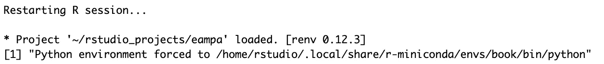
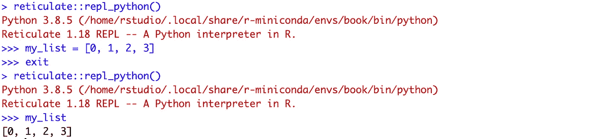
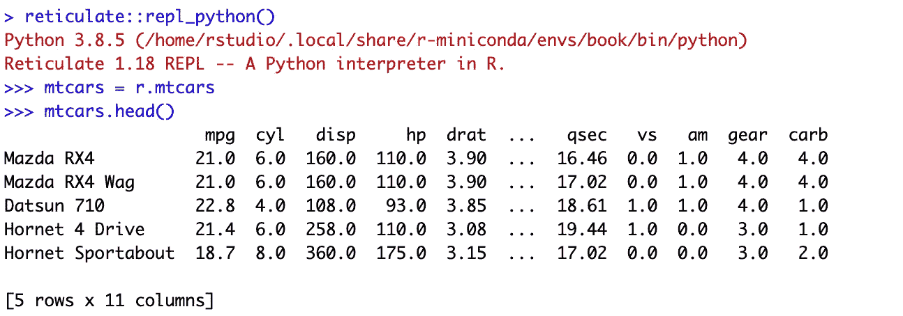
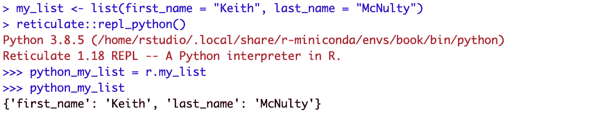
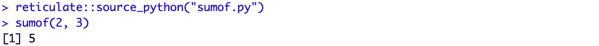
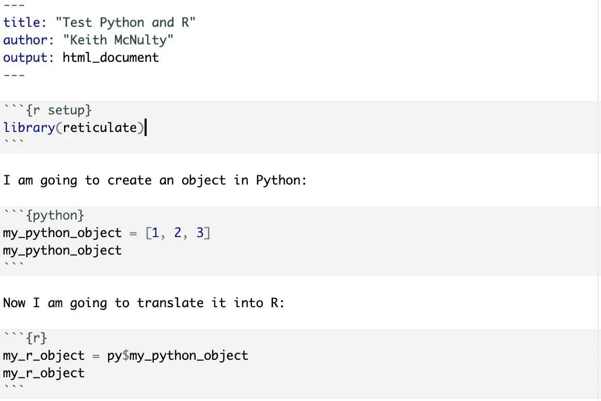
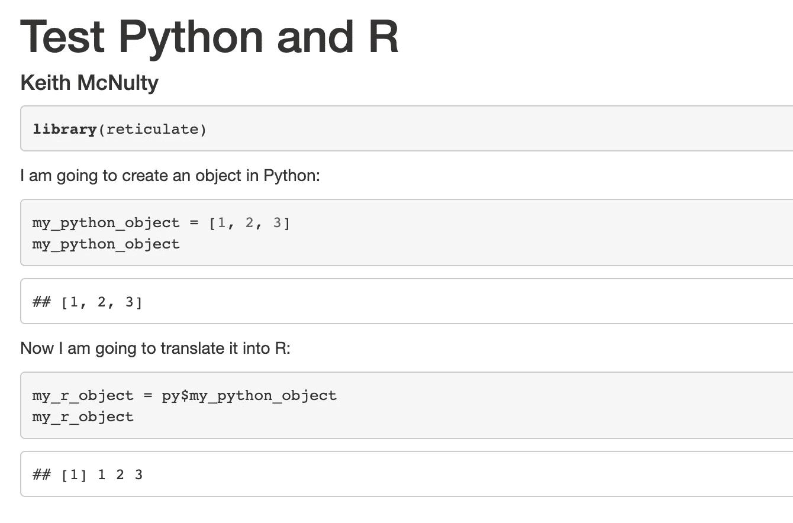
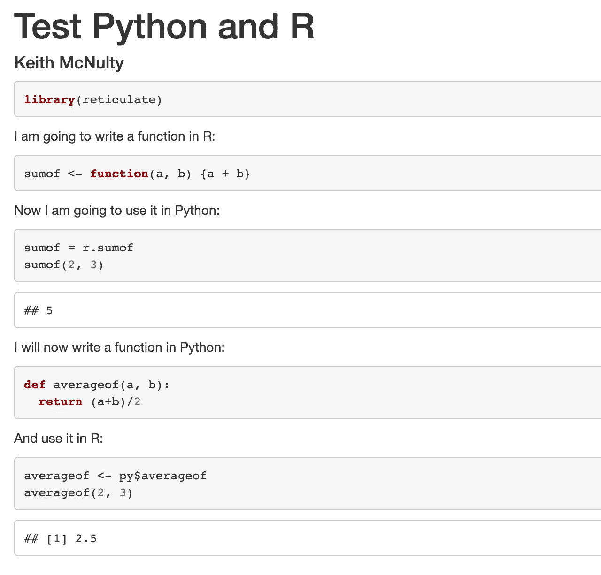

# 在同一个项目中实现 R 和 Python 无缝协作的五种方式

> 原文：<https://towardsdatascience.com/five-ways-to-work-seamlessly-between-r-and-python-in-the-same-project-bf173e35fdef?source=collection_archive---------8----------------------->

## 现在很容易同时使用两种语言来获得最佳效果

最近我发现自己同时使用 R 和 Python 做了更多的项目。对我来说，在工作中使用最好的工具，不受单一语言的限制变得越来越重要。有些事情 Python 做得最好，有些事情 R 做得最好，所以如果我们能在需要的时候使用这两者，我们就能做到最好。在最近的一个[例子](/generating-parameterized-powerpoint-documents-in-python-and-r-333368479038)中，我想创建一个闪亮的应用程序来生成参数化的 Powerpoint 文档，并想用 R 编写我的数据处理代码以利用 tidyverse，但使用 Python 编写 Powerpoint 编辑代码，这在`python-pptx`包中很容易。

现在，在 RStudio IDE 中使用这两种语言非常容易。要做到这一点，您需要在 r 中安装并加载`reticulate`包。以下是您可以做的五件事，让您在同一个项目中使用两种语言进行无缝编码:

## 1.在项目启动时定义 Python 环境

为了避免与使用错误的 Python 解释器相关的任何问题，您可以在项目启动时通过创建一个`.Rprofile`文件并将其保存在项目目录中来定义您的 Python 环境。您的`.Rprofile`包含每当您的项目启动时将被执行的代码。我的`.Rprofile`里通常有这两行代码:

```
Sys.setenv(RETICULATE_PYTHON = "<path>")print(paste("Python environment forced to", Sys.getenv("RETICULATE_PYTHON")))
```

其中`<path>`是您希望使用的 Python 环境中的 *Python 可执行文件*的路径。第一个命令将其设置为 python 可执行文件。第二个命令打印一个确认信息，每次启动项目时都会显示在您的终端上。当我开始一个项目时，我的终端看起来是这样的:



作者生成的剪切屏幕

## 2.使用`repl_python()`在 Python 中实时编码

在构建项目时，您需要测试 Python 代码和 R 代码。`reticulate`包中的`repl_python()`函数将您的 R 终端切换到 Python 终端，这样您就可以用 Python 实时编码了。您可以使用`exit`命令退出，然后用 R 编写更多的代码，然后如果您返回到 Python 终端，它仍然会记住上次会话的所有对象，这意味着可以很容易地在语言之间无缝切换。这里有一个简单的例子:



作者生成的剪切屏幕

## 3.在 Python 和 R 之间交换对象

任何相当标准的数据对象，比如值、列表和数据帧，都可以在 Python 和 R 之间交换。要在 R 中使用名为`my_python_object`的 Python 对象，可以使用`py$my_python_object`来调用它。下面是另一个例子，我将来自 R 的`mtcars`数据集引入 Python:



作者生成的剪切屏幕

数据对象将被翻译成不同语言的等价结构。例如，R 中的列表将被翻译成 Python 中的 dict:



作者生成的剪切屏幕

## 4.将 Python 函数转换成 R 函数

当您同时使用这两种语言时，您最终需要将 Python 代码作为 R 中的一个函数来执行。如果您将 Python 函数编写到一个文件中，然后使用`source_python()`将该文件转换为 R 中的源代码，那么您的 Python 函数就变成了一个 R 函数，供您在需要时使用。下面是一个简单的例子，我编写了一个 Python 函数将两个数字相加并保存在文件`sumof.py`中:

```
def sumof(a, b):
  return a+b
```

现在我可以对`sumof.py`进行 source，它变成了 and R 函数:



作者生成的剪切屏幕

## 5.编写介于 R 和 Python 之间的 R Markdown 文档

通过适当地设置您的`.Rprofile`,您可以创建具有两种语言的代码块的文档，并且您可以在代码块之间交换对象。下面是一些简单的 R Markdown 代码来演示这一点:



作者生成的剪切屏幕

这会产生以下输出:



作者生成的剪切屏幕

同样，您可以用一种语言编写函数，并在另一种语言中轻松使用它们:



作者生成的剪切屏幕

对我来说，这个功能让我的工作变得可能。我希望这些技巧能帮助你开始探索 Python 和 R 所能提供的最好的东西。

最初我是一名纯粹的数学家，后来我成为了一名心理计量学家和数据科学家。我热衷于将所有这些学科的严谨性应用到复杂的人的问题上。我也是一个编码极客和日本 RPG 的超级粉丝。在[*LinkedIn*](https://www.linkedin.com/in/keith-mcnulty/)*或*[*Twitter*](https://twitter.com/dr_keithmcnulty)*上找我。也可以看看我在*[*drkeithmcnulty.com*](http://drkeithmcnulty.com/)*上的博客。*


unsplash.com 的好意