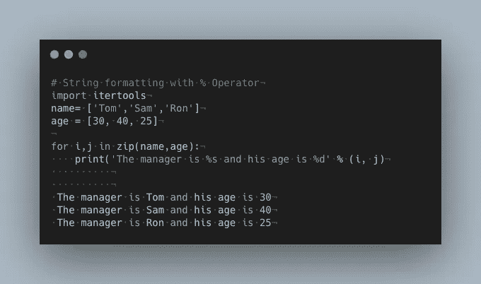
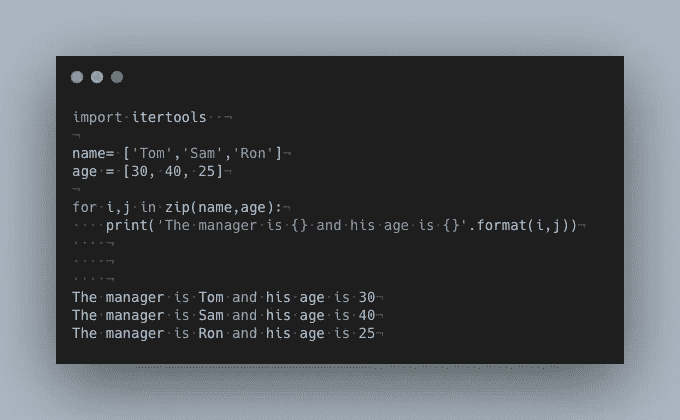
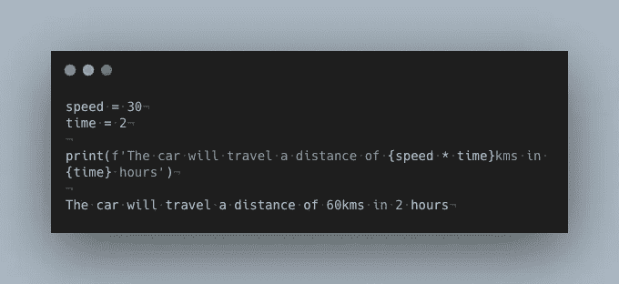
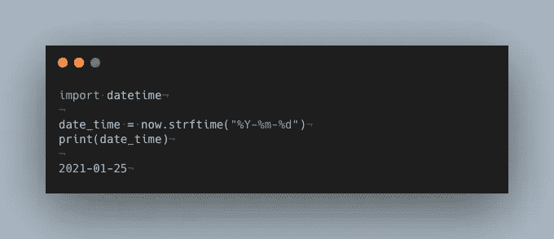
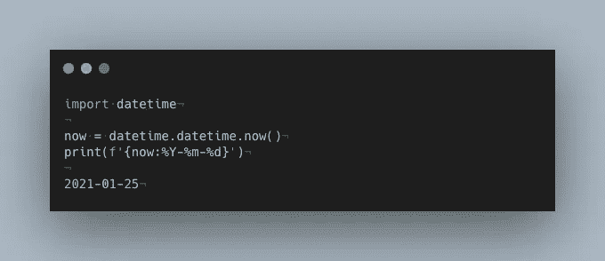
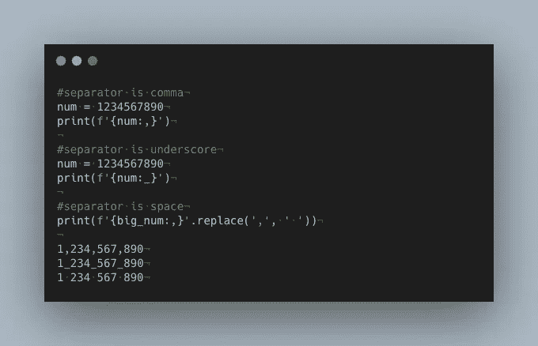
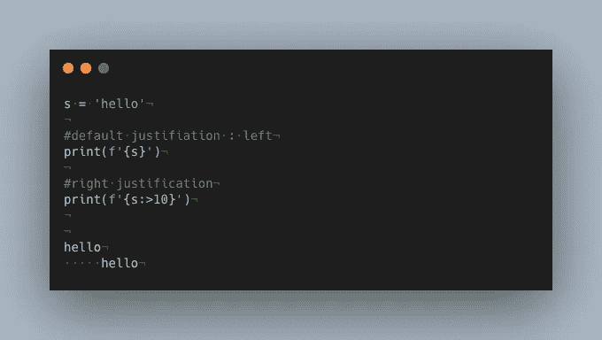
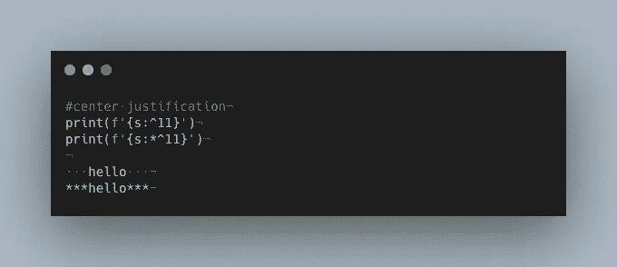
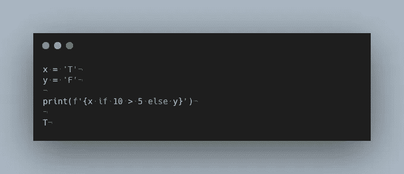

# Python 中“f 字符串”的五种奇妙用法

> 原文：<https://towardsdatascience.com/five-wonderful-uses-of-f-strings-in-python-7980cfd31c0d?source=collection_archive---------18----------------------->


Paul Volkmer 在 [Unsplash](https://unsplash.com?utm_source=medium&utm_medium=referral) 上拍摄的照片

在 [PEP 498](https://www.python.org/dev/peps/pep-0498/) 推出之前，Python 主要有三种格式化字符串的方式，即`[%-formatting](https://docs.python.org/3/library/stdtypes.html#printf-style-string-formatting)`、`[str.format](https://docs.python.org/3/library/string.html#formatstrings)`和`[string.Template](https://docs.python.org/3/library/string.html#template-strings)`。2015 年， **Eric V. Smith** 提出了一种新的字符串格式化机制，称为[文字字符串插值](https://www.python.org/dev/peps/pep-0498/)，为格式化字符串提供了一种更简单有效的方式。这些字符串被称为格式化字符串或 f 字符串，因为它们以`'f'`或`'F'`为前缀。

首先，我们将快速了解 Python 中不同的字符串格式样式，以及 f-strings 是如何超越其他格式的。假设我们有三个人的姓名和年龄，我们希望以下面给出的格式打印他们:

```
The manager is [NAME] and his age is [AGE].
```

现在让我们来看一下 Python 中不同字符串格式样式之间的比较。我们将看到相同的输出，但是使用了不同的格式。

## 1.使用%运算符



## **2。使用字符串。格式**

使用`string.format`的确在一定程度上简化了格式。



## 3.使用 f 弦

f 字符串进一步简化了格式。


如上所述，f 字符串在格式化字符串时非常方便。不再需要计算%s 和格式关键字。它们直截了当，不那么模棱两可，容易理解。既然我们现在知道了 f 弦的用处，是时候看看它们的其他功能了。

# 1.用 f 字符串格式化表达式

F-strings 允许您将表达式放在括号之间。括号内的表达式被计算并显示为结果。



这里，距离是在表达式中计算的，这为用户节省了一个额外的步骤。

# 2.格式化日期时间对象

在 Python 中，我们使用`strftime()` 方法，该方法使用 [date](https://www.programiz.com/python-programming/datetime#date) 、 [time](https://www.programiz.com/python-programming/datetime#time) 或 [datetime](https://www.programiz.com/python-programming/datetime#datetime) 对象返回表示日期和时间的字符串。让我们看下面一个打印当前日期的例子。



嗯，仅仅用 f 弦也能得到同样的结果。这样就不需要使用`srftime`。



# 3.添加分隔符:逗号、下划线和空格

f 字符串也可以派上用场的情况下，你想包括分隔符在长的数字，即分隔数字在千位。您可以添加逗号、下划线，或者简单地用空格分隔数字。



# 4.对齐和居中字符串

默认情况下，字符串靠左对齐。但是，可以通过使用`>`或`<`字符后跟一个表示填充的数字来将它们右对齐。



类似地，你也可以通过在需要居中的字符串后使用`^N`来使字符串居中。同样，N 表示字符的数量。



## 5.在 F 字符串中使用`if-else`条件

最后，`f-strings`能够评估 if-else 条件。您可以在花括号中指定条件，它会输出结果。下面是一个打印两个给定数字中较大的一个的例子。



# 结论

我们已经看到 f 字符串在格式化字符串时非常有用。我们也看到了它们的一些使用方法。f 弦还有其他一些很好的用途，如果你想深入了解，官方文档[是一个很好的起点。如果这篇文章激起了你对字符串数据类型的兴趣，这里还有一篇你可能会喜欢的文章，它是关于 Python 中的字符串方法及其用途的。](https://www.python.org/dev/peps/pep-0498/https://www.python.org/dev/peps/pep-0498/https://www.python.org/dev/peps/pep-0498/)

[](/useful-string-methods-in-python-5047ea4d3f90) [## Python 中有用的字符串方法

### 了解一些 Python 内置的可用于字符串的方法

towardsdatascience.com](/useful-string-methods-in-python-5047ea4d3f90)