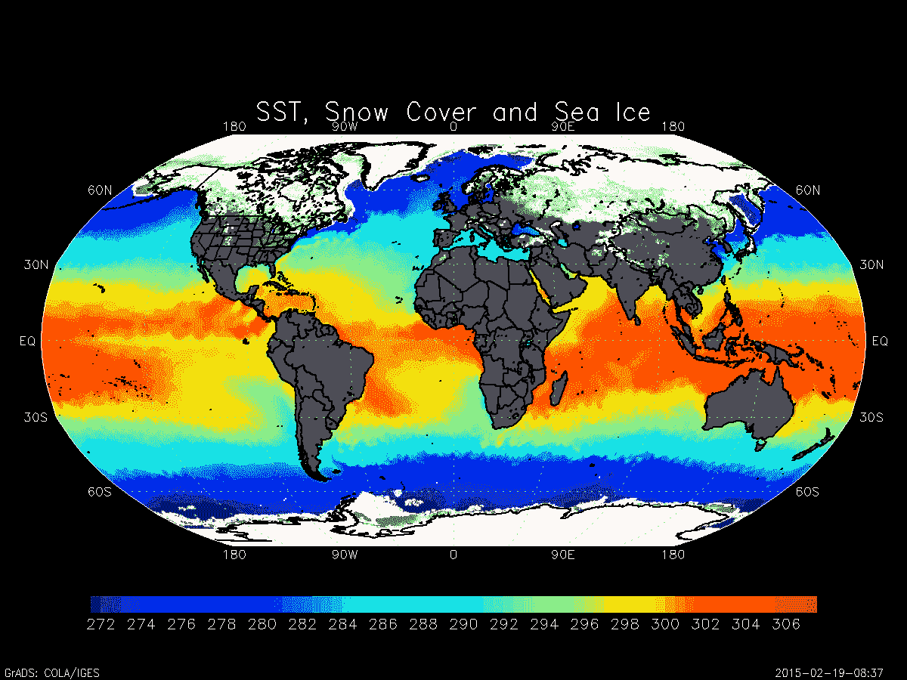
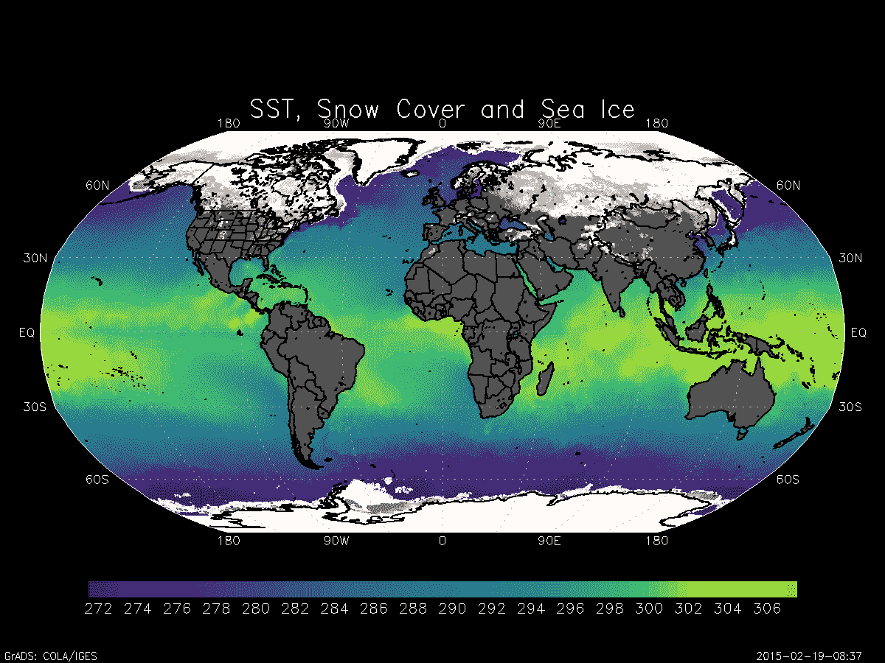
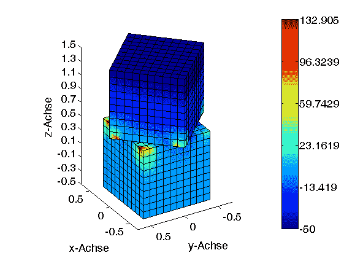
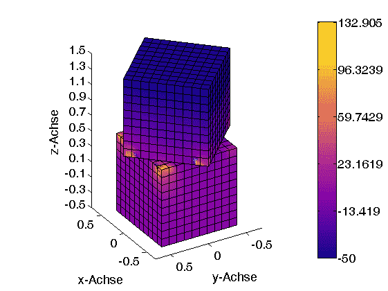
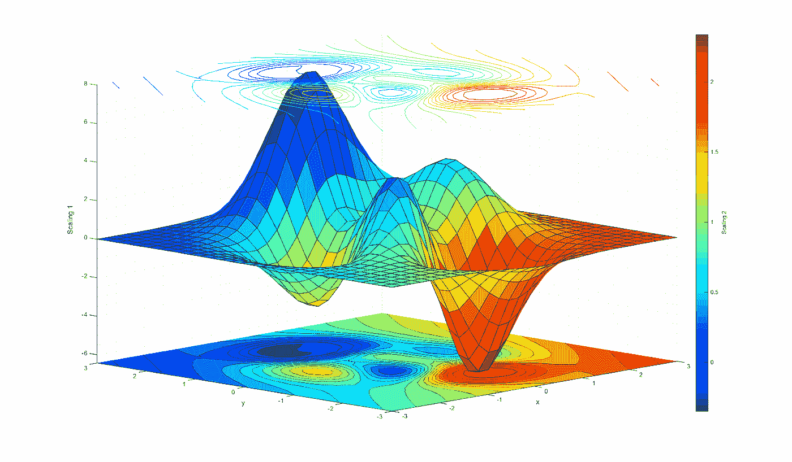
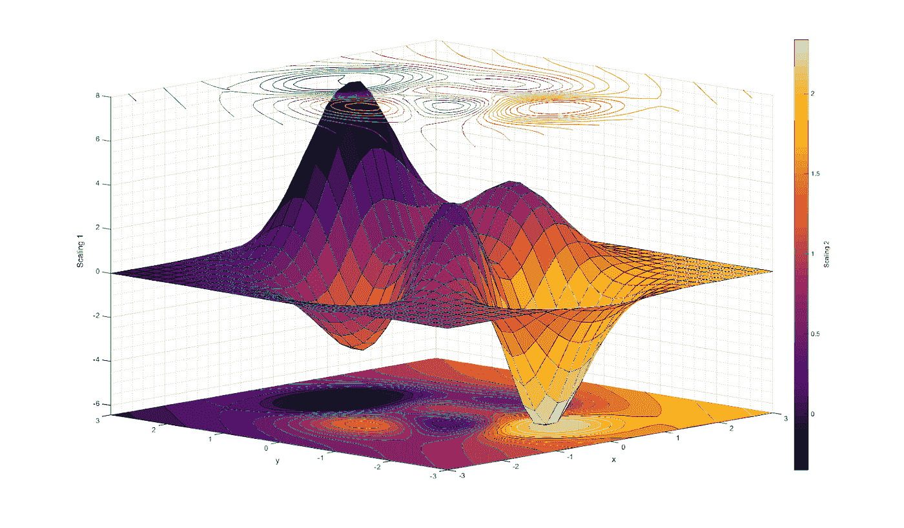

# 用 fixthejet 修复不均匀的色彩映射表

> 原文：<https://towardsdatascience.com/fix-non-uniform-colormaps-with-fixthejet-7446375204c2?source=collection_archive---------35----------------------->

## 为什么(以及如何)避免感知上不一致的色彩映射表


Pawel Czerwinski 在 [Unsplash](https://unsplash.com/s/photos/color?utm_source=unsplash&utm_medium=referral&utm_content=creditCopyText) 上的照片

信息是*而不是*知识。

如果信息背后的模式被很好地理解，信息可以被转化为知识。在当今这个科技飞速发展的时代，数据是一个重要的信息来源。因此，我们产生大量的数据也就不足为奇了——每天大约有 2.5 万亿字节。

理解科学数据(并因此将其转化为知识)的最有力的方法之一是绘制它。

想知道人的体重和身高有关系吗？[剧情吧](https://statisticsbyjim.com/basics/correlations/)！

想知道宇宙膨胀是否在加速？[剧情吧](http://hyperphysics.phy-astr.gsu.edu/hbase/Astro/univacc.html)！

想知道离赤道越远越热吗？[剧情](https://gradsaddict.blogspot.com/2015/02/tutorial-use-basemapgs-to-make.html) …小心出错！

尽管可视化对于快速消费数据和获得洞察力非常有效，但如果处理不当，它们也可能是有害的。

**在这篇文章中，我们将学习:**

1.  为什么要小心选择色彩映射表？
2.  为什么不使用“喷射”和所有其他感知不一致的色彩映射表？
3.  如何使用一个新的 python 包来改变制作拙劣的图形的色彩映射表

# 非均匀色彩映射表的问题是



平均海面温度(来源: [GrADS-aholic](https://gradsaddict.blogspot.com/2015/02/tutorial-use-basemapgs-to-make.html)

看上面的海面温度(SST)图，试着用一句话概括。当我把上面的图表给我的 10 个朋友看时，他们中的 7 个人给出了某种版本的回答:“随着我们远离赤道，温度下降，*在大约北纬 30 度或南纬 30 度处突然转变*(斜体是我的)。我的朋友认为温度突然变化的原因是高亮度的颜色(如黄色)在我们的眼中很突出。换句话说，上面使用的色彩映射表在不存在对比的地方制造了人为的对比。在更好的色图中的相同数据(下面显示了具有“绿色”的例子)显示没有这样的突然转变。



如果这是一次性的，我们可以原谅。不幸的是，[科学文献中充斥着使用糟糕的、感觉不一致的彩色地图的地图](https://www.nature.com/articles/s41467-020-19160-7)，比如“喷射”、“彩虹”、“光谱”、“要点”等等。雪上加霜的是，许多彩色地图对色盲人群也不友好。

2015 年，很多人注意到了这个现象，并在 R、Python、Matlab 等中轻推各自的社区。以改变它们的默认色图，使其在感觉上一致，从而不会在亮度上引入任何人为的梯度。关于更新的更多信息，[查看 Python 中 matplotlib 的新默认颜色图的发布](https://www.youtube.com/watch?v=xAoljeRJ3lU)。我鼓励每个人使用他们可以得到的感觉上统一的颜色图(他们可以在这里找到 [Python](https://matplotlib.org/stable/tutorials/colors/colormaps.html) 和 [R](https://cran.r-project.org/web/packages/viridis/vignettes/intro-to-viridis.html) )。

但这仍然给我们留下了 2015 年前的劣质地图。如果不固定，它们可能很难在海报或演示中引用。迄今为止，它们继续出现在顶级会议、期刊和报告中。我们如何继续使用“喷气机”时代的知识，但避免与解释它们相关的陷阱？

# 输入 fixthejet

fixthejet 是一个 python 包，可以将图像(jpg/。png)从“jet”色彩映射表转换为基于用户输入的任何其他色彩映射表。该脚本仅选择性地更改喷射颜色。图像中的所有其他颜色保持不变。因此，图像的背景和文本保持不变(假设它们与“jet”中的颜色明显不同)。由于包只需要一个图像文件，因此避免了获取图像的原始数据所需的时间和精力。

现在，更改他人制作的劣质图像的色彩映射表就像在终端中输入以下内容一样简单:

```
python fixthejet.py —-input <input file> —-output <output file>
```

这里有两个例子，展示了该软件包如何将图像从“喷射”色图转换为感知均匀的色图。

## 示例 1

```
python fixthejet.py —-input .\images\cube.png —-output .\images\cube_plasma.png —-colormap plasma
```

**输入文件:**



**输出文件:**



## 示例 2

```
python fixthejet.py —-input .\images\cone.jpg —-output .\images\cone_inferno.jpg —-colormap inferno
```

**输入文件:**



**输出文件:**



传递颜色图参数来控制 outfile 的颜色图。默认为“viridis”。仅支持 Matplotlib 颜色映射。

```
--colormap <output colormap> 
```

**对使用 fixthejet python 包感兴趣？** [**下面是下载说明**](https://github.com/kkraoj/fixthejet) **。**

# 概述

使用像“jet”这样的糟糕的色彩映射表会导致人为的渐变，在某些情况下，这会导致错误的推断。善待你的观众，避免不一致的色彩，如“喷射”、“彩虹”、“光谱”等。

总而言之，

1.  如果你正在制作你自己的地图，不要使用“喷射”或者其他感觉上不一致的颜色。
2.  如果你想在你的演示中使用别人制作得很差的图形，使用 fixthejet python 包来改变色彩映射表并删除任何人工创建的图案。

*本文的一个版本最初出现在* [*斯坦福数据科学博客*](https://datascience.stanford.edu/news/fixing-non-uniform-colormaps-fixthejet) *。*