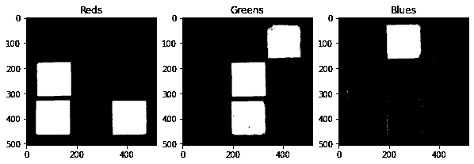

# 聚焦分割第 1 部分:如何用 Python 进行图像分割

> 原文：<https://towardsdatascience.com/fixation-on-the-segmentation-part-1-how-to-do-image-segmentation-with-python-fa7c690aaf0d?source=collection_archive---------37----------------------->

在我的[上一篇文章](https://nico-aguila.medium.com/spot-the-blob-on-the-job-image-detection-labeling-and-measurement-using-python-6faf7af2fc19)中，我们学习了如何基于斑点检测和连接组件来识别感兴趣的对象。然而，有时我们必须从图像中分离出感兴趣的特定对象。让我们来看看人类制造的最多彩的物品之一:魔方


作者图片

对于这个故事，我们将讨论两个主题，关于如何隔离这个立方体感兴趣的特定对象:阈值和彩色图像分割

**阈值处理**

第一种方法需要大量的试验和错误步骤，以确定您希望从图像中分离的对象的完美值。对于这种类型的方法，最容易分割的元素之一是灰度图像。让我们用魔方试试吧

```
#library imports
from skimage.io import imread, imshow
from skimage.color import rgb2graycube = imread('medium/source.jpg')
cube_gray = rgb2gray(cube)
imshow(cube_gray)
```


作者图片

现在让我们尝试几个阈值，看看我们是否能把立方体从背景中分离出来

```
import matplotlib.pyplot as plt
thresh_list = [0.2, 0.3, 0.4, 0.5]
fig, ax = plt.subplots(1,4, figsize=(10,10))
for i in range(4):
    im = ax[i].imshow(cube_gray < thresh_list[i], cmap='gray')
    ax[i].set_title(thresh_list[i])
plt.show()
```


作者图片

然而，试错是非常麻烦的。自动找到阈值的一种方法是使用 Otsu 的方法。这种方法非常适合我们的魔方图片，因为 Otsu 的方法假设图像有前景和背景。

让我们用下面的代码来试试我们的魔方吧

```
from skimage.filters import threshold_otsuthresh = threshold_otsu(cube_gray)
cube_binary_otsu2  = cube_gray < thresh
imshow(cube_binary_otsu2)
```


作者图片

**彩色图像分割**

由于魔方中有多种颜色，如果我们想要分割图像的特定区域，我们也可以考虑每种颜色。按照这种思路，我们可以通过不同的颜色通道对图像进行分割。让我们首先尝试使用 RGB 颜色空间，并分割红色、绿色和蓝色。

```
#red
red = cube[:, :, 0] - cube_gray*255
red2 = np.where(red > 0, red, 0)
thresh = threshold_otsu(red2)
red_binary_otsu  = red2 > thresh#green
green = cube[:, :, 1] - cube_gray*255
green2 = np.where(green > 0, green, 0)
thresh = threshold_otsu(green2)
green_binary_otsu  = green2 > thresh#blue
blue = cube[:, :, 2] - cube_gray*255
blue2 = np.where(blue > 0, blue, 0)
thresh = threshold_otsu(blue2)
blue_binary_otsu  = blue2 > threshfig,ax = plt.subplots(1,3,figsize=(10,10))
ax[0].imshow(red_binary_otsu,cmap='gray')
ax[0].set_title('Reds')
ax[1].imshow(green_binary_otsu,cmap='gray')
ax[1].set_title('Greens')
ax[2].imshow(blue_binary_otsu,cmap='gray')
ax[2].set_title('Blues')
```



作者图片

请注意，还有其他颜色空间可以分割魔方的每种颜色。另一个我们将尝试的是 HSV 颜色空间。HSV 代表色调、饱和度和值，与 RGB 相比，该空间的优势在于，有时不同的色调和色调看起来会更加相似。这使得 HSV 更适合根据颜色隔离图像的特定部分。

我们将使用以下代码隔离绿色

```
from skimage.color import rgb2hsv
cube_hsv = rgb2hsv(cube)#green mask
lower_mask = cube_hsv[:,:,0] > 0.30
upper_mask = cube_hsv[:,:,0] < 0.40
mask = upper_mask*lower_mask
plt.imshow(mask)
```


作者图片

正如你从上图中看到的，绿色的色调范围在 30 到 40 之间。通过使用这个值，我们可以生成一个遮罩来标识绿色在图像中的位置。然后，我们可以使用这个遮罩来引用原始图像中的绿色色调，并最终在图像中只显示绿色

```
red = cube[:,:,0]*mask
green = cube[:,:,1]*mask
blue = cube[:,:,2]*mask
cube_masked = np.dstack((red,green,blue))
imshow(cube_masked)
```


作者图片

现在你知道了。用几行代码完成的图像分割

对我的工作感兴趣？你可以在我的个人资料中看到更多的故事

<https://nico-aguila.medium.com/> 