# 关注分割第 2 部分:如何用 Python 进行图像分割

> 原文：<https://towardsdatascience.com/fixation-on-the-segmentation-part-2-how-to-do-image-segmentation-with-python-b29e40c2b46c?source=collection_archive---------35----------------------->

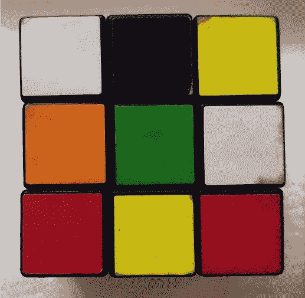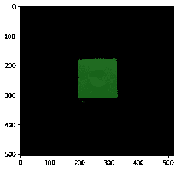

作者图片

嗨！如果你还没有阅读这个关于图像分割的简短系列的第一部分，请在这里阅读。

我们已经讨论了阈值和颜色分割，所以我们的第 2 部分将集中在色度分割，以及图像差异。

**色度分割**

尽管 HSV 比 RGB 有优势，但仍然会有一些颜色需要我们的眼睛更仔细地观察才能发现明显的差异。其中一个例子就是我们的肤色，不同深浅的棕色可能看起来相同或不同，这取决于个人如何解释颜色差异。对于这种情况，我们可以查看 RG 色度空间，为感兴趣的对象生成遮罩。

在这种情况下，我们将使用这幅画作为参考，并使用以下代码确定 RG 色度

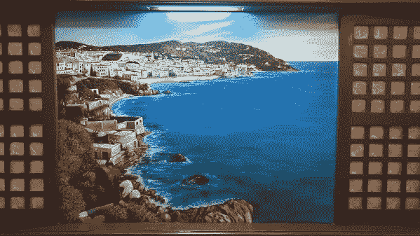

作者图片

```
#library imports
from skimage.io import imread, imshow
import matplotlib.pyplot as plt
import numpy as nppaint = imread('medium/painting.jpg')paint_R = paint[:,:,0]*1.0/paint.sum(axis=2)
paint_G = paint[:,:,1]*1.0/paint.sum(axis=2)plt.figure(figsize=(5,5))
plt.scatter(paint_R.flatten(),paint_G.flatten())
plt.xlim(0,1)
plt.ylim(0,1)
```

上面的代码将通过散点图显示红色和绿色空间的分布，如下所示

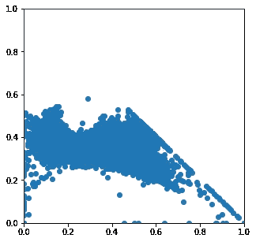

作者图片

在查看了数据的分布后，我们可以得到颜色值的 2D 直方图

```
plt.figure(figsize=(5,5))
plt.hist2d(paint_R.flatten(), paint_G.flatten(), bins=100,cmap='binary')
plt.xlim(0,1)
plt.ylim(0,1)
```

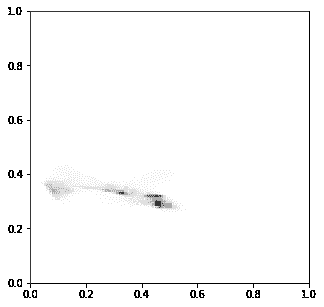

作者图片

从直方图中，我们可以确定哪些颜色构成了我们的绘画。为了确定颜色及其在直方图上的具体位置，我们需要从图像中获取一个参考色块，并获取其相应的 RG 色度。

让我们试着把水体作为补丁

```
patch = paint[150:200,400:450,:]
imshow(patch)
```

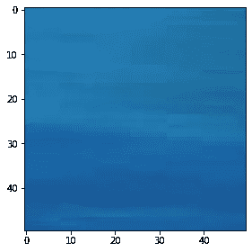

作者图片

使用以下代码获取 RG 色度

```
#scatterplot
patch_R = patch[:,:,0]*1.0/patch.sum(axis=2)
patch_G = patch[:,:,1]*1.0/patch.sum(axis=2)plt.figure(figsize=(5,5))
plt.scatter(patch_R.flatten(),patch_G.flatten())
plt.xlim(0,1)
plt.ylim(0,1)#histogram
plt.figure(figsize=(5,5))
plt.hist2d(patch_R.flatten(), patch_G.flatten(), bins=100,cmap='binary')
plt.xlim(0,1)
plt.ylim(0,1)
```

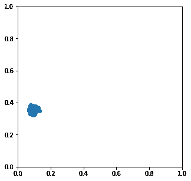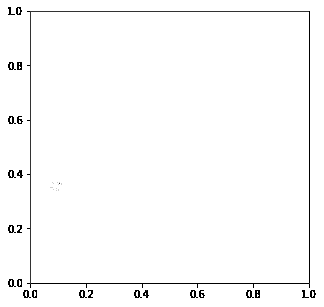

作者图片

现在我们有了水体的数据分布，让我们使用 RG 色度来尝试两种类型的分割:参数和非参数分割。

1.  **参数分割**

参数分割需要根据参考面片和图像参数变换每个元素。为了在我们的绘画图像中做到这一点，我们将首先使用前面生成的遮罩来拟合高斯概率分布

```
#Parametric Magic
std_patch_R = np.std(patch_R.flatten())
mean_patch_R = np.mean(patch_R.flatten())std_patch_G = np.std(patch_G.flatten())
mean_patch_G = np.mean(patch_G.flatten())#Making the gaussian work
def gaussian(p,mean,std):
    return np.exp(-(p-mean)**2/(2*std**2))*(1/(std*((2*np.pi)**0.5)))
```

现在让我们检查一下我们用上面的代码制作的补丁的分布情况

```
x = np.linspace(0,1)
y = gaussian(x,mean_patch_R,std_patch_R)
plt.plot(x,y)
```

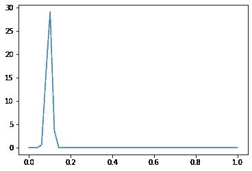

作者图片

让我们在 RG 色度空间中测试我们的数据

```
#Visualization of R space and G space#R space
r_test = np.tile(np.linspace(0,1,64),(64,1))
plt.imshow(r_test)#G space
g_test = r_test.transpose()
plt.imshow(g_test)
```

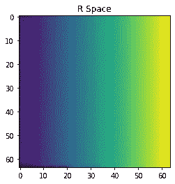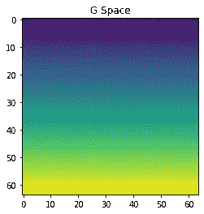

作者图片

```
#Test sample R and G space into the gaussian distribution with the generated patch#R space with patch
test_R = gaussian(r_test,mean_patch_R,std_patch_R)
plt.title('R Space and patch')
plt.imshow(test_R)#G space with patch
test_G = gaussian(g_test,mean_patch_G,std_patch_G)
plt.title('G Space and patch')
plt.imshow(test_G)
```

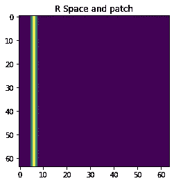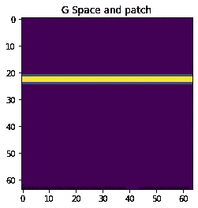

作者图片

```
prob_test=test_R * test_G
plt.imshow(prob_test)
```

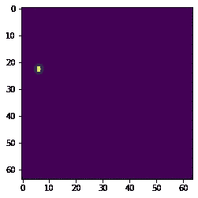

作者图片

上面的图像显示，通过仅使用 R 坐标，补丁的颜色有可能是绘画的一部分。让我们试着只用 R 色度空间来遮盖我们的画

```
prob_R = gaussian(paint_R,mean_patch_R,std_patch_R)
plt.imshow(prob_R)
```

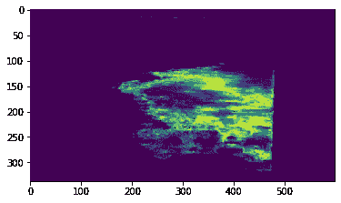

作者图片

现在让我们使用 G 色度空间来尝试一下

```
prob_G = gaussian(paint_G,mean_patch_G,std_patch_G)
plt.imshow(prob_G)
```

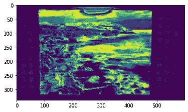

作者图片

将 R 和 G 空间相乘得到以下输出

```
prob=prob_R * prob_G
plt.imshow(prob)
```

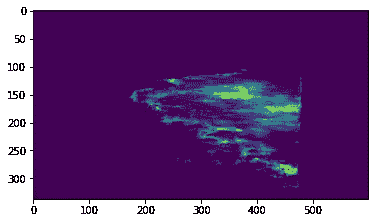

作者图片

组合图像现在表明，所拍摄的颜色实际上有可能是我们之前拍摄的参考色块的一部分。我们现在可以通过用一组给定的概率值生成一个新的掩模来正确地分割图像

```
prob_list = [0.2, 0.4, 0.6, 0.8]
fig, ax = plt.subplots(1,4, figsize=(10,10))
for i in range(4):
    ax[i].imshow(prob > prob_list[i], cmap='gray')
    ax[i].set_title(prob_list[i])
plt.show()
```

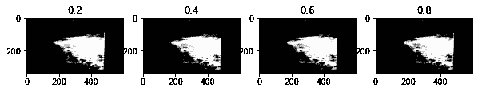

作者图片

在我们的原始 RGB 图片上整合蒙版可以隔离水体。对于本例，我们将使用 0.8 作为阈值

```
mask = prob > 0.8
red = paint[:,:,0]*mask
green = paint[:,:,1]*mask
blue = paint[:,:,2]*mask
paint_masked = np.dstack((red,green,blue))
imshow(paint_masked)
```

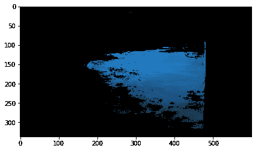

作者图片

**2。非参数分割**

对于感兴趣区域不容易被我们生成的 2D 高斯函数近似的情况，可以用非参数方法来代替。其工作原理是使用绘画中的 2D 直方图，并使用直方图反投影，用参考面片的计算直方图来掩盖图像。

既然已经说了，我们可以简单地用 cv2 做所有这些！这里有几行代码可以实现这一点。然而对于这个例子，我们将只使用一维直方图，考虑来自 HSV 颜色空间的色调

```
import cv2 as cv#histogram and backprojection
def Hist_and_Backproj(val):

    bins = val
    histSize = max(bins, 2)
    ranges = [0, 180] # hue_range

    hist = cv.calcHist([hue], [0], None, [histSize], ranges, accumulate=False)
    cv.normalize(hist, hist, alpha=0, beta=255, norm_type=cv.NORM_MINMAX)

    backproj = cv.calcBackProject([hue], [0], hist, ranges, scale=1)

    cv.imshow('BackProj', backproj)

    w = 400
    h = 400
    bin_w = int(round(w / histSize))
    histImg = np.zeros((h, w, 3), dtype=np.uint8)
    for i in range(bins):
        cv.rectangle(histImg, (i*bin_w, h), ( (i+1)*bin_w, h - int(np.round( hist[i]*h/255.0 )) ), (0, 0, 255), cv.FILLED)
    cv.imshow('Histogram', histImg)#getting image and transforming to hsv
src = cv.imread('medium/painting.jpg')
hsv = cv.cvtColor(src, cv.COLOR_BGR2HSV)
ch = (0, 0)
hue = np.empty(hsv.shape, hsv.dtype)#using only 1-D histogram (Hue)
cv.mixChannels([hsv], [hue], ch)#creating trackbar to change bin values
window_image = 'Source image'
cv.namedWindow(window_image)
bins = 25
cv.createTrackbar('* Hue  bins: ', window_image, bins, 180, Hist_and_Backproj )
Hist_and_Backproj(bins)#show image and allow user to close the program
cv.imshow(window_image, src)
cv.waitKey()
```

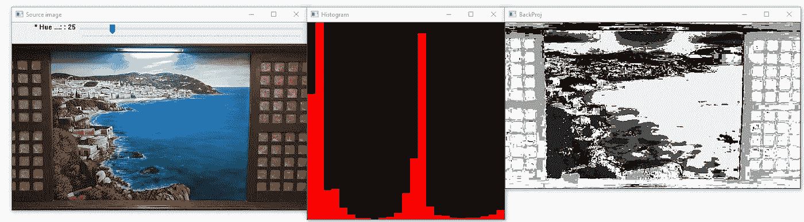

值设置为 25。作者图片

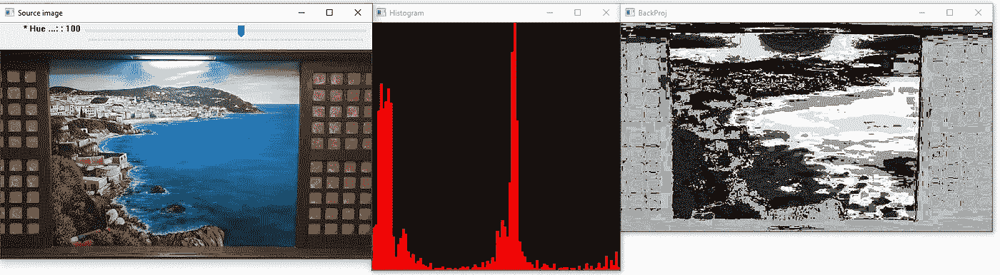

值设置为 100。作者图片

**图像差分**

这是一个有趣的话题，尤其是对孩子们来说。图像差异是指当我们不看色彩空间时，我们想要确定我们的视频或图像中的变化或运动，这很像孩子们在看两张几乎相同的图片时玩的“找出差异”游戏。

```
image1 = imread('medium/19a.jpg')
image2 = imread('medium/19b.jpg')fig, ax = plt.subplots(1,2,dpi=100)
ax[0].imshow(image1)
ax[1].imshow(image2)
```

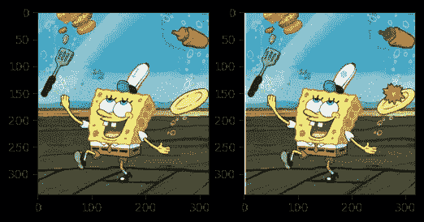

你能看出区别吗？作者图片

进行图像差分的一种方法是简单地将两幅图像转换成灰度，并从字面上减去两幅图像。结果输出给出了两幅图像之间的变化

```
#grayscale
from skimage.color import rgb2grayimage1_gray = rgb2gray(image1)
image2_gray = rgb2gray(image2)fig, ax = plt.subplots(1,2,dpi=100)
ax[0].imshow(image1_gray,cmap='gray')
ax[1].imshow(image2_gray,cmap='gray')
```

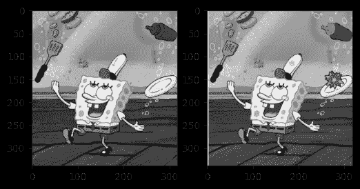

作者图片

现在让我们`spot the difference`

```
diff = image1_gray - image2_gray
imshow(diff)
```

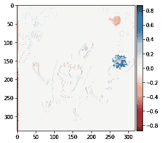

作者图片

现在你知道了！色度分割和图像差分

对我的工作感兴趣？你可以在我的个人资料中看到更多的故事

[](https://nico-aguila.medium.com/) [## 尼科·阿吉拉-中等

### 在我之前的文章中，我们学习了如何基于斑点检测和连接来识别感兴趣的物体…

nico-aguila.medium.com](https://nico-aguila.medium.com/)