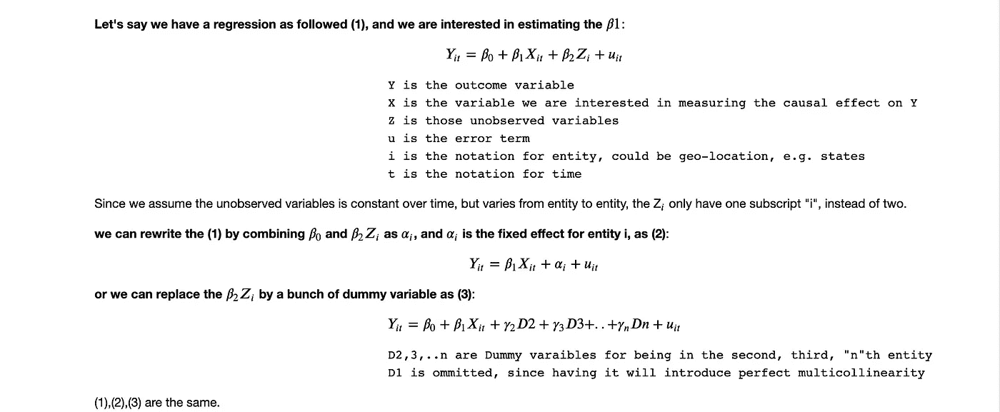
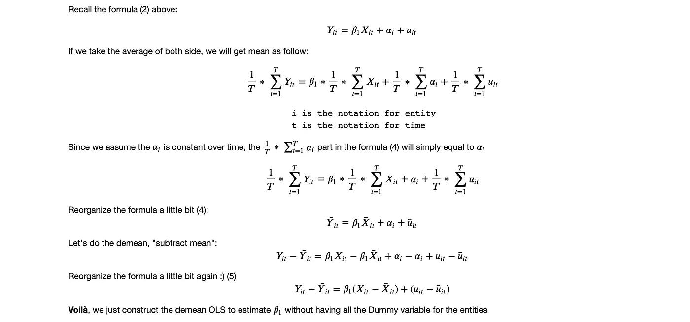
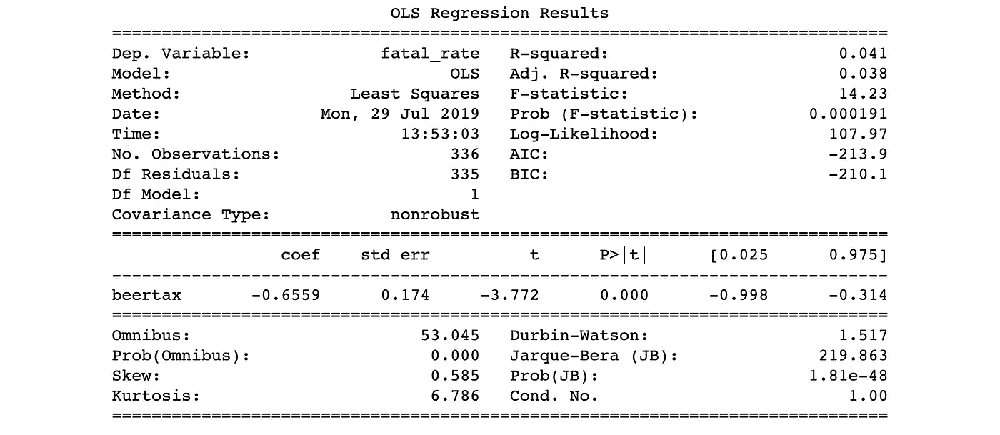

# 固定效应回归—简单解释

> 原文：<https://towardsdatascience.com/fixed-effect-regression-simply-explained-ab690bd885cf?source=collection_archive---------3----------------------->

## 为什么我们在测量因果效应时需要固定效应回归的直观观点。

照片由 [Alex wong](https://unsplash.com/@killerfvith?utm_source=medium&utm_medium=referral) 在 [Unsplash](https://unsplash.com?utm_source=medium&utm_medium=referral) 上拍摄

我目前正在学习因果推理和相应的建模技术。本着边解释边学习的精神，我决定写一篇博客来解释固定效应回归模型及其在 Python 中的实现。该博客将包含三个部分:

1.  什么是固定效应模型，我们为什么要使用它？
2.  固定效应模型是如何工作的
3.  在 python 中使用固定效果模型的示例

与试图做出预测不同，经济学家更感兴趣的是回答一个不同的问题——一个特定变量(感兴趣的变量，添加或不添加功能)和结果变量(销售额)之间的因果关系是什么。

什么是“因果关系”，它与“相关性”有什么不同虽然我听说了很多关于“相关性并不意味着因果关系”，但直到最近我才真正注意到这一点。

为了解释什么是“因果关系/结果”，我认为最好参考一下达纳·麦肯齐(Dana Mackenzie)和朱迪亚·珀尔(Judea Pearl)所著的《*原因之书》中的“*因果关系阶梯*”。*

在书中，作者描述了 ***因果关系的三个层次* :**

1.  联想:如果我看到了什么会怎么样。在数学中， *P(观察 Y |观察 X)*
2.  干预:如果我做了某事会发生什么。数学上， *P(观察 Y |做 X)*
3.  反事实:如果我做了/没做某事会发生什么。 *P(观察 Y|如果我没有做 X 会怎样)*

> 因此，因果效应是我们做了某件事和我们没有做某件事(反事实)的结果差异

我们为什么关心这个？这是我第一次遇到这个问题时的疑问之一。嗯，事实证明我们确实关心它，因为当我们试图在现实世界中做出决策(例如，为应用程序添加新功能)时，企业不仅知道明天会发生什么(预测或预报)，他们还想知道如果我们今天添加一个新功能，我们是否会增加下周、下个月和明年的参与度。

回答这个问题的直观方法是运行 A/B 测试(看到该功能的人的收入(治疗组)和没有看到该功能的人的收入(对照组))。不幸的是，实验有时成本太高，或者不道德/不合法。

你可能也会想，为什么我不能在训练完我的模型之后，直接使用我感兴趣的变量的估计量/系数。如果你这样做，你可能会遇到**遗漏变量偏差**，这是我们的估计量的偏差(例如，看不看特征的系数)，当一些重要的和未观察到的变量(例如，用户特征)在我们的模型中未被控制时。

这些变量很重要，因为它们既与我们的兴趣变量(更有可能看到新功能)相关，也与我们的结果变量(花费更多)相关。所以忽略它们会给我们的估计量带来偏差。

在我们开始解释固定效应模型如何工作之前，让我们先介绍两个术语。

**固定效应回归**，顾名思义，暗示某事物是固定不变的。当我们假设一些特征(例如，用户特征，这里我们先假设)在一些变量(例如，时间或地理位置)上是恒定的。我们可以使用固定效应模型来避免遗漏变量偏差。

**面板数据:**也称为纵向数据，用于跨多个时间段(如年或月)的多个实体(如地理位置、州)。这是固定效应回归的关键因素。

# 它是如何工作的？

让我们戴上数学帽子，写一些公式。

# 贬低固定效应回归

对于上面的公式(3)，我们可以在数据中丢弃虚拟变量，然后运行 OLS 回归来得到结果。但是当实体列表变得很大时(例如，产品名称(SKU/阿辛)，在这种情况下可能有数千个实体)，回归可能变得不可能或非常乏味。

为了解决这个问题，我们可以使用一种叫做“实体贬低 OLS”的东西。这里的实体贬低实际上就是从每个观察值中减去其实体平均值，以从我们的结果变量中去掉那些不可观察的实体独特但时间不变的变量影响。

# 在 python 中使用固定效果模型的示例

我将使用著名的啤酒税数据来说明 python 中的步骤，如下所示:

结果表明，啤酒税系数为负，具有统计学意义。我们可以解读为，啤酒税增加 1 美元将导致每万人减少 0.66，这个数字是巨大的！这可能是由于其他被忽略的变量随着时间的推移而变化，从而引入了偏差。

这篇博客通过我们为什么需要它，我们如何制定它，以及一个玩具例子，介绍了通过固定效应避免遗漏变量偏差来测量因果效应的通用建模技术。我希望你喜欢阅读。