# 面向数据科学家的定点 DSP

> 原文：<https://towardsdatascience.com/fixed-point-dsp-for-data-scientists-d773a4271f7f?source=collection_archive---------3----------------------->

## 了解如何使用 C/C++和 Arm 的 CMSIS-DSP 库在 Python 中创建 DSP 管道，并将其转换为在基于 Arm Cortex-M 的 MCU 上运行。

**作者** : [桑德普·米斯特里](https://twitter.com/sandeepmistry)，[亨利·伍德库克](https://twitter.com/henriwoodcock)代表 [Arm 软件开发团队](https://twitter.com/ArmSoftwareDev)

# 介绍

当在音频系统中应用机器学习(ML)时，通常使用数字信号处理(DSP)技术将输入音频信号转换成 2D“图像”，从而可以使用计算机视觉技术对音频进行分类。现实世界中的例子包括[音频或语音识别](https://www.tensorflow.org/tutorials/audio/simple_audio)，以及关键词识别。

本指南将使用 [Python](https://www.python.org/) 和 [NumPy](https://numpy.org/) 代码示例向您介绍这些系统中使用的 DSP 技术。一旦您熟悉了这些 DSP 技术，我们将介绍如何使用 Python 中的 [Arm 的 CMSIS-DSP 库](https://arm-software.github.io/CMSIS_5/DSP/html/index.html)来使用定点数学执行相同的操作。

最后，我们将演示如何用 C 语言创建一个等效的流水线，以便将其部署到基于 [Arm Cortex-M](https://developer.arm.com/ip-products/processors/cortex-m) 的微控制器(MCU)上。**在基于 Arm Cortex-M 的系统上使用定点数学可以大幅减少内存使用，同时提高运行时性能！**

本指南的 Jupyter 笔记本版本也可以在 GitHub 上找到，也可以使用 Google Colab 访问。

## 目录:

*   [音频频谱图](#a615)
*   [Python 中的音频声谱图](#de0e)
*   [使用 CMSIS-DSP 的音频频谱图](#5e1a)
*   [不同音频声音的声谱图示例](#f9a4)
*   [将 CMSIS-DSP 代码从 Python 移植到 C 语言](#2960)
*   [结论](#5ad1)

# 音频频谱图

在这本笔记本中，我们将在 NumPy 和 CMSIS-DSP 中开发一个*音频声谱图*管道。这是用于音频数据的常见预处理管道。原始音频样本被转换成音频信号的可视表示，其显示频率随时间的变化。它通常被描绘成 2D 的形象。

关于 spectrograms 更深入的解释，可以看看关于音频识别的 TensorFlow [教程](https://www.tensorflow.org/tutorials/audio/simple_audio#spectrogram)。

为了将音频信号转换到频域，使用了快速傅立叶变换(FFT)。这将按时间将幅度表示的音频信号转换到频域，因此您可以了解信号中包含的频率。然而，当对整个音频信号执行 FFT 时，您将丢失该音频信号的时域信息，为了抵消这一点，我们将音频分解为单独的片段。

## 光谱图步骤

创建光谱图可分为以下步骤:

1.  音频信号被分解成称为“窗口”的更短的片段。这意味着当我们稍后应用 FFT 时，我们仍然保留一些时间信息，因为我们知道每个窗口出现的时间点。将音频信号分割成多个窗口时，窗口之间通常会有一些重叠，以帮助保持输出更加连续。
2.  然后将*窗口函数*应用于每个窗口。将我们的信号分解成重叠的窗口会给我们留下音频信号的不连续性，这将不能准确地表示真实世界的音频信号。为了减少这种影响，窗口函数将通过将窗口乘以 0 和 1 之间的平滑对称曲线来平滑每个窗口的幅度边缘。
3.  然后用 FFT 将每个窗口转换到频域。因为 FFT 产生复数输出，所以从该输出中取出*绝对值*以保留幅度信息，但移除复数。
4.  最后，创建一个称为频谱图的 2D 阵列，其大小为(窗口数、FFT 仓)。

我们选择了一些示例音频输入及其音频频谱图，如下所示:

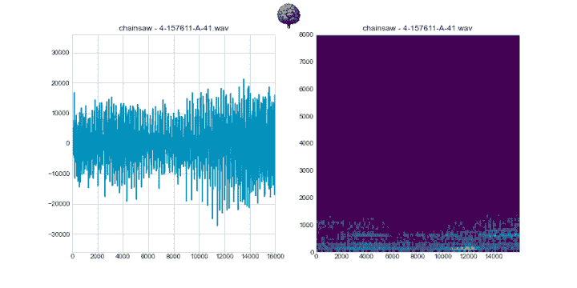

# Python 中的音频频谱图

现在你已经对什么是音频声谱图有了一个大概的了解，我们将通过 Python 和 Numpy 从一个预先录制的 wave 文件中创建一个声谱图。

## 安装 Python 模块

您需要使用`pip`安装 [NumPy](https://numpy.org/) 、 [Matplotlib](https://matplotlib.org/) 、 [SciPy](https://www.scipy.org/) 和 [requests](https://requests.readthedocs.io/) Python 模块:

```
pip install numpy scipy matplotlib requests
```

## 下载样本音频文件

我们将使用来自[“ESC-50:环境声音分类数据集”GitHub repo](https://github.com/karolpiczak/ESC-50) 的“敲门”`.wav`文件作为笔记本中 DSP 管道的输入信号。您可以使用 Python 的`requests`库从 GitHub 下载`.wav`文件:

## 从样本音频文件中读取数据

SciPy 的`[scipy.io.wavfile.read(...)](https://docs.scipy.org/doc/scipy/reference/generated/scipy.io.wavfile.read.html)` API 现在可以用来从`.wav`文件中读取音频样本。

`.wav`文件的采样率为 44.1 kHz，这意味着每 1 秒钟的音频由 44100 个样本表示。由于 44.1 kHz 采样率包含的分辨率超过了我们的需求，我们将使用 SciPy 的`[scipy.signal.resample(...)](https://docs.scipy.org/doc/scipy/reference/generated/scipy.signal.resample.html)` API 将音频数据的采样率从 44.1 kHz 降低到 16 kHz，以减少分析中使用的样本数量。

现在我们已经从`.wav`文件中读取了音频样本，让我们使用 Matplotlib 绘制一段时间内的音频信号:

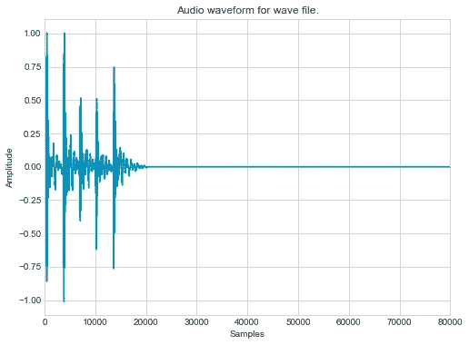

您也可以在您的电脑上下载并收听 1–103995-A-30 . wav 文件。

根据整个音频信号的图表，播放声音，我们知道开始时有大约 1 秒钟的声音，然后是寂静。让我们放大并使用 Matplotlib 仅绘制前 1 秒的音频信号，以便更仔细地观察:

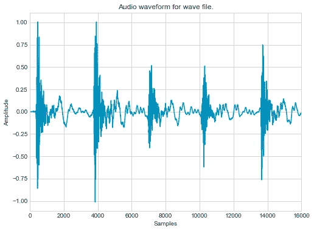

## 开窗术

现在我们可以将音频样本分割成重叠的窗口。通常选择 2 的幂，例如 16、32、64、128、256、512、1024 或 2048 作为窗口大小。我们将使用大小为 256 的窗口，并在此时跨过音频信号 128 个样本。

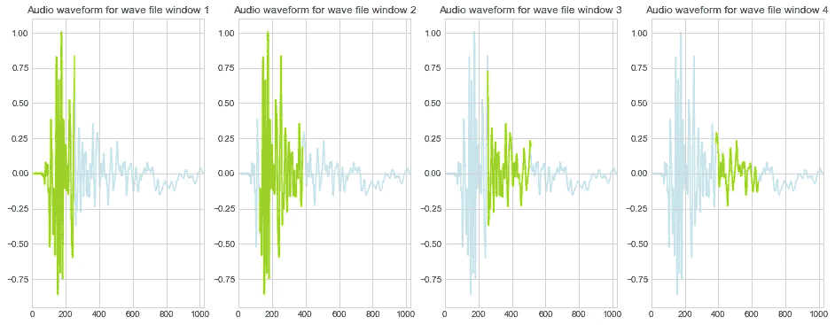

当前窗口在整个蓝色信号之上以绿色突出显示。你可以看到第一个窗口是从 0 到 256，第二个窗口是从 128 到 384 (128 + 256)，第三个窗口是从 256 到 512，第四个窗口是从 384 到 640。

的窗口总数。wav 文件可以计算如下:

```
number_of_windows = (len(audio_samples) - window_size) // step_size
```

## 窗口函数和汉宁窗口

当处理连续信号(如音频)时，在应用 FFT 变换之前会应用一个窗口函数，以便音频片段的边缘更平滑。窗口函数是(通常)范围在(0–1)之间的函数，可应用于窗口，如下所示:

𝑦 = 𝑤𝑖𝑛𝑑𝑜𝑤_𝑓𝑢𝑛𝑐𝑡𝑖𝑜𝑛 × 𝑤𝑖𝑛𝑑𝑜𝑤

Hanning 窗口是最常见的窗口函数之一(也是本例中使用的函数)。 [NumPy 有一个内置的方法来计算任意窗口长度的汉宁窗口](https://numpy.org/doc/stable/reference/generated/numpy.hanning.html):

```
**import** numpy **as** nphanning_window = np.hanning(window_size)
```

让我们使用 Matplotlib 绘制汉宁窗口:

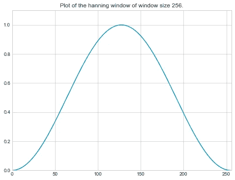

现在，汉宁窗口可以应用于第一音频信号窗口，使用:

```
window_1 **=** audio_samples[0:window_size]processed_window_1 **=** hanning_window ***** window_1
```

然后，我们可以使用 Matplotlib 绘制第一个窗口和已处理的窗口

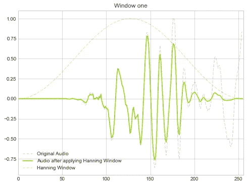

可以看到，在整个窗口周期内，经过处理的窗口幅度从未超过汉宁窗口的值。

让我们扩展我们的图表，通过前几个窗口进行循环。

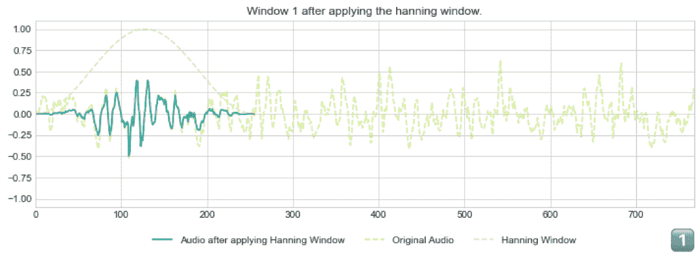

## 快速傅里叶转换（同 fast Fourier transform）

对于每个已处理的窗口，可以使用 NumPy 的`[np.fft.rfft(...)](https://numpy.org/doc/stable/reference/generated/numpy.fft.rfft.html)` API 计算 FFT，并使用`[np.absolute(...)](https://numpy.org/doc/stable/reference/generated/numpy.absolute.html)`获取 FFT 的绝对值:

```
*# Calculate the FFT.* fft_1 **=** np.fft.rfft(processed_window_1)*# Take the absolute value.* fft_bins_1 **=** np.absolute(fft_1)
```

然后，我们可以使用 Matplotlib 绘制 FFT 频段。

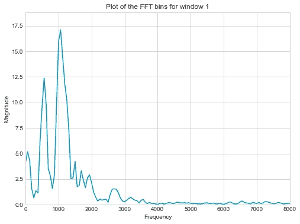

让我们绘制前 4 个窗口随时间变化的 FFT 图，以便了解音频信号的频率成分如何随时间变化:

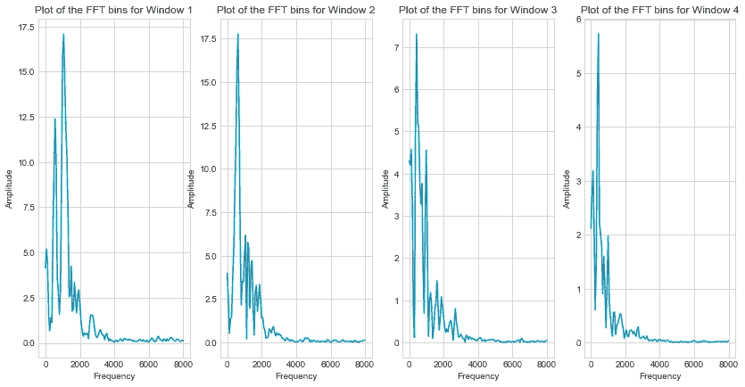

# 光谱图

我们可以创建一个单独的音频信号频域 2D 图，作为热图，也称为频谱图，而不是每个窗口周期随时间变化的单独 FFT 图。该频谱图在 x 轴上显示时间，在 y 轴上显示频率，最后用颜色显示振幅。

让我们以重叠的步长和窗口大小遍历所有样本，计算信号随时间变化的频率，以显示为频谱图。这里我们计算 1 秒钟音频中的窗口数量。

现在我们已经计算了音频信号的频谱图，让我们绘制它:

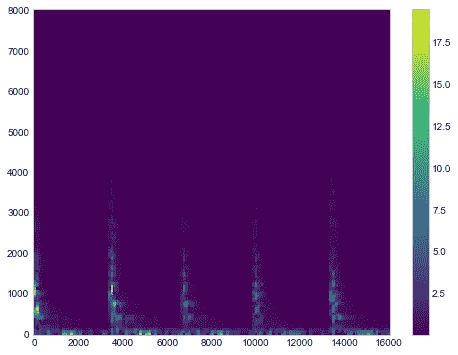

从频谱图中，我们可以清楚地看到每个爆震的 5 个感兴趣的区域，频率低于 4000 Hz 的更普遍。

让我们放大声谱图的下半部分，仔细看看:

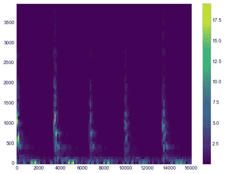

我们再画一张图，但在声谱图上方加上时域中的信号。这样，我们可以看到信号幅度和频率计数与时间的相关性。

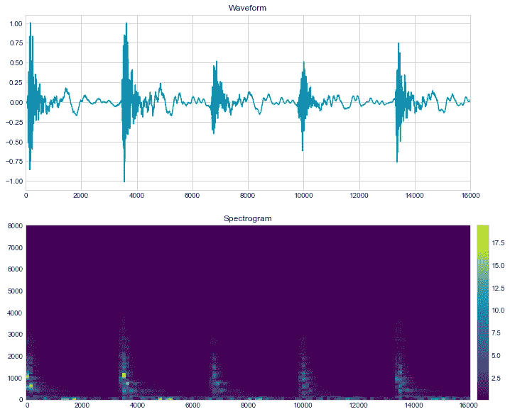

## 概述

让我们回顾一下迄今为止我们所取得的成就:

1.  使用请求库从 GitHub 下载了一个敲门声音的. wav 文件。
2.  使用 SciPy 库从 44.1 kHz 的. wav 文件中读入音频样本，并对它们进行重新采样，以获得 16 kHz 的采样速率。
3.  理解什么是窗口，为什么需要窗口函数，比如汉宁窗口。
4.  学习了如何在特定窗口周期内创建音频信号的 FFT。
5.  通过在一段时间内跨越音频信号、应用汉宁窗口并对每个窗口周期使用 FFT 函数来创建音频信号的频谱图表示。

# CMSIS-DSP 音频频谱图

现在您已经了解了如何使用 NumPy 创建音频频谱图，我们可以使用带有定点数学的 CMSIS-DSP Python 包装器做同样的事情。

## 定点数学和 CMSIS-DSP 简介

与浮点运算不同，定点数学数字以较低的精度表示实数，因为它们有固定的位数来表示小数点前后的数字。比如我们有一个 1.15 定点格式的 16 位数，这个 16 位的值可以代表-1 到 1 之间的一个值，固定精度为`1 / 2^15` = `0.000030517578125`。

Arm Cortex-M 处理器在基于整数的计算方面比浮点运算更快。Arm Cortex-M4、Cortex-M7 和更高版本的处理器支持单指令多数据(SIMD)指令，允许它们一次对多个值执行相同的指令。CMSIS-DSP 库利用这些 SIMD 指令实现更高性能的 DSP 处理。

Arm 的 CMSIS-DSP 库包含针对 Arm Cortex-M 处理器常见 DSP 操作的高度优化实现。

## CMSIS-DSP Python 包装器

一般来说，在 Arm Cortex-M 设备上使用 C 或 C++来使用 CMSIS-DSP 库。然而， [CMSIS-DSP 团队已经创建了一个 Python 包装器](https://github.com/ARM-software/CMSIS_5/tree/develop/CMSIS/DSP/PythonWrapper)来利用 Python 中的这些 DSP 功能。

该库包含针对 Arm Cortex-M 处理器的高度优化的 DSP 功能实现和针对非 Arm 处理器的通用 C 实现。如果您在 PC(可能基于 x86)上使用 Arm CMSIS-DSP Python 包装器，则从输入和输出角度来看，这些函数的行为将与它们在 Arm 处理器上的行为相同，但是您可能看不到运行时性能的提高。

让我们继续安装 CMSIS-DSP Python 包装器:

```
pip install git+[https://github.com/ARM-software/CMSIS_5.git@5.8.0#egg=CMSISDSP\&subdirectory=CMSIS/DSP/PythonWrapper](https://github.com/ARM-software/CMSIS_5.git@5.8.0-rc#egg=CMSISDSP\&subdirectory=CMSIS/DSP/PythonWrapper)
```

## 量化输入信号

我们可以使用 CMSIS-DSP 的`[arm_float_to_q15(..,)](https://arm-software.github.io/CMSIS_5/DSP/html/group__float__to__x.html#gac7696e64963e5051ebb950c88c6ba186)`函数将浮点值转换为 16 位定点(Q15)值:

```
**from** cmsisdsp **import** arm_float_to_q15audio_samples_q15 = arm_float_to_q15(audio_samples)
```

现在，让我们将定点值与原始数值一起绘制成图表:

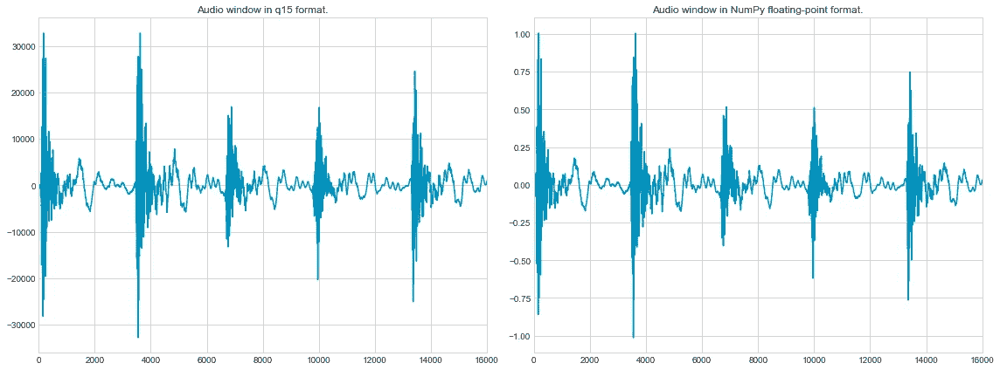

您可以看到信号的形状与使用 NumPy 创建的信号相似，但是 Y 轴上的值的范围是从-32768 到 32767，而不是从 0 到 1。

## CMSIS-DSP 中的汉宁窗口

CMSIS-DSP 没有为特定窗口大小创建汉宁窗口的内置功能。然而，我们可以利用内置的`[arm_cos_f32(...)](https://arm-software.github.io/CMSIS_5/DSP/html/group__cos.html#gace15287f9c64b9b4084d1c797d4c49d8)`和`arm_float_to_q15(...)` API 来创建一个定点汉宁窗口。让我们用[汉恩函数](https://en.wikipedia.org/wiki/Hann_function)的公式来做这个:

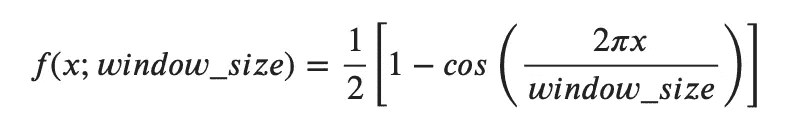

现在让我们使用 Matplotlib 绘制 Q15 Hanning 窗口和 NumPy Hanning 窗口:

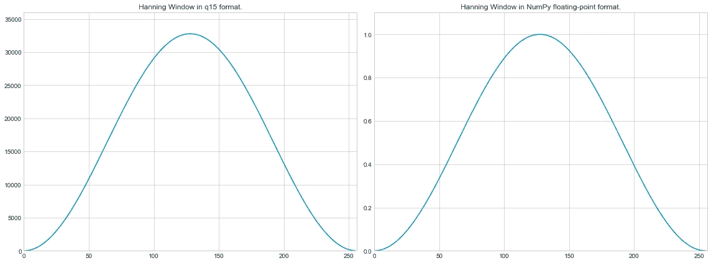

您可以看到它的形状与使用 NumPy 创建的形状相似，但是值的范围是从 0 到 32767，而不是从 0 到 1。

要像在 NumPy 中那样应用汉宁窗口，我们可以使用`[arm_mult_q15(...)](https://arm-software.github.io/CMSIS_5/DSP/html/group__BasicMult.html#gaeeda8cdc2c7e79c8a26e905342a0bb17)`乘法函数将两个长度相等的向量相乘。

现在让我们来看看在 q15 格式中应用 Hanning 窗口后的第一个窗口:

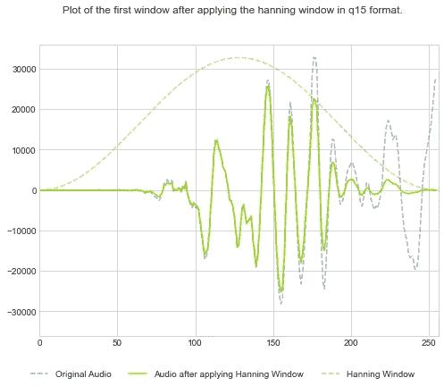

让我们将它与 NumPy 值并排绘制成图表:

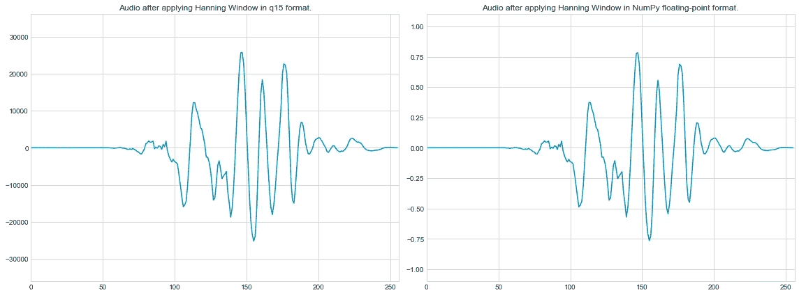

## 采用 CMSIS-DSP 的 FFT

[CMSIS-DSP 为各种数据类型提供了许多 FFT 功能](https://arm-software.github.io/CMSIS_5/DSP/html/group__groupTransforms.html):q15、q31 和 f32。在本例中，我们将使用[实数 FFT 函数](https://arm-software.github.io/CMSIS_5/DSP/html/group__RealFFT.html)。要使用 CMSIS-DSP 的 Q15 RFFT 函数，我们首先需要创建一个`[arm_rfft_instance_q15](https://arm-software.github.io/CMSIS_5/DSP/html/structarm__rfft__instance__q15.html)`实例，并用`[arm_rfft_init_q15(...)](https://arm-software.github.io/CMSIS_5/DSP/html/group__RealFFT.html#ga053450cc600a55410ba5b5605e96245d)`函数初始化它。之后，过程类似于 NumPy，你可以使用`[arm_rfft_q15(...)](https://arm-software.github.io/CMSIS_5/DSP/html/group__RealFFT.html#ga00e615f5db21736ad5b27fb6146f3fc5)`函数来计算 FFT 和`[arm_cmplx_mag_q15(...)](https://arm-software.github.io/CMSIS_5/DSP/html/group__cmplx__mag.html#ga0488e185f4631ac029b02f1759b287cf)`来计算 FFT 的幅度。

我们现在可以用 Matplotlib 绘制 Q15 定点值的图形:

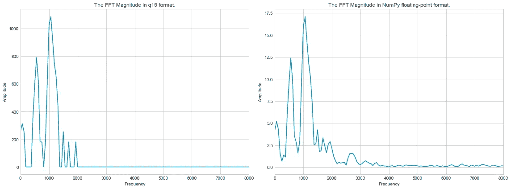

现在让我们将`fft_bins_1_q15` Q15 的值转换为浮点值，这样我们就可以将该值与 NumPy 计算的值进行比较。

当使用 256 的 RFFT 长度时，`arm_rfft_q15(...)`功能的输出格式将是`9.7`(而不是`1.15`)。`[arm_cmplx_mag_q15(...)](https://arm-software.github.io/CMSIS_5/DSP/html/group__cmplx__mag.html#ga0488e185f4631ac029b02f1759b287cf)`功能的文档说明输入值为`1.15`格式，输出为`2.14`格式。因此，如果我们将一个`9.7`格式的数字传递给`arm_cmplx_mag_q15(...)`，输出将会有一个`10.6`的格式——这意味着它的值的范围将会从`-512`到`511`。

我们可以通过使用`[arm_q15_to_float(...)](https://arm-software.github.io/CMSIS_5/DSP/html/group__q15__to__x.html#ga5a75381e7d63ea3a3a315344615281cf)`函数将其从 Q15 转换为浮点数并乘以`512` ( `2^9`)来将`10.6`数转换为浮点值:

```
**from** cmsisdsp **import** arm_q15_to_float# Let's rescale them and compare the two
fft_bins_1_q15_scaled = arm_q15_to_float(fft_bins_1_q15) * 512
```

我们可以叠加它们，看看它们有多接近:

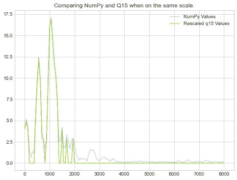

正如我们从上面看到的，两条管道产生了视觉上非常相似的特征。

虽然使用定点函数会丢失一些信息，但我们设法计算出了类似的形状，并在相同的频率下显示出峰值。定点函数未能计算出的频率(在 2000 年的右侧)，都具有非常低的振幅，表明信息损失最小。

## CMSIS-DSP 谱图

最后，我们需要像处理 NumPy 一样将所有这些放在一起。

现在让我们用 Matplotlib 绘制输入信号和 Q15 频谱图:

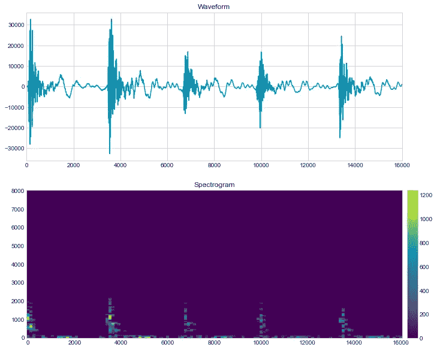

最后将 Q15 谱图与 NumPy 版本进行比较:

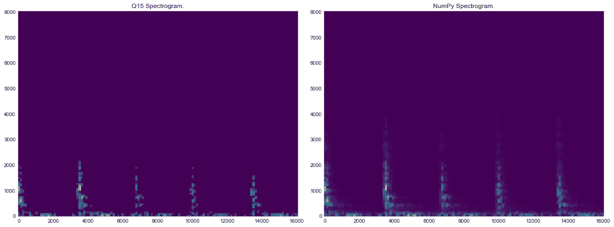

## 概述

正如我们所见，CMSIS-DSP 管道类似于 NumPy 管道。让我们回顾一下我们为创建它所做的工作:

1.  使用`arm_float_to_q15`功能将音频样本转换为 Q15 格式。
2.  使用汉恩函数公式通过`arm_cos_f32`和`arm_float_to_q15`函数计算汉宁窗口。
3.  学习了如何使用`arm_mult_q15`函数乘以相同长度的向量。
4.  了解如何使用`arm_rfft_instance_q15`、`arm_rfft_init_q15`和`arm_rfft_q15`函数在 CMSIS-DSP 中计算 Q15 FFT。
5.  通过在一段时间内跨越音频信号、应用汉宁窗口并对每个窗口周期使用 FFT 函数来创建音频信号的频谱图表示。

# 不同音频声音的频谱图示例

现在让我们来看看 [ESC-50 存储库](https://github.com/karolpiczak/ESC-50)中不同音频文件的一些不同频谱图。


# 将 CMSIS-DSP 代码从 Python 移植到 C

现在，我们已经从上一节中对如何使用 Python 中的各种 CMSIS-DSP API 有了一个大致的了解，我们可以开始将这些 API 映射到 C 语言，以便在基于 Cortex-M 的系统上运行。

## 包含

第一步是在`.c`文件的顶部添加一个`#include <arm_math.h>`:

```
#include <arm_math.h>
```

## 常数

然后我们可以为窗口和步长定义一些常量变量:

```
const int WINDOW_SIZE **=** 256;
const int STEP_SIZE   **=** 128;
```

## 输入信号

可以声明一个全局数组变量来存储输入信号:

```
q15_t input_q15[WINDOW_SIZE];
```

创建光谱的输入信号可存储在`input_q15`变量中。

出于测试目的，我们将其设为频率为 440 Hz、采样频率为 16 kHz 的固定正弦波。

```
for (int i = 0; i < WINDOW_SIZE; i++) {
    float32_t f = sin((2 * PI * 440) / 16000 * i);

    arm_float_to_q15(&f, &input_q15[i], 1);
}
```

## 汉宁窗户

对于 Hanning 窗口函数，必须声明一个全局数组变量来存储窗口函数值:

```
q15_t hanning_window_q15[WINDOW_SIZE];
```

然后我们可以创建一个 C 函数，在运行时初始化`hanning_window_q15`数组:

```
void hanning_window_init_q15(q15_t* hanning_window_q15, size_t size) {
    for (size_t i = 0; i < size; i++) {
        *// calculate the Hanning Window value for i as a float32_t*
        float32_t f = 0.5 * (1.0 - arm_cos_f32(2 * PI * i / size ));

        *// convert value for index i from float32_t to q15_t and
        // store in window at position i*
        arm_float_to_q15(&f, &hanning_window_q15[i], 1);
    }
}
```

我们将需要另一个变量来存储输入信号上应用的汉宁窗口的值:

```
q15_t processed_window_q15[WINDOW_SIZE];
```

现在，我们可以对输入信号应用汉宁窗口:

```
*// equivalent to:
//   processed_window_q15 = input_q15 * hanning_window_q15*arm_mult_q15(input_q15, hanning_window_q15, processed_window_q15,
             WINDOW_SIZE);
```

## 快速傅里叶转换（同 fast Fourier transform）

**变量**

我们需要 FFT 实例和输出的全局变量:

```
arm_rfft_instance_q15 S_q15;*// this is twice the size because each FFT output has a real and
// imaginary part*
q15_t fft_q15[WINDOW_SIZE ***** 2];*// this is half the size of WINDOW_SIZE becase we just need the
// magnitude from the first half of the FFT output*
q15_t fft_mag_q15[WINDOW_SIZE **/** 2];
```

**初始化**

我们需要调用`arm_rfft_init_q15`来初始化 Q15 RFFT 实例:

```
arm_rfft_init_q15(&S_q15, WINDOW_SIZE, 0, 1);
```

**执行 FFT**

执行 FFT 并计算 FFT 的输出幅度现在可以通过下式完成:

```
arm_rfft_q15(&S_q15, processed_window_q15, fft_q15);arm_cmplx_mag_q15(fft_q15, fft_mag_q15, WINDOW_SIZE / 2);
```

## 将所有东西连接在一起，就像一幅 Arduino 草图

## 性能基准

现在，让我们在以下 Arduino 或 Arduino 兼容板上对上面的 Arduino 草图进行基准测试:

*   [Arduino Nano 33 物联网](https://store.arduino.cc/usa/nano-33-iot)
*   [Arduino Nano 33 BLE](https://store.arduino.cc/usa/nano-33-ble)
*   [Teensy 4.0](https://www.pjrc.com/store/teensy40.html)

我们已经创建了一个等效的草图，它使用 32 位浮点而不是定点来与上面的定点草图进行比较。这两张草图都可以在 GitHub 上找到:

*   [cmsis_dsp_fft_q15.ino](https://github.com/ArmDeveloperEcosystem/fixed-point-dsp-for-data-scientists/blob/main/cmsis_dsp_fft_q15/cmsis_dsp_fft_q15.ino)
*   [cmsis_dsp_fft_f32.ino](https://github.com/ArmDeveloperEcosystem/fixed-point-dsp-for-data-scientists/blob/main/cmsis_dsp_fft_f32/cmsis_dsp_fft_f32.ino)

**RAM 使用情况**

当我们使用 16 位 Q15 而不是 32 位浮点时，我们应该会看到 DSP 运算所需的缓冲器占用一半的空间。

我们目前的缓冲包括:

因此，对于`WINDOW_SIZE = 256`,我们预计:

*   F32: 22 x 256 = 5632 字节
*   Q15: 11 x 256 = 2816 字节

这说明与 F32 使用浮点相比，Q15 使用定点需要一半的 RAM。

如果我们编译我们的草图，我们会得到下面的“*全局变量使用*”度量。

来自 Arduino 的值与我们期望节省的内存量完全匹配。

**运行时速度**

现在，让我们将两张基准测试草图上传到评估板上，看看计算单个输入窗口的 FFT 仓需要多长时间:

Arduino Nano 33 物联网板基于 Arm Cortex-M0+ CPU，未配备 FPU(浮点单元),使用 16 位定点 DSP 流水线完成流水线的速度比 32 位浮点版本快 11 倍。基于 Arm Cortex-M4F CPU 并配备 FPU 的 Arduino Nano 33 BLE 性能提升了 37%。最后，基于配备 FPU 的 Arm Cortex-M7 CPU 的 Teensy 4.0 的性能提高了 26%。

# 结论

本指南概述了将音频信号转换为声谱图的 DSP 流水线，声谱图可以与计算机视觉技术相结合，对音频信号进行分类。我们已经解释了什么是声谱图，以及如何使用以下 DSP 操作用 Python 和 NumPy 从. wav 文件创建声谱图:开窗、汉宁窗和 FFT。之后，您了解了定点数学，以及如何利用 CMSIS-DSP Python 包装器通过 16 位定点运算创建等效频谱图，同时精度损失最小。然后，我们介绍了如何将 CMSIS-DSP 管道从 Python 移植到 C，以便在基于 Arm Cortex-M 的设备上运行。

在我们的基准测试中，当使用定点 16 位操作而不是 32 位浮点操作时，DSP 流水线所需的全局缓冲区需要的内存减少了 50%。当使用定点 16 位操作而不是浮点操作时，Cortex-M0+(无 FPU)的速度提高了 11 倍。当使用定点 16 位运算而不是浮点运算时，具有内置 FPU 的 Cortex-M4F 和 Cortex-M7F 系统的速度分别提高了 37%和 26%。这些进步令人印象深刻。使用定点还可以节省一个转换步骤，当从模拟麦克风(使用 ADC)或数字麦克风读取音频输入值时，这些值(通常)会存储为 16 位值。

欲了解更多来自 [Arm 软件开发团队](https://developer.arm.com/)的博客、指南、资源、视频和笔记本，请访问:

*   [@推特上的 armsoftwardev](https://twitter.com/ArmSoftwareDev)
*   [Arm 软件开发商 YouTube 频道](https://www.youtube.com/c/ArmSoftwareDevelopers)
*   [@ GitHub 上的 ArmDeveloperEcosystem](https://github.com/ArmDeveloperEcosystem)

## 了解更多信息

在即将到来的 [Arm 开发峰会](https://devsummit.arm.com/en?utm_source=armdevsummit&utm_medium=social&utm_campaign=2021_armdevsummit_mk17_arm_na_na_conv&utm_content=autoiot)上提升使用 tinyML 的技能并获得实践经验，这是一个在 10 月 19 日至 21 日之间举行的为期 3 天的虚拟活动。该活动包括针对真实嵌入式设备的 tinyML 计算机视觉研讨会，以及利用基于 Arm Cortex-M 的 MCU 构建大词汇量语音控制。我们希望在那里见到你！

https://devsummit.arm.com