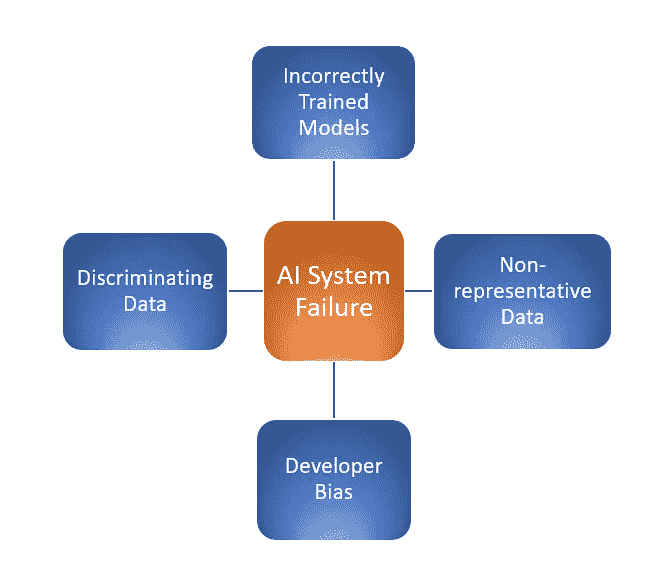

# 人工智能系统中的固定偏差

> 原文：<https://towardsdatascience.com/fixing-bias-in-ai-systems-by-building-better-ai-models-8d4266fca59?source=collection_archive---------39----------------------->

## 元学习和创建人工智能伦理框架的反直觉方法如何对抗偏见蔓延

鸣谢:Zapp2Photo/Shutterstock

人工智能模型与它们接受训练的算法和数据一样好。当一个 AI 系统失败时，通常是由于三个因素；1)算法被错误地训练，2)系统的训练数据中存在偏差，或者 3)在模型建立过程中存在开发者偏差。本文的重点是训练数据中的偏差和模型开发人员直接编码到 AI 系统中的偏差。

作者图片

## 开发者偏见

> “我认为今天，人工智能社区总体上有一种自我选择的偏见，因为建造这种系统的人仍然主要是白人、年轻人和男性。我认为，人们已经认识到，我们需要超越它，但现实是，我们还没有做到这一点。”——格雷迪·布奇，IBM 首席沃森科学官

开发人员偏见是数据团队缺乏多样性的产物。有社会责任感的组织认识到需要改变这种动态，并持续努力让代表性不足的群体参与进来，以增加其数据团队的多样性。这一努力需要时间。与此同时，解决人工智能系统继承的默认价值系统的另一种方法是，技术行业为人工智能采用一个通用的道德框架。

## 一个人工智能伦理模型框架

人工智能尚未建立道德模型框架的一个重要原因是，对于应该使用谁的价值观和道德体系来建立一个道德模型框架，还没有达成共识。

那么为什么不让模型建立自己的伦理框架呢？这种反直觉的想法正是 IBM 的 Murray Campbell 通过使用逆向强化学习提出的。逆向强化学习涉及让系统学习人们在各种情况下的行为，以便它可以找出人们重视什么，让模型做出符合我们基本道德原则的决定。这个解决方案是违反直觉的，但是它也给了模型和我们一起更新信念系统的能力。在一个不断变化的世界里，这应该是所有人工智能系统的特征。

## 偏见是如何潜入人工智能模型构建的

监督学习算法依靠人类来做标记，这是模型建立过程中的一个步骤，可能会将人类偏见引入系统。还可能有一个主题专家沿途通知学习系统。该主题专家在提供意见时也在输入他们自己的偏见。

一种可以从人工智能系统构建过程中消除这些偏见注入步骤的技术是无监督学习。无监督学习使用未标记的数据来训练系统，几乎没有人工干预，通过与环境交互来学习环境。这大大减少了偏见渗入模型的机会。

我们离开发纯无监督学习还很远，但有更新的学习方法，即混合模型，位于无监督和有监督学习之间的某个位置。这些模型需要的数据量较少，有助于解决代表性数据集较少的问题。此外，这些模型需要更少的标记和人工干预，从而降低了数据预处理阶段出现偏差的可能性。无监督学习的一种方法是元学习。

## 修复有偏数据集的元学习

元学习是机器学习的一个子领域，深度学习模型可以用较少的数据进行有效的训练。这样做的方式是让机器学习一项复杂的任务，使用它用来学习一项任务的相同原则，并将它应用于其他任务。这种形式的泛化允许学习模型更快地获得新技能。

一次性元学习技术是这种建模方法的一个很好的例子。一次性学习可以应用于像人脸识别这样的任务，我们有很多类，但每个类的样本很少。许多人脸识别数据集都是如此，在这些数据集里，白人的数量过多。在这一步中，设计了一个深度神经网络，它能够从训练数据集推广到看不见的数据集。一次性分类类似于普通分类，但它不使用数据样本，而是使用整个数据集。该模型在不同的学习任务/数据集上进行训练，然后在一系列训练任务和未知数据上进行优化，以获得最佳性能。

作者图片

## 展望未来

修正无意的偏见需要提高认识和数据收集技术。为了实现更好的数据完整性，组织必须自己手动收集数据，以确保机器接收的数据集确实是多样化和包容性的。收集更多的数据可能是不可行的，而且成本高昂。组织还必须继续努力，为他们的数据科学团队带来更多的多样性和代表性。

无监督学习和元学习是两种可以解决在数据收集、特征标记和模型开发阶段悄悄进入人工智能系统的偏见的技术。此外，一个通用的人工智能伦理框架是重要的一步，可以确保指导人工智能系统建设的价值观是保护和促进整个社会的价值观。

在新冠肺炎疫情的生活告诉我们，偏见是一个我们需要毫无疑问和迫切解决的问题。我们的优先事项已经改变。生命、时间和环境重塑了我们的伦理和价值观，我们的人工智能系统应该得到发展，以便它们能够根据我们不断变化的社会价值观更新信仰系统。

格雷迪·布奇在他的 [Ted 演讲](https://www.ted.com/talks/grady_booch_don_t_fear_superintelligent_ai?language=en)、*不要害怕超级智能* AI 中呼应了这一观点:

> “我们正处在与机器共同进化的不可思议的旅程中。我们今天的人类不是那时的人类。”

多么美好的未来等待着我们。