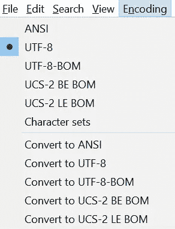
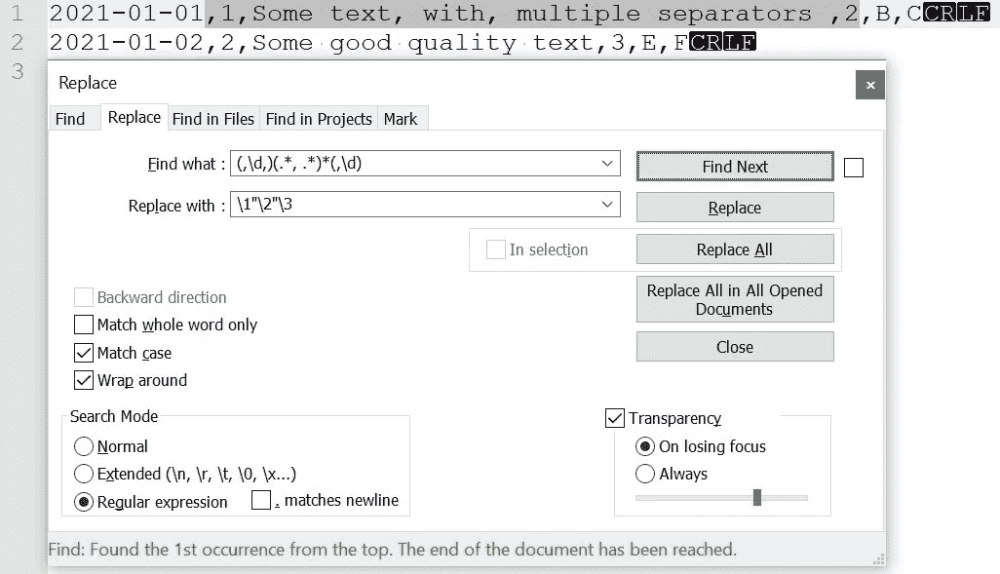
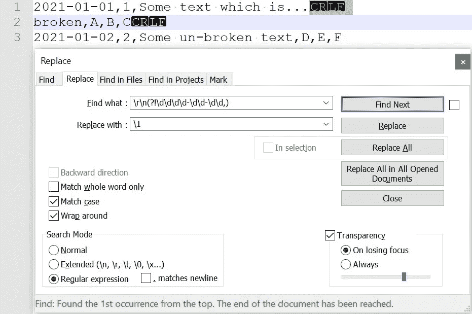
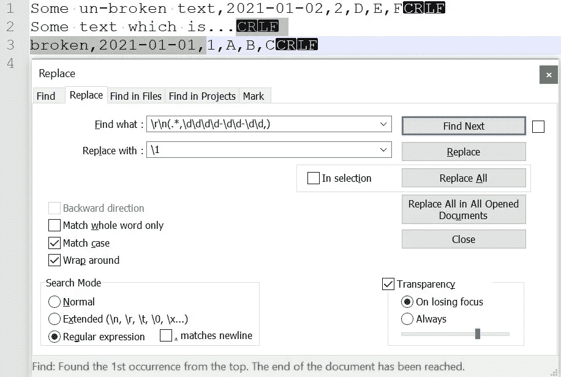
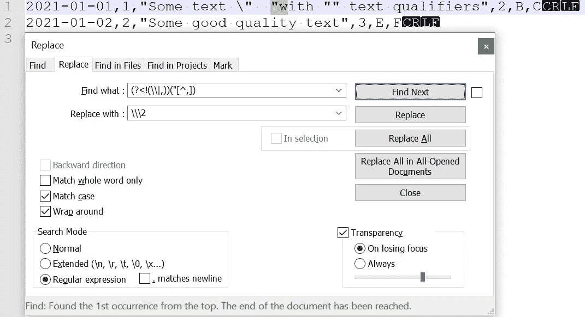

# 使用正则表达式修复常见 CSV 错误

> 原文：<https://towardsdatascience.com/fixing-common-csv-errors-with-regex-c75cdb47236?source=collection_archive---------25----------------------->

## [实践教程](https://towardsdatascience.com/tagged/hands-on-tutorials)

## 一个强大的、未被充分利用的工具，可以修复许多常见的数据问题。

照片由[杰克森煨](https://unsplash.com/@simmerdownjpg?utm_source=medium&utm_medium=referral)在 [Unsplash](https://unsplash.com?utm_source=medium&utm_medium=referral)

正则表达式是一个经常被忽视的强大工具。

在这篇文章中，我将介绍 CSV 文件的几个常见问题，并使用正则表达式来修复它们。

作为一名数据科学家，您通常会处理自己没有生成的大型数据集。因此，从外部数据提供程序接收数据的情况很容易出错。您无法直接控制传输前的数据导出。当这些错误发生时，有几个选项可用—其中一个是使用正则表达式。

有一个关于在软件开发中使用正则表达式的笑话是这样的:

你有一个可以从正则表达式中获益的问题，现在你有两个问题。

但是正则表达式并没有想象的那么复杂。本质上，你试图完成的是描述一个模式。Regex 包在许多语言中都有很好的定义，语法也相对一致。

然而，在这篇文章中，我不会展示具体的代码块。相反，我将展示在 Notepad++中使用正则表达式。Notepad++是一个非常轻量级的编辑器。因此，在编辑器中而不是直接在代码中试验正则表达式，可以快速测试所创建的表达式。

Notepad++可以很好地处理 CSV 文件，最多可以处理一百万条记录。但是，当文件较大时，更好的选择是联系数据提供商，从源头解决问题。

许多在线正则表达式工具可以帮助构建表达式，但是来自编辑器的直接反馈可能更有益。此外，对于文件中的某些实例，您创建的模式经常会中断，如果不上传整个文件，您可能在在线正则表达式工具中看不到这一点。

# **编码**

文件编码(作者照片)

CSV 文件的第一个问题是文件中的奇怪字符或奇怪的换行符。虽然由于有许多不同的格式，这些问题没有万能的解决方案，但一个常见的解决方案是在 UTF-8 中打开所有内容。虽然这并不总能解决你的问题，但如果你坚持这样做，那么你就能逐渐理解你的 UTF-8 解决方案。

# **可视化**

谈论可视化 CSV 文件似乎有点奇怪。然而，仅仅看一下数据通常就能清楚地显示出你所面临的问题。然而，默认情况下，许多编辑器会忽略 GUI 中的一些字符。有时候，像额外空间这样的小事也可能是问题的根源。因此，在处理文件错误时，确保您可以看到文件中的每个符号，并确认您所看到的是您所期望的。

要在 Notepad++中显示所有文件符号，请转到视图>显示符号>显示所有字符。

显示所有文件符号(作者照片)

# **改变日期格式**

大多数文件读取函数都有解析日期的选项。然而，这些通常假设日期遵循相同的格式。当日期是相同的格式时，确定该格式是一个相对简单的过程。

但是，如果你曾经在现实世界中工作过，你就会知道每个人写日期的方式都不一样。每个人都有自己的理由，这些理由对他们来说是有意义的。争论通常是打一场失败的仗。

但是，如果您的文件有多种日期时间格式，您可以用正则表达式更新这些格式。

多种日期时间格式(图片由作者提供)

**这里需要注意一些事情:**

*   使用括号捕获组。
*   正则表达式的替换部分中的引用组。第一组使用\1，第二组使用\2，依此类推。

目的是将日期部分作为一个组来捕获，并将这些组重新排列成与其余日期一致的单一格式。

我知道没人问，但最好的日期格式是' yyyy-mm-dd '，如果你需要时间，那么' yyyy-mm-dd hh:mm:ss '。这种格式的 DateTime 的小数位数正在严格减少。每个元素都是分开的，使用前导零，时间与日期分开。易于机读且逻辑清晰。最好的格式。

如果你在日期字段中添加月份作为缩写文本，你就是一个怪物，停止。

# **文本限定词**

文本是最灵活的数据格式之一。也正因为这种灵活性，才成为很多问题的源头。文本通常可以包含文件中使用的列分隔符。

由于这个问题，添加了文本限定符。文本限定符(通常是引号之类的字符)指定要跟随的文本。文件读取器将忽略任何列分隔符，直到遇到第二个文本限定符。当这些限定符不存在时，很难在以后有效地添加文本限定符。

最好的选择是尝试获取文本限定符。也许您可以要求用文本限定符提取另一个数据。

这是我提到的第一个选项的原因是文本太灵活了。下面的替换表达式要求相邻的列具有一致的、结构良好的模式。如果没有一致的模式，就无法保证剩余的字符不是文本的一部分。文字是一场噩梦。请求文本限定符。

如果获取文本限定符不是一个选项，并且数据的其余部分有一些结构，那么有一些选项。示例显示文本中多了一个逗号，这是这种类型中最常见的问题。

下面的模式利用了文本和相邻列的几个方面。

*   在文本中，逗号后面通常有一个空格。因此，无论其他文本如何，该模式都很容易被捕获。
*   可能有多个逗号。带逗号的文本模式与*字符匹配零次或多次。
*   相邻的列以一致的模式匹配。
*   括号内捕获的组用\1 指定。对于多个组，使用\2、\3 等。

文本中的文件分隔符(作者图片)

# **中线断开**

当发生多个数据导出时，行中间有换行符的 CSV 可能是一个常见问题。例如，这种错误经常发生在没有文本限定词的数据导出过程中，以及在允许文本内换行的初始数据插补系统中。

最简单的情况是当这个换行符只在一行中时。虽然通常更容易确定断行的原因(开发人员通常会添加检查来计算一行中的分隔符数量以找到行)，但自动修复这些问题要困难得多。

带有换行符的文本(作者提供图片)

当由于文本的原因一行中只有一个断点时，可以用负的前瞻自动处理。本质上否定的前视是匹配模式的正则表达式，但仅当后面没有另一个模式时。

第一部分在 regex 中很容易识别。匹配换行符。

第二部分，消极的前瞻，更为复杂。要寻找的模式是您在下一个换行符开始时所期望的。例如，如果每一行都以日期“yyyy-mm-dd”开头，后跟一个数字，则您要捕获的负数模式是\r\n(？！\d\d\d\d-\d\d-\d\d，)，并替换为第一组\1 的内容。

**这里需要注意的几件事:**

*   前瞻是用字符“？”指定的后跟“！”字符(对于负前视)或=字符(对于正前视)
*   指定了整个日期格式模式。捕捉任何日期都需要这种模式，并且必须加以推广。
*   括号内捕获的组用\1 指定。对于多个组，使用\2、\3 等。
*   替换操作会删除用“\n”捕获的换行符。然而，在 UTF 8 中，换行符既是换行符又是回车符' \r '。在记事本文件中显示为 CRLF。

特别敏锐的读者会注意到匹配模式中的额外逗号。匹配第一个组后，添加一个逗号来强制第一列只有这种格式。匹配前几列将显著提高这种模式匹配的可靠性，但这是有代价的。如果问题文本字段位于 CSV 的第一列，那么这种模式就不再可行。但是假设前几列有一个清晰、一致的模式。在这种情况下，您应该匹配其中的每一项，因为文本中的分隔符不可能在多列中具有相同的模式。

当第一列是文件的问题列时，替换更易于管理。

带有换行符的文本(作者提供图片)

这种模式的基础是 CSV 中的一些列具有格式良好的设计。确保 CSV 中至少有适当格式的一种方法是在第一列中要求 ID 或日期。这个 ID 确保有一些模式作为模式匹配的基础。

对于文本字段中的多个换行符，最简单的解决方案是重复该模式，直到找不到匹配为止。虽然这不是最优雅的解决方案，但当中断次数未知时，会有一个问题。使用未知数量的分隔符，需要未知数量的组来成功地将文本组合成一行。因此，最简单的解决方法是用替换重复该模式。

# **未转义字符**

另一个常见的问题是带有特殊字符的文本没有被转义。当非转义字符是文本限定符时，这个问题就更成问题了。

下面的正则表达式看起来相当复杂，但是每个组件都相对简单。首先，目标是捕获引号，引号是未转义的，而不是文本限定符。这里的第二个方面意味着忽略前面的分隔符和后面的分隔符。

未转义字符(作者照片)

**这里的模式使用了一些不同的正则表达式组件。**

*   后面的否定眼神，用‘指定？
*   The second group uses exceptions to handle the valid text qualifiers with the trailing separator. This group captures the quote to be escaped then the following character.
*   The replacement places the literal escape character (specified with the double escape) and the content of the second group.
*   For the stand-alone double quotes, this pattern will need to be run twice since the unescaped second quote is placed back in the first replacement.

# **结论**

正则表达式是一个经常被忽视的强大工具。然而，它可以在几乎所有的编辑器和编程语言中使用。由于大多数数据科学工作都是数据争论，正则表达式成为数据科学家武器库中的一个重要工具。

尽管有奇怪的语法和挑战性的学习曲线，正则表达式只是一个模式匹配工具。如果你很难找到正确的表达方式，大声说出你想要捕捉的模式，包括例外和条件，这是一个很好的开始。

此外，数据清理和结构问题通常可以用一个正则表达式来解决。当您不仅考虑畸形模式，而且考虑围绕畸形模式的正确模式时，这些表达式变得越来越强大。不幸的是，人们通常不使用文件中存在的已知模式，而只关注畸形。这就是为什么表达式不能捕捉所有的情况，或者更糟；他们抓住你不想要的案子。

最终理解正则表达式是值得投入时间的。

如果你有兴趣阅读关于新颖的数据科学工具和理解机器学习算法的文章，可以考虑在 Medium 上关注我。

*如果你对我的写作感兴趣，想直接支持我，请通过以下链接订阅。这个链接确保我会收到你的会员费的一部分。*

 [## 通过我的推荐链接加入 Medium-Zachary Warnes

### 阅读扎卡里·沃恩斯(以及媒体上成千上万的其他作家)的每一个故事。您的会员费直接支持…

zjwarnes.medium.com](https://zjwarnes.medium.com/membership)